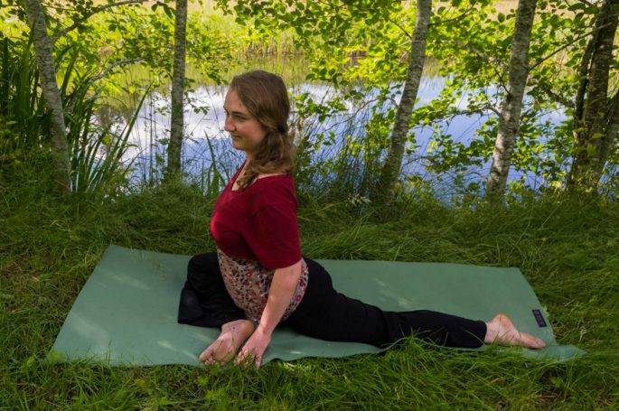
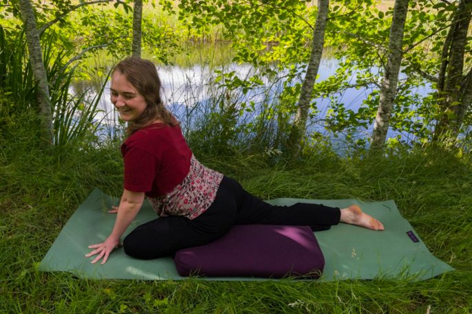
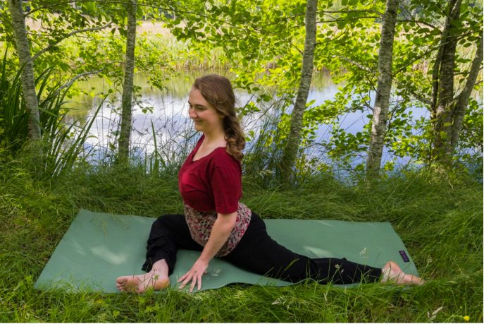
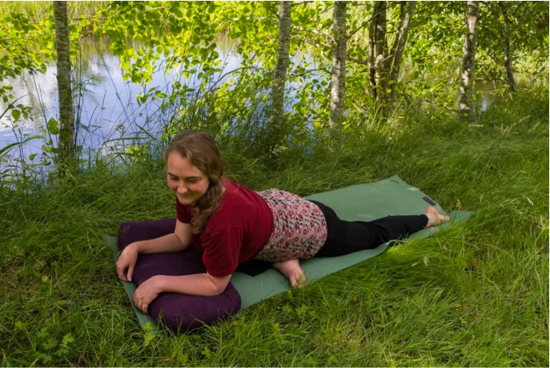
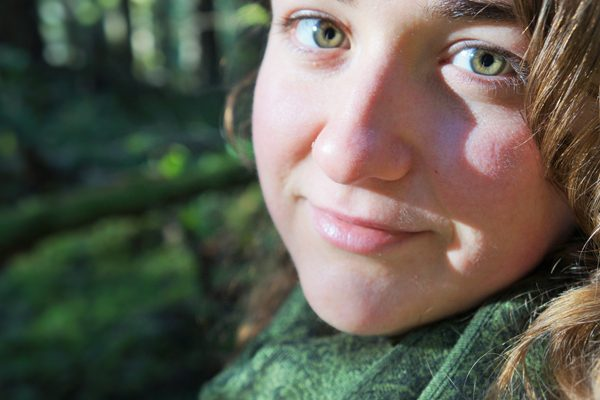

I remember the first time a teacher brought me into Pigeon pose when I was sixteen years old. The pose, and what the teacher said about it, spoke to me deeply. Looking back, I think it was the first time I really met an asana. I am delighted to share a few pointers on this pose in hopes of passing on the Pigeon Love to others.
Tanya Gita Roberts wrote a beautiful piece about [Pigeon](https://saltspringcentre.com/2014/10/asana-of-the-month-kapotasana/) in the Asana of the Month section of October 2014. I highly recommend giving her article a read as well. In this month’s piece I will explore “Sleeping Pigeon” as it is practiced in Yin Yoga, as well as how emotions are stored in the body and how to release them in a Yin practice. This is a particular variation on what Gita explained in beautiful detail a few years ago.

## **Step One: Enter the Pose**

[caption id="attachment\_13774" align="aligncenter" width="600"] The first step is to situate your hips, before easing down.[/caption]
Starting in tabletop position, slide your right knee forward towards your right wrist. Slide your left leg straight out behind you. Let the outside of your right shin, as well as your left leg, rest on the floor. Take a few breaths here, feeling into your legs. Then slowly begin to lower your torso down. Pay attention to how much sensation you are feeling in your legs, as well as how relaxed your body and breath are, as you lower down. You want to find what in Yin is called your “edge,” the place where you are challenged by sensation, but not challenged to the point where you begin to tense up or breathe shallowly. Your edge might be relaxing on your arms, your forearms, your stacked fists, a bolster or pillow, or relaxing all the way onto the floor. Wherever your edge is, stay there once you’ve found it. Let your back relax and your head hang heavy. Make sure that you don’t round to the point that your diaphragm is constricted, though, because you want to be able to have a natural deep breath.
[caption id="attachment\_13771" align="aligncenter" width="600"] Put a bolster under your hip if there is too much sensation without support.[/caption]
If it is uncomfortable to relax into gravity, put a pillow or bolster underneath your right hip. For a Yin practice, you want to be able to relax any muscle that you aren’t using to keep yourself in the posture. Use as much support under your hip as you need in order to really relax. 
[caption id="attachment\_13772" align="aligncenter" width="600"] Bringing the front foot forward deepens the stretch.[/caption]
If you want to deepen the stretch in your right hip, you can move your right foot up, creating a wider angle in your right knee. You don’t need to move the foot if you are already challenged by sensation with your foot closer to your body, or if moving the foot causes any discomfort in your knee. You don’t want any discomfort in your joints.
[caption id="attachment\_13773" align="aligncenter" width="600"] Propping your forearms on a bolster can help you ease slowly into the pose, or stay at your edge if that is where your edge is.[/caption]

## **Step Two: Be in the Pose**

Once you’ve found a version of the pose that works for your body, come into stillness. In a Yin practice, you hold a pose for 3-5 minutes – or longer, if you are accustomed to the pose. During this time it is good to avoid fidgeting or moving around because when you’re still you can bring your attention further inward. In Yin your job isn’t to get your body to go deeper into the pose; gravity and time are in charge of that. Your job is simply to meet your body where it is, as it is, and watch as it softens and heals in its own time. The Yin practice is largely internal, so here are a few more pointers on what to focus on while you’re in the pose:

1. At the beginning of your pose, focus on relaxing. Relax your shoulders, the muscles along your spine, your belly, your left leg, and your right leg. Ask yourself if you’re holding anywhere else that you hadn’t already noticed, and invite those places to relax in their own time.
2. Rather than forcing a deep breath, allow your breath to be as naturally deep as it wants to be. Focus on relaxing your breath.
3. When your body and breath are soft, bring your attention to the sensations in your body. Start at the periphery, noticing the sensations in your head and face, neck and shoulders, arms, back and front body, and left leg. When you get to the right leg, where the most intense sensation probably is, start to give more attention to each sensation. Take your time, really pressing your awareness and breath against what you find there.
4. Over the course of 3-5 minutes, watch how the sensations gradually change as your body releases deeper into the pose. Give loving attention to your body, the little piece of life that you inhabit, as it softens.

## **How Yin Yoga helps release stored emotion in the body**

The day I first met Pigeon Pose was when I was attending asana classes at a studio called Yoga Yoga in Austin, Texas. On this particular day, the teacher brought us into Sleeping Pigeon at the end of a Hatha class and let us stay in it for about five minutes on each side. She told us, “Our bodies tend to store a lot of emotions in our hips. During a deep hip opener, some of those emotions can sometimes come to the surface. If that happens, don’t turn away. Allow yourself to feel those emotions and release them. Don’t try to figure out where the emotions came from. Don’t think about them – feel them. Breathe into them and let them release.” My conscious mind didn’t understand how emotions could be stored in my legs, but I found that her words resonated with me deeply. I focused on what I felt in my hips and found that there was an emotional quality to the sensations. It felt so good to sink into them and let myself feel them. 
Now I have more of a conscious understanding of how emotions are “stored” in our muscles. When a person experiences or witnesses an event that elicits an emotional response, several things go on in the body-mind complex. The body mobilizes a stress response, with one result being that a lot of energy gets poured into the muscles responsible for fighting or running away. The body also activates the tension patterns and physiological responses associated with whichever emotions have been deemed appropriate. Ideally, all the energy fueling the stress response gets released at the time of its creation, through self-defence or effective communication that is healthy and un-harmful for everyone involved. 
If the energy doesn’t get released, then it stays in the system in some form. Even though the event has passed, the nervous system is still signaling the alarm, saying that the event is still happening. When the nervous system is out of sync with present moment surroundings, this causes all sorts of suffering. Our muscles become chronically tense, because they are receiving signals to fight, flight, or freeze in response to an event that has already passed. Seeing a reminder of the event can also trigger more vivid memories of the event, amping up the nervous system charge far beyond what is appropriate for a small situation. This can be very confusing and painful.
Thankfully, it is possible to release this stored energy from our nervous systems, even long after the event has passed. There are many different methods, from different religions, spiritual systems, and psychotherapeutic models. Yin Yoga is one method, and it works well alongside other methods such as psychotherapy, Hatha Yoga, massage, meditation, and others.
In Yin Yoga, we find a safe environment to practice, where our bodies feel safe to fully relax. We move slowly, encouraging a relaxed nervous system. We soften into the poses and allow the breath to be deep and relaxed, again encouraging the activation of the parasympathetic nervous system, the “rest and digest” function. From this place of relaxation, being with sensation can be therapeutic. We stay at our edge, regulating how much sensation we come into contact with- not too much, and not too little - staying with just the right amount that keeps the experience vivid but not overwhelming. Like my teacher said when I was sixteen, we focus on the sensations rather than the thoughts, allowing the sensations to unfold and change as they do when given a spotlight of loving attention.

## **Step Three: Exit the Pose**

To come out of the pose, carefully bring your hands underneath your shoulders to press your torso into an upright position. Stay in touch with the sensations in your legs, moving slowly and carefully. Then gently slide your left leg forward and your right leg back, coming back into tabletop position. From there, rest back into Child’s Pose for a few breaths.

## **Step Four: Repeat on the Other Side**

When you feel ready to move out of Child’s Pose, come back into tabletop. Then come into Sleeping Pigeon on the other side, bringing your left leg towards your left wrist and sliding your right leg back out behind you. Take your time when settling into the pose on this side, as you’ll need to go through the whole process all over again, relaxing from the periphery and in towards the belly of the muscle that has the most sensation. Notice and respect any differences between the two sides. You may need to use more support on this side, or less support. Take your time in settling in again, and be sure to stay in the pose for the same amount of time as you did on the other side. This allows your body to release in a balanced way.
I hope this description of the inner workings of Pigeon Pose in a Yin practice can be helpful in informing all Yin postures, the process of healing, and coming back into union with the Self. 
Om
*Asana photos by Gawain Jones*
--
Arpita (Jessy), daughter of Padma (Diana) and Purna (Doug), is a grown-up Centre child, having been born into the Salt Spring Satsang. She took YTT at the Centre in 2009, the youngest so far, being 17 years old at the time. She has spent several summers serving at the Centre in Housekeeping, Maintenance, Yoga teaching, scanning old Babaji Q&A's, and doing social media. Having recently graduated from Quest University Canada with a focus on embodiment psychotherapy and spirituality, she intends to continue her studies in Yoga Therapy, Somatic Experiencing, and Thai Yoga Massage.
