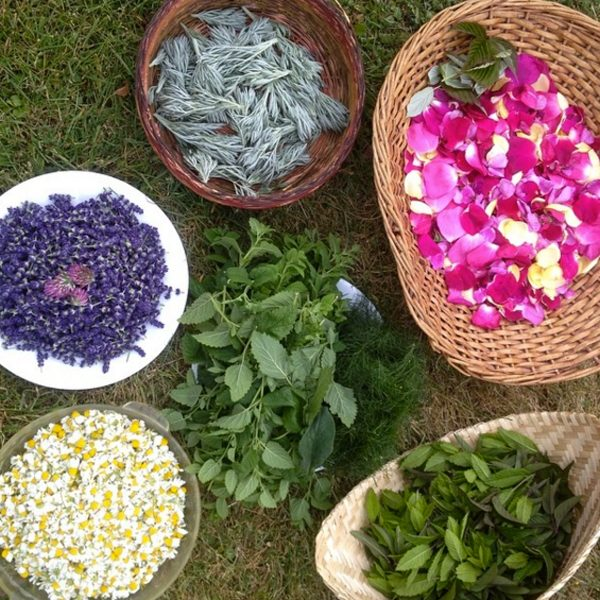
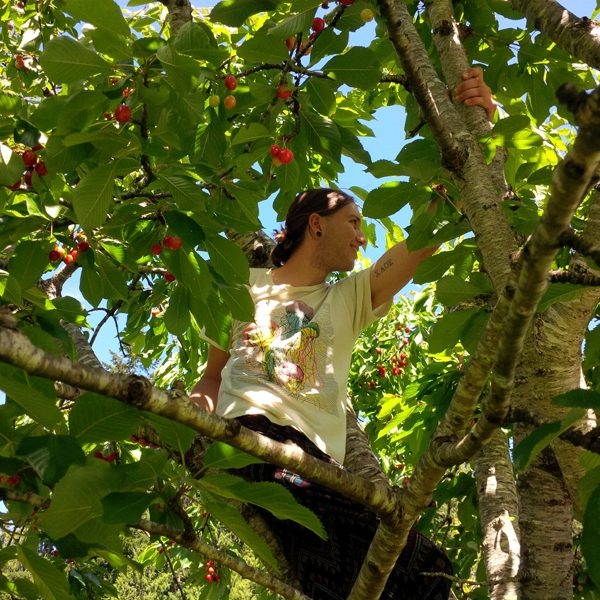
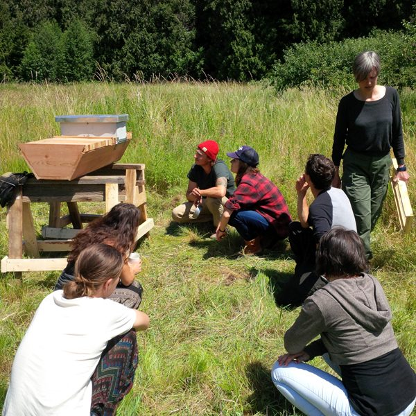
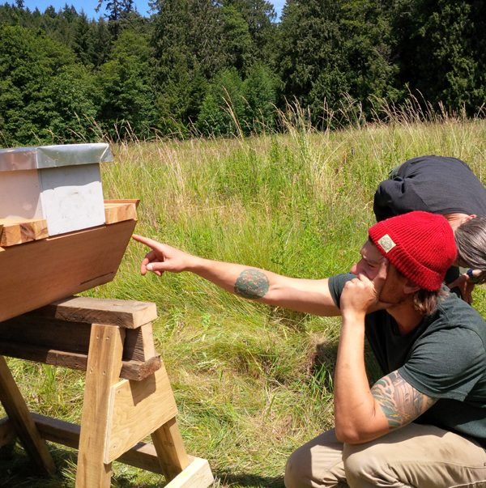

Greetings Friends.
The Solstice has come and gone. Summer is fully upon us with its outward spiral of heat, light and life force. July may be whirling away, but we remain firmly tethered by our sadhana, as we circle around the Centre.
[caption id="attachment\_13802" align="aligncenter" width="600"] Our land provides us with so many delicious things![/caption]
We welcomed our Yoga Service and Study Immersion (YSSI) participants into the community in June. We hosted five different programs and many private retreat guests, which offered myriad opportunities for the YSSI and KYs (residential karma yogis) to grow together in community through hard work. Sofi, our new kitchen lead, has joined us for the summer as well and we are still looking to fill the Programs Assistant [position](https://saltspringcentre.com/job…/opportunities-how-to-apply/) for the busy months ahead.
[caption id="attachment\_13794" align="aligncenter" width="600"] Harley in a cherry tree.[/caption]
We have begun holding Wednesday morning work parties to ensure that we are coming together to work on bigger to do list items. We are hoping to fix the fence line, as the deer are munching our kale and strawberries, and earlier in the month we cleared brush and prepped the firewood to dry for winter. We are working honestly, but we also play! The volleyball net continues to be well used, with usual games held at 5 p.m. daily when the weather cooperates.
The weather has been co-operating! Milo continues to steward the land with reverence. He shares with us these words from the Farm:

*The gardens burst into abundance after a most welcome June-uary brings savory squalls to our parched soils. Water, what big life you have.*

*Now it's July and honey bees have arrived! Snugged into our Carpenter Chris built top-bar hive. Seeds of support including buckwheat and clover have been sown in their wake. A sanctuary we will make.*

*Our legumes, also a theme this year, are blooming and booming. We're up to our ears in peas! Dan's bush beans follow their lead as stretching for the summer sun and repair damage done.*

*Lots of harvesting on the horizon and fun to be had. Come play.*

[caption id="attachment\_13795" align="aligncenter" width="600"] Our board member and KY Julie Higginson blessed us with some of her bees![/caption]
 
[caption id="attachment\_13796" align="aligncenter" width="600"] Carpenter Chris built the bees a top-bar hive.[/caption]
Looking forward, July is full speed ahead with our 200 hour [Yoga Teacher Training](https://saltspringcentre.com/yoga-teacher-training/) beginning July 3rd. As the first half of the training wraps up mid-month, we will pause to celebrate Guru Purnima on July 19th, beginning at 8.30am in the Pond Dome. For those unfamiliar with this ancient Vedic ceremony (yajna), it is an opportunity to honour Babaji and all spiritual teachers, rededicating ourselves to all that the teachings inspire within us, to attain real peace.

*Guru is your own Self which is projected onto a person who is more knowledgeable and capable of teaching. In the beginning an aspirant seeks support from outside, which is given by the teacher. But when the aspirant begins meditating honestly, his or her own Self is revealed as the Guru. Then the aspirant starts turning inward and finds the path, which is shown by the voice of the heart.*

If you are interested in offering at the Yajna, or would like more information, please contact Rajani at 250 537 9537 or rajanirock@me.com.
July will turn to August as we gather together for our [Annual Community Yoga Retreat](https://saltspringcentre.com/retreats-programs/annual-retreat/). Registration is now open and there are opportunities to volunteer as well as participate to varying degrees. We like to think of this retreat as summer camp for yogis, friends and families.

## This Month’s Newsletter Offerings

“The very first question that I was ever brave enough to ask Babaji was, “Babaji, if you had only two words to say to the people of the world, what would they be?” And without hesitation, he wrote “Attain Peace.” “
The above quote is from Pratibha Queen’s piece [The Practice of Peace](https://saltspringcentre.com/2016/06/the-practice-of-peace/). Reflecting on her own experiences as a long time devotee of Babaji, she explores the attainment of peace with great clarity and generosity of spirit.
Those who attended ACYR last year, especially with children, no doubt remember Catherine and her husband Ishi, providing the kid’s meals every evening. This month gifted teacher, and lifelong learner, Catherine Dinim, shares her story in [Our Centre Community](https://saltspringcentre.com/2016/06/our-centre-community-catherine-dinim/).
Long time Karma Yogi (and Satsang kid) Arpita offers us kapotasana (pigeon pose) through a Yin lens in [Asana of the Month](https://saltspringcentre.com/2016/06/asana-of-the-month-the-inner-workings-of-sleeping-pigeon-kapotasana-in-a-yin-practice/). She includes a thoughtful exploration of Yin Yoga which is a style of yoga that is especially well worth practising at this time of year as it can help balance the Yang energy of the summer season.

*If you are in peace, then others around you will feel peace.*
 *So your best effort should be to work on yourself.*

Wishing you peace, peace, peace.

Warmest regards,
Kenzie
