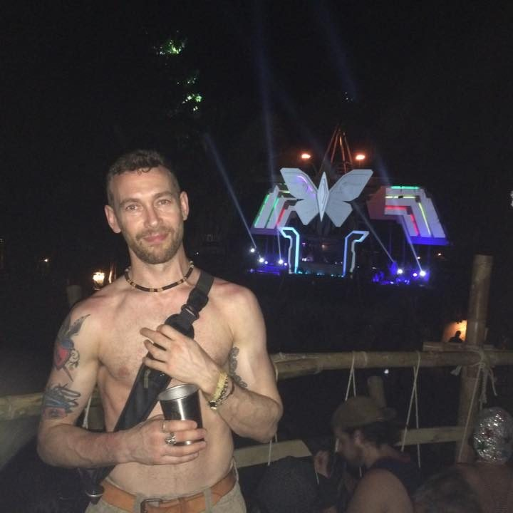
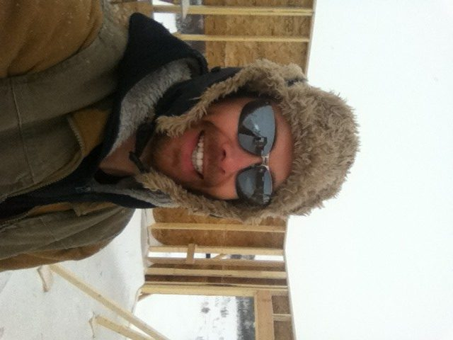
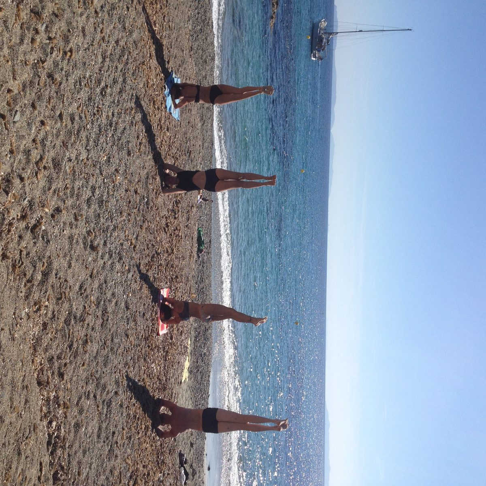

# Shaking off the Dust

I’m in the middle of the desert, at night, inside a massive tent structure, with maybe 200 other revellers. And we’re dancing.
The music is loud and hypnotic. Each bass beat ripples through the air, vibrating my muscles and rippling across my skin.
The vibration intensifies in my feet and when they touch the ground, the ground feels soft, almost spongy.
The sensation moves up, past my ankles, my lower legs feel warm and liquid-like. There is no loss of balance as my body seems to move on its own, in response to the music.
It continues upward, engulfing my thighs, and torso. I become aware of the inside of my body, and the effect of the music upon it. It feels like my organs are losing their solidity.
It’s as if some strange energy is consuming me but I’m not anxious, I’m intensely curious. I close my eyes immerse myself in the feeling. I surrender to it without resistance and the more I let go, the more entrancing the experience becomes.
The sensation reaches my throat. My eyes snap open, and for the first time, fear creeps in. My mind, which up to that point was clear and serene, starts to question, “What happens if I can’t stop this?”
I’ve never experienced anything like this in my life yet I understand immediately that I must make a choice. Either I surrender to it completely or I resist and try to stop it. I sense there is only a fraction of a second to decide.
I take a deep breath, steady myself and close my eyes.
The energy envelopes my head and everything vanishes- the desert, the music, the tent, the people- everything is black and silent. I am aware only of a vast nothingness.
The next morning, everything was different. My thoughts were different, my body felt light, my speech was more precise. The first people I spoke to seemed to notice. I didn’t even bother trying to explain what had happened, yet somehow I sensed they understood. I was relaxed and without the normal self-consciousness and social anxiety I was used to feeling.
It felt like the door to a cage I never knew I’d been living in had opened. I stepped out of it and was walking free for the first time.
I walked back to my camp, unsure of how my campmates would react to what I perceived to be a fundamental shift in my consciousness. I needn’t have been concerned as I was greeted by hugs, warm smiles and curiosity about where I’d been all night. This was Burning Man, after all, so staying out all night and wandering back the next morning was far from unusual.
I looked up, towards one of our RVs, and locked eyes with one of my camp mates. We didn’t really know each other that well, but I knew that he had been travelling for the last few years and had spent some time in India. He had a mystical air about him and as I looked into his eyes I knew that I had to tell him what I’d experienced .
It was as if he had read my thoughts and as he came over to greet me I asked him he would be willing to go for a walk.
He agreed and we left the camp. I related all that had happened over the last 12 hours and he listened intently. I told him about how I had “disappeared” and also what had happened after I came back. I explained how my body felt like liquid and was moving of its own accord. How I rode my bike to different parties throughout the festival and the remarkable experiences I had at each one. How it seemed like time had slowed down and the physical reality around me was somehow different. How it was the most ecstatic and free I’d ever felt.
He listened without asking questions, letting me re-immerse myself in the experience. When I was finished, he began talking about his travels in India and some of the experiences he’d had and the remarkable people he’d met. Then he started talking about yoga, which I’d never heard of before. He said that by practicing it I could understand more about what I’d experienced. He said he would take me to his teacher. He offered to teach me what he knew and I accepted. One year later he took me to Salt Spring to meet his teacher, Baba Hari Dass.
I arrived at the center with the Annual Summer retreat in full swing. I saw a short Indian man with a wispy grey beard, dressed in white, pointing and gesturing amidst the frenzy of activity that surrounded him. He was writing on small whiteboard. I was told he didn’t speak. I had no idea what to make of all of this but I knew immediately knew that I wanted to be a part of it.
The following year I was living at the center as a karma yogi, building cabins and discovering my sadhana.
A year after that I’d completed the Center’s YTT.
A year later I was travelling through India, visiting Sri Ram Orphanage and Babaji’s hometown, Almora. (where I had a strange encounter with a man who claimed to be a childhood friend of Babaji’s. I also became violently ill and was forced to head back to the orphanage to recover. Ahhh, India)
The following year I was living on Salt Spring, teaching yoga and volunteering on the Center School Board.
To say yoga was becoming a way of life would be an understatement. After years of frustration, feeling like I had no purpose or direction I’d finally stumbled upon a path. My heart felt light.
I still had many deep questions and inner conflicts to resolve, but now I had hope, a plan, and a community to guide and support me on my path.
 Building houses in Saskatchewan. 2011
I moved back to Saskatchewan, and my hometown of Regina in 2010. I was full of my newly found self awareness and eager to rediscover the home I’d left 15 years earlier.
I had some mixed feelings too though. On one hand, I was excited to re-connect with my old friends and family. Would they notice how I’d changed? Would they accept me?
On the other hand, I was apprehensive about returning to a place with a lot of painful memories; a place I still associated with my insecurities and regrets. Could my “new self’ resist being pulled back into my old patterning? Would I be able to maintain the confidence and self-assuredness I’d developed? Could I take my show on the road, so to speak?
The answer was yes. My reintegration was immediate and joyous. I was accepted. I found work and teaching opportunities almost immediately. My old friends were thrilled to have me back. I can’t say for certain that they recognized the shift I felt had occurred, but it didn’t matter. My home was still there.
 On retreat with friends. Nice, France. 2013
6 years later, I still teach. I still practice nearly everyday. It’s less formal, and I’ve tweaked it to suit my lifestyle, but my mat and cushion are always laid out, waiting for me. I’ve also found new practices and new people to learn from. They may not call themselves yogis, but I believe they are walking the same path as me.
I miss Salt Spring and the Centre. I will always consider it a home. Babaji and his teachings still feel very close, shifting and transforming in beautiful and mysterious ways.
Those first few years on Salt Spring, were very hard. Often I felt lost and disconnected. I wouldn’t have been able to push through though, without the support, guidance, love, respect and kindness of my center family. I am deeply and truly thankful to Babaji, his early students, and the center staff and community.
I would not be the person I am without all of you.
Om shanti, shanti, shanti
Loknath
