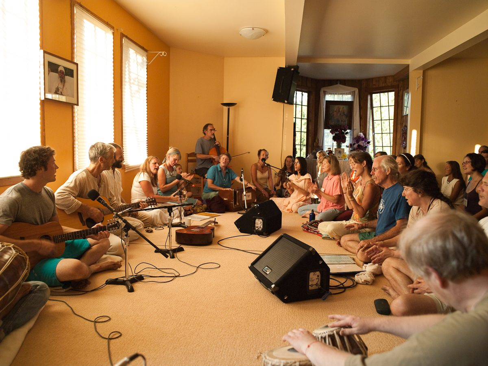

My own interest in the realm of Sanskrit, Mantra Yoga and Sound came about at a juncture of my life in which the forms of spiritual practice I had adopted needed to be adjusted. When I was in my mid-twenties, 4-5 years after I had met Babaji, I began to experience some health challenges. These challenges did not respond to explorations of all kinds; thus began my continuing relationship with surrender and acceptance.
In consulting Babaji, I expressed dismay over the limitations the condition was placing upon my ability to practice Sadhana. Babaji patiently pointed out, *"You are not understanding the point. These are methods to gain control of the mind."*The next few sentences he wrote were, for me, profound. *"This can also be achieved by understanding your aim, understanding yourself, and understanding the energy which is blocking us from progressing. Between God and the self, the blocking energy is our ego. If the ego is pulled toward the world, it makes a wall* (note: in Yoga philosophy, "world” means egocentric desires, or our self-interest)*. If the same ego is pulled toward God, it makes a ladder."* Then he seemed to light up as he wrote, *"You can sing to God. It works!"*
I think Babaji counselled me in this direction because of several things. First: he knew me very well, in that way that only a saintly being whose own mind is quietly peaceful can know the minds and hearts of others. I'd venture to say that most of us who have "grown up" with Babaji have had this experience. I think he also saw that I had an inherent interest in Sanskrit: from the moment I heard the chanting of Mantras, or Kirtan, I was instantly intrigued by the sounds of the language. Although I love all kinds of music, especially in prayers and rituals - these things in Sanskrit moved me in a unique way, almost as if they reached a different part of me. And, because I love singing!
Thus began a journey that continues to this day. Chanting and singing in Sanskrit have become a large part of my practice. It has also become a great support - like a life-raft that carries me, even as I continue to meet those ongoing health challenges. Babaji's counsel also led me to study, and then teach, about Sanskrit: how to pronounce and read the special sounds of its alphabet, as well as explore Sanskrit's main branch of philosophy and practice within the great tree of Yoga: union through sacred sound, or Mantra Yoga.
The ancient sages tell us that all the sounds of the *Sanskrit* language have been born from the sound of *OM*, described as the primordial sound of creation. Brought to light by the sages or *Rishis* as a result of their deep meditative states, this knowledge is therefore considered revealed through divine wisdom. This is called *Shruti*- “that which has been heard at the level of the spiritual heart, or revelation. The true revelation is not mere words that one can read in a book. It is the mantra revealed in the state of awakened listening, which reveals the essence of truth” (American Institute of Vedic Studies).
The mantra *Om* indicates both the manifest creation – the changing world – and the eternal principle that is its substratum. That is, the unchanging and formless pure Consciousness, known by many names: universal Awareness, cosmic Intelligence, the Mystery, all-pervading Spirit, Divine Love, etc.  Om is also known as “*Pranava*”, which means, “ever-new”.
*Sanskrit* is called *Devanagari*: the abode of the *Devas* (*Devas* - Gods and Goddesses, here referring to elemental energies of creation; literally, “Shining Ones”; from the root “*div*” – “which brings illumination”. *Nagar* - abode or dwelling place).
The letters of the *Sanskrit* alphabet are also called *Matrikas* "little Mothers" or "Goddess Mothers." To what do these sounds give “birth"? Because of the foundation of*Sanskrit* (the word means “refined”, or “perfectly put together”), based in the primordial mantra, *Om*, the language has a quality of resonance; a certain kind of vibrational characteristic.
*Mantra* Yoga means union with higher consciousness through the vehicle of Mantra. Babaji writes about this practice: *"The word mantra is made from two roots: mana; the mind; and tra (from “trana”), protection” (it can also mean, “support”, “shelter, or, “to liberate”). "Thus mantra is a means for protection from thoughts.”*
A mantra is either a single Sanskṛit syllable (a beeja, or “seed” mantra), or a series of sounds combined in a sacred sound formula. The practice of mantra can take many forms, such as:

- Using a mantra, or a Sanskṛit name for the Divine, as a focus for *pratyahara*   (internalization); or as an object for *dharana*  (concentration), or *dhyan*a (meditation)
- Coordinating repetition of mantra with the breath
- Classic chanting of mantras, as with mantras from the *Vedas* and *Upanishads*
- Names or qualities of the Divine sung with melody, such as in *Kirtan*

When we use mantra in any of these forms, it creates a vibrational field. This field resonates and has an effect on our internal, subtle-body energies (for example, the chakras - energy centers contained within the subtle nerve channel in the spine, *sushumna nadi*). In addition, when we repeat these potent words of *Sanskrit* with focused attention, our minds stay absorbed in the present moment.
We create new "grooves" - the neural pathways described in the concept of brain plasticity in neurobiology: we generate fresh channels in the mind and the heart through which our awareness may flow.
Many more facets being discovered in the field of neuroscience have fascinating correlations that support a practice such as Mantra in its benefits for a practitioner: healing, balance, and integration.
Babaji has said: *“The mind of the yogI gets absorbed in the sound of the sacred words (mantra) and all other thoughts are excluded. By repeating a mantra over and over again, three energies are united: the concentrated mental energy, the breath or prāṇic energy, and the energy within the mantra. A yogi, by repeating the sacred word (mantra) with faith, devotion, and full concentration, achieves perfection through the inner awakening of the sacred word (mantra chaitanya).”*
This is only brushing the surface of a vast and fascinating field of knowledge. Yet one doesn't need to know any of this in order to feel the subtlety and power inherent within the "sacred sound formulas": the mantras from the Vedas and Upanishads we experience in a Yajna ritual or in chanting the Healing Mantra (Mahamrityunjaya Mantra); or when we sing joyously together in praise of the Divine in Kirtan. When we chant and sing like this, it feels to me like we are joining a great river made up of all the souls over millennia who have expressed their longing for connection and peace; their "homesickness" for God, in voices raised together using any of the innumerable Names with which the Divine may be called. Or, called upon in that internal place of the heart, in which - to quote Babaji -  *"at all times an aspirant sings the praises of God with an inner voice that sings by itself out of love for God."*

---

Bhavani Siegel began her practice of yoga with Baba Hari Dass in 1974. She began teaching yoga sadhana and philosophy in 1976. A part of the Senior Teaching Group and a founding member of the Mount Madonna Center community, Bhavani specializes in Sanskṛit and Mantra, sacred sound meditation, and yogic symbolism. Considering the teachings of conscious communication an important aspect of the Yogic principle of non-harming, Bhavani has integrated this study as facilitator/coordinator of MMC’s Yoga, Service & Community residential programs for over 20 years. In Teacher Trainings, Yoga Retreats, community programs, and various seminars, Bhavani has continued her journey of “teach to learn” at MMC, and at MMC’s sister community, Salt Spring Centre of Yoga. Bhavani enjoys chanting, mystic poetry, and the solace of nature.
