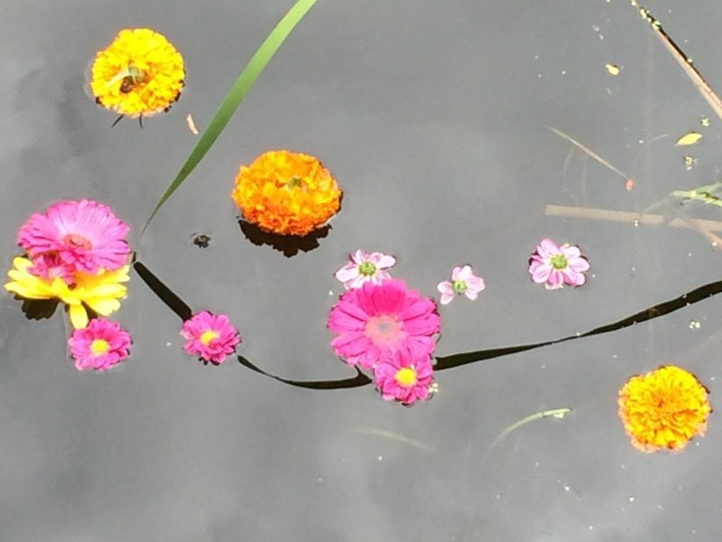
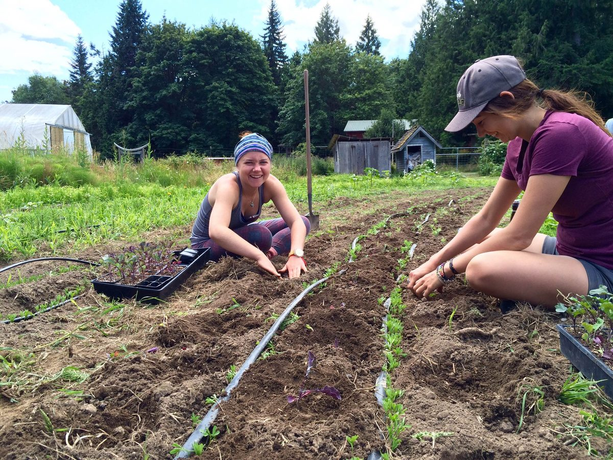

Hello everyone,
I hope you are enjoying summer, wherever you are. Depending on when you read this, we are either enjoying the last day of the 42nd Annual Community Yoga Retreat or will be preparing for the second session of Yoga Teacher Training. As I write this preparation is still going on for the upcoming Annual Community Yoga Retreat. A couple of weeks ago we gathered to celebrate Guru Purnima, honouring Babaji and all spiritual teachers.

The summer’s group of karma yogis are busy in all departments: maintenance and building projects, harvesting the abundance of produce in the garden, cooking fabulous meals with the freshly harvested veggies, and of course, washing dishes. I’d also like to give a shout out to the industrious team in the office who keep everything going.

And of course there’s formal sadhana as well as play. Currently Ramayana rehearsals are going on - and some energetic folks are training for the Hanuman Olympics. Some activities are more likely than others to capture our attention, but all the pieces create the wonderful tapestry of the Salt Spring Centre of Yoga.
Babaji’s oft quoted instructions guide us through each day.
Work honestly
Meditate every day
Meet people without fear
And play.
**Here this month’s garden offering from Milo:**
> *Still in awe at the amount of greens we roll through here. More baby kale, chard and lettuce taking root in the lower fields to supply our salad storms.*
> *Lentils begin to blanket the soil beneath our greens providing nitrogen nodules and shady support, a great companion catch crop.*
> *Every year zucchinis catch me by surprise. They're incredible! ...and... they're starting to haunt my dreams.*
> *Oh and fava beans - full on! We've been blanching and freezing them for less abundant times. Such an amazingly hardy and gracious legume.*
> *Come on out for a garden visit!*

## In this Month's Newsletter

The gift of the summer sun can sometimes create problems if we’re not careful. Pratibha reminds us that we can stay calm and balanced in the summer heat. It’s the perfect time of year to go for a swim, eat juicy cooling watermelon and take it easy! I encourage all of us to follow her advice in “[Stay Cool, Calm and Hydrated this Summer](https://saltspringcentre.com/2016/07/stay-cool-calm-and-hydrated-this-summer/).”
People come to Yoga via various pathways, very often through confusion and suffering, and the desire to get out of confusion and suffering. Sometimes we seem to wander through life without a clear direction, and then something happens that gives us a little push to change our life’s direction. Lee Loknath Mason describes vividly what happened to propel him towards Yoga, in his great story, “[Shaking Off the Dust](https://saltspringcentre.com/2016/07/our-centre-community-loknath/)”.
Even when established on a spiritual path, life sometimes presents us with unexpected challenges that may lead us to refocus our practice. Bhavani Siegel shares how physical difficulties led her to the path of [Mantra Yoga](https://saltspringcentre.com/2016/07/mantra-yoga/). Still in her mid twenties, she expressed her dismay to Babaji over the limitations her physical condition was placing upon her ability to do sadhana. She says Babaji patiently pointed out, *“You are not understanding the point. These are methods to gain control of the mind.*” He gave her some profound teachings, and told her, *You can sing to God. It works!*
I hope you take time to enjoy the beauty and expansiveness of summer, while also remembering to keep cool. If you enjoy the articles in the newsletter, please let us know by leaving a comment at the bottom of each article. We love to hear from you to know what articles you enjoy - and to stay in touch. If you leave a comment, we’ll answer it!
Love,
Sharada
