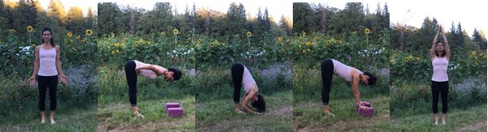
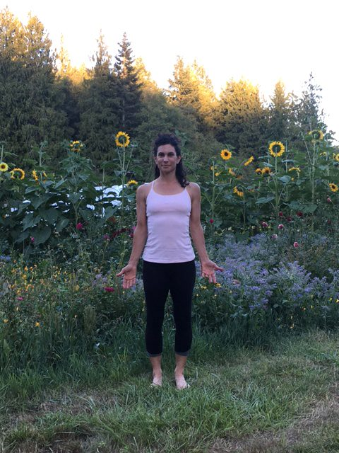
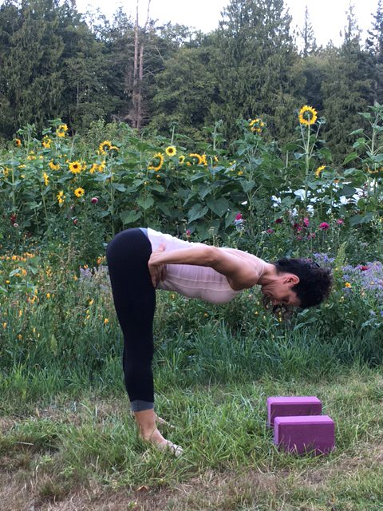
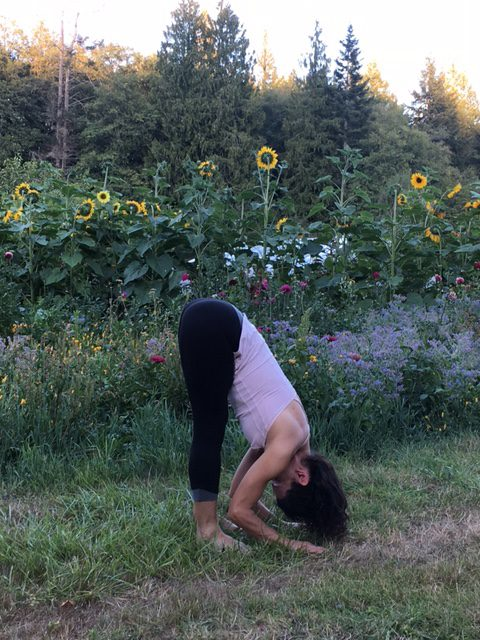
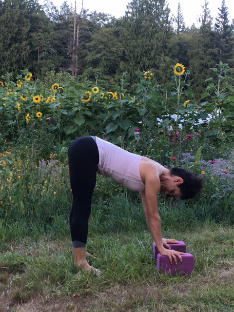
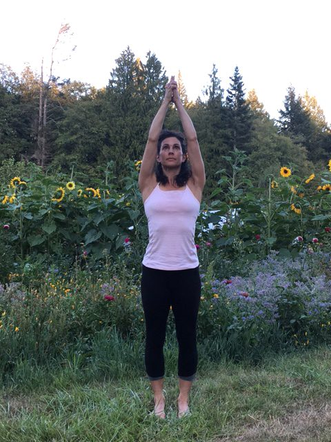
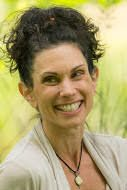

Ardha Surya Namaskar, also known as Half Sun Salutation, is a simple yet foundational sequence consisting of two poses that can easily become overshadowed in our asana practice. Tadasana, known as Mountain Pose, means just that, mountain, and is the first pose of this sequence. Tadasana flows into Uttanasana, which is also referred to as Standing Forward Bend. Looking at the poses energetically, Tadasana represents how we stand in the world as well as how we present ourselves to the world. It is a very empowering pose, that represents our ability to embrace our right to be here. Uttanasana allows us to find a way of releasing and letting go of accumulated internal energy that has been stored along the Sushumna Nadi, which is our central nerve channel. Uttanasana, as a forward bend, is calming to the nervous system, has the benefit of lengthening the hamstrings, activating the inner legs, stretching the spine and relieving tension from the neck and shoulders.
 Tadasana
Begin by standing in Tadasana with the focus on your feet. Feet are parallel, weight distributed evenly between the ball of the foot and the heel. Lift and spread your toes, then place them down. Gently lift your arches away from the mat, bringing slightly more weight to the outer edges of your feet and energetically draw your heels towards each other. With an inhalation, draw the energy up from the soles of your feet through the midline of the legs, bringing the energy into the lower abdomen. Continue to allow the breath to flow up the spine internally. Extend the arms to the side and over your head, keeping the shoulders relaxed.
 Table top (flat back)
On an exhalation, soften your knees, bring your hands to the crease of your thighs and begin to hinge at the waist as you lengthen the spine to extend the torso forward. Keep the lower ribs and navel drawn inwards, make your way into a flat back.
 Uttanasana
Continue to allow the torso to release and rest on the thighs. Place your hands either beside your feet or on the ground in front of you.
 Uttanasana with blocks
If you feel tension in your lower back or hamstrings, place your hands on two blocks in front of your feet. You are now in Uttanasana. Continue to breathe for five breath cycles. Breath remains full and steady, even in its length as well as even in its intensity.
**What to avoid:**

- Rounding your upper back and rolling your shoulders forward.
- Locking your knees and rounding your lower back.
- Allowing the hips to rock back behind the heels, do keep the top of the thigh bones in alignment over the ankle bones.

To exit Uttanasana, begin by checking in with your foundation. Root down through the ball and heel of the your feet, lifting the arches, bringing slightly more weight to the outer edges of the feet and energetically drawing the heels towards each other to engage the inner legs. Keep the navel drawn in as you inhale and proceed to lengthen the spine into a flat back, bringing your hands either to the two blocks in front of you, on shins or thighs. Keeping the abdominal wall engaged by knitting the lower ribs together, pelvic floor and navel lifted. To ensure a flat black, move the sternum away from the pubic bone and elongate the lower spine. Bringing the hands to your hip creases, hinge at the waist and float the torso to an upright position. Exhale the arms to rest at the side body, palms facing forward. You have now returned to Mountain Pose.
 Upward salute
--
Thea Posch has been studying yoga since the mid 1980s. She received her 200 hour teacher training in Boulder Colorado in 2008 through the Boundless Yoga Center. She teaches with an emphasis on alignment, breath and finding expression through movement. Thea's background includes time as a professional dancer with the New York Contemporary Ballet Company, has taught dance, Pilates, and is a Registered Massage and Cranial-Sacral Therapist. Most recently her time has been spent as a karma yogi at the Salt Spring Centre of Yoga.
