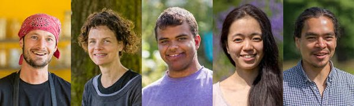
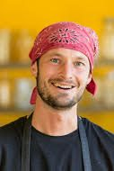
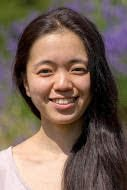
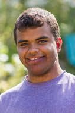
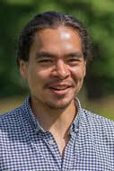
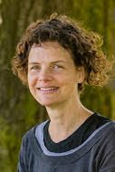

Spiritual community provides support for learning, developing a daily spiritual practice and the opportunity to live and work with others. The YSSI (yoga service and study immersion) participants live at the Centre for three months in the summer, immersing themselves in a yogic lifestyle. During this time they work, study, practice, and learn about yoga, community and themselves. There’s plenty of work - and play. Here is this year’s YSSI group: Angelo, Carnel, Gawain, Karen, Moss, Saori, Shizuka, Tyler, Val, Dee, Laura, Thea and Warren.
I interviewed a few of the participants in this year’s YSSI program, inviting them to share the flavour of their experience with our wider community.
I began with the following questions:
What were the highlights of your time at the Centre this summer?
What have you learned - about yourself? About yoga practice? About living in community?
What teachings and practices have inspired you?
Here are some of their reflections.

## \* \* \*

## Tyler

This has been my deepest immersion into yoga as a lifestyle. I’ve had an asana practice for quite a while and have done a YTT as well (primarily asana based). I’ve lived on Salt Spring for the past couple of years, but even before then, I had heard about this place.
It’s been inspiring to deepen into pranayama practice; it is now my main regular daily practice - that and meditation.
I’ve lived in a few different communities, but this is the most longstanding one by far. It is important to have the thread of spiritual teachings and the emphasis on karma yoga, which is the crux of whether a community thrives or crumbles.
It’s been a busy time at the Centre. Ramayana was a highlight. I got to play Lakshman - so much fun! There was a cohesiveness created in the group going through the process. Creative projects bring the community together.
I’m very grateful for this place, for the systems and structures that are already in place. I appreciate that it’s been done for years, and I appreciate the presence of elders.

## Saori

This has been the first time for me living in a community. I don’t have a yoga community in Japan and I haven’t heard of one. For me everything was the first time - the first time camping, meeting so many people and remembering everybody’s names.
I feel energy from the people, the land, the history of the place; the history has power. I love living in community. We do everything together and it’s fun. It feels like a big family, with everybody caring about each other.
I have so strong a desire for peace on earth. If this community shares with others, peace will grow. That is my dream.
I learned so many things here, including how to make delicious, healthy vegan food. I went to so many yoga classes. I learned so many things, so many styles of yoga. And English! - how to teach yoga classes in English. People support each other here - not like Tokyo or other big cities. At ACYR there were so many people, but it was all so peaceful. It felt like a big family.
Even though English is not my first language, I learned a lot in the theory classes. There were handouts, so I could look up words I didn’t know on my translator. I want to understand everything!
I’ll be going back to Japan, continuing the work I had been doing before, teaching yoga in a Zen temple and in a hospital for people with mental health problems. I want to help create more peace in the world.

## Carnel

It’s been quite a journey! It’s been beautiful, blissful, joyous, and very challenging. Living in community with the duty of work has highlighted my good qualities and my flaws and weaknesses. I’m very introverted by nature, shy and socially awkward so living with so many people in community has been a big learning curve.
I’ve learned a lot about yoga. it’s shown me the importance of daily practice and given me an entirely new perspective on life. What drew me here in the first place was the path of self improvement and healing that I was on, wanting to find the truth about myself and life in general. I’ve found that the daily practice of asana and sadhana works. I have a busy mind and I really appreciate having my mind slow down and focus.
In kirtan and satsang I can feel my heart opening. Music is one of my favourite things. That’s where I feel we’re all connected, we’re all God and everything is God.
I enjoyed ACYR, and Ramayana was amazing, an incredible experience - a group effort, a fun journey and a lot of laughs. So much fun!
The highlights of the summer have been the connections I’ve made with people, the amazing people who come to the Centre.

## Warren

I came here because I wanted clarity. The highlights for me have been having many avenues to learn many things all in one place. I got to explore making desserts for the community, and I really enjoyed being in the Ramayana. There was a feeling of freedom in stepping onstage, and I hope I can find more opportunities to perform in community theatre. It helped me let my heart speak instead of over-rationalizing my life.
I’ve learned that I’m more capable and creative than I thought I was. I’ve also learned that I take my time doing things, and if I’m pressured to do something I get really anxious - and that I’m very hard on myself.
I strongly resonated with Daniel’s energy classes, being able to cultivate the power of being present. I also like the foundation of yama and niyama, a reminder of the way we live our lives. Also, the class on Yoga Nidra was like a huge release.

## Dee

Shankar’s class on the Bhagavad Gita inspired me; there were a couple of strong takeaways. One was the guiding principles of virtuous and nonvirtuous (or sinful) actions - not good and evil but connecting vs isolating. Another was Bhavani’s class on the rolling OM in her Sacred Sound class.
I liked doing pranayama practice as a daily routine so that it sticks and the practices have a chance to get into your bones.
Ever since starting yoga around 16 years ago I’ve become more self-reflective. It’s useful being in a community of people having the same intention of freeing ourselves from our particular burdens or vrittis (thought waves).
Being here I’ve also been relearning the sense of play - like being a singing, dancing monkey in the Ramayana. Being in community there are lots of chances to move toward connection instead of isolation. One of the things I like about being here is that I never have any questions about why I’m doing something; it’s living, it’s connection, it’s community.

## \* \* \*

*To serve others with no selfish motive is sacrifice,*
 *To give what others need with no strings attached is charity,*
 *To live a disciplined life is austerity.*
 *Sacrifice, charity and austerity together in action is called Karma Yoga.*
Thank you to the summer karma yogis!
Contributed by Sharada
Text in italics is from Babaji

### For information about the Salt Spring Centre of Yoga’s Residential Yoga Study and Service Immersion Program program, visit:

[Residential Yoga Study and Service Immersion Program](https://saltspringcentre.com/programs-retreats/residential-yoga-study-and-service-immersion/)
