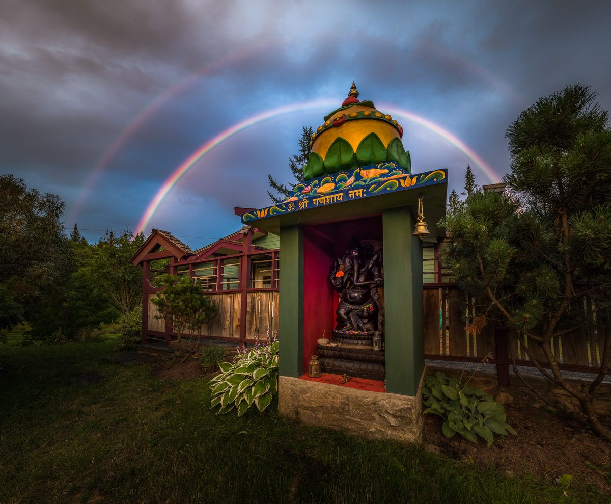
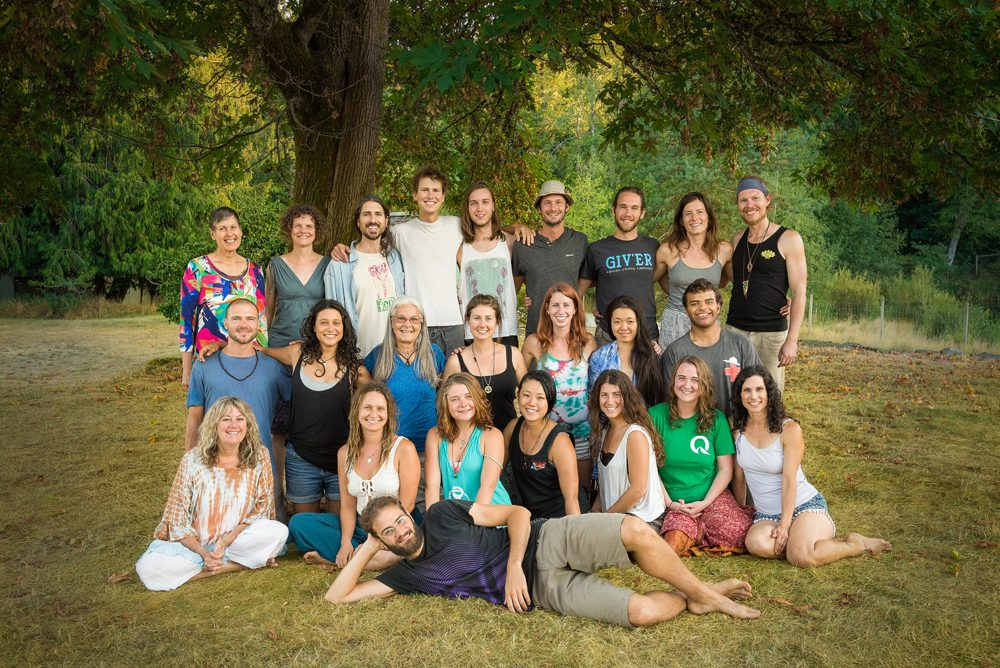
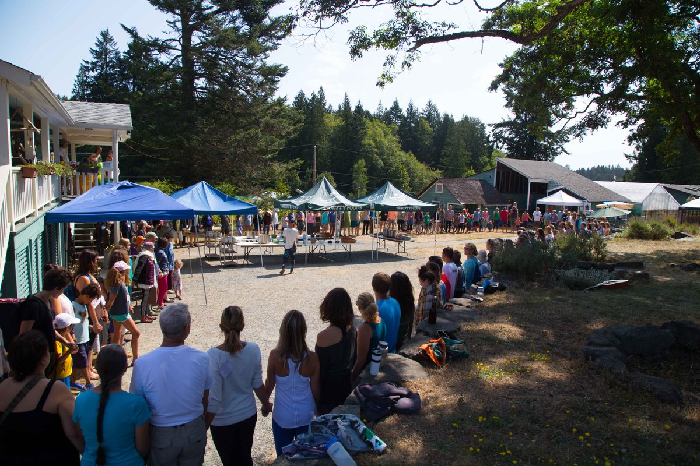
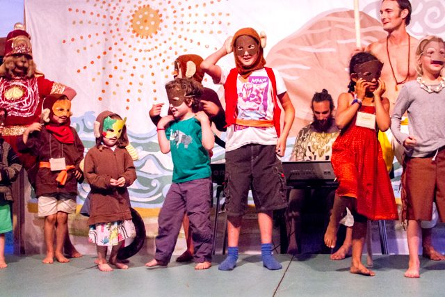
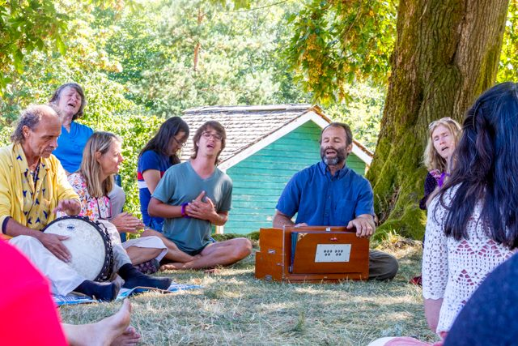
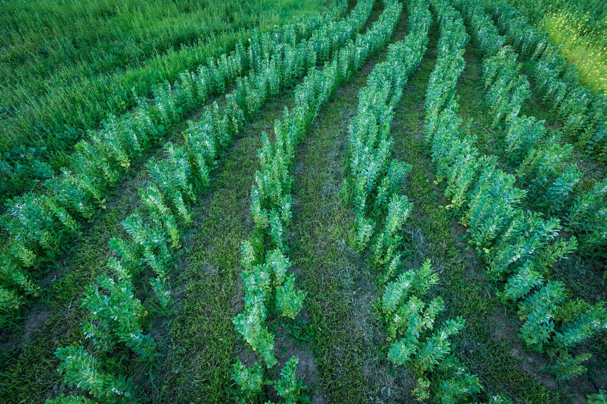
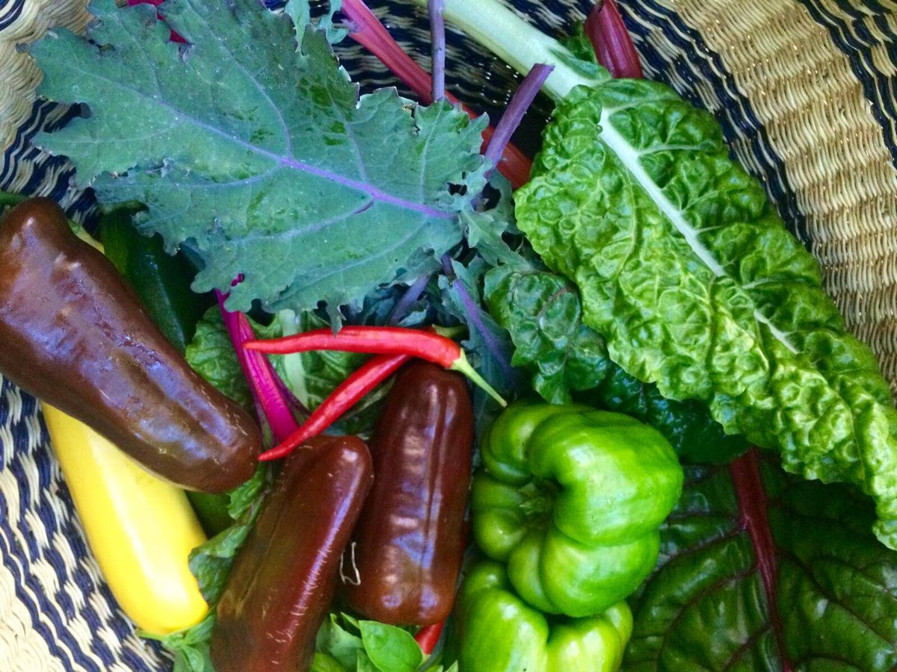
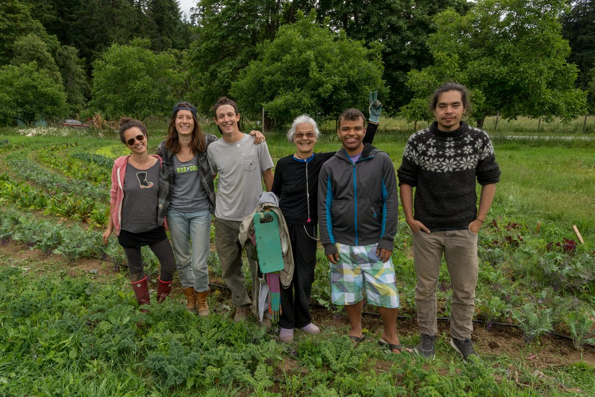
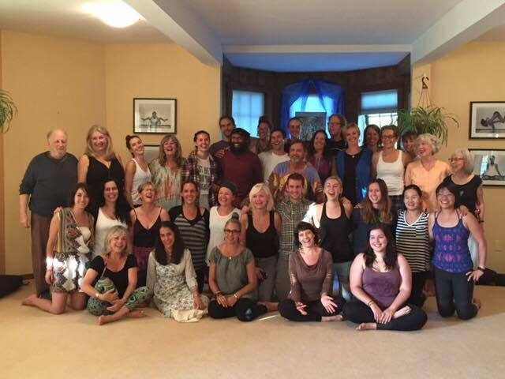

[caption id="attachment\_13981" align="aligncenter" width="600"] Ganesh with rainbows (photo by Gawain Jones)[/caption]
Hello everyone,
What a full wonder-filled summer! So much happens at the Centre in the summer months: the Yoga Service and Study program, Yoga Teacher training and the Annual Community Yoga Retreat - and many, many wonderful, inspiring people.
[caption id="attachment\_13983" align="aligncenter" width="600"] Our wonderful summer community[/caption]
This year’s retreat reminded me of retreats of years ago, largely because there were so many children. It was like a throwback to the days when those of us who are now the elders came to retreats with our kids - and now those kids come with their little ones. The kids’ program and special kid-friendly dinners adds support to the sense of community.
[caption id="attachment\_13987" align="aligncenter" width="600"] ACYR meal circle (photo by Ella Cooper)[/caption]
[caption id="attachment\_13974" align="aligncenter" width="600"] Little monkeys (photo by Rebecca Dadson)[/caption]
Several of the kids got to take part in the now-annual Ramayana, as little monkeys. There were so many inspiring classes and programs offered! In addition to the sadhana and asana classes, there was fabulous kirtan, dancing with Imaginelle, Hanuman Olympics, and the 3rd annual Ramayana production (a video of which will be posted on the Centre’s website shortly). Take note: the reference to Ram’s Golden Fava Bean is a reference to the huge abundance of fava beans from the farm that appeared in many of the meals.
[caption id="attachment\_13975" align="aligncenter" width="600"] Kirtan on the mound (photo by Rebecca Dadson)[/caption]

# Milo's Garden Update

Here’s Milo’s monthly report on what’s happening in the garden.
[caption id="attachment\_13985" align="aligncenter" width="600"] Curving rows (upon rows) of fava beans (photo by Gawain Jones)[/caption]
[caption id="attachment\_13978" align="aligncenter" width="600"] Summer abundance[/caption]
[caption id="attachment\_13982" align="aligncenter" width="600"] Working on the farm[/caption]
Harvest dance is in full swing this month as we do our darndest to keep up with tomatoes, bush beans, zucchini and the ever relentless cucumbers.
...Keep your ears perked for pickling and processing parties on the horizon.
The apples are falling freely and a rumour has been circulating amongst the mighty maples that Fall is near...
So... let's gather the rattling seed and fruits from our most vigorous veggies, loudest flowers, and helpful herbs to see us through the winter.
Pan the soil for your last potatoes, yip and yearn for rain and sow your favourite winter blanket!
Abundance abounds. See you next time round.

# Congratulations to the new teachers!

A group of 24 students graduated from this year’s YTT graduated in mid August, taught and supported by an amazing group of experienced teachers who practice what they teach. Congratulations to the new teachers!
[caption id="attachment\_13986" align="aligncenter" width="600"] Congratulations to this year's group of YTT Graduates![/caption]

# Comings and goings at the Centre

Community life at the Centre is now moving into its smaller size for the upcoming quieter season. We say goodbye to Raven as a land resident, but not as part of the community. He will continue to be involved in satsang and rituals like arati. He continues to be an important part of the satsang.
Arpita is also moving off-land, to Montreal. She will continue her studies and expand her world. At this time of year, there is a shifting of resident staff. We bid farewell to those who are moving on to other adventures and wish them well.
This summer’s Yoga Service and Study Immersion program has ended, but a couple of YSSI participants will stay with us for a longer period of time.

# Upcoming Programs

Programs continue throughout the fall. There is a [Yoga Getaway](https://saltspringcentre.com/retreats-programs/yogagetaways/) coming up on September 9-11 and [Yoga for Cancer](https://saltspringcentre.com/retreats-programs/yoga-cancer-workshop/) on September 30-October 2. This workshop is designed for yoga teachers, and is approved for continuing education credits through Yoga Alliance toward YTT 500 at Mount Madonna Center.
Visitors continue to come to the Centre as [Personal Retreat](https://saltspringcentre.com/retreats-programs/personal-yoga-retreats/) guests, a simple, relaxing way to get away for a few days, stay at the Centre, go to yoga classes, book treatments at [Chikitsa Shala](https://saltspringcentre.com/wellness-centre/), delicious and nutritious vegetarian meals made with veggies straight from the garden, and connect with community members.

# Back to School

The [Salt Spring Centre School](http://saltspringcentreschool.ca/) begins the new school year on September 6, followed by the annual whole school vegetarian potluck at the school on the 9th, an opportunity for all the parents, kids, teachers, GES board members and some folks from the Centre community to connect.

# In this Month's Newsletter

There are a number of articles for you to enjoy in this edition, and as always, we welcome your comments.
What is it like to take part in the YSSI program at the Centre? [Life as a Summer Karma Yogi](https://saltspringcentre.com/2016/08/life-as-a-summer-karma-yogi/) introduces you to five of this summer’s YSSI karma yogis. It will give you a bit of the flavour of community life during the 3 busiest months of the cycle of life at the Cente.
Thea Posch, who is also a summer karma yogi in the YSSI program, and who is also a yoga teacher, dancer and massage therapist among other things, introduces us to [Ardha Surya Namaskar](https://saltspringcentre.com/2016/08/asana-of-the-month-ardha-surya-namaskar-half-sun-salutation/), a modified version of sun salutation -a simple but powerful series.
After a rich and inspiring experience of being at a retreat it’s not uncommon to head home with a vision of living a dedicated yogic life, only to find that going back to our regular lives doesn’t always match up with our dreams. I invite you to read [Whatever is Happening is our Practice](https://saltspringcentre.com/2016/08/whatever-is-happening-is-our-practice/).
Since we never know what’s around the corner, here’s a helpful reminder from the Dalai Lama: Remember that sometimes not getting what you want is a wonderful stroke of luck.
With best wishes,
Love,
Sharada
