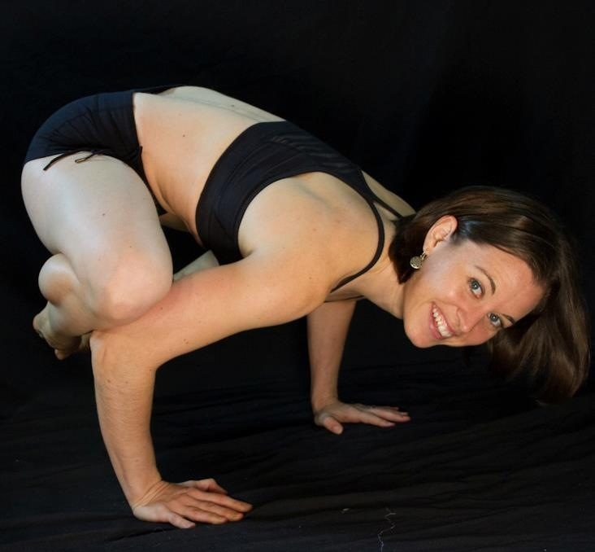
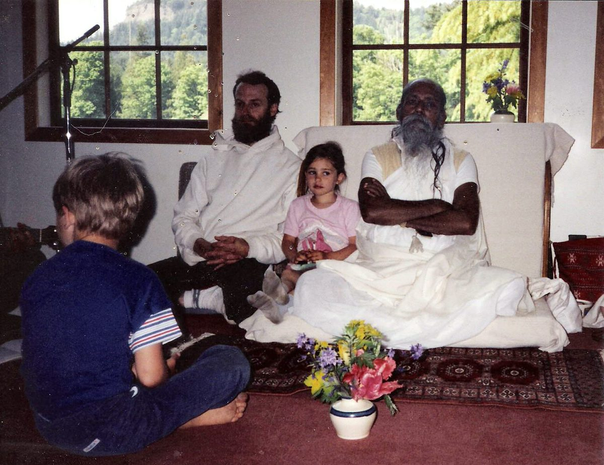
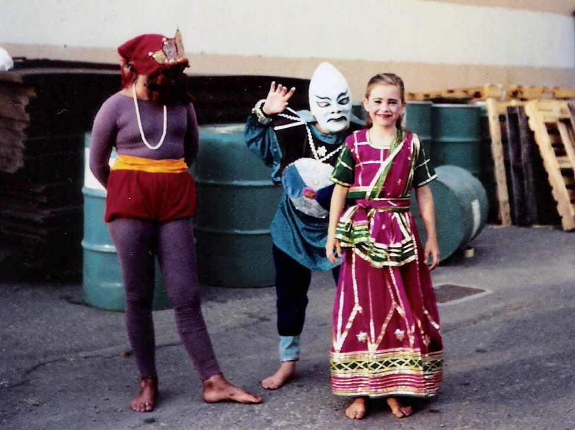
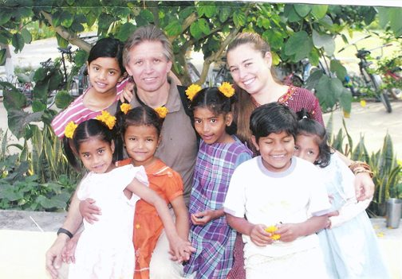
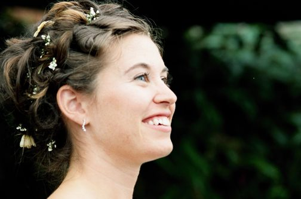
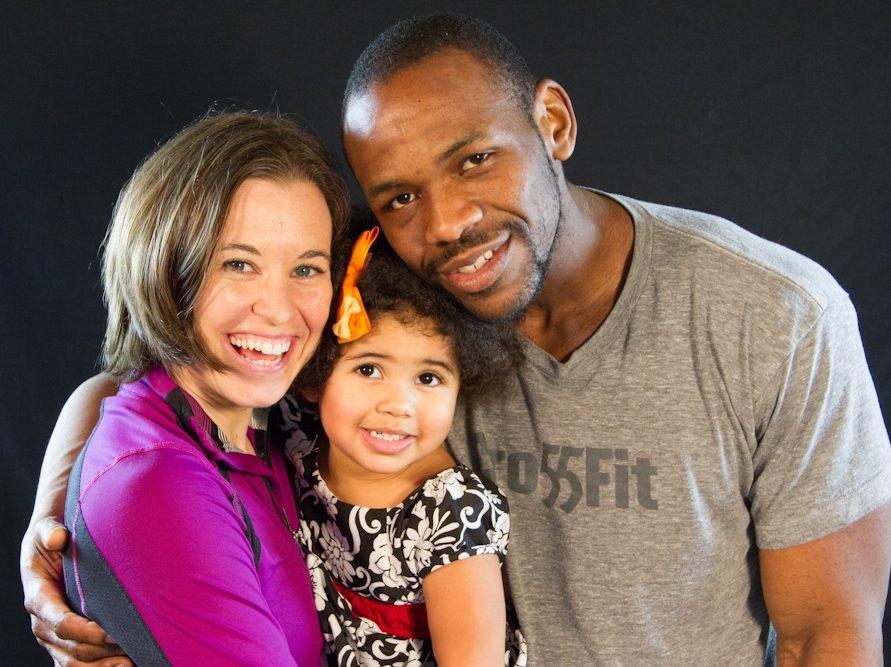

# Anchor

[caption id="attachment\_14074" align="alignnone" width="600"] Kirti practices crow pose[/caption]
The Salt Spring Centre of Yoga has been a part of my life as far back as I can remember. My parents moved to Salt Spring Island in 1983 and found community at the Centre shortly after. My earliest memory is telling my parents that I would like to ask Babaji for a name. They agreed it would be fine with the understanding that I would continue to use my Great Grandmother’s name outside of the Centre. However, Julia never resonated with me. Arrangements were made and I impatiently awaited my appointment with Babaji. I remember walking into the room with my parents, sitting in front of Babaji and being given my name. Unlike most of my memories that can be played back like a video, this memory is filled more strongly with the feelings of “ah this is right.” I left the room as Kirti; I refused to be called anything else thereafter, I was 4 years old.
[caption id="attachment\_14078" align="alignnone" width="600"] Sitting with Babaji at the Easter Retreat, 1990[/caption]
Even though our family lived off the land, Centre life was a large part of my childhood. As a kid, singing Kirtan (or rather running in and out of the room with my friends), learning alternate nostril breathing, tracing Babaji’s Ram’s that he had painted on the rock wall, playing parts in the yearly Ramayana, participating in dish shifts, meeting and befriending other kids from our sister Center at Mount Madonna were a normal part of growing up. I’m glad that was my normal; it solidified my sense of belonging and connection to our community.
[caption id="attachment\_14079" align="alignnone" width="600"] All dressed up for Ramayana, 1990 Retreat[/caption]
During one retreat I learned to blow the conch. There were a few of us learning outside on the deck by the kitchen, we were all creating beautiful dying cow sounds. Thankfully, each of us slowly began grasping how to make the correct sound. We were laughing and blowing the conch longer and longer and longer. Then a man came running from the direction of the school flailing his arms and in a panic “STOP! STOP!” he said. We were all a little surprised and began to think that we had disturbed part of the program. Nope, that wasn’t the problem; it was more that the long blow of the conch signaled someone had died. Whoops! It seems someone must learn this lesson at least every other retreat.
I feel truly privileged to have grown up around the beautiful community that is the Salt Spring Centre. People come together on the platform that Babaji created for all of us to live by and learn from. It took me years to realize that the Centre was my family outside of my home. When I was 18 I lost a very close friend in an accident, and my parents were out of town; I headed straight to the Centre and found the family I needed to cope with the shock and grief. The Salt Spring Centre and Babaji’s teachings have continued throughout my life to be an anchor when my ship gets rocked.
In 2002 my dad and I made our pilgrimage to the Sri Ram Ashram in India. What struck me most was the closeness that everyone had with each other; it was a family with a blended community of people from all over India and the world. I can’t wait to go back with my daughter one day.
[caption id="attachment\_14075" align="alignnone" width="600"] With the kids at the Sri Ram Ashram, March 2002[/caption]
In 2007 my husband, Theron, and I were married. Our wedding was sandwiched by my participation in YTT. Crazy? Yes. Fun? Absolutely! I couldn’t have done it without the huge support of my incredible husband, supportive family, loving Centre family and fantastic teachers. What a transformative experience and phenomenal way to take one’s personal practice deeper. I highly recommend it to everyone, even if you don’t plan on teaching.
[caption id="attachment\_14076" align="alignnone" width="600"] Kirti's wedding[/caption]
After the birth of our daughter, Takaya, in 2010 my health was compromised for several years. It took a while to figure out that my extreme exhaustion was not a normal part of motherhood. Through that time I fell back on the teachings of Babaji to help me to keep pushing on. I still have setbacks, though thankfully, in the last two years my health has come back enough to participate more in the summer retreats with Takaya, this past summer taking part in the ACYR planning committee and helping with the kids’ program. It is a wonderful feeling seeing Takaya thrive in the environment that I grew up in and to see the second generation of kids playing, learning and growing together.
[caption id="attachment\_14077" align="alignnone" width="600"] Kirti, Takaya and Theron[/caption]
Om
Kirti
