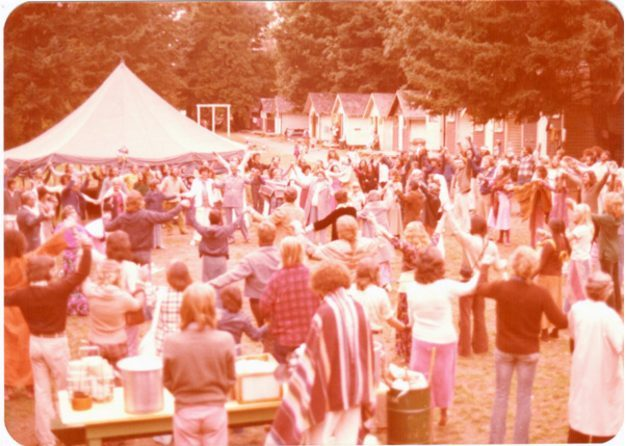
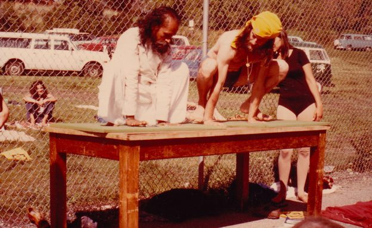
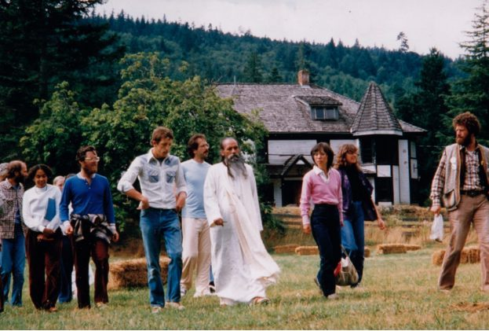
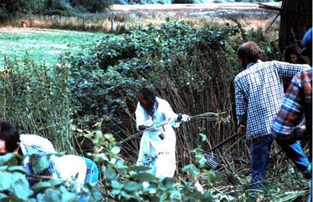
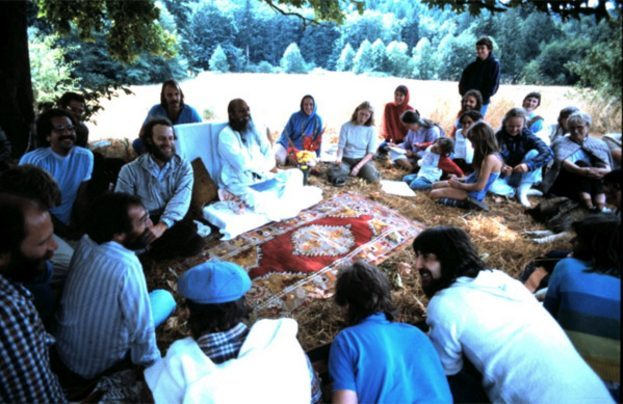
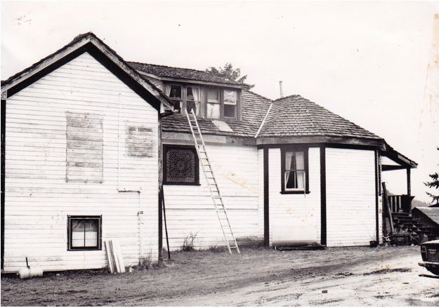
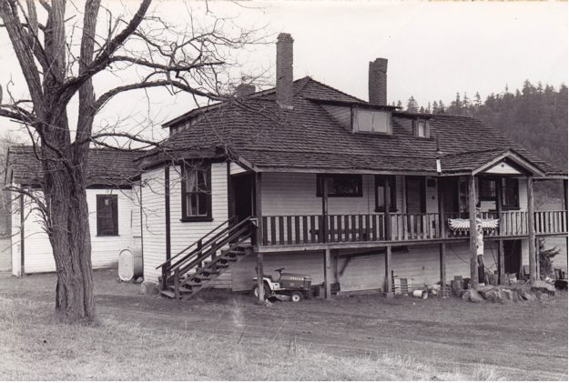
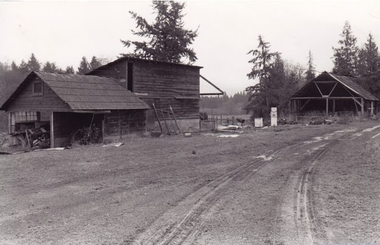
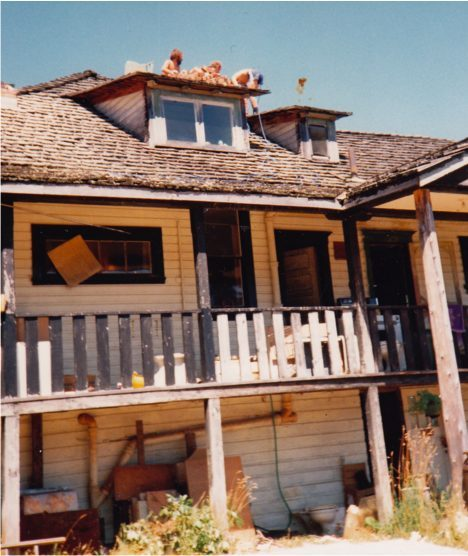

*The main aim of life is to attain peace. At the land we are doing various things, but underneath it, that is our main aim.*
The story of the Salt Spring Centre of Yoga began in the 70s, before the dream of land was born. In 1974 Babaji spent a week in Vancouver, teaching and spending time with a group of devotees at the Spruce Street house. He said, “If you have a yoga retreat next year, I will come.” And that’s what happened.
We rented a camp in White Rock, BC and held a 10 day yoga retreat, none of us ever having done such a thing before. As I recall, it rained for 9 of the 10 days, but it was a success nonetheless. Babaji was there, AD taught classes, everybody pitched in and our yoga community grew.
[caption id="attachment\_14092" align="alignnone" width="600"] The grace circle at the White Rock yoga retreat in 1975[/caption]
**Lakshmi:** Like many young people my age, I had read the book Be Here Now and was intrigued by a picture of a yogi from India named Baba Hari Dass. Shortly after that, in August 1975, I heard that Babaji was going to be at a yoga retreat in White Rock, BC. That was the first Dharma Sara (DS) Yoga Retreat. I felt a deep calling to go and I hitchhiked to White Rock with my young son in a snuggly pack. When I got there, there were no posters or signs to locate the event. (This may have led to my later obsession with brochure and flyer distribution for SSCY programs!) I went to the intersection and picked a direction to hitch-hike. The next car stopped and the people were going to the retreat! I arrived in the middle of a traditional Indian wedding fire ceremony. Afterwards, we all formed a “grace circle” and that is when I first met Babaji.
For the next several years we held yoga retreats at Camp Hatikva in Oyama, BC on the shores of Lake Kalamalka. Hundreds of people came. Yoga classes were held in a tent and in the tennis court. There were no yoga mats back then; people brought foamies or blankets. There was rocking kirtan in the main hall, yoga theory classes, big meal circles, canoe races, skits and a childcare program for the many, many children.
[caption id="attachment\_14100" align="alignnone" width="600"] Babaji and AD demonstrating asanas in the tennis court[/caption]
After a while Babaji suggested that we take the next step, saying, “Buy land.” The search for land took a couple of years - until the land we call the Salt Spring Centre of Yoga was found. It was 1981.
[caption id="attachment\_14099" align="alignnone" width="600"] Walking the land with Babaji, 1981 - From left to right: Vidyasagar, Girija (with the top of Karuna’s head behind), Dayanad, Pitambar, Badri Dass, Babaji, Sharada, Lakshmi, Keval Dass[/caption]
**Sri Nivas:** After searching over the whole province, we came across the ‘Blackburn Road’ piece in May of 1981; in early June we purchased it with donations from many members for the down payment and the knowledge that our store, Jai, in Vancouver, could meet the mortgage payments.
**Sharada:** The land was beautiful and the house was promising. We walked the land with Babaji that first year, and on his chalkboard he wrote, “It is a good land” and proceeded to tell us all the things we could do on the land, from agriculture to Ayurveda, from programs to yoga school. All of it ended up happening.
**Raghunath:** The first time Babaji came to see the land with us, before anyone had really moved in at all, he decided we should get rolling on some clean-up. Within twenty minutes, a score of strong hands were rolling a big old disused oil-storage tank from where the greenhouse now stands, and a cheer went up when it took off down the slope on its own momentum. Next were the tangles of blackberry brambles that festooned the area, so Babaji plunged into the middle of them with Anuradha close at hand, secateurs and loppers, sickles and shears, snipping and tugging till bare soil came in sight. We sent a mountain of thorny greenery on its way to a new home in the compost pile. “This will be the garden”, Babaji’s chalkboard told us. It was a very exciting time.
[caption id="attachment\_14098" align="alignnone" width="600"] Babaji led the de-brambling and rock-clearing effort. Later, this area was the first to be gardened.[/caption]
[caption id="attachment\_14097" align="alignnone" width="623"] On Babaji’s first visit to the land, under the big maple tree. 1981[/caption]
[caption id="attachment\_14096" align="alignnone" width="600"] The house in 1981 (where the main entrance is now prior to the addition of the lobby).[/caption]
**Sri Nivas:** The Centre farmhouse was quite run-down and had been abandoned for about six years. We began working on the renovations almost immediately. Room 108 – the main floor guest bedroom – was the only room in the house that was insulated. All the chimneys were falling down so the house had no heat. All the plumbing had long since frozen and burst. The lobby and most of the dormers upstairs didn’t exist. There was a lot of work to be done!

**Sri Nivas:** Today, apart from the main house, the only existing original structures are what are currently the community kitchen and the tool shed, the latter known for some obscure reason as the Top Shop. They had been milking sheds from the original dairy farm.

We held our annual yoga retreat that year at Camp Elphinstone on the Sunshine Coast, but the next year we held our first retreat on the land! More from **Sri Nivas:** At the first yoga retreat on the land in summer 1982, we ran out of water and had to order tanker trucks for water. Originally there was only a dug well that didn’t supply nearly enough water. We called in a dowser who located the spot for our existing drilled well.

## That takes us up to 1982. More to come in future editions.

--
Contributed by Sharada, with gratitude to Babaji who pointed the way, and to everyone who worked hard to make this dream come true.
