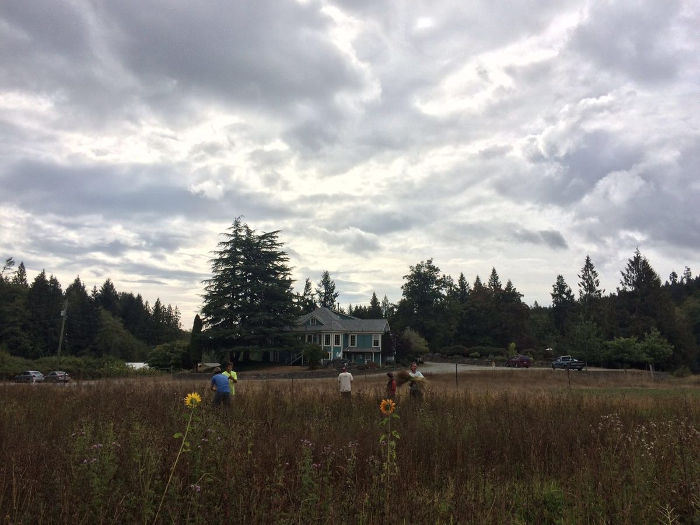
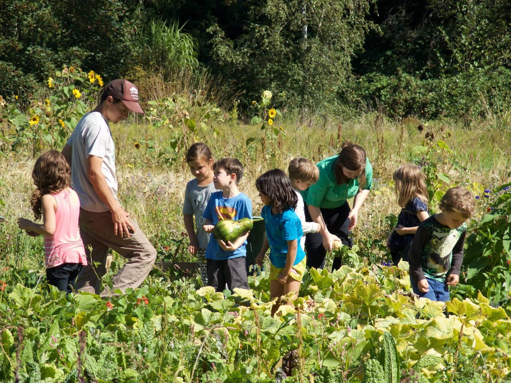
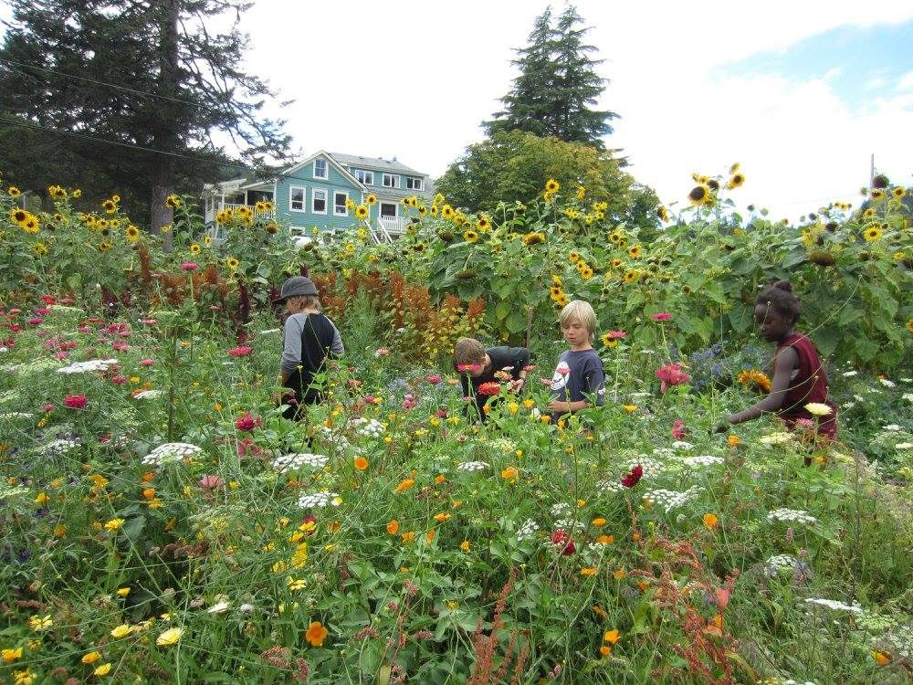
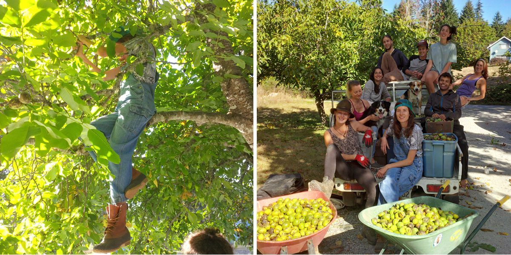
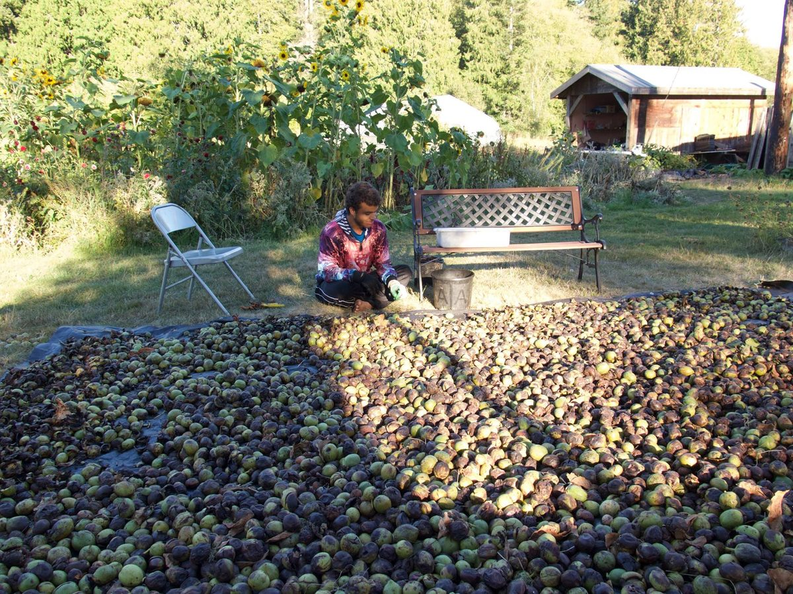
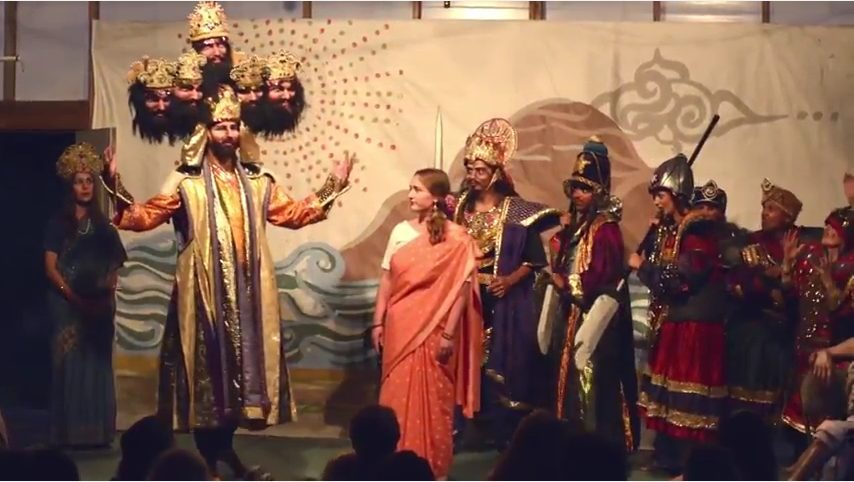
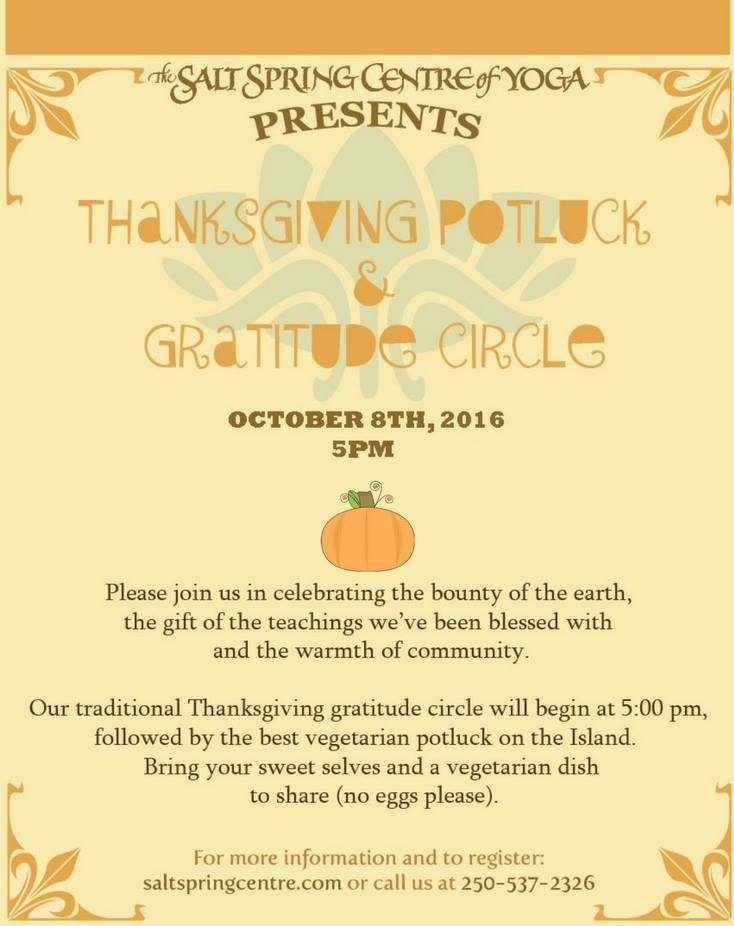

# Autumn Day

### Lord: it is time. The summer was generous. Lay your shadows onto the sundials and let loose the winds upon the fields. Command the last fruits to be full, give them yet two more southern days, urge them to perfection, and chase the last sweetness into the heavy wine.

### *~ Rainer Maria Rilke*

Autumn greetings, everyone. This is a time of rich abundance and chilly nights, and a time of transition. The residential community at the Centre is beginning its annual dance of dwindling to winter community size. Although there is a never ending list of projects, they tend toward preparations for the upcoming cooler months. The farm has produced abundantly this year, leading to many harvesting parties. Apples and pears have been picked and are being dried, made into sauce and crumbles; peas, beans and flax have been harvested and dried, and a huge number of walnuts have been harvested from the trees along the driveway. We continue to be served amazing meals made of freshly harvested produce directly from the garden.
[caption id="attachment\_14119" align="alignnone" width="600"] Harvesting flax[/caption]
On the same theme, here is...

# Milo’s monthly farm update

The Centre School is back in session and the sounds of play and laughter echo warmly across the land again. The weekly exploration of our farm with the kids is full of questions and qualms around the apples, pears and most recently walnuts and the delicate cracking or smashing of them.
[caption id="attachment\_14115" align="alignnone" width="600"] Milo with the school kids on the farm[/caption]
[caption id="attachment\_14114" align="alignnone" width="600"] School kids in the garden[/caption]
Speaking of walnuts... Some of you may have witnessed our residential tree climbers channeling their inner monkey and "swaggling" our trees along the driveway last week to encourage nut fall. Gratefully no trees or climbers were harmed in this endeavour and we are feeling quite pleased with our nutty bounty.
[caption id="attachment\_14118" align="alignnone" width="600"] Walnut harvest and crew[/caption]
[caption id="attachment\_14117" align="alignnone" width="600"] Carnel sorting the walnut bounty[/caption]
As the rains return, we are rounding up the final dry beans and watching all kinds of winter squash explode onto the scene and into our pantry. Seeds from neighbouring trees (chestnuts, hazelnuts, hawthorne, walnuts) are being gathered and planted for emergence next spring, along with hopes for the reliable and sustainable source of nourishment that these magical trees provide.
Happy and cozy fall days to you and yours.

# Ramayana!

For those who have been waiting, here’s the link to the 50 minute [Ramanaya from this summer’s ACYR](https://www.youtube.com/watch?v=f00jmPhLQ7A&feature=youtu.be). If you’ve already seen it, you get to enjoy it all over again. Jai Sita Ram! Jai Hanuman!

# Special Autumn Events

Several special autumn events are coming up this month, beginning with [Navaratri](https://calendar.google.com/calendar/render?eid=YThqYmIyZHMwcjZ1aGo3bWs2Ymx2aTZiaWNfMjAxNjEwMDFUMDIwMDAwWiBpMDM5ZXJvamg4cmpsdDRvNzV1NjNkc3NoNEBn&ctz=America/Vancouver&sf=true&output=xml#eventpage_6), nine nights dedicated to the Divine Mother, symbolizing the triumph of light over darkness.
Sharada will again be leading a Rosh Hashanah celebration with the school children to welcome the new year according to Jewish tradition.
A few days later, on October 8, the Centre will host its annual Thanksgiving gratitude circle and vegetarian potluck dinner. Happy Thanksgiving, everyone.
At the end of the month, we will be hosting a Halloween costume party. There’s a longstanding tradition of great Halloween parties at the Centre, which has lapsed over the years as the original party folks got busier - and older. This year it’s coming back!

# In this month's Newsletter

On the subject of longstanding traditions, I hope you enjoy a peek into the past in this photographic journey of the [The Early Years](https://saltspringcentre.com/2016/09/the-early-years-the-beginnings-of-dharma-sara-and-the-salt-spring-centre-of-yoga/). This is intended to be the first of a series of stories and photos of the Centre over the years. This edition takes us up to 1982.
“Our Centre Community” introduces you to [Kirti White](https://saltspringcentre.com/2016/09/our-centre-community-kirti-janyk/), who has been connected to the Centre since she was a child. The Annual Community Yoga Retreat and Ramayana performances were a regular part of her life. She’s still an active participant in Centre life, this year serving on the ACYR planning committee and working/playing in the kids’ program. Now her daughter gets to share the same connection when she comes to the Centre.
Kenzie shares her musings on [7 Ways to Prevent Yoga Teacher Burnout](https://saltspringcentre.com/2016/09/7-ways-to-prevent-yoga-teacher-burnout/). If you’re not a yoga teacher, you may think this article has nothing to teach you, but you may be surprised. The specifics may differ, but our underlying needs are the same, and you might find that Kenzie’s suggestions will work for you as well.
*May we be filled with loving kindness,*
 *May we be well,*
 *May we be peaceful and at ease,*
 *May we be happy.*
*Wish you all happy.*
Love,
Sharada
