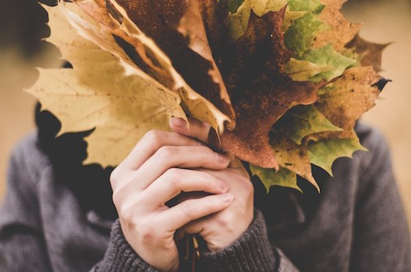
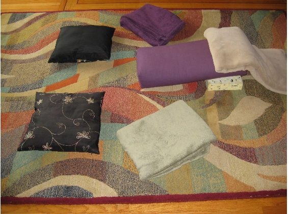
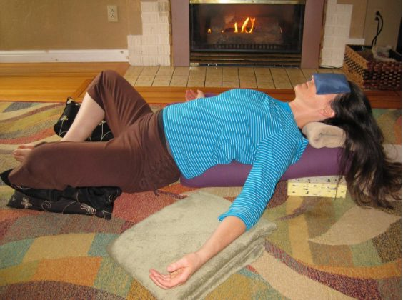
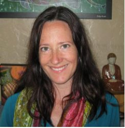

Autumn is my favorite time of year. I love all the changes that take place during this season. The leaves turn vibrant yellows and reds and golden oranges and browns as they offer up a sensory feast for the eyes. The air turns cool and crisp and walking in the fall air turns our cheeks rosy. To keep ourselves warm we layer up, bringing out our hats, scarves, sweaters, cozy jackets, and boots. For me, fall is a time of reconnection with my inner child, jumping into, skipping through, or kicking up the piles of leaves lining the sidewalks and roadways.
Fall provides the opportunity to slow down, to release the hectic pace of summer, as all of nature begins to prepare for the winter ahead. From the perspective of Ayurveda, as nature transitions into fall, it lets go of the dominance of fiery Pitta and enters Vata time of year. Vata is the dosha (or constitution) governed by the elements of air and ether/space. Vata is dry, cool, and mobile. The arrival of fall winds and storms is one manifestation of Vata’s tendency toward movement. Remembering that we too are a part of nature, this movement outside creates movement inside of us as well. This movement inside can manifest as a lack of grounding, increased activity in the mind (swirling or racing thoughts, for example), insomnia, and difficulties in allowing the body to be still.

## Nourish and Ground your Body and Mind

There are many ways that we can help nourish and ground our bodies and minds at this time of year. Food is one way we can do this. Fall foods are some of my favorites - warm hearty soups and stews and roasted root vegetables are great choices to help pacify the increase in Vata that occurs in the autumn. Self-massage with warmed oils (abhyanga) is also very effective for calming and grounding both mind and body. In addition, restorative yoga is a wonderful way to calm the mind and nervous system, encourage stillness in the physical body, and establish a connection to our inner wisdom and Spirit. This connection is vital for keeping us grounded and centred, regardless of what is happening outside.

## Benefits of Supta Baddha Konasana

Supported Reclining Bound Angle Pose is an ideal restorative pose to practice whenever you feel swept away by the winds of the season. This posture opens the chest, abdomen, and pelvis and counteracts the effects of sitting hunched over a computer all day. The props cradle the body and create a sense of comfort and safety that permits us to deeply relax. Reclining Bound Angle pose calms the nervous system, relieves stress and fatigue, and is beneficial to those with high blood pressure. It is a great posture for women during their menstrual period and menopause and is also very helpful for women during pregnancy. This is my go-to pose when my anxiety starts to spin out of control.

#### Contraindications

This is a pose you will to exercise caution with if you have disc problems in your lower back or sacroiliac dysfunction. You can experiment with lower prop heights with these conditions, but be mindful – restorative postures are meant to be effortless and comfortable, so if you aren’t comfortable even with prop adjustments, this posture might not be appropriate for your body.
If you have disc disease or other injuries or tenderness in your neck, support your head and neck. You might have to play with different heights of props to find your place of comfort.
If you have a knee injury, you might find that keeping the knee bent for prolonged periods of time is uncomfortable. You can always start by holding the pose for shorter periods or extending your legs periodically while you are in the pose.
Please, do not practice this posture if you have spondylolisthesis or spondylosis.

## Props

You will need a few props for this pose: a bolster, 2 cushions or blankets to support your legs, a cushion or blanket to support the back of your head and neck. In case you need to adjust the height of your set-up, have a couple of yoga blocks or extra cushions/blankets handy. You might also want to have a blanket to cover yourself, so you stay warm and cozy for the time you are in the pose. You might also choose to use an eye pillow to support and deepen your relaxation.

## Setting Up

[caption id="attachment\_14208" align="alignnone" width="567"] Prop set up[/caption]
Place your bolster on the ground. If you don’t own a bolster, grab a blanket or two and fold or roll them to create a “bolster” to support your back. I find that a thick blanket or quilt works nicely. Sit with your tailbone/sacrum up against the end of the bolster, knees bent and feet on the floor. Make sure your blankets and cushions are easy to reach before you lie down. Lie down on the bolster, using your arms for support. Are you comfortable? If not, you will need to adjust the height of your props. You can increase the height of your bolster by adding a folded blanket. Other height adjustments include placing a block or cushion under the head end of the bolster or placing a block or cushion beneath your bottom.
Once you have found a comfortable height, place a folded blanket beneath the back of your head. Alternatively, you might make a small roll at one end of the blanket and place that beneath the curve of your neck. Ideally, your forehead will be higher than the chin, the chin higher than the sternum, and the sternum higher than the pelvis. In other words, your torso will be slightly angled away from the floor, bottom lower than the head.
With your knees bent, allow the soles of your feet to come together and let your knees fall out to the sides. Place a cushion or folded/rolled blanket beneath each of your outer thighs to help support your legs. The blankets or cushions should completely support your legs, and your knees should be equal heights away from the floor. Check in with yourself. Do you need to add more height beneath your legs? Are you still comfortable with the height of your bolster and the support behind your head? Adjust your props as needed.
You might feel like you need a little height to support your arms. You can choose to place a cushion or folded blanket beneath each of your forearms. This arm support can help relax the shoulders and chest. If you have an eye pillow, place your eye pillow gently over your eyes and let yourself settle in.
[caption id="attachment\_14206" align="alignnone" width="564"] Supported Bound Angle Pose[/caption]
Let go of any effort you might be using to hold yourself up. Can you allow the earth to rise up and cradle or embrace the whole back of your body? Let the eyes fall away from the back of the eyelids and relax your jaw. Notice the soft flow of your breath – breathing in, aware you are breathing in; breathing out, aware that you are breathing out. Allow your breath to breathe you – letting go of all effort. Rest here for as long as you like, staying for as long as 30 minutes.

## Coming out of the Pose

When you are ready to come out of the pose, start by slowly letting your awareness come back toward the outside world. Notice the sounds in the room, notice the sensations in your body. Begin to make some small movements as you’re ready, maybe wiggling fingers and toes or letting your head rock from side to side. Remove your eye pillow, open your eyes, and allow your movements to grow, until you feel ready to either lengthen your legs out or place your hands on the outsides of the knees to help draw your knees back towards one another. Roll onto one side and take a couple of breaths here. When you’re ready to rise, press the ground away with the arms and come up toward seated. Notice what Supported Reclining Bound Angle Pose offered up to you today. Move into another posture or continue on with the rest of your day.

### About the Instructor

Tanya Gita Roberts has been practicing yoga for almost 16 years, starting in university as a way to alleviate stress and anxiety. Her practice has evolved to become the cornerstone for all aspects of her life. Gita completed her 200 hour training at the Salt Spring Centre of Yoga in 2011 and 500 hour training at the Mount Madonna Centre in 2014. She is a faculty member of the SSCY Yoga Teacher Training, instructing Shath Karma and Asana classes. Baba Hari Dass reminds us that we “teach to learn” and she takes this to heart, learning something new in every class she teaches or takes. Her teaching style integrates principles of alignment, subtle body and Ayurveda. By cultivating harmony of body, breath, and mind throughout practice, she encourages students to dive inside and connect with their deepest Selves. Gita teaches Hatha, Gentle, Yin and Restorative classes in Victoria.
