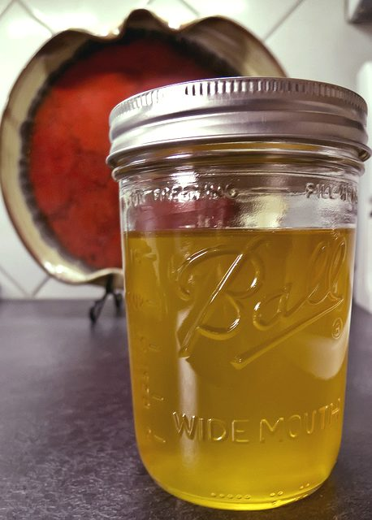

Ghee is the purified form of butter, often called “clarified butter.” In Sanskrit, it is referred to as ghrta. Ghee is one of the most ancient and sattvic foods known. According to Charaka (one of the codifiers of the Ayurvedic system of natural medicine), ghee plays a vital role in health maintenance; it “promotes memory, intelligence, vital fire (agni), semen, vital essence (ojas), kapha, and fat. It is curative of vata, pitta, fever and toxins.”
After years of promoting a low-fat diet, modern nutritionists are now saying that consuming healthy fats is very important for brain function, digestion, increased absorption, and overall health. And ghee is definitely a healthy source of fat. (Those with a vegan inclination can substitute other healthy vegetable oils – such as sesame, olive and coconut – into their daily routine. They also have a myriad of health promoting properties.)
Ghee is good for all body types, especially vata were it counters the vata’s tendency to dryness; it also serves to promote a healthy pitta dosha, as it is considered cooling, soothing, anti-inflammatory and detoxifying. Minimal use of fatty substances is recommended for kapha types, for their bodies naturally generate sufficient fat tissue. Ghee is also loaded with heart-, brain- and skin-healthy Omega-3 and Omega-9 essential fatty acids, along with all the fat-soluble vitamins A, D, E, and K, minerals and at least nine antioxidants.
Ghee is particularly useful to promote a healthy digestive system. First it adds fuel to the fire of the digestive enzymes in the stomach. In the small intestine, ghee helps lubricate the passageway, helping to ease the digested nutrients into the blood vessels. And in the colon, ghee is the primary fuel for the cells lining the colon. Ghee is also rich in Butyric acid, which helps to repair the intestinal walls and boosts our immune system.
A dollop of ghee with your meal is especially welcome during the vata season in autumn. You can include ghee with nearly any dish – cook a teaspoon in your hot breakfast cereal; add it to grains and soups right at the table; it’s delicious slathered on a piece of toast. You can use it to sauté vegetables, tofu, even scrambled eggs.
As a soothing daily moisturizer, as a topical remedy for burns and scars, as a “bath” for the eyes, and even for the practice of “oil-pulling” as a part of dental hygiene, ghee can be part of an anti-aging skin care routine and kept in everybody’s medicine cabinet.
Glee also serves as a base for herbal ointments to treat sunburns, skin rashes, ulcers, and other conditions. Many herbal mixtures are taken with ghee, as the herbs are then absorbed directly into the liver. It does not increase cholesterol, as does butter, according to Ayurvedic tradition. It is high in protein and is taken with milk to increase Ojas, the vital energy reserve that supports the immune system.

## Making your own Ghee

Maintain a clean appearance and a calm mind while preparing your ghee.
**What you need:**
One pound organic, unsalted butter
A heavy bottomed, stainless steel saucepan
A metal spoon
A small strainer
Cheese cloth
A dry, clean wide-mouth glass jar
Put the butter in the saucepan over medium heat and stir periodically with the metal spoon. When the butter has melted and begins coming to a boil, reduce the heat to low. You want the liquid to continue to simmer slowly with small bubbles.
From the milk solids, a foam will develop on top and will eventually sink to the bottom. Watch carefully to avoid burning. Continue to stir every few minutes until all the foam has gone to the bottom and there is golden ghee on top. This can take from 15-30 minutes. Remove from the heat and let it cool for an additional 15-30 minutes.
When the ghee is cool enough, but still liquid, place the cheese cloth over the strainer and set it over the glass jar. Then gently pour the ghee through the cheese cloth and strainer into the jar. Make sure none of the milk solids make it into the jar. Cover the jar and let it cool overnight.
Ghee can be stored at room temperature for a month or two and for 2 to 4 months in the refrigerator without going bad.
Ghee is truly one of nature’s most incredible and versatile substances, having stood the test of time for millennia. Useful as a food and medicine, used internally or topically, alone or mixed with herbal preparations, ghee is a genuine elixir on your kitchen shelf. Treat yourself to the luxury of ghee on a daily basis, and watch the health benefits unfold.

---

[caption id="attachment\_8434" align="alignleft" width="287"] Pratibha Queen[/caption]
**Pratibha Queen** is an Ashtanga Yoga instructor and Ayurvedic practitioner who lives in Santa Cruz. She is a member of DSS who attends Salt Spring Centre of Yoga retreats on a regular basis. **All quotes above are from the writings of Baba Hari Dass.**
--
Ghee image by [Larry Jacobsen](https://www.flickr.com/photos/ljguitar/) via flickr cc
