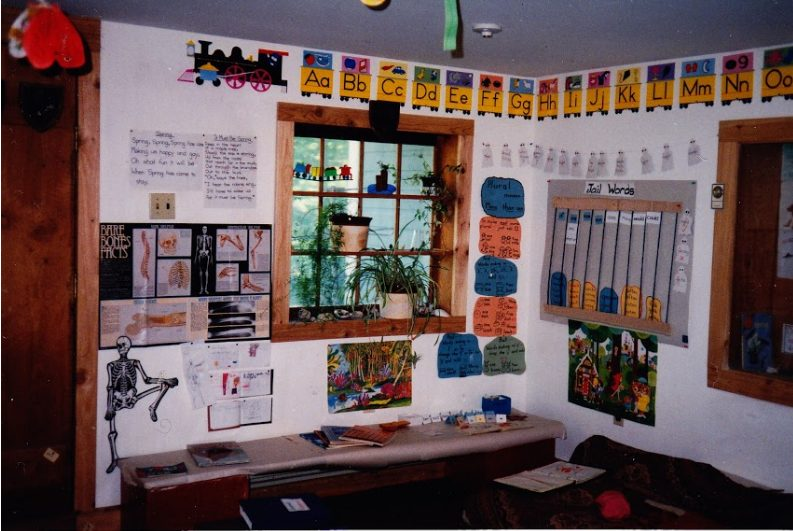
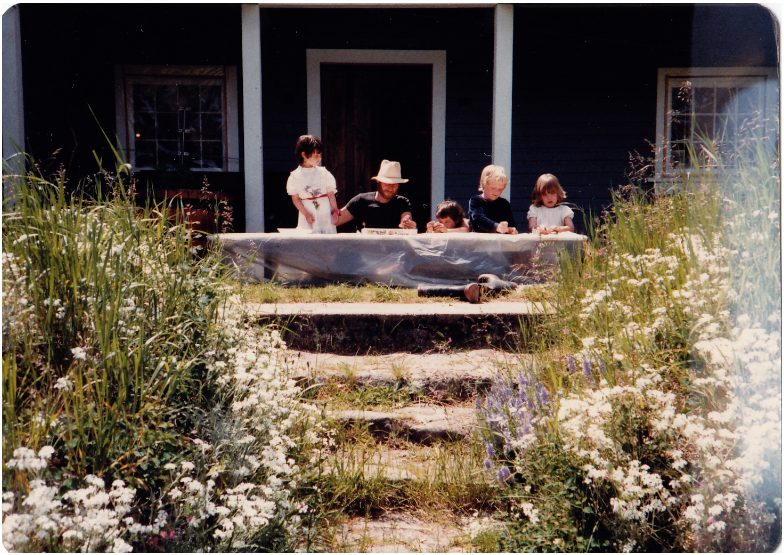
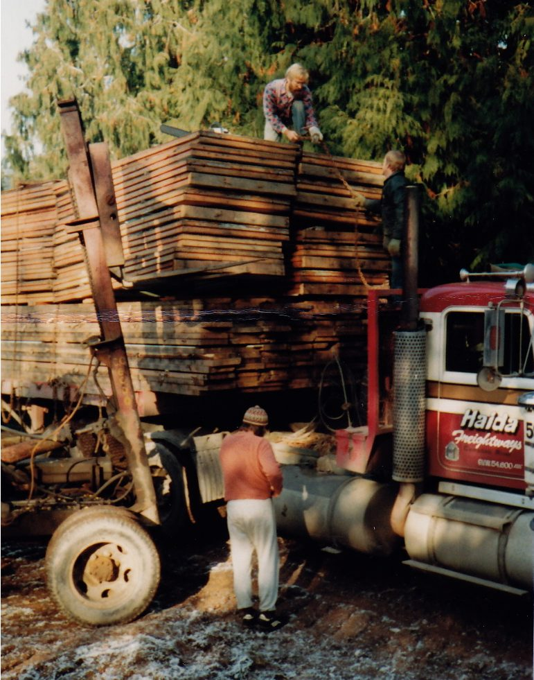
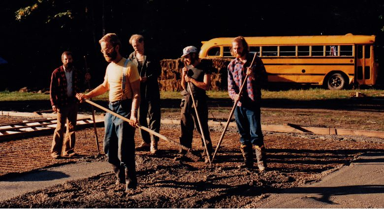
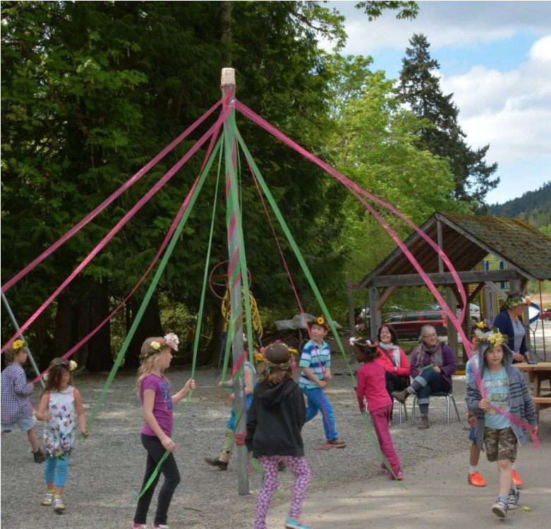
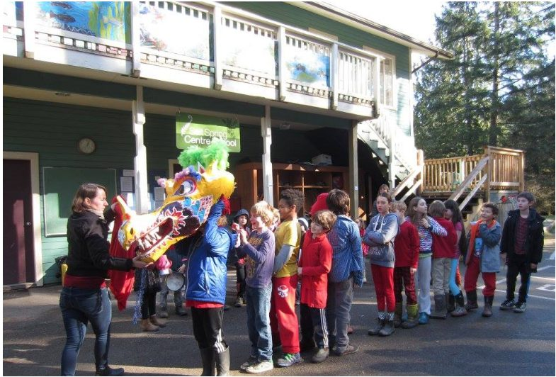

In the summer of 1982 Babaji said to Usha, “Start the school”. She protested that she knew nothing about teaching young children. She had an impressive list of experiences and qualifications, none of which seemed to be what was needed to run a school. However, she discovered what Babaji had known all along: she was perfectly suited to run a school and to teach children.
There were ten families urging Usha to teach, wanting to send their children to the school at the Centre - even though there was no actual school location yet. The Salt Spring Centre basement was the planned location of the school, but the preparations had encountered unexpected delays, so the school began in a bedroom on the main floor, later dubbed room 108. In September of 1983 school began in that room with 10-12 children (it varied). They spent a lot of time outdoors as well, the entire property becoming their classroom.
The students in that first year were Nayana Filkow, Maya Suess, Fainne Emery, Uma Emery, Ariel Corkum, Rajom Black, Rohan Tate, Kerry Martin, SunMoon Perreault, Sunya Dawn Davies, Ananda Aurora Davies. Also, for a short period of time, Autumn and Moonbeam.
[caption id="attachment\_14219" align="aligncenter" width="600"] The first classroom was in what’s now room 108. You can see the doorway (with no stairs leading to it) on the left side of the photo, around the corner from the back stairs (then the only entrance). There was a ladder to begin with, soon replaced by a set of stairs.[/caption]
In November the basement room was ready for the school. It was great while it lasted, but apparently this space was not meant to be the school location for long. In September of the following year, the school population outgrew the tiny space in the basement, so the library (then called the piano room) was used for part time overflow. Sharada Filkow and Dan Jason taught part time.
[caption id="attachment\_14220" align="aligncenter" width="600"] The schoolroom in the basement[/caption]
[caption id="attachment\_14221" align="aligncenter" width="600"] Outside the door to the classroom in the basement: Maya, Satyanand, Nayana, Rohan, Ariel[/caption]
[caption id="attachment\_14222" align="aligncenter" width="600"] Some of the kids - and a couple of adults -in March, 1984. Back row: Usha, Maicha; front row: Rohan, Kerry, Ariel behind Kerry, Maya, SunMoon, Tzigani, ,Nayana, Sunya behind Nayana, Ananda . Missing from this photo are Rajom, Fainne and Uma. Between Usha and Maicha is someone we can’t identify; if you know who it is, please let us know.[/caption]
When the building inspector declared the basement classroom unfit for a school, the school was booted out and spent March 1985 - June 1986 in the home of the Jacob family. In May, the inspector of independent schools was delighted with his visit and recommended that Usha apply for funding for the following year.
By September 1986 the school was back in the main house, but upstairs this time: the piano room (now the library), the satsang room and, when there were weekend programs, the yurt on Fridays. School and programs managed quite harmoniously during that time. The school had no permanent fixtures; everything was movable, including the chalkboard and displays. The bookshelves were on wheels and were reversible. Turn them around, put a doily and some flowers on top - et voila! On Sunday evenings the satsang room was turned back into a school.
Meanwhile, a school building became available in Port McNeill on northern Vancouver Island. It was for sale, and Chakrapani, a DS member who lived in Alert Bay, bid on it, bought it, and donated it to Dharma Sara. A group of satsang men headed up north and spent about a week dismantling the building and loading it onto a flatbed truck, to be rebuilt at the Centre.
[caption id="attachment\_14223" align="aligncenter" width="600"] The arrival of the school building. SN atop the panels, Sanatan on the ground.[/caption]
[caption id="attachment\_14224" align="aligncenter" width="600"] Preparing the foundation: Sid, SN, Martti, Satyanand, Tao (The bus was Tao’s.)[/caption]
Once the foundation was completed, the building was rebuilt. We had a school building - but it was still an unfinished shell. It wasn’t until 1990 that the school moved in. The main floor was unfinished, but school began that year in the two upstairs classrooms. The big room upstairs was still unfinished and served as a gym for indoor hockey games. Eventually that room also got finished as did the main floor.
In the beginning Usha was the main teacher, but over time as the school population grew, so did the school staff and the number of classrooms. For a period of time, school extended from kindergarten through grade 9, with Mark Classen teaching the senior class - grades 7-9 (although there were two boys who didn’t want to leave after grade 9 and stayed on through grade 10). Eventually, given space requirements and the fact that Salt Spring now had a middle school, the Centre School staff and board decided to focus on elementary education, kindergarten through grade 6.
Traditions begun by Usha in the earliest years continue to this day: Rosh Hashanah, Advent (now called Celebration of Light), Lunar New Year, May Day, whole school theatre productions and the annual family camping trip at the end of the school year - and of course, the much-used peacekeeping script that helps students resolve their own disputes.
[caption id="attachment\_14225" align="aligncenter" width="600"] May Day 2015[/caption]
[caption id="attachment\_14226" align="aligncenter" width="600"] Getting ready for the dragon parade, Lunar New Year 2015[/caption]
The school grew from what was known as Usha’s School in the earliest years to become a vital part of the educational options on Salt Spring Island. The Salt Spring Centre School is a gem in the heart of the island, offering small class sizes with excellent teachers, lots of enrichment, and a sense of belonging to a community - on this beautiful land where children get to explore and play outdoors every day.
--
Contributed by Sharada, with gratitude to Babaji for directing Usha to start the school, to Usha for listening to him and to the many families who have been part of the school community over the years.
