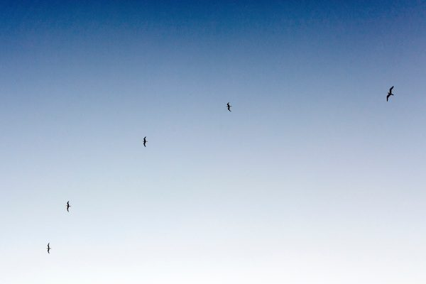
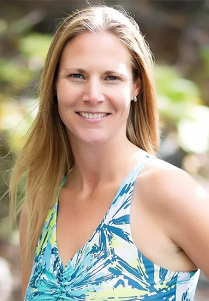

We all have this amazing gift that we carry with us everywhere we go: a tool that enables us to burst into a fast sprint if we come across a bear in the bush, or to instill a sense of calm, clarity, and increased immunity within us. This gift is our breath. In ancient yogic tradition learning how to control your breath is called *pranayama* or breath control. As we begin to learn how to control the breath, we can ultimately learn how still the mind, lower blood pressure, decrease stress, lower anxiety, relieve depression, and increase our concentration. Let’s explore this together.
Adjust your body so you are in a comfortable, upright position, creating a posture of awareness. Notice the sensation of your natural inhale and exhale as it moves throughout your body without changing its direction.
Now, part your lips and breathe in and out through your mouth five times.

- Now, close your mouth and breathe in and out only through your nose five times.
- Still breathing in through your nose only, exhale, and draw your belly button back towards your spine to squeeze out any extra air.
- As you inhale, fill your belly first like a balloon and then guide that same breath up into your rib cage expanding your chest.
- Exhale, drawing the belly button back and emptying out all air. Let’s try that again, working your way up to five full, complete yogic breaths.

 **How did your body respond to breathing just through the mouth?**
When we breathe through the mouth it directs the air to the upper lobes of the lungs. This is where the stress receptors and the connection to our sympathetic nervous system – the flight or fight response – are located. When you take a deep breath in through the mouth it fills the upper lobes of the lungs first and activates the stress receptors, engaging the flight or fight response. This is what gives you that quick burst of energy to run away from a bear.
Our lungs have five lobes. The majority of people breathe only into the two upper lobes, leaving most of their lung space dormant. If all, or a majority, of the 26,000 breaths we take in a day are shallow, upper chest mouth breaths, then these stress receptors will be continuously activated. This constant activation of the emergency stress response taxes our adrenal glands, compromises immunity, and is degenerative for the body. During mouth breathing, air and its associated *prana* – the body’s energetic life force – are moved in and out of the body without entering the sinus cavity, resulting in less prana being absorbed into the brain and nervous system. (The breath has been associated with life force throughout history. In China it is called *chi*, and in India it is called *prana*. Prana, is carried into the body and cells through water, food, and air. This is why pure water, fresh food, exercise, and breathing techniques are fundamental components to perfect health.)]
**How did your body respond to breathing only through the nose?**
Breathing through the nose, on the other hand, delivers the air deeper into the lower lobes of the lungs because of the structure inside the nasal passage and sinus cavity. Turbines, or turbinates, in the nasal cavity allow air to spin and move in a thinner rotating stream. This forceful and direct stream of air effectively penetrates the deeper, lower lobes of the lungs where the receptors for the parasympathetic nervous system are concentrated. This is our de-stress button.
The nasal breath practices used during pranayama are teaching the body how to deal with stress, cope with fear, and prevent the impacts of extreme stress, such as compromised immunity, disease, and mood disorders. Deep breathing not only facilitates a feeling of calm, but offers improved health and performance. Deep nasal breathing is also the key ingredient in the development and full use of our nervous system.
Breathing through the nose provides something else that breathing through the mouth cannot. With proper nasal breathing, the amount of prana available to the nervous system is increased and it directly accesses the brain. Prana is carried by oxygen and enters the nasal cavity with the breath. While in the nose, the air is cleaned, warmed, and filtered before it enters the sinuses and lungs. While moving through the nose, prana moves through the olfactory plate directly into the emotional cortex or limbic system of the brain and connects with the cerebral hemisphere of the frontal lobes—the cognitive thinking part of our brain.
A pranayama (yoga breathing technique) called Nadi Shodhana (alternate nostril breathing) is practiced by alternating the breath in and out of one nostril at a time. Forcing the breath through opposite sides of the head initiates a cycle of alternating cerebral dominance between the hemispheres of the brain. With depression and anxiety, one cerebral hemisphere of the brain is more active than the other. The right hemisphere shows greater activation in anxiety, while the left hemisphere is more active in depression. The healing powers of alternate nostril breathing prove to be significant in helping with these conditions.
By practising pranayama breathing techniques and daily nasal breathing we can prevent the impacts of stress. The breath opens the door, giving us access to our full or enhanced human potential.
Namaste
Tricia ( Priya) McLellan
Co-owner/ Operator Satya Yoga Studio
info@satyayogastudio.ca
[www.satyayogastudio.ca](http://www.satyayogastudio.ca)
Reference:
“Perfect Health for Kids,” Dr. John Doulliard
“Yoga Sutras of Patanjali,” Baba Hari Dass
“MMC School of Yoga Teacher Manual,” Mount Madonna Center
--
Tricia is a Registered Yoga Teacher (RYT-500hr) graduate from the Salt Spring & Mt. Madonna Yoga Center, RYT 300 Integrative Yoga Therapist and has earned a Diploma in Human Kinetics.
Tricia McLellan is a graduate of the Salt Spring Yoga Centre, RYT 500 hr Mount Madonna Centre, 300 hr Integrative Yoga Therapeutics, and is the Co-Owner of Satya Yoga Studio in Williams Lake. She is trained in classical ashtanga & hatha yoga systems, yin yoga, level 2 reiki, integrative yoga therapeutics, diploma in Human Kinetics and is enjoying discovering more about children, youth and family yoga. In her yoga classes, Tricia weaves together mindfulness, alignment, strength and softness in a flow style practice. She guides students in a rhythm that allows them to move in harmony with their breath and to discover the obstacles / opportunities that are waiting to be met. The word Satya means truth and she invites you to discover your truth Contact: info@satyayogastudio
