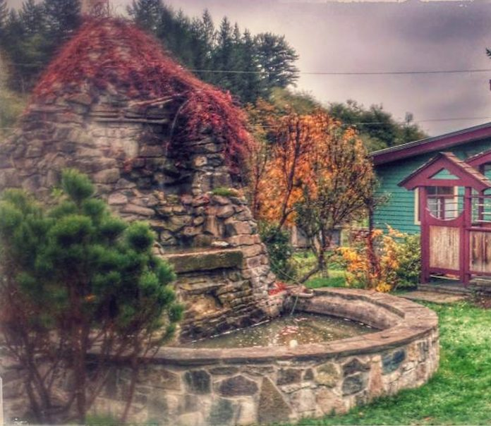
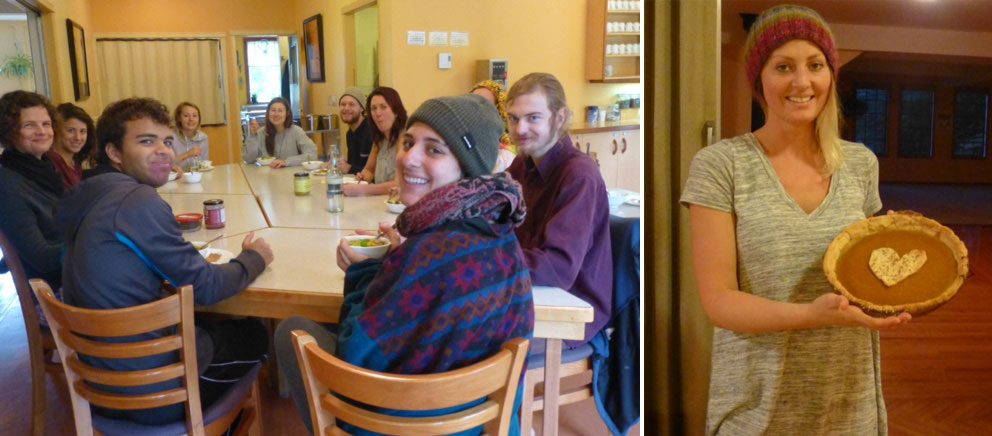
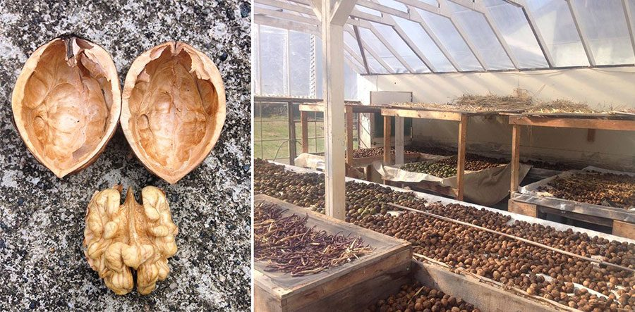
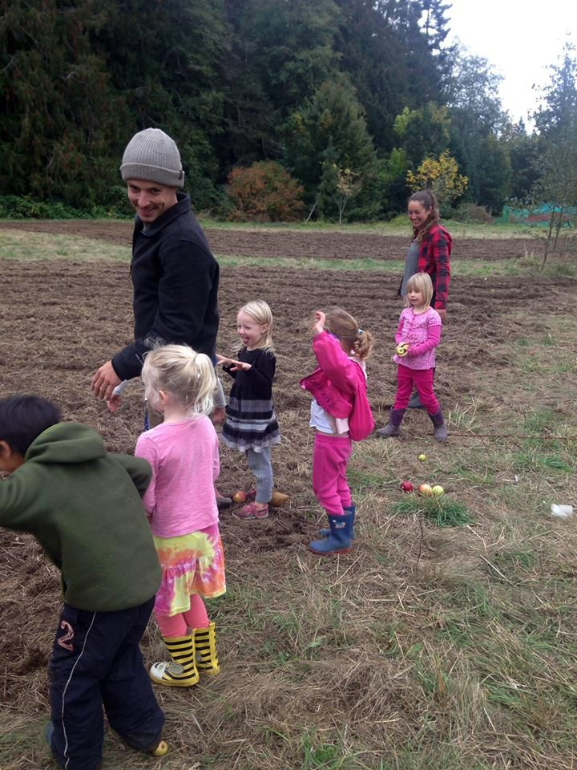

*Even after all this time the sun never says to the earth, “You owe me.” Look what happens with a love like that - it lights the whole sky.* 
*-Hafiz*
Hello everyone,
Greetings from beautiful, wet Salt Spring Island.

Although rain and cooler weather have set in, it doesn’t deter the hard-working farm team. While Milo and Jules are away, Sharna and Harley are completing the work of getting us ready for winter. Sharna continues to work and play with the school kids, and has contributed this month’s farm update.
The rain and cooler weather have created some big changes here on the farm, but they haven’t limited the number of projects on the go. Before departing on his exciting Europe adventure, Milo was busy on the tractor tilling and cover-cropping the fields in preparation for winter, leaving the hardy plants such as kale, chard and leeks remaining for harvest.
Although most of the vegetables that sustained us over summer have stopped growing, they’re still going to good use. We have been utilising the upper greenhouse to dry beans, sunflowers, amaranth, buckwheat, flax, walnuts and much more. These will not only provide us with some healthy snacks, but will also be used as seed for next season.
 
The weather also isn’t preventing the Centre School children from getting involved. Dressed in their colourful rain jackets and welly boots, the children have been providing their assistance in doing some last harvesting of tomatoes, pears and apples. They have been learning all about how to protect the farm's soil over winter and have now moved their plant pots to their brand new greenhouse built by some amazing karma yogis. Their latest project involves getting creative with natural resources from the farm to build some spooky decorations for the SSCY halloween party!
Our regular weekly events - Sunday satsang and Wednesday kirtan continue to draw many islanders; kirtan is very popular on Salt Spring! Yoga classes remain ever popular. Monthly full moon yajnas are another regular event on our calendar, the next one scheduled for Thursday, November 10.

## This month's Newsletter Offerings

Continuing the [Centre history series](https://saltspringcentre.com/category/the-early-years/), I hope you enjoy the story of the beginnings of the Salt Spring Centre School.: [“In 1982 ‘Babaji said: Start your own school](https://saltspringcentre.com/2016/10/in-1982-babaji-said-start-your-own-school-heres-what-happened/)[’](https://saltspringcentre.com/2016/10/in-1982-babaji-said-start-your-own-school-heres-what-happened/)[. Here’s what happened”](https://saltspringcentre.com/2016/10/in-1982-babaji-said-start-your-own-school-heres-what-happened/).Tanya Gita Roberts, a member of our YTT faculty, leads us through [Supta Baddha Konasana or Reclining Bound Angle](https://saltspringcentre.com/2016/10/reclining-bound-angle-pose-supta-baddha-konasana/) in the [Asana of the Month](https://saltspringcentre.com/category/asana-2/) series. This is a relaxing, restorative pose that stimulates the abdominal organs, helps balance hormones and settle the mind - perfect for this time of year!
Another powerful tool for relaxation is something that’s with us all the time - the breath. Tricia Priya McLellan, another of our excellent YTT faculty, has contributed “[The De-Stress Button: Health is just a Breath Away](https://saltspringcentre.com/2016/10/the-de-stress-button-health-is-just-a-breath-away/)”. We all need a de-stress button - and the good news is it’s built right in. Giving attention to the breath can bring us back to our centre, to ourselves.
Yet another gift to help us ease our way into fall and winter comes from Pratibha Queen in her article, “[The Wonders of Ghee](https://saltspringcentre.com/2016/10/the-wonders-of-ghee-clarified-butter/)” (Clarified Butter). Ghee (or other healthy oils if you follow a vegan diet) is good for all body types, and is particularly helpful for nourishing and strengthening the digestive system. Pratibha says, “Treat yourself to the luxury of ghee every day and watch the health benefits unfold.” It’s easy to make, too; just follow the recipe that’s included.
These tools for health and well-being - restorative asana poses, focus on the breath and attention to physical health (particularly digestive health)  - can help us stay calm and balanced as we move through fall and winter.

## Donations for Sri Ram Ashram

As we approach the gift-giving season, here is a reminder of how you can make a charitable donation to [Sri Ram Ashram](http://sriramfoundation.org/).
In order to receive a receipt for tax purposes in Canada, donations to Sri Ram Ashram may be made through:

**Ram Yoga**
**6479 CONC.2 RR3**
**STN. MAIN**
**Stouffville, ON**
**L4A 7X4**

<http://donate2charities.ca/en/RAM.YOGA.CENTRE._.0_888783461RR0001>
To learn more about this wonderful home for abandoned and destitute children, go to [sriramfoundation.org](http://sriramfoundation.org/). Supporting Sri Ram Ashram is a way of showing our appreciation for the many gifts of teaching that Baba Hari Dass has given us.
It is not too late to make a tax deductible donation for 2016.
Whatever is going on in the wider world, and in our own little personal world, to navigate well we need to be clear and centred ourselves; otherwise we’re not very effective. We know this, then we forget, but we can come back again and again. That’s why it’s called practice. Here’s wishing you well in your continued practice.
A reminder from Babaji: *This is life. It includes pleasure, pain, good, bad, happiness, depression, etc. There can’t be day without night. So don’t expect that  you or anyone else will always be happy and that nothing will go wrong. Stand in the world bravely and face good and bad equally. Life is for that. Try to develop positive qualities as much as you can.*
Love,
Sharada
