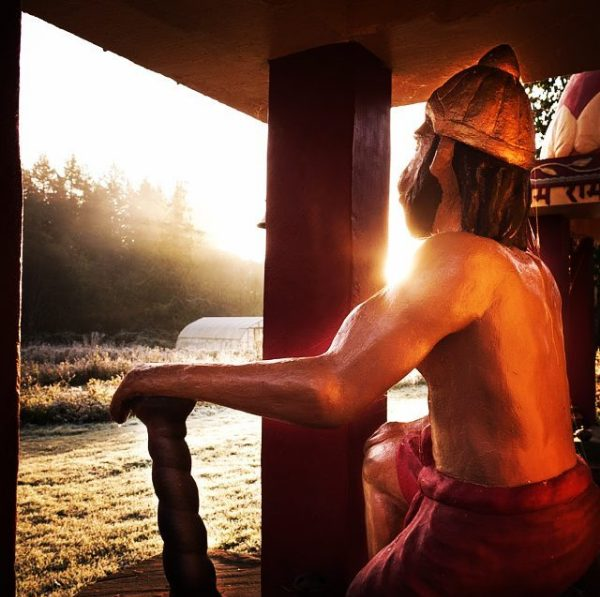
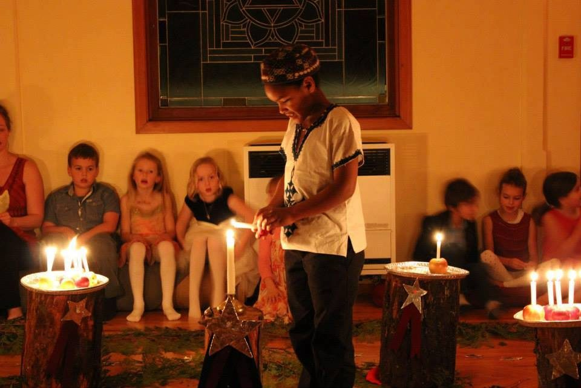
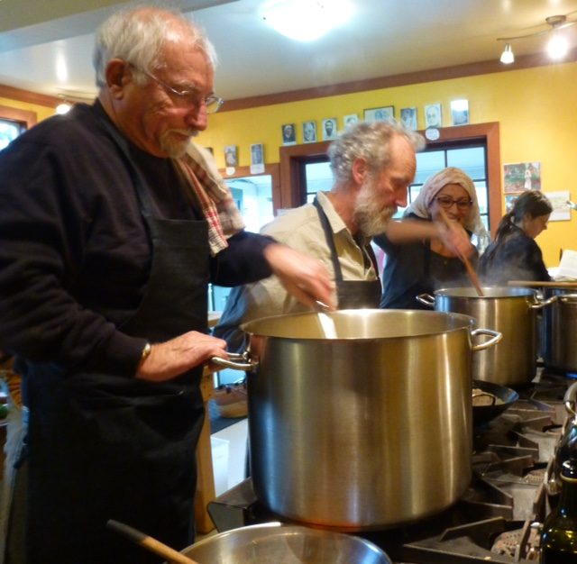
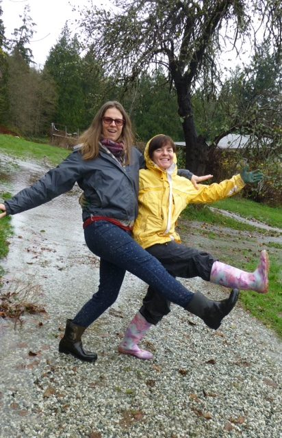
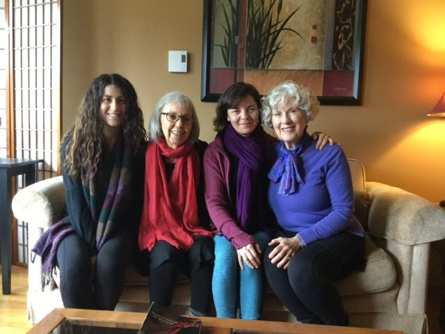

Hello everyone,
 Our Hanuman shrine on an early frosty morning.
As we move into the season of celebrations in many traditions, we acknowledge that this is also a time of big changes in the world, and an unsettling time for many. No matter where you stand on the political spectrum, we are all affected by the changes in the world. Yoga teaches that Prakriti (form, nature, the world as experienced by our individual egos) is constantly changing and impermanent. What doesn’t change (spirit, known by many names - Purusha, God, the divine) is the energy that supports creation. That divine energy is always present.
This is a time of inner reflection and choosing to support our deepest values. What matters most to you? Winter celebrations are a perfect opportunity to connect with each other and spread love and support in our circle of family and friends. Some words of wisdom from Katagiri Roshi: “In the end we are all children, walking through this strange land between birth and death. None of us knows much. The best we can do is stay close and hold hands.”
One way to deepen our interconnectedness is to contribute to [Sri Ram Ashram](http://sriramfoundation.org/), begun by Babaji many years ago to provide a home for abandoned or neglected children in India, raising them as a family. To make a charitable donation, [click here](https://saltspringcentre.com/2016/01/donations-for-sri-ram-ashram/).

# Comings and Goings On

The small winter community at the Centre is focusing on spiritual teachings through a weekly Bhagavad Gita study group and NVC (Nonviolent Communication) class and regular morning practices. And singing! Wednesday kirtan and Sunday satsang nourish all who attend.
We bade farewell to Sharna Pinkney in November, farm yogi extraordinaire and great addition to the Centre community as well as to the Centre School community.
 Sharna in her turtle costume on Halloween
Shortly after Sharna left, Jules and Milo returned from a month in Europe. Welcome home!

# Celebrating the Light

The [Salt Spring Centre School](http://saltspringcentreschool.ca/)’s Celebration of Light, again lifted the hearts and spirits of school families, the Centre family and others from the island who came to celebrate and be reminded that even in the midst of darkness, the light is always within each of us, and as the song says, “This little light of mine, I’m gonna let it shine. Let it shine, let it shine, let it shine!”
 Lighting a candle at the Celebration of Light

# Weaving the Generations Celebration

Also in late November we held Weaving the Generations, a weekend gathering for Dharma Sara members. Many people came to work and play. Lots got done, the food was fabulous, the company was excellent, and the the conversations were connecting; it was a reminder of the importance of the Centre as a place of of peace and renewal for all of us. If you would like to be included in these events, but are not yet a member of Dharma Sara Satsang Society, you can [apply for membership](https://saltspringcentre.com/about/dharma-sara-satsang/) online.
 Sid making wild tofu surprise, with Raghunath, Satya and Amy
 Christine and Kathryn
 Bri, Sharada, Kathryn, Chandra

# This Month's Offerings

This month we introduce you to Bri Crisanti, part of the Centre’s resident community who has taken on a major role in the office this year. She is a woman of many skills and an abundance of love. Although she’s been here for less than a year, she’s become an integral part of our family. Here she writes about her [lifelong quest for freedom](https://saltspringcentre.com/2016/11/our-centre-community-bri-crisanti/).
 Photo by Raghunath (Rodney Polden)
How many of you have attended a Ramayana production over the years? The past three years, at ACYR, a revival of Ramayana productions has occurred, starting in 2014 with the 20 minute Ramayana, and gradually expanding to just under an hour. Who knows what next year’s ACYR will bring? The first of the Centre’s Ramayana productions began 1n 1982 in the old hay barn. The story of the beginnings and its evolution is the subject of this month’s the Centre History series: [Jai Sita Ram! Jai Hanuman!](https://saltspringcentre.com/2016/11/ramayana-history-at-salt-spring-centre/)
Pratibha again brings her wisdom to us in ‘[Replace Judgment with Compassion](https://saltspringcentre.com/2016/11/replace-judgement-with-compassion/)’, reminding us that regardless of what’s happening in our world, we have a choice about how we respond. As always, her writing is down to earth and immediately applicable. It’s a perfect reminder for all of us. I’m sure you’ll enjoy it.
***“May all beings everywhere be happy and free from suffering. And may the thoughts, words, and actions in our own lives in some way contribute to that happiness and that freedom for all.”***
Love,
Sharada
