# Freedom

[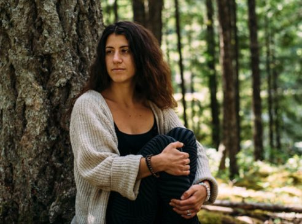](images/9ae12847_OCC-Bri-1.jpg) Spirit Lake, Salt Spring Island, 2016
I find myself giggling as I sit here thinking of piecing together a tale of what brought me to the Salt Spring Centre of Yoga. I guess I could start by saying that it is a nice feeling being able to look back on the path that lead me here and find so much laughter and bliss in the journey.
I imagine it all started the day I realized I wanted to be free. Though I couldn’t tell you the exact date of when my quest began, I know it was in the eighth year of my life. What this word meant to me and how I perceived this concept during my early stages had much influence on how I tried to seek out freedom. I was curious! What was freedom, anyway?
In questioning freedom and my place in it, I found myself living with yet another desire: to understand my personal existence as well. How and why did I exist? I became a constant observer. I remember feeling so lucky to be alive, so unique, and yet not special at all. I wondered many things. How was I created? Why am I me? How different would my life be if I had a different family? Lived in a different place? Existence for me at a young age was hard to understand. I could barely wrap my mind around the physical elements of human existence, let alone the spiritual.
Freedom for me at this time in my life seemed much easier to grasp. It seemed a simple definition: I was free because I was alive. Because I lived on this planet. It was feeling sunshine on my shoulders, spending picturesque summers camping with my family, and cruising around the neighbourhood on my bicycle. Like all beings in this human form, my life was not without heartache. But I knew I could feel freedom when I was living a simple life without cares or worries. This led to days spent dancing in fields, picking flowers, talking to birds, and imagining life as a mermaid.
I continued on in my quest to be free, but the harder I searched the further I felt I was from finding “freedom”. In high school I discovered myself to be an amazing juggler. I juggled full time: full time class loads, a full time job, and a full time boyfriend. I did all of the things I thought I was supposed to do. I could check off every box and it all looked good on paper. This was, so I had thought, my ticket to freedom. Still, I didn’t feel free. My efforts had led me to more worries and apparent lack of freedom than ever before. Moments of peace would find me in the ravine behind my house, in daydreams and in dance, but my quest for freedom continued.
I was eighteen when I boldly put everything on hold and booked a plane ticket to Australia. A change of scenery to point me in the right direction, I thought. After three months of exploring the east coast from Cairns to Adelaide, I knew I had gotten a taste of what I was looking for. Connection to nature, connection to self, to beings. To the world. This felt like freedom! But it seemed to be impermanent. Did leaving Australia mean losing freedom? I felt like I was returning back to “reality” and that there was no escaping it.
[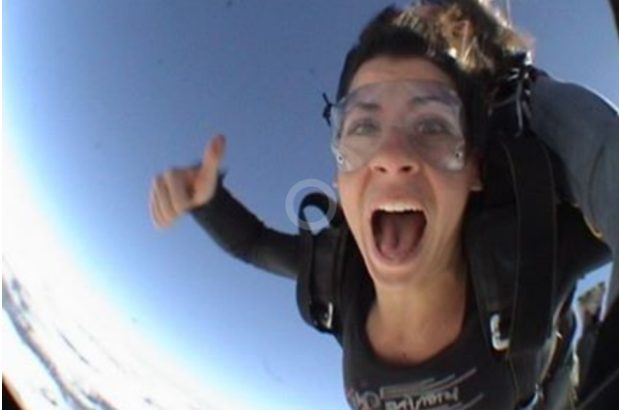](images/9ae12847_OCC-Bri-2.jpg) Skydiving in Cairns, Australia, 2007

## Reality. Re.a.l.i.ty. What is real?

According to Webster’s dictionary reality is ‘the world or the state of things as they actually exist, as opposed to an idealistic or notional idea of them’.
The world or things as they actually exist? What is real?
What was my true nature? I knew I honoured kindness and community. I knew I was seeking a place where I could be myself, where I could find love, connection, and safety. Dreaming of this felt like truth. Could this be my true nature? Living in peace and harmony with all beings? Was this the path to freedom?

*As soon as a person starts thinking, “ I want to be a better person,” that is the start of yoga.* – Baba Hari Dass

The next nine years I would spend in awe of the Roman empire, contemplating my existence by the cliffs of Moher, chewing sugar cane by the Zambezi river, sharing laughs and sticky rice, sleeping on beaches, catching rides across countries with my thumb, swimming in crater lakes, wishing for a map and finding one in the grass, wishing for a hot bath and discovering a hot spring. Moments of pure love, pure bliss, pure freedom. All over the world. Freedom like I had never felt it before. Freedom apparently had nothing to do with where I was, or how much money I had in my back pocket. It appeared to have little to do with where I would eat lunch or where I would lay my head at night. Not every particular moment in my existence during this time was pleasant. But still, I could feel it. Freedom. All around. But why?
[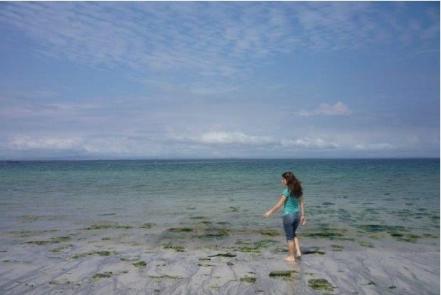](images/9ae12847_OCC-Bri-3.jpg) A beautiful beach, Ireland, 2008
[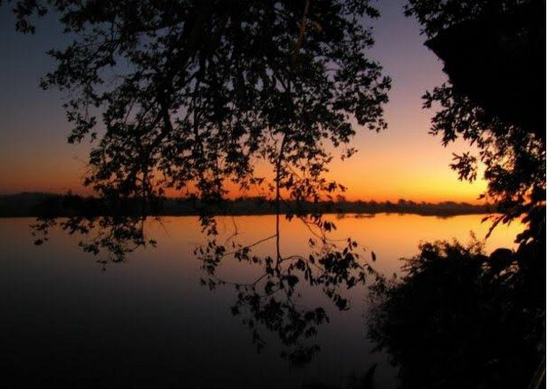](images/9ae12847_OCC-Bri-4.jpg) The Zambezi River at Sunset, Mwandi, Zambia, 2009
[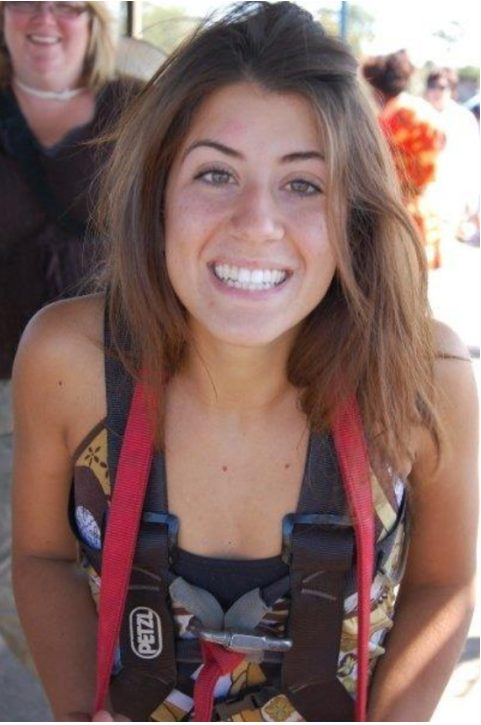](images/9ae12847_OCC-Bri-5.jpg) Preparing to Bungee Jump, Victoria Falls, Zambia 2009

## What is freedom?

Even after all this searching for freedom, I had no idea how to define it. What did I know about freedom? Somehow I knew it had to do with existing, with being present. With finding stillness. My connection to self, to beings, and to the world seemed to play a part in it. All those moments on the road where I found myself embraced in love and community. The way things seemed to always work out, even when they didn’t. What was this called?
[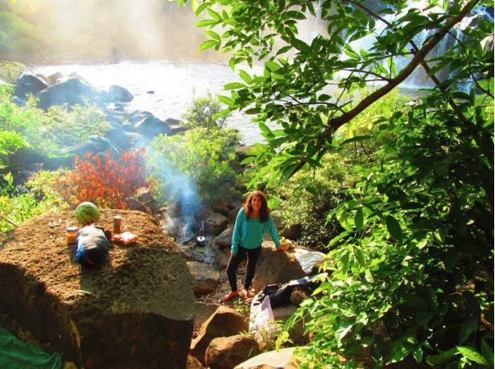](images/9ae12847_OCC-Bri-13.jpg) The Bolaven Plateau, Laos, 2011
[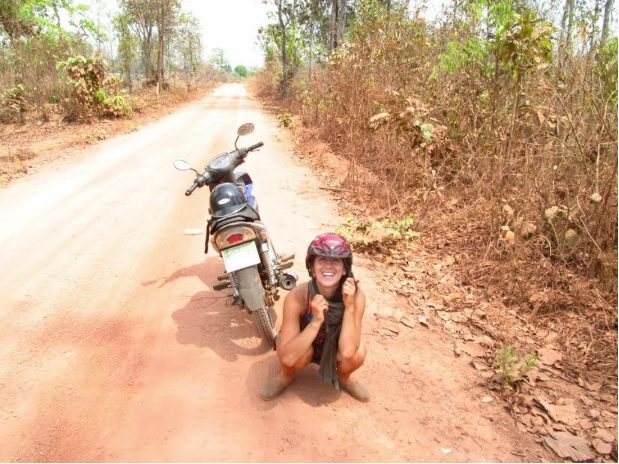](images/9ae12847_OCC-Bri-6.jpg) Saoirse and I getting lost in Ratanakiri Province, Cambodia, 2011
[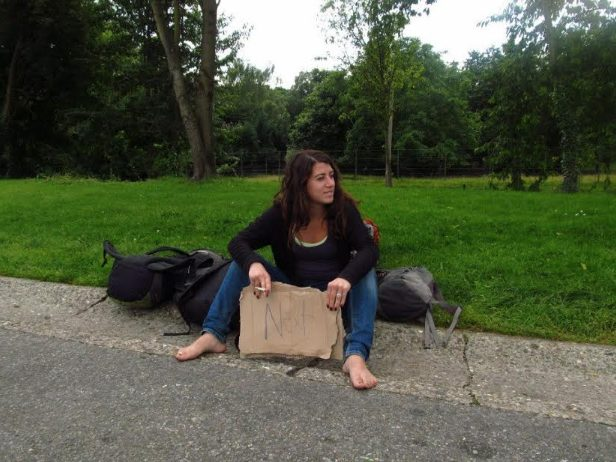](images/9ae12847_OCC-Bri-8.jpg) Somewhere outside Leuven, Belgium, 2012
[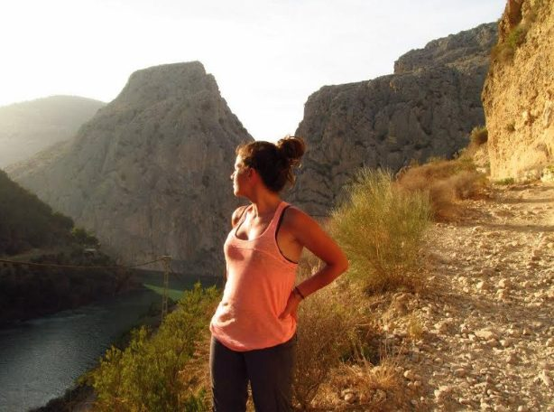](images/9ae12847_OCC-Bri-9.jpg) Andalusia Province, Spain, 2012

*The aim of life is to attain peace. No one can give us peace. We can’t buy or borrow it. We have to cultivate it by practicing yama and niyama, the ethical foundation of yoga and the first two limbs of Ashtanga Yoga.*– Baba Hari Dass

*The purpose of practicing the restraints [yama] and observances [niyama] is to cultivate morality, character, and yogic discipline. The practice of restraints and observances is considered an austerity (tapah) of the mind, body, and senses. As such, they are the foundation of spiritual life. This yogic discipline purifies the mind and develops one pointed concentration.* (Sutra 32, The Yoga Sutras of Patanjali, A study guide for book II, page 131).

This human experience is a powerful teacher. There were times when I found myself at the complete mercy of the universe, rocking and flowing with a current. A powerful force that moved me to exactly where I needed to be. This feeling, this knowing, that provided me safety and nourished me to my core.Times where I had to be okay with whatever happened because I had no control over the outcome. I know now that I was finding yoga. That the path to freedom is deeply entangled in it. I am at the very base of a steep and rocky mountain. For now I sit as a quiet observer. Observing my breath, observing my ego, observing my path.
[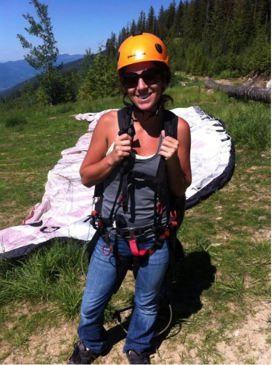](images/9ae12847_OCC-Bri-11.jpg) Parasailing by Grinrod, BC, Canada, 2013
[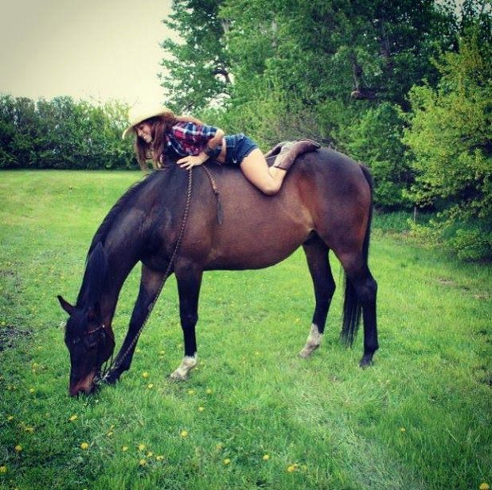](images/9ae12847_OCC-Bri-12.jpg) Airdrie, Alberta, 2014

For *“everything changes once we identify with being the witness to the story instead of the actor in it”*. - Ram Dass.

The rest awaits.
Jai Peace Love Om
Bri
