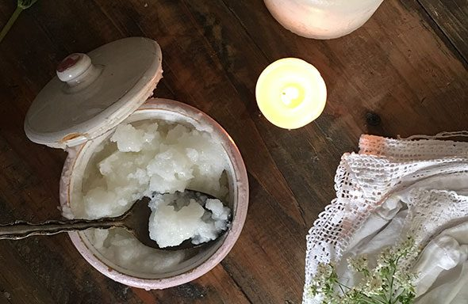

You may have heard about Oil Pulling; it’s become quite the new fashion in some circles! It’s something of an unusual practice, especially the first time you do it, but after trying it once, I was hooked! It gives the mouth not a feeling of freshness, but also has a soothing effect on the whole oral cavity.
Basically, it’s quite simple: swish some sesame or coconut oil around in your mouth for 10-15 minutes, and then spit it out! But coming from the ancient art of Ayurvedic cleansing, you can imagine there’s more to it than that!!
Oil pulling is an ancient, time-tested practice and part of one’s dinacharya (daily practices for health maintenance) in Ayurveda. Nasal cleansing (jal neti) is an example of dinacharya practice that is familiar to many of us from the yoga system. Many of the dinacharya involve oiling - self-massage with warm oil, the use of ghee in cooking, and lubrication of the nasal passages in the practice of nasya. As you know, oil is widely used in Ayurveda both to reduce the vata dosha, and to cleanse and to strengthen various tissues in the body – skin, ears, sinuses, and mouth.
As a cleansing agent, oil pulls toxins from the soft tissue in the mouth; it strengthens the teeth and gum tissue, and refreshes the breath. The practice can be done before or after brushing, flossing and tongue scraping, or you can swish while showering.

# Method – How to Practice Oil Pulling

Sesame and coconut oil are the recommended choices of oil. Make sure the oil is organic, cold-pressed, and preferably raw or unrefined. Some practitioners advocate the use of a combination of sesame and coconut oil with a little added turmeric for the most reliable benefits.
Coconut oil has a cooling effect so is most appropriate in warm weather, but if you tend to be over-heated even in winter, feel free to use it then. Sesame oil is warming, so for most of us, it’s the best choice during the cooler seasons of the year.
As mentioned above, you can do this first thing in the morning, before or after brushing and flossing, or any time of day to freshen the breath!
Start by taking 1-2 teaspoons and swishing it gently through your teeth and around the mouth. You can then build up to 1-2 tablespoons as the muscles, nerves and blood vessels in the tongue build up strength. Swish and/or gargle the oil in the mouth for about 10-15 minutes.
Never swallow the oil! As it becomes more fluid, it is easier to swish. When you feel like spitting, do so, noticing the change in the color and texture of the oil. Then rinse your mouth well to flush toxins and bacteria from the area.
After this practice, drink a glass of warm water.

# How it Works

Named for the cleansing effect that oils have when applied to the skin, this process uses lipophilic oils, meaning they attract other oils and fat soluble toxins, and act to pull them out from any surface where oil placed. This amazing property to chelate or pull toxins has been employed for centuries during classical Ayurvedic detoxification therapies, such as panch karma.
Over time, oil pulling firms up the gum tissue and removes acids and plaque from the teeth, according to clinical experience and studies. Also, it’s said to gradually whiten your teeth.
In a healthy mouth, certain microbes play a critical role in upper respiratory health, breath smell, healthy gums and teeth and the first immune response for the entire body.
Microbes that contribute to tooth decay and a harmful yeast bacteria seem to flourish in the mouth – particularly in the presence of sugars and starches. These bad bacteria and fungi, when allowed to flourish, can cause a number of health concerns throughout the body.
Oil pulling has been shown to create a saponification or detergent effect that deters bad bacteria and plaque, while supporting healthy gum tissue as a barrier against bacterial exposure to the bloodstream.
[Dr. John Douillard](http://www.lifespa.com) has reported on studies that show oil pulling to affect the level of microbial activity in the mouth. He says that supporting a healthy microbial population in the mouth limits the proliferation of sulfur-producing bacteria that cause bad breath! Other studies show that neglected oral hygiene has been linked to poor cognitive function, and risk of heart and artery health concerns in the elderly.

# Your New Mouthwash

Basically the proof is in the swishing. Give it a try tomorrow morning as part of your New Year’s resolutions and see what you think. And after a few weeks of regular practice, notice your fresher breath, your brighter smile and, perhaps, a whole new outlook on life! Happy swishing!
~Pratibha Queen

---

 Pratibha Queen
**Pratibha Queen** is an Ashtanga Yoga instructor and Ayurvedic practitioner who lives in Santa Cruz. She is a member of DSS who attends Salt Spring Centre of Yoga retreats on a regular basis. **All quotes above are from the writings of Baba Hari Dass.**
*Coconut oil photo by [Sunny Mama](https://www.flickr.com/photos/130283013@N07/26917465625/in/photostream/) (creative commons license)*
