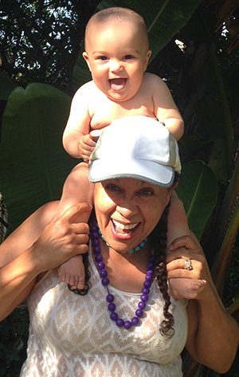

Hello fellow yogis,
My experience at Weaving Generations Weekend last month, November, 2016, was both well organized and inspirational. Although many meetings have transpired over the years, there is always a scent of a fresh and invigorating breeze that has the potential to let the sails up and navigate a new course.
Saturday night, a panel discussion took place on the topic of Deathbed Wisdom. The panel - Sudharshan , Chandra, Raghunath and myself - were presented as The Elders. Each reflected with drops of seriousness, and a good flow of humor, sharing any words of wisdom from our collective deathbed. Once I rose from the dead, I simply wished to reflect further on the subject.
Deathbed Wisdom speaks to me of a finale, my nearing a final moment when a morsel of insight, should I have any, be passed on. If that is the case then I believe I have missed the whole point of Yoga and the teachings. To think, in my maturing age, what inspirational tidbits I should pass on would feel as though I have not heeded Babaji’s words, nor those of the great sages and saints. As an Elder I believe I should be thinking of the Now and how I can share today. Giving wisdom through my actions at every moment is what the teachings have taught me. How can I love, how can I give, how may I care for others while attaining true Yoga? To think ahead to what I will share for my Deathbed Wisdom will surely make me miss an opportunity today.
We saw this way of wisdom, sharing in Babaji’s grace every day. We never had to wait for his Deathbed Wisdom. He was living it every second - as I must also try to do.
I would like to reframe the question by asking, “When I get out of bed today, what wisdom can I share through my actions and thoughts? I need only to think of Baba Hari Dass.

*“Unconditional love is universal love.*
 *Universal love is the nature of God.*
 *One who is established in unconditional love has found God”*
~ Baba Hari Dass

*“If you live joyfully till the last moment you won't have to worry about death - that will also be a joyful process.”*
~ Sadhguru

Namaste,
Girija

---

Girija
Ayurvedic Massage Therapist, Ayurvedic researcher and educator
Iridologist, Herbalist, Marine Engineer (recently retired )
Disciple of Baba Hari Dass. Member of the Dharma Sara Satsang Society, BC, Canada
