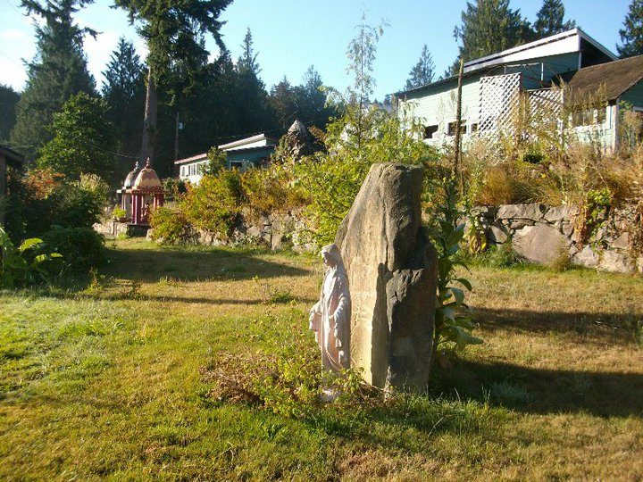
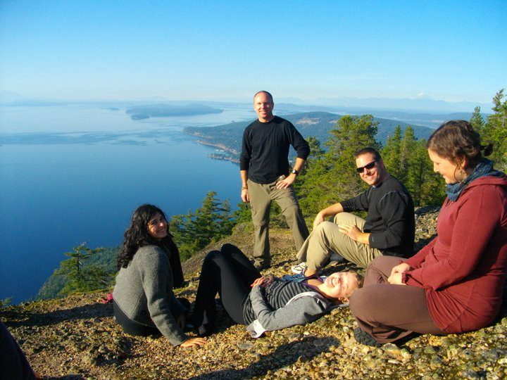
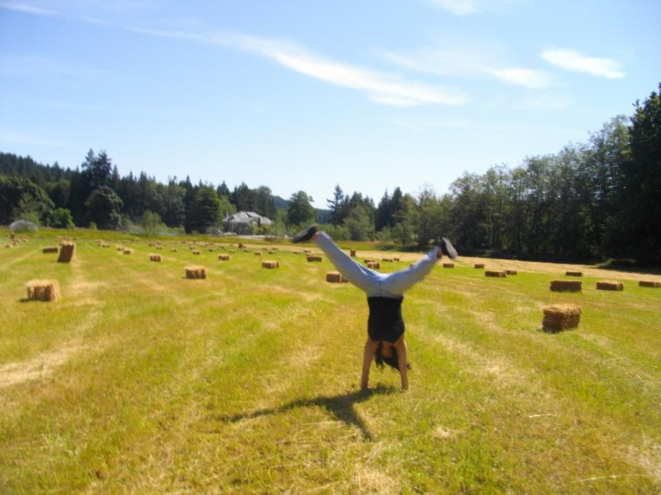
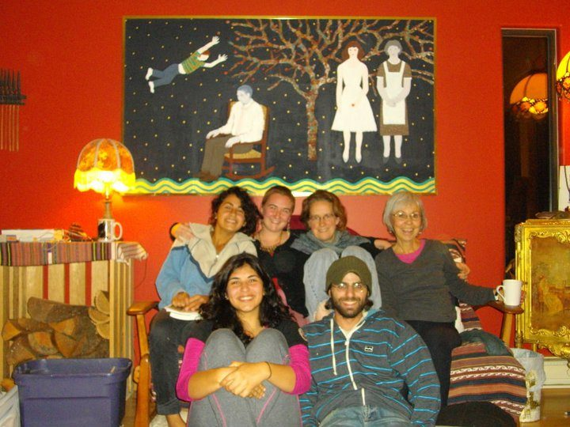
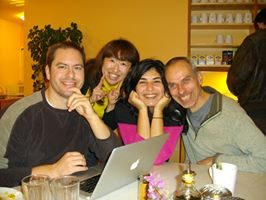
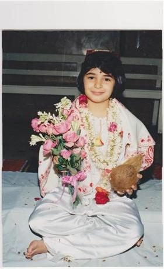
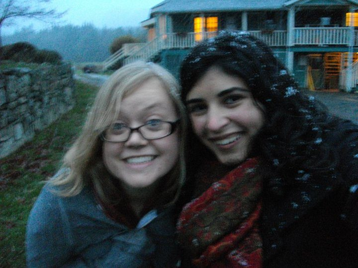

When I first arrived at the Centre in 2010, I remember seeing the large green house from the top of the gravel path, foreign and strange to me then. It was early September in 2010, the land was quiet and nobody was around. I saw a wheel barrow and several clothes lines upon which hung aprons and tie dye t shirts…. I remember thinking: What have I gotten myself in to?
[caption id="attachment\_14456" align="aligncenter" width="720"] My first time wandering around the centre, I stop by Mother Mary, 2010[/caption]
My 6 years of study at UBC had just ended and I was cut loose into the world. I felt full of dread in those days, with doubts about my use to society. I felt so lost. A series of serendipitous events led me to the Centre. Still, a part of me worried that I had made a mistake and that I should really be at home, working on resumes and trying to get a foot into some proverbial door in this “real world” people warn you about. Two weeks after my arrival, I was working on the farm, singing in the hammock, playing and laughing with my friends, and going about my day to day business with a deeper confidence than I was used to. I felt quite found. And nothing had ever felt more real than this world I was in.
[caption id="attachment\_14457" align="aligncenter" width="720"] Going on a hike with my Saltspring family[/caption]
[caption id="attachment\_14458" align="aligncenter" width="960"] Taking a break from moving hay bales[/caption]
When I think back to what it was that found me that brought me back to myself during that disorienting year, I realize it was community. Community, and a loving, mindful community at that, had not been part of my earlier experience. I grew up as a religious and ethnic minority in Pakistan, and then moved to Canada as a child, once again a minority. I lived with a slight sense of aloofness to hold me just a little apart from any communities that I happened upon, because I never felt fully accepted or understood.
I believed that it was in my fate to never quite fit. When I arrived at the Centre, I remember thinking, I’ll just learn my yoga and do my own thing, and go. But the Centre would not let me continue the way I had been living: in avoidance of belonging. Within days I begin to realize how much I was longing for community, and I only recognized this after I was embraced into it. Morning breakfast was such a joy, and circle check-ins and gatherings, a new experience. I sensed that I was accepted as I was. Celebrated even! It was new, and exhilarating to feel that exactly how I was, at any given moment, was perfectly permissible and good. People trusted in me. They noticed my presence and my absence. And most of all, they loved me. And this in itself was the biggest healing. I could then love myself more fully. What a gift!
[caption id="attachment\_14459" align="aligncenter" width="720"] NVC meeting at Sharada’s house[/caption]
[caption id="attachment\_14460" align="aligncenter" width="266"] Late night in the dining room with Shayam, Tomoko, and Holger[/caption]
My sense of spirituality growing up in Pakistan, was mostly taught to me by my mother. My family is officially Parsi / Zoroastrian, but my mother took me everywhere; we went to the aagyari (the parsi temple), Hindu temples, various shrines, mosques, and churches. At these holy places, often I would see very poor and ill people sitting outside. They tended to congregate there because there was a greater chance for being fed. My young heart would break, and inside of those holy places my mother taught me to channel that sadness into a cultivation of love. In the various temples and churches, I saw that there were many different faces of god, and felt the presence of spirit and the divine everywhere. Coming to the centre was a continuation and deepening of this, in a community. Babaji’s teaching about loving one another touched me deeply. I could sense the undiscriminating love in his face, in the portraits that hang in the Satsang room, and felt warmed by it. Spirituality was in the air, in the forest, in the honest moments with friends, the gentleness and wisdom of the founding members, and in the early morning asana practice I would do in the yurt.
[caption id="attachment\_14461" align="aligncenter" width="281"] My parsi navjote (initiation ceremony) in Pakistan[/caption]
Being supported at the centre, my angsty mind settled and cleared. I decided to pursue 4 further years of education to become a counselling psychologist. Every day at work, I have the privilege of being present with people, accompanying them through changes and challenges, and sometimes great pain and suffering. When I feel depleted or in need of hope, I think of the people at the Centre and the land, and am reminded of the peace and love that is abundant in us. I try, every day, to see each person that comes into my office as whole, and full of the potential to be well, resilient, loved and loving. More than anything I have learned to do as a counsellor, my spiritual path has taught me to love my clients and to trust that they are whole. This love and regard was something I received at the centre in 2010. Now I am learning to give it without discrimination or fear.
The centre is a guiding light for me, and I believe, for our larger community. As the US elections of 2016 yielded upsetting results, I started to become more aware of my duty as an individual blessed with this community. We have spiritual health, peace, and support, and this allows us to be well, free from the toxicity of prolonged hate, anger, fear and disconnection. As we all move forward in this political climate, I see a need to speak out more, to use the support we have to reach into the darker spaces. As Alt Right groups begin to take more risks in the Lower Mainland, spreading fear, racist propaganda, and hate, any remaining sense of aloofness that I once felt, is dissipating. I am starting to see this city, country and world as my community, and I hope I will be able to use what I have cultivated to resist and, in small ways, change this increasingly fear-based climate. Knowing that the Centre exists gives me hope and strength. My gratitude for everyone who enriches the centre with their presence and work is deep. The centre is my touchstone, my Satsang. And I hope it will continue to be, through my life.
[caption id="attachment\_14462" align="aligncenter" width="720"] Me and my dear friend Johanna, whom I met at the centre, enjoying the first snow[/caption]
