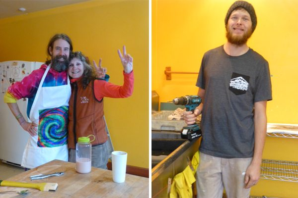

Happy New Year everyone!
Another beginning, another reminder to start anew. Although we can recalibrate every moment, the beginning of a new year is when many of us review our lives and resolve to change our unhealthy habits. Babaji’s recommendation: Do your sadhana every day and be happy.
The Centre began 2017 in a spirit of devotion, with arati, kirtan, and meditation through the midnight hour. Sanatan has been hosting the New Year celebration at his house over the past few years, but the gathering has outgrown his house, so this year it was held in the satsang room at the Centre - a new tradition.

December has been a snowy month at the Centre. Before school ended for the winter holiday, the slope behind the school was a favourite place for tobogganing. Snow is a big hit with kids.

[caption id="attachment\_14491" align="aligncenter" width="673"] Mayana and Amy (her mom) doing asanas in the snow[/caption]

During this quiet time of year, projects that can’t be done during program season are being undertaken. As I write this, the kitchen is getting thoroughly cleaned and painted, with new windows being installed. Various upgrades, including more painting, are on the list.
[caption id="attachment\_14505" align="aligncenter" width="600"] Space, Rajani and Tyler working on kitchen cleanup and upgrades[/caption]

# This Month's Newsletter Offerings

As we begin another year, here is a reminder about the value of satsang in all its aspects. I hope you enjoy the article “[Satsang - keeping the company of truth seekers](https://saltspringcentre.com/2016/12/satsang-keeping-the-company-of-truth-seekers/)”, and enjoy the photos of satsang gatherings over the years. See how many people you can recognize!
Pratibha brings us another in the series “[Ayurveda, Yoga and You](https://saltspringcentre.com/category/ayurveda-yoga-and-you/)” - this one on “[Ayurvedic Oil Pulling (aka Gandusha)](https://saltspringcentre.com/2016/12/ayurvedic-oil-pulling-gandusha/)”, an Ayurvedic cleansing technique that has become a popular practice of late. Several people have recommended that I try it, but I somehow never got around to it. However, Pratibha has convinced me; I hope it will inspire you as well.
This month we bring you another story in the series about “[Our Centre Community](https://saltspringcentre.com/category/sscy-community/).” Aneeta writes about “[Finding Community](https://saltspringcentre.com/2016/12/finding-community-aneeta/)”. When she first arrived at the Centre in 2010, she says she was not quite sure what she was getting herself into. She thought, “I’ll just learn my yoga and do my own thing.” It wasn’t long, however, before she found herself drawn into the midst of a loving, supportive community - and she’s never looked back.
At the Weaving the Generations weekend a couple of months ago, the Saturday evening program consisted of a panel of elders who have been part of this community for generations. They had been asked to consider what pearls of wisdom they might pass on to the next generation. Girija was inspired to continue her reflections in writing, and brings us “[Deathbed Reflections](https://saltspringcentre.com/2016/12/deathbed-reflections/)”. Good advice about living our intentions, our wisdom, every day.

*May we be filled with loving kindness,*
 *May we be well,*
 *May we be peaceful and at ease,*
 *May we be happy.*

Om Shanti, Shanti, Shantii,
Love,
Sharada
