We generally think of satsang as the gatherings where we get together and sing. It is that – and it is more than that. The word satsang refers to both the formal gatherings we hold, when we sing and meditate together, and to our spiritual community, our spiritual family.
Satsang is like a boat in which all passengers are carried away together to their destination. To a boat, no passenger ranks higher or lower. Similarly the teachings of satsang are equal to all. Singing God’s name together, chanting prayers together, performing spiritual rituals together – all of these activities are conducive to our spiritual development.
Sat means Truth. Satsang means being in the company of spiritually minded people seeking Truth.
Our minds are deeply affected by the people with whom we associate.
It is natural for people to gravitate toward people who radiate peace, compassion, love and truth. In the company of such people we are inspired and our own seeds of peace sprout. When we associate with people who live virtuous lives we find that we begin to live more virtuous lives.
A cotton thread can cut an iron bar if passed over it daily. If you work on yoga, yoga will work on you.
I hope you enjoy these satsang photos from Dharma Sara’s early years (1975-1995).
[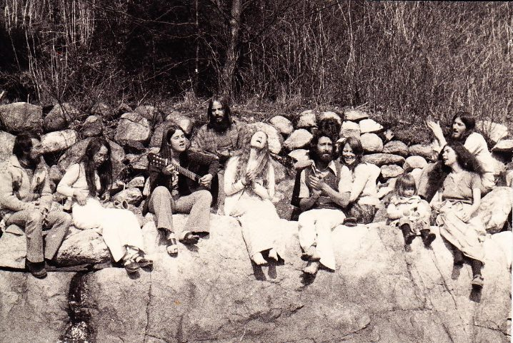](images/74707685_Truth-Seekers-1.jpg) 1975 – satsang on the rocks: Sudarshan, Sharada, Soma, Sanatan, Anuradha, Ravi Dass, Aparna, Daya, Lalita, Keshav
This was several years before we began the search for land. This photo was from a gathering at Belcarra Park near Deep Cove in North Vancouver where a couple of satsang families lived. A group of us spent the day there, complete with satsang, sauna and dinner.
[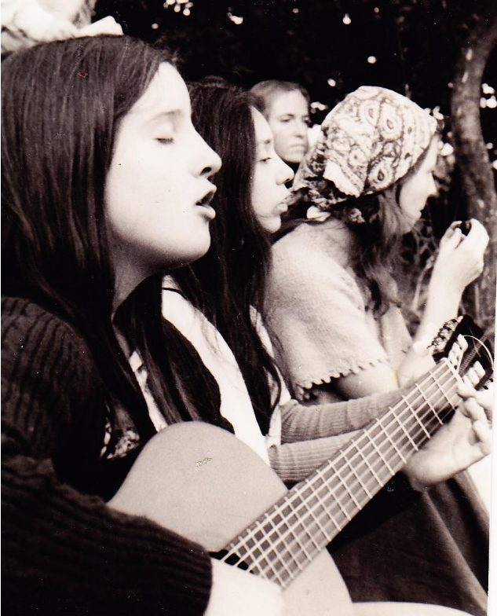](images/74707685_Truth-Seekers-2.jpg) 1975 – Soma, Sharada, Karuna (and one person whose name I don’t remember)
This photo was taken at the raspberry farm in Abbotsford, BC where a few satang families lived. Every Sunday we gathered there for satsang , singing and spending time together.
[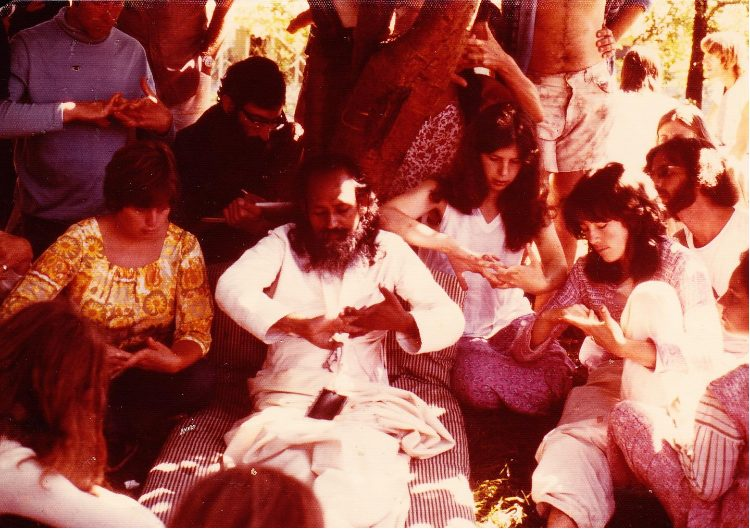](images/74707685_Truth-Seekers-3.jpg) 1977 Oyama Retreat – Babaji teaching hand mudras
The first yoga retreat was held in 1975 at a camp in White Rock, BC. During the next few summers we held our retreats at a camp in Oyama BC in the Okanagan. Some people you may recognize in the above photo are BND, Mandira and Kalpana.
[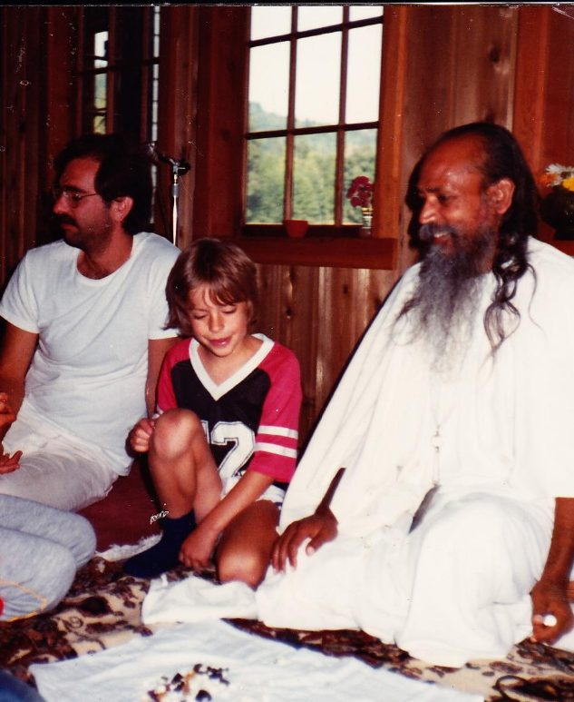](images/74707685_Truth-Seekers-4.jpg) 1982 – first retreat at the Centre – Badri Dass, Shyam (choosing a candy), Babaji
[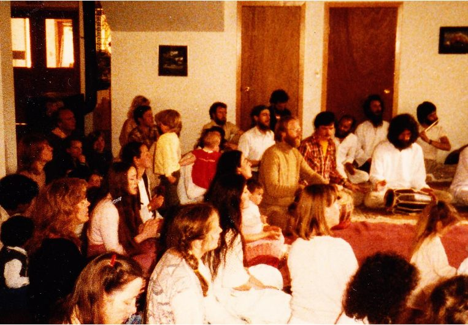](images/74707685_Truth-Seekers-5.jpg) satsang during the annual yoga retreat in 1986
[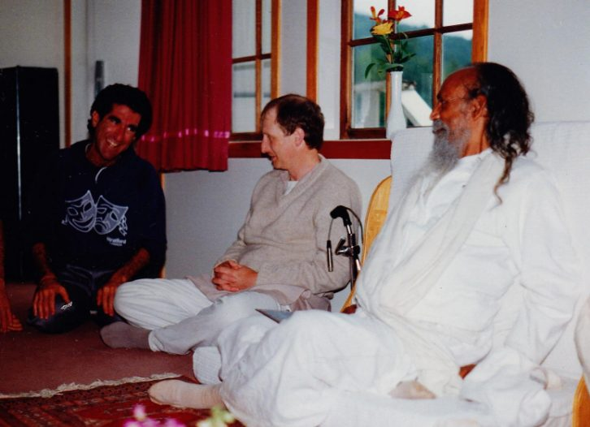](images/74707685_Truth-Seekers-6.jpg) 1991 – Sampad and Divakar with Babaji
[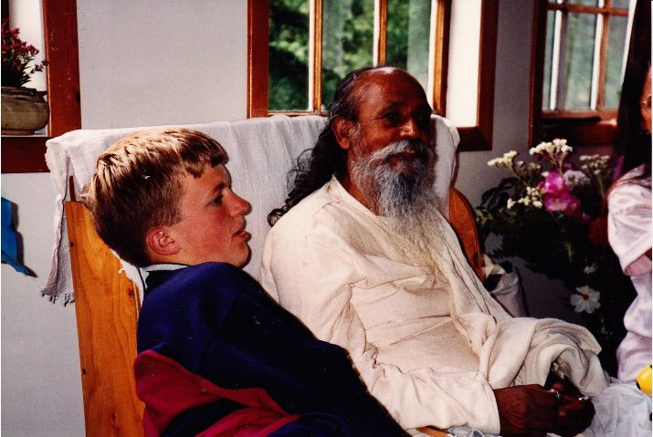](images/74707685_Truth-Seekers-7.jpg) Joel and Babaji, 1992
[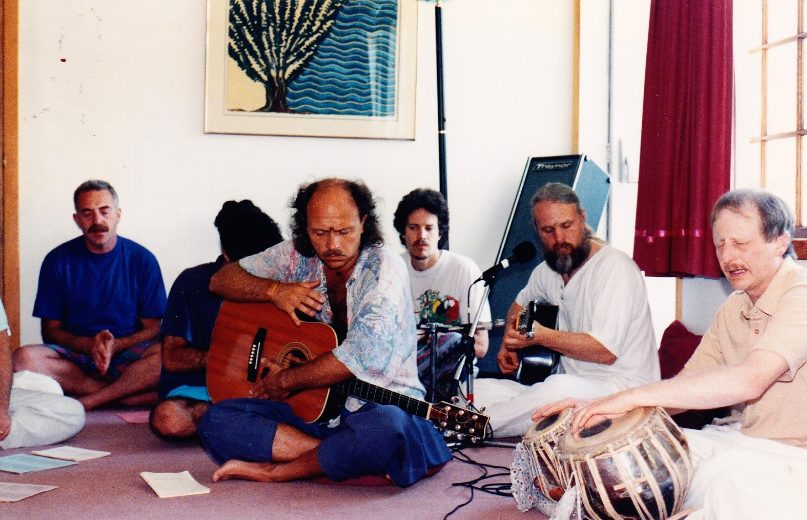](images/74707685_Truth-Seekers-8.jpg) satang 1993 – men’s side – Madhav, Om PK, Ramesh, Divakar
[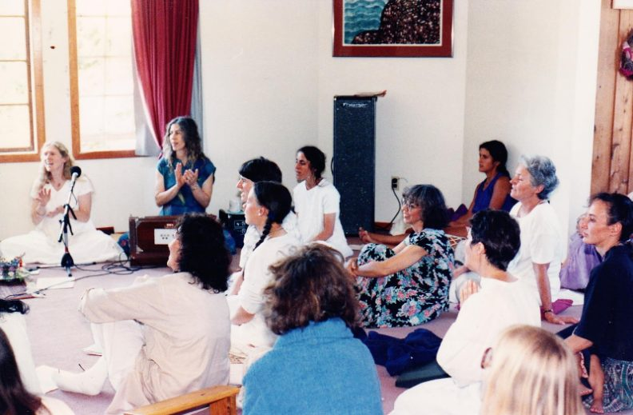](images/74707685_Truth-Seekers-9.jpg) satsang 1993 – women’s side - Anuradha, Mayana, Kishori, Anapurna, Bhavani S., Sharada, Chanchala,  
 Chandra Kala, Bhavani C.
[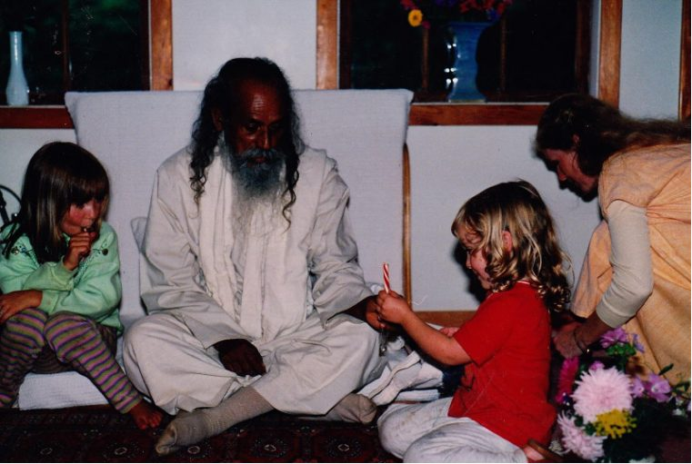](images/74707685_Truth-Seekers-10.jpg) 1993 – kids getting candy from Babaji
[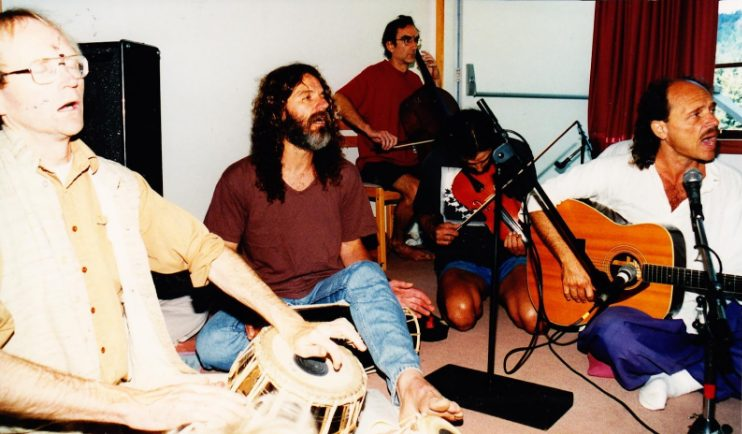](images/74707685_Truth-Seekers-11.jpg) satsang 1995 – Mark, Ashwin, Purna, Madhav
[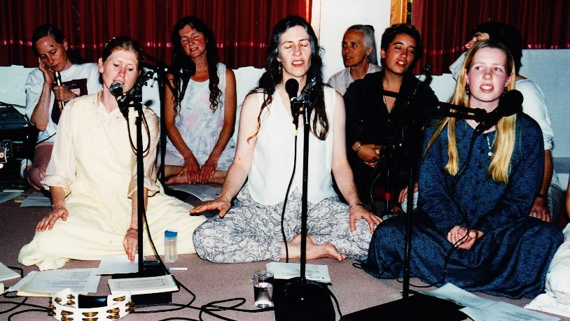](images/74707685_Truth-Seekers-12.jpg) satsang 1995 – Karuna, Anuradha, Rajani, Mayana, Pratibha, Nayana, Radhika
For many years we were blessed with Babaji’s presence at our annual yoga retreats. Although it’s been a few years since he’s been here, his presence is everywhere on the land. Sunday satsang, Wednesday evening kirtan, ACYR (Annual Community Yoga Retreat), YTT (Yoga Teacher Training) and YSSI (Yoga Service and Study Immersion) continue to strengthen our spiritual foundation and spread the love and the joy of being together as a spiritual family.
Here’s one more photo of spontaneous kirtan on the mound at last year’s ACYR.
[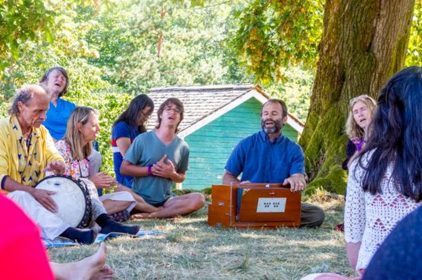](images/74707685_Truth-Seekers-13.jpg) Madhav, Kishori, Radha, Harreson, Brian, Raven, Anuradha
Please join us for satsang if you can. If you live in the Vancouver area, you can connect with the [satsang community there](https://saltspringcentre.com/about/dharma-sara-satsang/). Wherever you are, the song commonly known as the wedding song reminds us that “Whenever two or more of you are gathered in His name, there is Love.”
Jai Gurudev!
Contributed by Sharada
All text in italics is from writings by Baba Hari Dass

---

 
 Sharada Filkow, a student of classical ashtanga yoga since the early 70s, is one of the founding members of the Salt Spring Centre of Yoga, where she has lived for many years, serving as a karma yogi, teacher and mentor.
