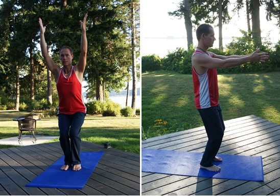
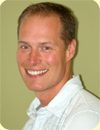

### Utkatasana, chair or powerful pose

 Bryan demonstrates utkatasana
I am always drawn to bring utkatasana into my classes - so much so that some of my students once gave me a thank you card with a stick figure in chair and plank pose (my other favorite posture). This posture is great for bringing more energy to a class. Flowing in and out of chair is very stimulating and strengthening. I find it an excellent way to prepare students for more challenging postures, such as eagle and revolved chair, that stem from utkatasana. I tend to introduce it early in the standing sequences of a class and use it like punctuation between flows that involve a single side of the body.

## Benefits

Chair pose works the whole body. There is an opening effect through the shoulders. The legs are strengthened from the ankle right to the hip. The abdominals and back are challenged to maintain correct alignment and simultaneously tone the internal organs. This posture also stimulates circulation and digestion.

## Coming into the pose

Begin in tadasana, I like to cue my students to maintain the integrity of the core as they found it in mountain, and bring that into chair pose. With an inhalation bring the arms overhead, with an exhalation bend at the knees. While in the pose draw the shoulder blades down the back, root into the ground evenly with both feet, open the chest and breathe.

## Modifications

To make utkatasana more accessible, a wider stance may help. The degree of bend in the knees is also going to change the workload; the greater the bend at the knee the greater the effort to maintain the posture. The arm position can be changed to have the hands supporting on the knees or hips. The next intermediate arm position would be to have the arms parallel to the ground, straight out or perhaps bending at the elbows and placing each hand on the opposite elbow.

### About the instructor: Bryan Eknath Hill

Bryan began practicing yoga in 2000. His practice grew slowly and continues to evolve in balance with life’s seasons and necessities. He completed his teacher training at the Saltspring Centre of Yoga in 2008. He leads a number of public and corporate yoga classes in the Comox Valley on Vancouver Island. Bryan is a registered massage therapist and has a long history of teaching physical skills to people of all ages. He brings his knowledge of anatomy to the mat in order to help students understand yoga asana. He emphasizes alignment of the body as well as thoughts, words and deeds.
--
Read more about [Bryan as a member of the SSCY Community](https://saltspringcentre.com/2015/09/our-centre-community-bryan-eknath-hill/), and his [experience as a student](https://saltspringcentre.com/2013/08/meet-our-ytt-grads-bryan-eknath-hill/) of the Salt Spring Centre’s Yoga Teacher Training program.
