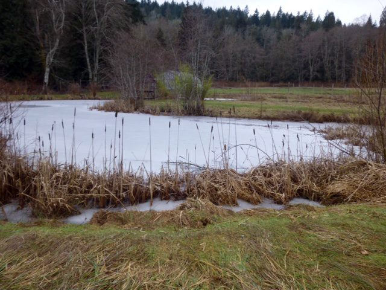
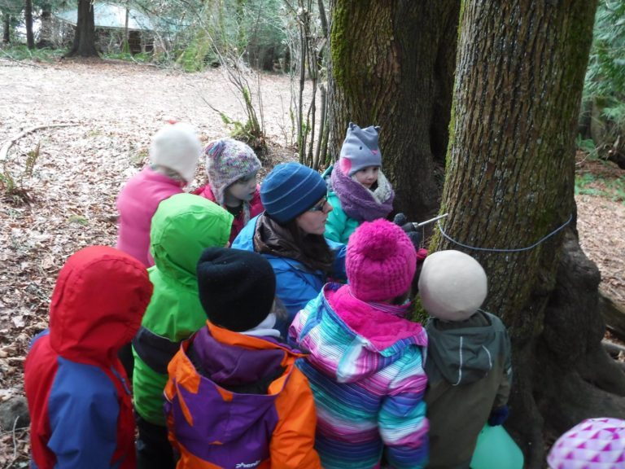
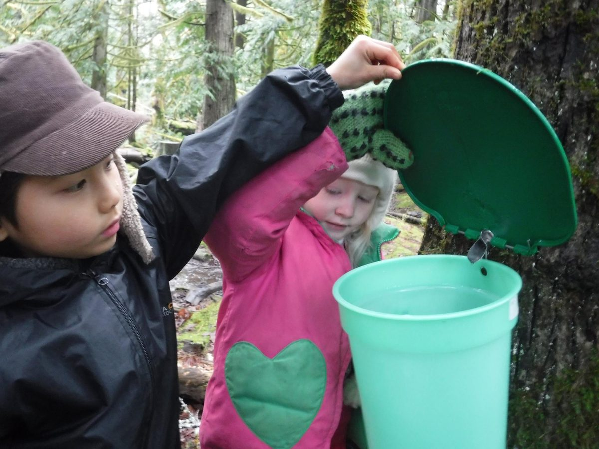

Hello everyone,
I hope your winter, wherever you are, is going well. Here on Salt Spring Island, we have had some warmish days, a reminder that spring is around the corner, but it’s not quite here yet. As mentioned in last month’s update, projects are getting done while it’s still quiet here, and the program house is looking clean and bright.
As we move through this winter season, we find ourselves without a Centre Manager. After careful deliberation, Piet Suess has decided to step down from his role as Centre Manager to actively pursue his previous career. The Centre Committee is taking on the role of management in the interim.
We would like to express our heartfelt appreciation to Piet for his vision and passion. Our hope is that he will continue to stay in touch and visit us often. May the road always rise to meet you, Piet. If you would like to send your warm wishes to Piet, you can email him at piet [at] saltspringcentre.com.

## Coming up at the Centre

The next big event at the Centre is the celebration of [Shivaratri on Saturday, February 25](https://saltspringcentre.com/2017/01/shivaratri-2017/) , the annual ritual honouring Shiva, the god of destruction - the destruction of the primal ignorance of our true nature.
It won’t be long afterward that we’ll be into our 2017 program season. The [YSSI (Yoga Service and Study Immersion) program](https://saltspringcentre.com/yoga-service-and-study/), May 31 - Sept. 1, is a wonderful opportunity for those looking to immerse themselves in the life of a spiritual community for three months. The program offers classes (asana and yoga theory), daily sadhana practices, and the opportunity to contribute to program guests and community in one of the Centre’s departments.
Applications for [Yoga Teacher Training (YTT)](https://saltspringcentre.com/yoga-teacher-training/) have been coming in. Amidst the many YTT programs that are available, the Salt Spring Centre’s is unique in that it is a residential, lineage based classical Ashtanga Yoga program that is part of an established yoga community on beautiful Salt Spring Island, taught by teachers who have learned from Baba Hari Dass. You can read more about the program [here](https://saltspringcentre.com/yoga-teacher-training/).

### Be part of our working community!

We have a busy program season coming up and would like to offer you the opportunity to come and be part of our team to support weekend programs and rentals. We are creating a database of volunteers who would like to come to the Centre for a weekend to be part of our working community. We’d love to hear from you! What we’ll need is your name, contact information, availability and your skill set. Contact yoga@saltspringcentre.com.

## Centre School Update

[The Salt Spring Centre School](http://saltspringcentreschool.ca/), as always, is a busy place. Here are a couple photos of the kindergarten class tapping a maple tree on the land. The maple sugar was delicious!

## Offerings from this month's Newsletter

Looking back through newsletter postings over the years, I discovered many that I’d like to share again. This piece by Bryan Hill - [Utkatanasana - Chair Pose](https://saltspringcentre.com/2017/01/asana-of-the-month-utkatasana/) - was first published in this newsletter in 2013, and I’m happy to share it with you again. Brian, a massage therapist and yoga instructor, teaches anatomy as part of our YTT program.
A few of us travelled to Mount Madonna Center this winter for the annual New Year’s Retreat. Of the many inspiring programs, one was an afternoon panel presentation on the subject of the Vastness of Yoga, with several presenters speaking about the path of yoga that most inspires them and brings them joy. Jaya Maxon, a long time student of Babaji’s and resident at MMC, shares with us her reflections on [The Vastness of Yoga](https://saltspringcentre.com/2017/01/the-vastness-of-yoga/).
A question in many people’s minds these days is about how to respond when life presents paradigm changing situations that we weren’t expecting. How can we respond in healthy ways when [Living with Uncertainty and Instability](https://saltspringcentre.com/2017/01/living-with-uncertainty-and-instability/)? Here are some reminders and supports for keeping our balance within the midst of the turmoil of life.
Pratibha has also written about change: [Reflections on Birth, Growth, Decay and Death](https://saltspringcentre.com/2017/01/reflections-on-birth-growth-decay-death/). This is not a depressing subject; this is the natural cycle of life. As we move toward Shivaratri, celebrating the destruction of ignorance, it seems appropriate to reflect on endings and new beginnings. At this moment there is still ice on the pond, but soon the crocuses and daffodils will be poking their heads out of the ground. The cycle of life continues.
With prayers for peace,
Love to you all,
Sharada
