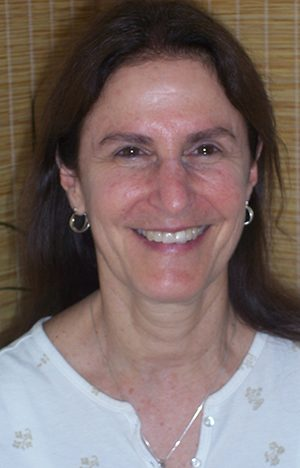

When Sarada invited me to be part of this panel and presented the question she wanted us to consider, *What aspect of your sadhana brings you the most joy?* I told her I had to think about it. Being up front behind a mic is not my *happy place.*
Once the seed, in the form of the question, was sown however, the inquiry took me on an immediate journey. First, in me the question transformed into *What practice am I most naturally drawn to and affects me in the deepest way…and what do I find myself actually doing?* The answer rose up multifaceted….three strands, woven like a rope…**service, prayer, meditation**. What also rose, simultaneously, was a reflection on why…Why do I do these practices?
I feel an immense gratitude for the profound depth and breadth of yoga philosophy and practice that Babaji has taught. Out of it, I realize there is a simple story that has evolved for me…a fundamental, rather two dimensional, framework upon which I base my personal practice.
It goes something like this….
I believe that as human beings we all embody the full spectrum of the pairs of opposites. I name this: ***on a scale of 10 - 1***…10 being the dark and 1 being the light…or, ***the journey from darkness to light***. Draw or visualize a horizontal line: 10, the dark, on left and 1 the light, on right; everything in between varying shades of dark moving to light gray. Examples of qualities of 10 are hatred, cruelty, violence, greed, agitation; and of 1 are love, compassion, peace, generosity, contentment.
I see us all on the scale, mostly some shade of gray, moving in one direction or the another, or at times back and forth, due to our thoughts and actions and the choices we make. From these we create the patterns that strengthen our behaviors. Yoga calls these prints that we make by our thoughts and actions, *samskaras*, or tendencies. With them we create our individual world and go on to experience this world.
We only have to observe around us, or listen to the news, to find examples of beings embodying the **far** ends of the spectrum. I’m assuming all of us here in this room are making an effort to move toward the light. Many in the world are also doing this naturally in their lives. Good people who are generous and kind, not necessarily consciously making an effort to be, but just by their innate tendencies.
And so it goes, all of us creating our worlds and *playing* in them, experiencing the pairs of opposites - happiness/sadness, joy/grief etc. until at some point something jolts us to a new awakening…a feeling that there must be something more to realize in this life. At this point a new journey begins, also a scale from 10 - 1, *from darkness to light*, however this journey is more transcendental. Visualize a line this time on a vertical trajectory, bisecting the horizontal line. The bottom representing 10 the darkness, in this case, Ignorance, or identification with the Unreal; 1 at the top representing the light, or Liberation, knowledge of the Real.
On this journey we’re consciously making effort to realize our highest potential, our higher consciousness or divine nature; it’s what we commonly call the spiritual path. This path requires sustained effort, which brings us back to practice and what, as I mentioned, is primarily for me Service, Prayer, Meditation.

## SERVICE

As an active person I **need** to work in the world, however this is a way I believe I can engage my body, mind, senses in action that helps reduce selfishness. It includes effort at practicing the great tenants of **Karma Yoga** (selfless service): *To work without identifying as being the doer.* *To work without attachment to the fruits of action.*
Why do this practice? I believe it reduces the sense of separateness, self interest, and selfishness, which gradually purifies the mind and makes it fit for deeper realization.

## PRAYER

For me this has evolved as an internal pranam in the form of expressions of gratitude to the divine in multiple ways that has become a daily practice.
Why? For me it is a way to remember and acknowledge an energy that is greater than myself; it humbles and purifies the heart, making it fit for deeper realization.

## MEDITATION

According to the Yoga Sutras, through a series of deepening states of meditation or levels of Samadhi, we directly experience Truth…that we are not the body, we are not the senses, we are not the mind, we are not the intellect, we are not even this individual I sense we so identify with.
Why practice? I believe that our enlightenment, and final liberation, is only known by direct experience and that this is only achieved through silencing the mind (*Yogash Chitta Vritti Nirodha* - Yoga is the cessation of the thoughts waves in the mind).
\_\_\_\_\_\_\_\_\_\_\_\_\_\_\_\_\_\_\_\_\_\_
Moving along this vertical trajectory takes ***Persistent Practice** (Abhyasa)* which leads to ***Dispassion** (Vairagya)*. This happens in degrees…persistent practice bringing greater dispassion and knowledge until ultimately we gain complete dispassion for the world (*Paravairagya*), which leads to complete Liberation (*Kaivalya*), the union, or merging, of our individual self with the universal Self, the endgame of *the journey from darkness to light*, or we could say, *the final getting over ourselves*….literally!
Babaji has said about this final union:
*The result of Yoga is the non-dual state. The non-dual state is characterized by the absence of individuality; it can be described as eternal peace, pure love, Self-realization, or Liberation.”*
\_\_\_\_\_\_\_\_\_\_\_\_\_\_\_\_\_\_\_\_\_\_
This is how I’ve framed the journey. It’s not a new story, but one I’ve told in words that work for me. As long as we continue to identify as separate beings, each one of us is a unique path, a unique story…and we’ll each have our own rope, or strands of practice, that work for us or bring us joy. As long as we haven’t realized Yoga, union, we’ll find ourselves somewhere on the scales of 10 - 1 and it’s our choice how we use every moment of our lives on this journey.
There’s a quote from Babaji that sums this up: *We have to cultivate positive qualities in our day-to-day life. Life is not coming but going. Every single second is flying away from our lives. If we are not trying to attain peace, then we have lost, are losing and will lose the precious seconds, minutes, hours, days, and years of our lives.*
To end, there is a prayer that speaks to this journey…

### Asato Mā असतो मा

Om Asato Mā Sad Gamaya Tamaso Mā Jyotir Gamaya
Mṛityor-Mā-Amṛitaṁ Gamaya
Sarveṣhām Svasti-Bhavatu Sarveṣhām Shānti-Bhavatu
Sarveṣhām Pūrṇaṁ-Bhavatu Sarveṣhām Maṇgalaṁ-Bhavatu
Lokā Samastāḥ Sukhino Bhavantu
Om Śhāntiḥ Śhāntiḥ Śhāntih

Om.
From the unreal lead me to the real.
From darkness lead me to light.
From death lead me to immortality.
May all beings dwell in happiness.
May all beings dwell in peace.
May all beings attain oneness.
May all beings attain auspiciousness.
May happiness be unto the whole world.
Om, peace, peace, peace.

---

**Jaya Maxon** began her spiritual journey when she met her teacher Baba Hari Dass in 1974. She has devoted her life to the study of yoga and attempts to bring the teachings to life in practical ways on a day to day basis. She has taught the methods of Ashtanga Yoga and Hatha Yoga for 40 years and over most of those years helped coordinate and evolve the Yoga Teacher Training program at Mount Madonna Center. She believes that life always offers the opportunities for the growth we need, and currently finds herself challenged to deepen her practice of patience, compassion, and contentment as she engages in the work of this stage of her life.

---

[Sky photo: [Creative Commons Zero license](http://creativecommons.org/publicdomain/zero/1.0/)]
