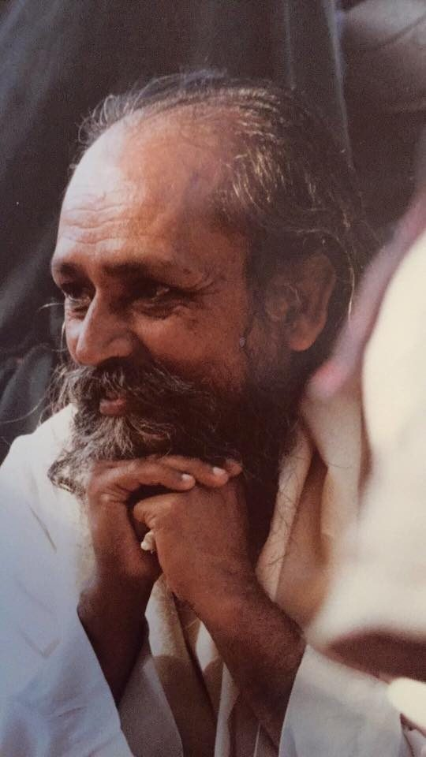

Whatever we do, whatever our life situation, chances are it involves other people. Relationship issues become very obvious when living in community; it’s impossible to hide. You may not live in community - you may even live alone - but life involves other people - family, work, friends, all kinds of relationships: with parents, children, romantic partners, your boss, your co-workers, friends.
Here are a few reminders we’ve been given by Babaji over the years. These comments and questions and answers come from meetings with Babaji in the early years at the Centre as we were struggling to understand how to work together and get along with each other.
Babaji: *People get negative because of their own unhappiness. If we see our pain is caused by outer forces, then we are not seeing right. We are not seeing within ourselves.*
B: *Human ego is the most mysterious energy. It appears in multitudes of faces. You think you are doing right, but sometimes the ego is hiding and interjecting negativity.*
Q: Is there a formula whereby the Centre residents can reduce negativity? You were just talking about open communication.
B: *Only formula I know is ‘play volleyball.’ It means keep a positive attitude. Think honestly. It is your life; you want to live in peace, but by dishonest thinking you create pain.*
Most of the time we don’t think we’re causing pain; we just think we’re right - but that’s the very thought that causes pain!
*No matter what you do, you have to face the pain. It’s very fulfilling when we blame others. You see the ego doesn’t want to lose.*
*If a person understands his or her anger, then only can they change. Because anger stirs up negativity in everyone, so the person should accept that he or she is not adjusting. A woman wrote me that she is angry and can’t change. I wrote her that a person who is angry knocks him or herself away from others. No one else is knocking out the person.*
*The purpose of life is to attain peace; that is why you are here.*
*Conflict of opinion is okay, but anger takes place when one’s ego wants to win. If you understand differently* (than others do)*, then you don’t accept someone else’s idea. It is a conflict. Now the ego wants to win. It will use all possible ways to kill the other person.* (not literally)
Q: I’ve been thinking lately that there can be a conflict but anger is a different thing. It comes down to honesty with myself.
B: *Honest Communication.*
Q: Dishonesty could be just plain delusion, couldn’t it?
B: *Delusion is the mother of all.*
*If you are trying to develop spiritually, then not getting along should be resolved positively. You will have disagreements everywhere. We can disagree with others in our ideas but it doesn’t mean we have to hide or run away. Everything is okay. In every step of life we have to face our fears. There are problems in everything. You have to deal with problems as honestly as possible.*
*Work honestly*
 *Meditate every day*
 *Meet people without fear*
 *And play.*

---

Contributed by Sharada
All text in italics is from meetings with Babaji

---

 **Sharada Filkow**, a student of classical ashtanga yoga since the early 70s, is one of the founding members of the Salt Spring Centre of Yoga, where she has lived for many years, serving as a karma yogi, teacher and mentor.
