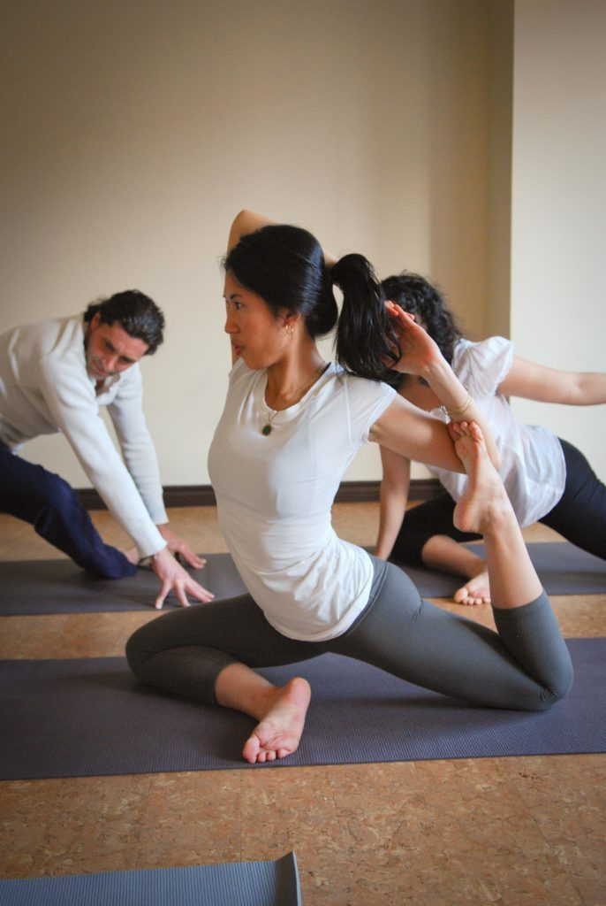
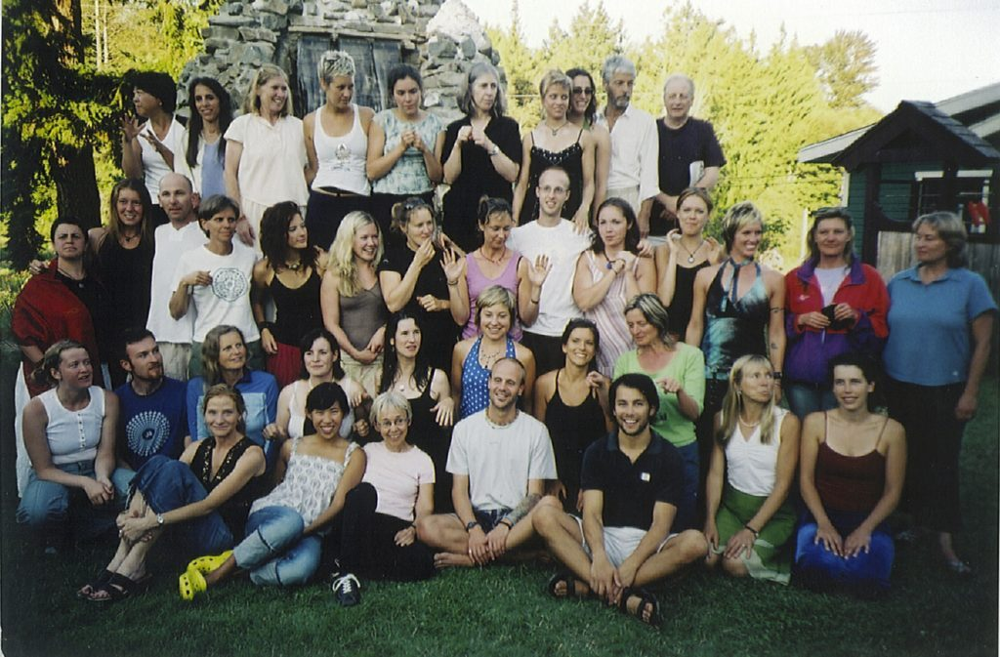
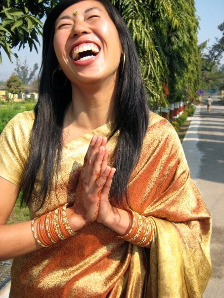
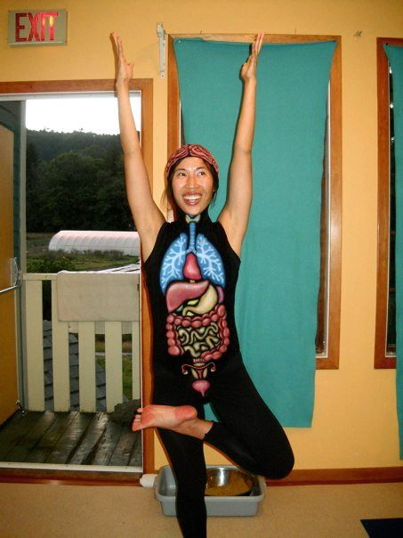
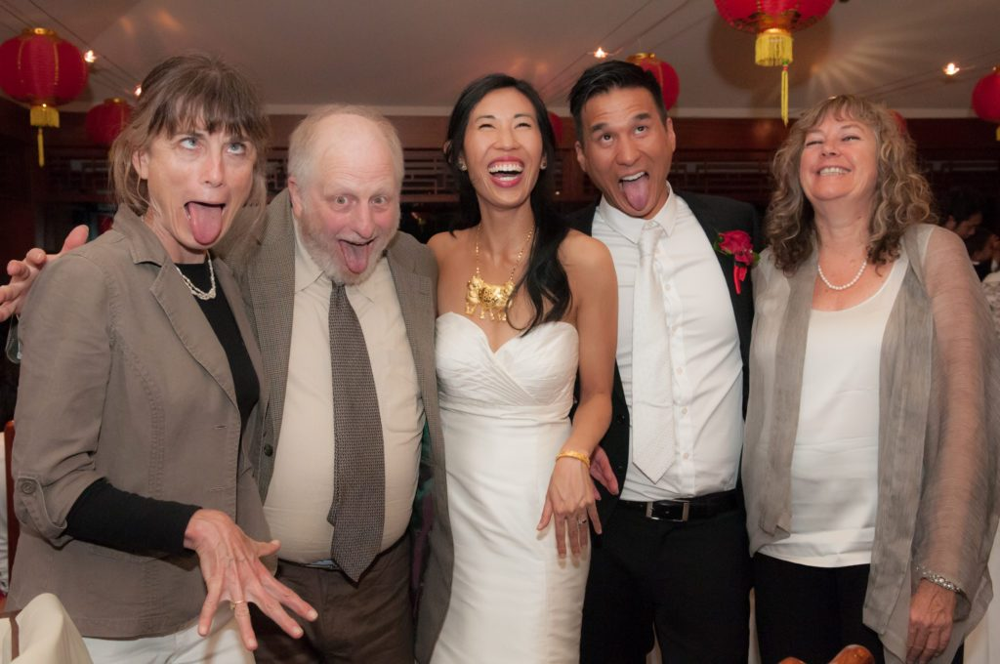
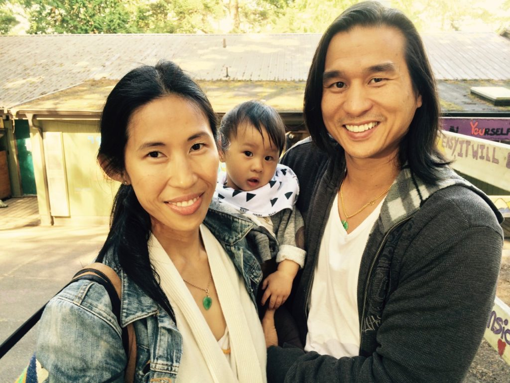

 Eka pada rajakapotasana variatio
I’ve been practicing yoga for over 15 years and I hope to continue for many more. The reason I’ve kept up with it is because it “works” for me. And when I say “work”, I mean that it continually expands my capacity for kindness, love, patience and peace.
I was first introduced to yoga in my second year of university and I immediately fell in love with the practice. The way asanas made space for different perspectives in my body and mind amazed me. I remember lying in savasana at the end of my first class, feeling content and that I was exactly where I needed to be. My mind wasn't racing ahead to the future or getting lost in the past as it normally would. It gave me a new response for the stress of student life and I started attending classes weekly. After graduating, I went to work in a smaller community north of Vancouver. I tried to keep up a home practice but felt lost on my own. Then I remembered one of my favourite yoga teachers had once brought a book to share with the class as a resource. That book was The Salt Spring Experience.
A month later, I signed up for the Yoga Teacher Training at the Salt Spring Centre. I was determined to deepen my knowledge beyond what I'd learned in public classes so I could sustain the practice on my own. I wanted to learn how to embody yoga in the way I saw the teachers I most respected did.
 Salt Spring Centre YTT Class of 2005
The program opened my heart wide. It ignited a vision and a feeling of how I wanted to live my practice. It also gave me the tools I needed to start.
One of the highlights from YTT was meeting Babaji for the first time. I didn't know what to expect from the silent yogi monk I'd heard so much about through the program. When he arrived, I was both delighted - by Babaji's incredible playful sense of humour - and surprised - by the strong sense of peace and stillness I felt his presence, even in a room full of people buzzing with energy. The memory of that peace has stayed with me and guides me to this day.
Another highlight during YTT was receiving my Sanskrit name from Babaji. One day as I headed to an afternoon session, I was handed a little piece of paper with Babaji’s handwriting. I felt a wave of emotion as I looked at the paper while continuing on into class. I sat down on my mat and glanced up at the wall in front of me where my eyes met those of a beautiful little girl's. It was a picture of one of the girls from Sri Ram Ashram who happened to share the same name I had just received, Neha. In that moment, I knew I had to meet her and I knew I had to go to Sri Ram.
It would take three years for the journey to come to fruition. I ended up in India (for an extended stay at Sri Ram Ashram), the Mount Madonna Centre, and back to India again! In hindsight it was a pilgrimage as I came to know myself in many new ways over those two and a half years of journeying. And through it all, my sadhana was the stable ground I stood on and a safe space that I always carried with me.
 Attending a joyful wedding at Sri Ram Ashram in 2008
These days, I'm at the Centre at least once a year for Yoga Getaways, YTT or the Annual Community Yoga Retreat. Every time I set foot on the Land, it feels like a homecoming. Because of this, I call it one of my "heart homes" and the community has become a second family, my "yoga family."
 Wearing the amazing organ suit for YTT in 2010
It's fitting that my yoga family brought me together with my partner, Mark. We met at the Centre in 2010 and immediately connected over the yoga practice, being YTT grads and having similar family backgrounds. We were both born and raised in Vancouver to first generation immigrant parents. We both grew up swimming in the same community centre pools and playing at the same playgrounds. It was surreal, and sweet, to find out that Mark had even worked with my very first pottery teacher whom I met in Grade 2!
I married Mark in 2014 and we welcomed our baby boy, Noah, the following year. And to complete the circle, we brought Noah to attend his first official yoga retreat (outside of the womb) at the Centre last summer.
 Quintessential simhasana breath wedding banquet photo
 Enjoying our first summer together as a family
Since Noah's arrival, life has been fuller than ever. Babaji’s words, "love everyone, including yourself. This is real sadhana." have helped me soften around the challenging aspects of transitioning into being a mother. From time to time I miss the simplicity of pre-baby sadhana where I could get on the mat or cushion at my leisure! The sweetness of loving my family, loving this phase and loving myself as I navigate the learning curve of new parenthood as “real sadhana” is special. This remembrance makes space so I can feel content and exactly where I need to be, just as I did during my very first savasana, in my very first yoga class. Thank you for this and for everything, Babaji.
Peace,
Joni Neha Louie
