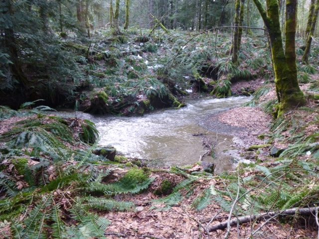
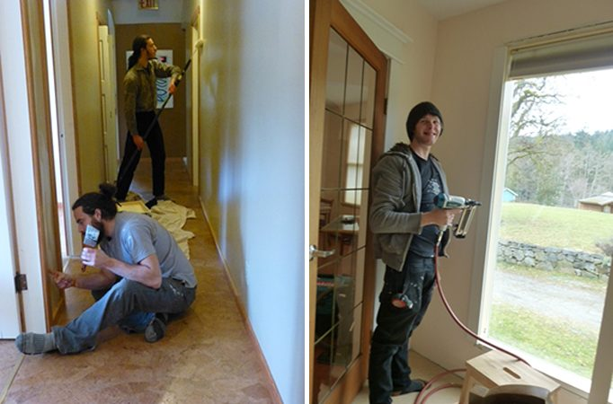
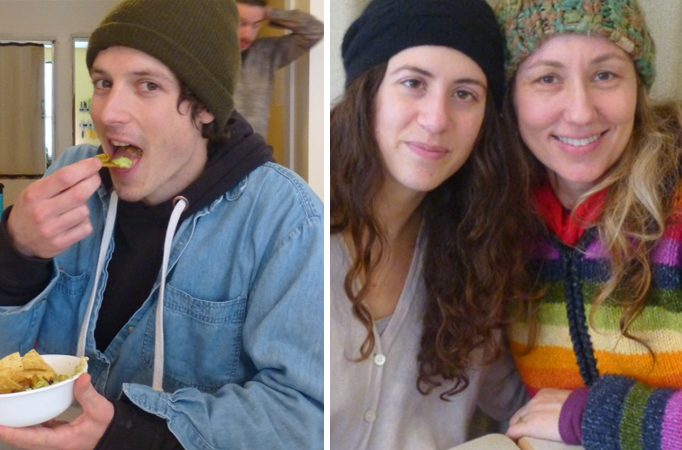
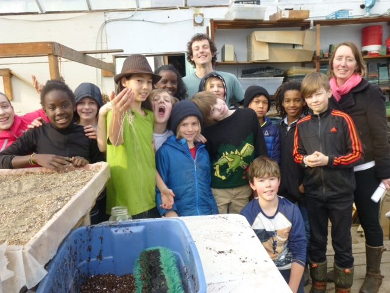
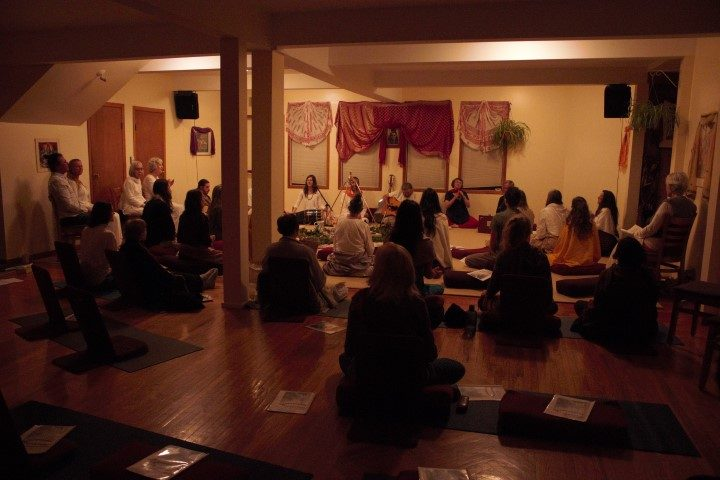
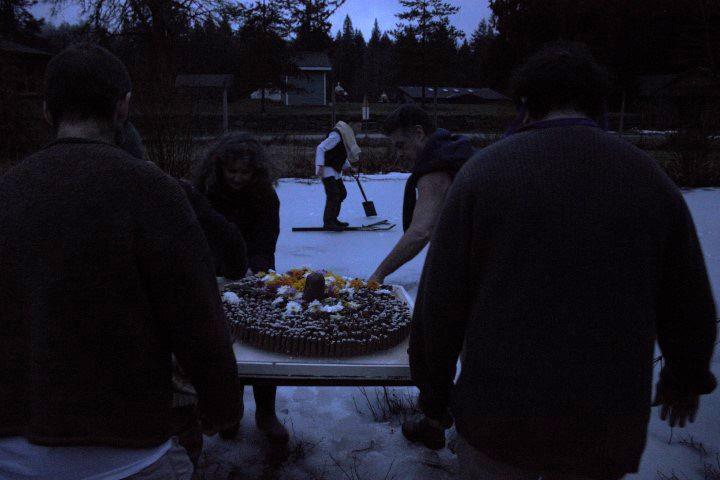

Hello everyone,
Spring officially begins later this month. Meanwhile, these photos give you a snapshot of our snowy-rainy February and the wet not-quite-spring at the Centre.
 Spring stream
 Milo by the tractor, February 2017. We had lots of snow! There's still some, but it's melting quickly and now it's very wet!
Here’s what’s been going on behind the scenes at the Centre. Along with ongoing daily tasks and Wednesday work parties, a lot is being accomplished.
 Jesse and Will painting the upstairs hallway; Tyler installing trim
 Milo, Bri and Udaya at lunchtime
Milo continues to work with the students of the [Salt Spring Centre School](http://saltspringcentreschool.ca/) every Thursday. Here they are in the propagation greenhouse, getting ready for planting.
 Kate's class in the greenhouse with Milo
Now that the weather is warming up and the snow is gone (for the moment), more people are emerging from their winter hideaways and joining us for kirtan and satsang. If you’re interested in joining our online Bhagavad Gita study group - Tuesday evenings at 7 pm - please contact me (sharada@saltspringcentre.com) and give me your email address. Monthly full moon yajnas also continue, the next one being on Thursday, March 9 at 7:00 pm.

# Night of Shiva

Shivaratri, the Night of Shiva, an all-night vigil of chanting and prayer, was powerful and uplifting, ending with the submersion of offerings into the pond at dawn. This year the pond was covered with a thick layer of ice, presenting a bit of a challenge. A hole had been cut in the ice to allow the offerings to be made, but the offerers had to stand on the ice to watch.
 The altar
 Kirtan
 Carrying the lingams to the pond

# Join us this season!

Our 2017 program season begins this month, with our first [Yoga Getaway](https://saltspringcentre.com/retreats-programs/yogagetaways/) of the season, March 10-12, a perfect way to renew at the beginning of the spring season.
The Centre’s [200 hour Yoga Teacher Training](https://saltspringcentre.com/yoga-teacher-training/) is accepting registrations for this summer’s YTT program. This unique residential program on beautiful Salt Spring Island is taught by a 20-member faculty of experienced teachers dedicated to passing on the teachings that have enriched their lives. The program is taught in two segments, July 6-19 and August 12-22.
On another note, we’ve noticed that there are some gaps on our library shelves. If you borrowed a book when you were here last, please know that we would love to have it back. You can bring it next time you come. Thanks!

# This month's newsletter offerings

This month we present Joni Neha Louie, part of Our Centre Community. In [Yoga Story](https://saltspringcentre.com/2017/02/yoga-story/), Neha shares her yoga journey, which began when she was in university and led to her taking Yoga Teacher Training at the Centre in 2005. She says the program “opened my heart wide. It ignited a vision and a feeling of how I wanted to live my practice. It also gave me the tools I needed to start.” Her story unfolds from there, leading her to spending time at Sri Ram Ashram, eventually meeting the man who became her husband and bringing a sweet little boy into the world. I’m sure you’ll enjoy reading her story.
Whatever your life situation, life invariably involves dealing with other people. Babaji has counselled many of us over the years as we struggled to learn how to live and work together. Although he was directing this advice to the Centre community, it applies equally to anyone who lives or works with others - in any relationship. Here is Babaji’s advice on [Getting Along With Other People](https://saltspringcentre.com/2017/02/getting-along-with-other-people-advice-from-baba-hari-dass/).
The Salt Spring Centre of Yoga kitchen has fed many, many people over the years. Back by popular request, here are a few recipes from both Centre cookbooks that guests still ask about - [Recipes from The Centre Kitchen](https://saltspringcentre.com/2017/02/recipes-from-the-centre-kitchen/). If you want more recipes, please let me know by leaving a comment; I’d be happy to share more.
As we move into spring, may we move from darkness into light on all levels.
*Purity in thought, purity in speech, and purity in action bring divine presence in the heart.*
OM
Love,
Sharada
