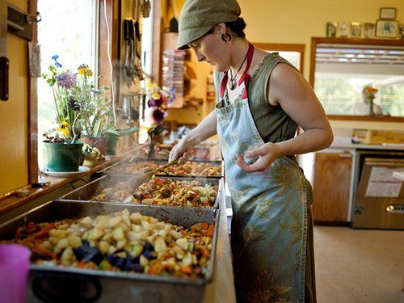

In response to requests, here are a few easy and delicious protein recipes for your enjoyment. Although many new recipes have been developed over the years, these old favourites are still in demand.
If you’d like more recipes, please let me know by leaving a comment; I’d be happy to provide more.

## Cashew-Carrot Loaf

6 cups chopped carrots
2 cups finely ground cashews
3 Tbsp. oil
1 cup finely chopped leeks (or mild onions if you prefer)
1 cup finely chopped celery
½ cup flour (or matzo meal for Passover)
1 tsp. salt
½ tsp. black pepper
2 tsp. sage
1 tsp. basil
½ tsp. thyme

- Steam the carrots till soft, then blend them in a food processor or blender. Six cups of chopped carrots make about 3 cups blended.
- Grind the cashews in a food processor or blender till they’re quite fine. If you’re using a blender, it works best if you do small batches.
- Mix all ingredients together and place in an oiled baking pan.
- Bake at 350° for 35-45 minutes or until the top edges begin to look dry.

## Tofu Burgers

1 cup fine breadcrumbs (any kind)
½ cup finely chopped leeks
1 lb. tofu, blended
1 Tbsp. tamari
¼ tsp. salt
¼ tsp. pepper
½ tsp. Sage
1 cup nutritional yeast (for coating the burgers)
olive oil, vegetable oil or ghee for frying

- Blend the tofu in a food processor.
- Mix all ingredients except the nutritional yeast in a bowl.
- Moisten your hands and form the mixture into patties.
- Dip them in the nutritional yeast, coating both sides.
- Fry them in oil or ghee until browned.

## Breaded and Baked Tofu

**Breading**
½ cup cornmeal
¾ cup nutritional yeast
¾ cup sesame seeds
1 Tbsp. dillweed
2 tsp. basil
pinch cayenne (optional)
2 lb. tofu
½ cup tamari

- Combine the cornmeal, yeast, sesame seeds, herbs and cayenne to make the breading mixture.
- Set out two bowls, one for tamari and one for the breading mixture.
- Slice the tofu into ¼ inch to ½ inch slices (your preference).
- Dip each piece of tofu first into the tamari and then into the breading mixture, making sure it’s well coated.
- Place the tofu slices on an oiled baking tray and bake at 375° for 35-45 minutes, depending on how crispy you like them.
  (For a quick meal, you can fry these instead of baking them.)

---

Contributed by Sharada
