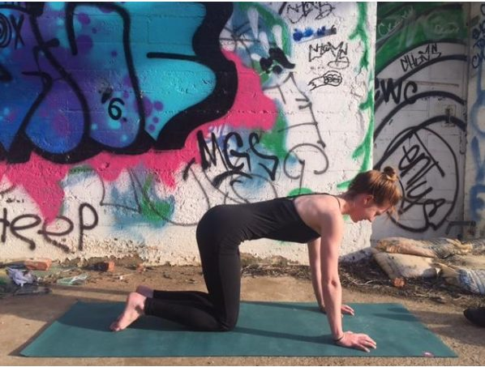
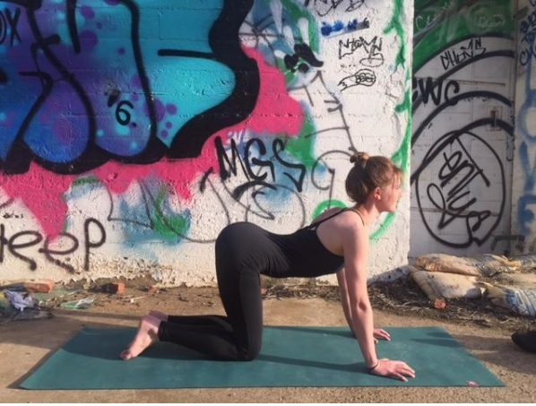
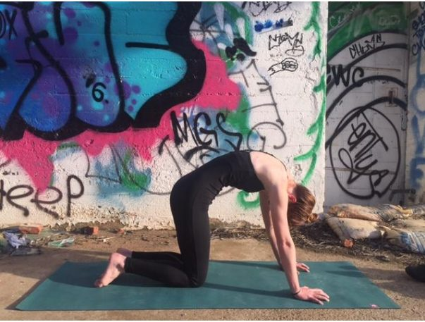
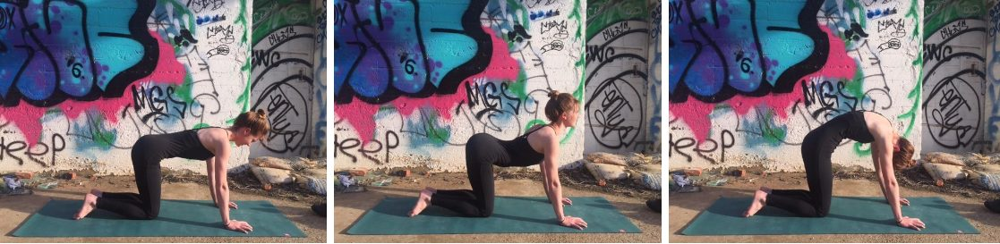
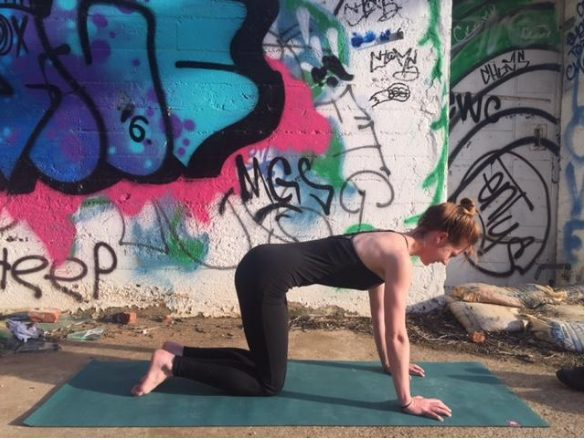
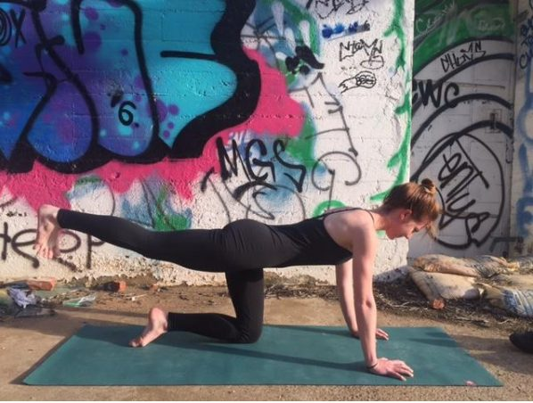
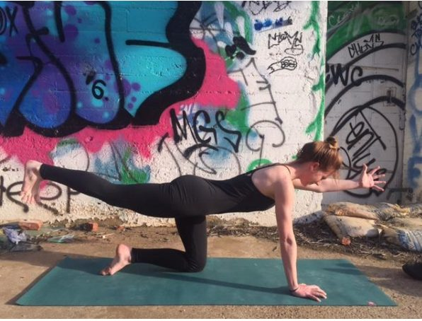
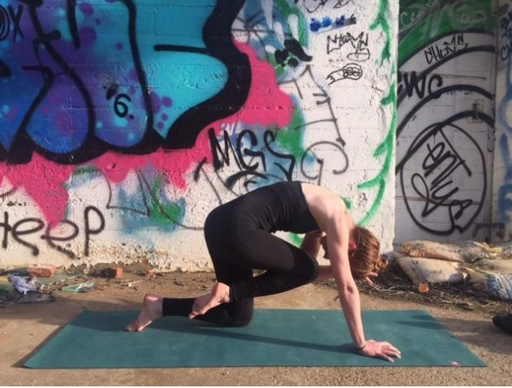
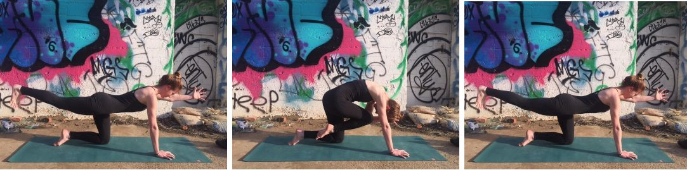
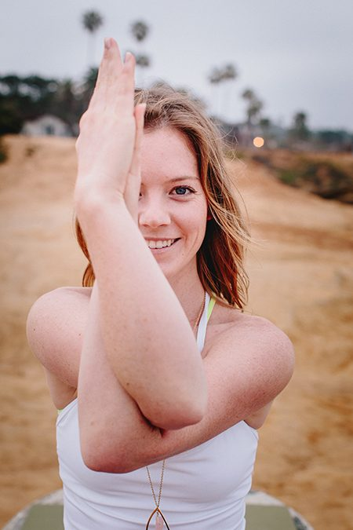

Freedom in the pelvis, freedom in the heart. I love this string of movements because it brings breath and motion into the pelvis and the heart. Flowing from cat to cow pose is a great way to warm up the body, ease tension in the spine and build strength in the core.

## Benefits of cat/cow pose

- Improves posture
- Strengthens abdominal muscles
- Stretches the spine
- Massages the organs in the belly
- Relieves stress

### Coming into the Pose

Start on all fours with your knees under your hips and your wrists under shoulders. Spread your fingers beautifully and root down through your hands. Activate your feet, pressing down through the tops of your feet. Feel the inner thighs slightly hug into the midline and engage the core.
[caption id="attachment\_14700" align="aligncenter" width="598"] This is neutral spine![/caption]
This is neutral spine! It is a great position to hold for a few breaths to gain strength and stability in the core. Leading with your sit bones, un-tuck the pelvis, lifting the sit bones to the sky.
[caption id="attachment\_14701" align="aligncenter" width="598"] This is cow pose![/caption]
This is cow pose! Take a few breaths. Notice the release in the pelvis and opening in the front of the chest.
On an exhale, leading with the pelvis, tuck the sit bones under to round the spine.
[caption id="attachment\_14702" align="aligncenter" width="603"] This is cat pose![/caption]
This is cat pose! Feel the back body start to open; relax the head; relax the neck.
Continue to breathe and move the spine between cat and cow. Try to start the movement with the pelvis, allowing the rest of the spine to follow.

### Moving Deeper

Looking for more of a challenge? Start by pausing in neutral spine. Take a few breaths to re-establish the connection to your hands and feet. Feel the core engage.
[caption id="attachment\_14704" align="aligncenter" width="585"] Feel the core engage.[/caption]
Keeping the neutral spine position, extend one leg back. The foot can be extended on the mat or lifted. If the leg is lifted, flex the foot (this helps to square the hips).

If you are feeling strong and stable here, extend the opposite arm out long.

As you breathe here, notice the length in the spine.
On an exhale, tuck the pelvis under to round the spine, bringing the knee toward the nose.

Flow through a few rounds. Extending and feeling the length of the spine on the inhale. Tucking the pelvis under and rounding the spine on the exhale.

---

## About your Instructor

### **Sue Ann Hamsa Leavy**

Sue Ann turned to yoga after many years long distance running. In 2012 she moved to the Salt Spring Centre of Yoga to further her understanding of classical ashtanga yoga.  At the Salt Spring Centre of Yoga Sue Ann studied philosophy, yoga theory, asana, pranayama as well as community living.  The Centre is deeply rooted in the practice of Karma Yoga, which speaks to her passion for helping others.
Sue Ann currently lives and teaches in Asheville, North Carolina.  She is constantly inspired and encouraged by the journey yoga has taken her on. Her classes are focused on alignment, postural benefits, and cultivating peace.
