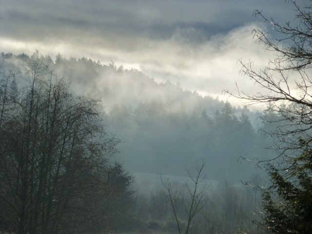
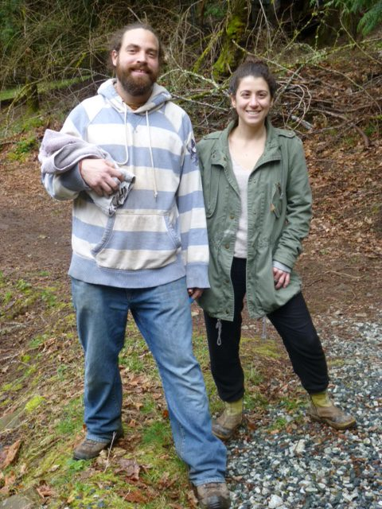
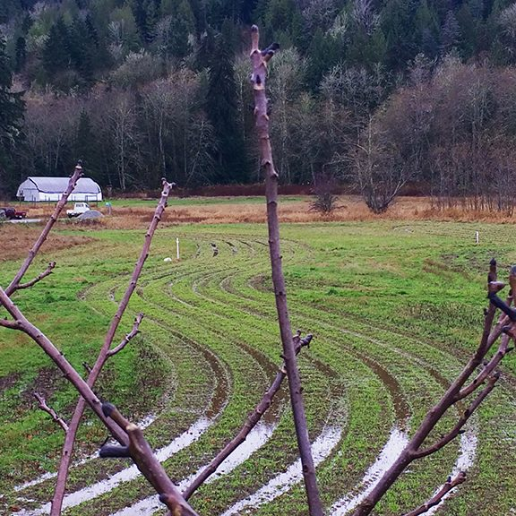
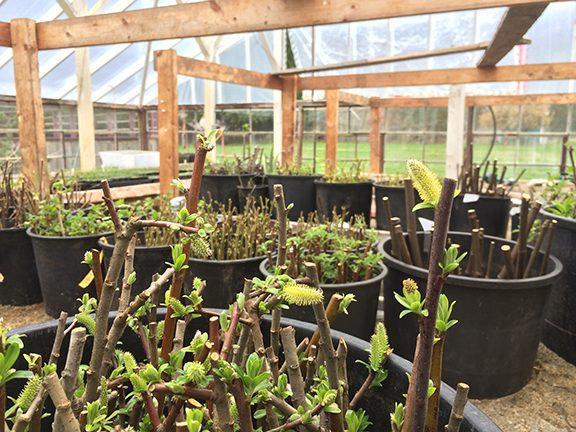
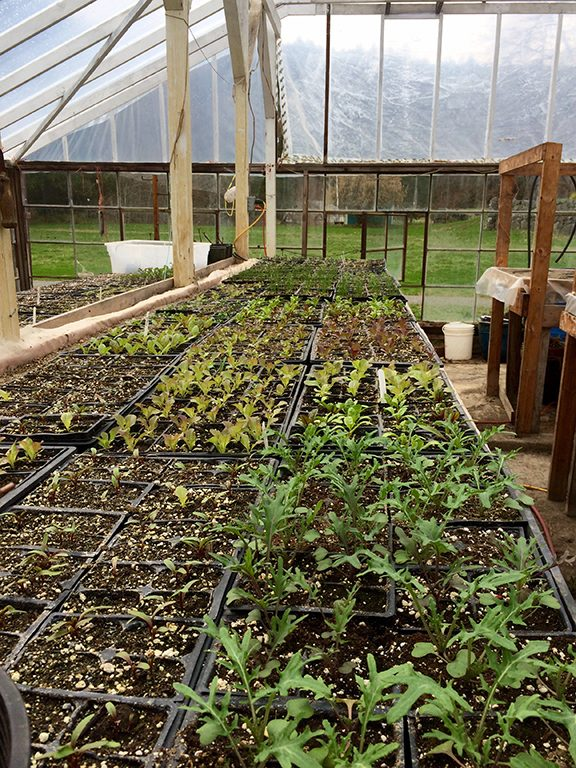

 A misty morning at the Centre
Hello everyone and happy spring. The snow finally all melted sometime in early March - or maybe it was mid- March - and spring began - nettles, blossoms, new growth. The days are long and much warmer than they were a month ago.
The Centre’s program season began in March with the first Yoga Getaway of the year, with Anila and Brant teaching the yoga classes. It was wonderful to welcome guests back to the Centre. [Yoga Getaways](https://saltspringcentre.com/retreats-programs/yogagetaways/) continue through the program season, the next one being April 28 - 30. Our resident community is still small, but little by little more people will be joining us.
 Jesse and Bri
Registration for our [200 hour Yoga Teacher Training](https://saltspringcentre.com/yoga-teacher-training/) is still open. This residential YTT program in the heart of Salt Spring Island is rooted in the teachings of Classical Ashtanga Yoga and Hatha Yoga.
I invite you to read more about this wonderful program [here](https://saltspringcentre.com/yoga-teacher-training/). There is also a Facebook page called [Yoga Teacher Training at the Salt Spring Centre](https://www.facebook.com/saltspringcentreYTT/).
The [Salt Spring Centre School](http://saltspringcentreschool.ca/) teachers and students have now returned after spring break. It’s so uplifting to hear the kids’ voices again! They will soon begin rehearsals for this year’s whole school play, held every year in May. Early registrations for next year’s school year indicate that the classes will be quite full next year.
**There’s lots of energy on the farm these days. Here is Milo’s update:**

Nettles are up! Spring has slowly found its way to the island and the seasonal race has begun here on the farm. We’ll have about twice as much land in cultivation this year and we’ll be embarking on a huge adventure with our food forest installation in the “upper field”.
The food forest has prompted a major need for planting stock and I have been propagating various berries, nut/fruit trees and support species like a mad man since the first rumour of Spring.

By mid April we’ll be enjoying the first of our Spring greens and roots so plan your visits accordingly ;)
Onward

## Articles for you to read…..

This month we share a story from someone who’s been connected to our community for years - in fact since his father brought him to retreats years ago. You may have heard him play tablas at a summer retreat. In this piece Ravi honours his dad: [Ravi Albright - dedicated to my father, Matt Albright](https://saltspringcentre.com/2017/03/our-centre-community-ravi-albright/). I remember Ravi telling me years ago that when he was a little boy, his dad used to read him bedtime stories from the Bhagavad Gita. I’m sure you’ll enjoy his story.
Sue Ann Hamsa Leavy brings us this month’s [Asana of the Month - Cat/Cow Pose](https://saltspringcentre.com/2017/03/asana-of-the-month-marjaryasanabitilasana-catcow-pose/), a wonderful stretch for the spine. We were fortunate to have Hamsa living at the Centre for a couple of years. She now lives in Asheville, North Carolina where her students are lucky to have her as a teacher.
In the ongoing evolution of the Salt Spring Centre of Yoga life continues to unfold. Evolution brings change, some of it exhilarating, some of it difficult; this is the nature of life in the world. There have been many conversations in the past number of months about what will happen next in this beautiful place of refuge and peace. Those of us who were around in the earlier years were blessed by Babaji’s presence and constant inspiration. Those who have joined us since then have different life experiences and bring new ideas. As the founding group ages, change is inevitable. Pratibha has contributed her thoughts in “[Unto the Seventh Generation](https://saltspringcentre.com/2017/03/unto-the-next-seven-generations/)”. We invite you to join this ongoing conversation.
A reminder from Babaji:
*Don’t think that you*
 *are carrying*
 *the whole world:*
 *make it easy,*
 *make it play,*
 *make it a prayer.*
Love,
Sharada
