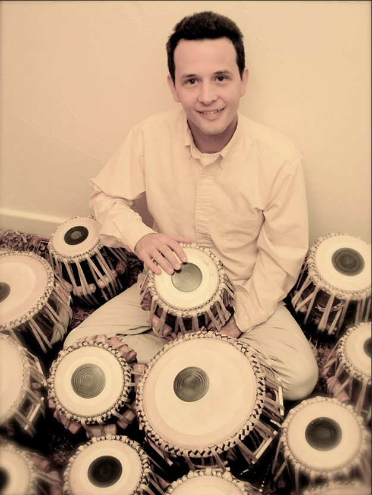
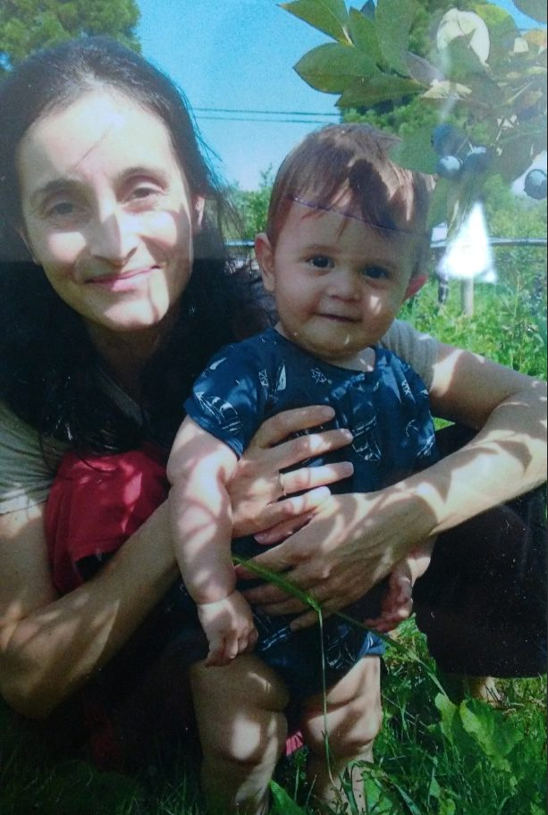
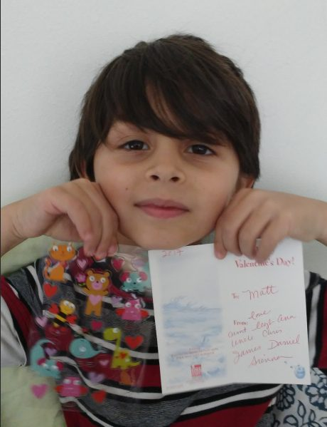
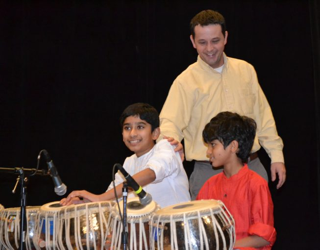
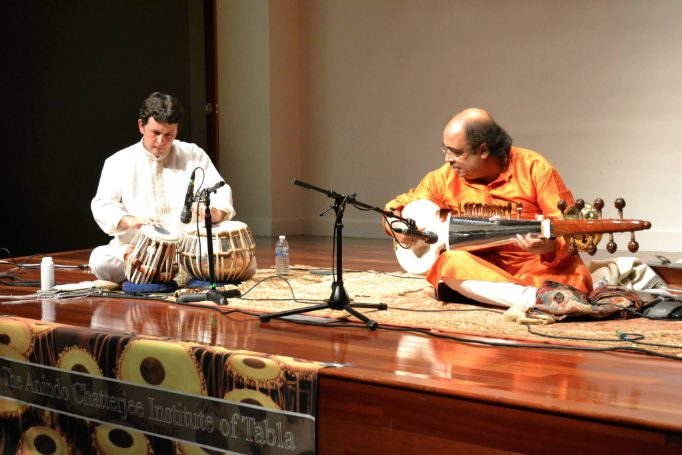
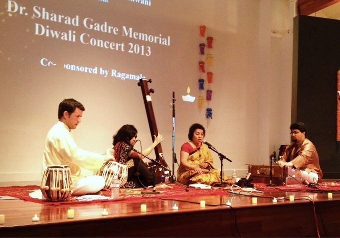
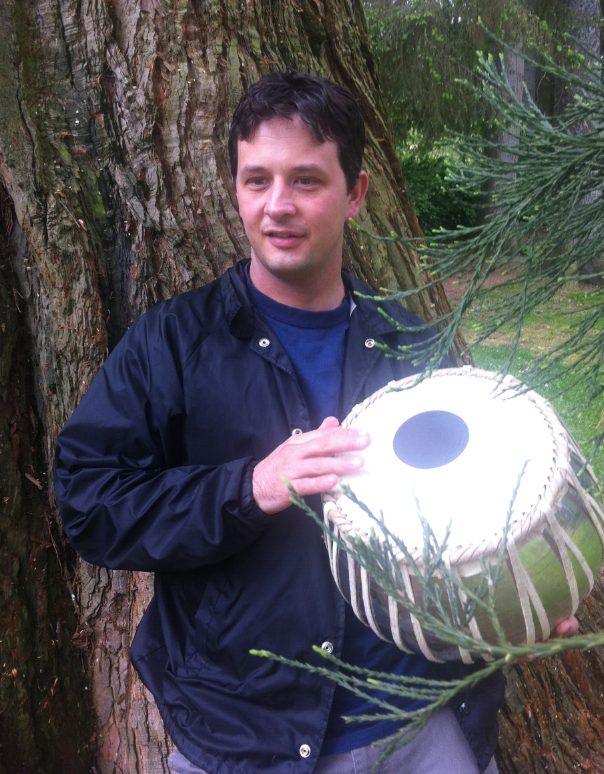

### Dedicated to my father, Matt Albright RIP

[caption id="attachment\_14724" align="aligncenter" width="626"] Ravi Albright, part of our Centre Community[/caption]
I was born at home in Seattle where my father was at the University of Washington getting a Masters in Middle Eastern Studies. I am the middle child of 5,: my brother Abe, sisters Margaret, Annie, and Beth. Our family moved to Sequim on the Olympic Penninsula when I was about 8 or so. My dad, Matt Albright, worked for the Olympic National Park, first volunteering and then working in revegetation where he grew native plants to replant in the park in areas where people had trampled the indigenous plants.
It was through my father than I met Babaji and first came to Salt Spring Centre in the 1990's. It was Babaji who suggested I start studying tabla after he saw me perform on guitar at the summer retreat.
When I was about 14, I was in a terrible car accident and had to have 9 surgeries. A speeding driver slid out of control in the snow and I was hit in the leg. They didn't know if I would ever walk again, but I did. During that time I was out of school for a year. Soon after, when I was about 15 I moved down to Mount Madonna Center and starting living and working there on my own.
I went to India for the first time of many, and got into tabla. I studied Babaji's teachings and started doing Sadhana. I worked on the rock crew, learning masonry, and was the resident tabla player for weekly satsang, kirtan, and retreats. Priya and I got married in 2005, and after my father passed away from cancer in 2007, we moved to Seattle. Priya also grew up in the Mount Madonna Community, and with our combined talents and skills we started a non-profit arts organization, ACIT Seattle, in 2009.
[caption id="attachment\_14718" align="aligncenter" width="613"] Priya and Lio[/caption]
[caption id="attachment\_14716" align="aligncenter" width="460"] Matt[/caption]
At that time I didn't know what career I wanted to follow, if I should continue with masonary or maybe become a postal worker. I realized that I wanted to put all my energy into tabla, which had always been there. Right after that we started our non-profit organization, [ACIT Seattle.org](http://www.acitseattle.org/), where I teach and perform in Washington. We've been doing this for about 7 years now.
[caption id="attachment\_14720" align="aligncenter" width="653"] Ravi with performers at ACIT Recital, 2016[/caption]
After my parents divorce when I was about 9, things at school got harder. I was not a well-behaved adolescent - I was suspended and kicked out of school more than once. In a way the car accident saved me because being out of school for so long, I started to study guitar which led to tabla. My dad and my mom, Ellen Adams, realized that public school was not meeting my needs, so the idea to move to MMC was a chance to change the direction if my life.
I have always had intense focus on whatever I am interested in, and absolute disinterest in being forced to learn things that were not relevant to me. This has been a mixed blessing, but gives me the drive to practice tabla at least 2-3 hours a day for the last 18 years or so.
[caption id="attachment\_14721" align="aligncenter" width="682"] Performing with Tejendra Majumdar[/caption]
[caption id="attachment\_14722" align="aligncenter" width="682"] Performing with Srivani, 2013[/caption]
My dad was the biggest inspiration for me in music and life. He was always interested in Eastern culture, philosophy, and music. He could read and write in Arabic and used to tutor in Seattle at a mosque. He played the violin as a teenager and played in a youth state orchestra. He gave up violin though because he didn't like the pressure of public performance. I think he would be happy to see me performing now with some of the greatest musicians of India.
As a kid I would wake up hearing recordings of Ali Alkbar Khan on sarod or Ravi Shankar on sitar or Ustad Bismalla Khan on shenai, that my dad would blare on the stereo. That is what started my love for Indian Classical music. Later Babaji jokingly named me Ravi Shankar.
My dad also could grow native plants that no one else could, including a type of northwestern red heather that only grows at very altitude. After he passed, they dedicated the Matt Albright Native Plant Center in Sequim, Washington, after him.
I have had many other mentors in the community, Sanatan and Anuradha took me under their wing like surrogate parents. Pratibha sponsored me in my first trip to India and always supported me. I learned rock work from Jai/Sunil and Babaji. I learned electrical work from my first good buddy at MMC, Umesh.
 
Now we have two boys, Matt age 7 (named after my dad) and Lio 17 months. We will support them no matter what they want to do, and give them lots of music exposure along the way. Seattle is a good place for our family and I'm glad we are close to the Salt Spring Centre so we can stay connected with the community where it all started for me.

---

**Ravi Albright** is a professional tabla player, Executive Director and head instructor of ACIT Seattle, [www.ACITSeattle.org](http://www.acitseattle.org/), and Adjunct Faculty at Lewis & Clark College in Portland. Ravi teaches in the greater Seattle area and performs throughout the West coast.
