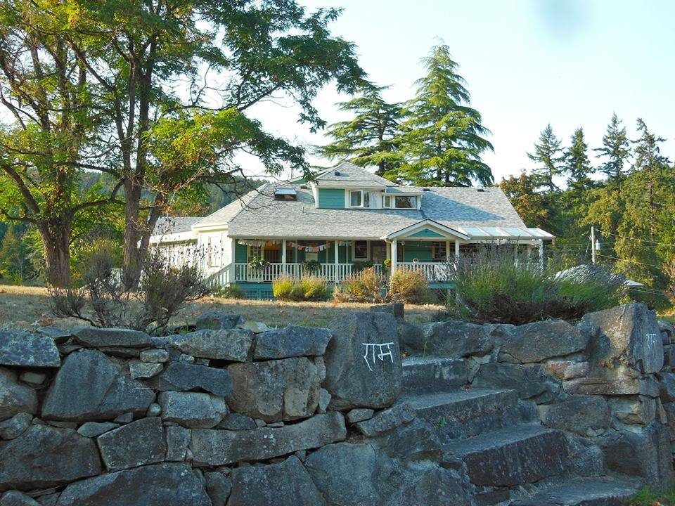

### As part of our ongoing conversation about the future direction of the Centre, here are some reflections from one of our far-flung members about managing transitions at the Pacific Cultural Center in Santa Cruz.

 The Salt Spring Centre of Yoga
Salt Spring Centre, like Mt. Madonna Center and Sri Ram Ashram, plays an essential role as a beacon of light in a darkening world. These centers help keep our spiritual faith and our hopes for the future alive as we traverse the struggles of daily life: social crises, financial issues, health concerns, career and relationship challenges. We desperately need these places of peace and pilgrimage to remind us of the immense potential of not only the human spirit, but of the spirit of nature and the mysterious force that unifies and supports our human journey. These centers are vital in offering the teachings and the space for humans to work on their self development.
An essential component of Babaji’s teachings is to "Live a Virtuous Life". To support the practice of this path requires the supportive community (satsang) to accomplish the work as well as to remind us of our intention. SSCY is a blessing as it contributes to the continuance and maintenance of such a sacred space where one is supported in living a virtuous life! With a supportive community dedicated to service as karma yoga, the Centre can continue as a place of summer pilgrimage where we gather to share the deep bonds that have grown up among the spiritual family at Salt Spring Centre. Many of us visit from 2 to 6 weeks, long enough to absorb, soak up, as well as contribute to the life at the Centre.

## Three Phases of the Natural World – Brahma, Vishnu, Shiva

Reflecting on the current incarnation of Salt Spring Centre of Yoga leads me to the realization that the many years that we spent with Babaji in building the Centre were the start-up phase. The natural world is said to consist of three phases – creation, maintenance, destruction. These are symbolized by the Gods Brahma, Vishnu, and Shiva in the Vedic tradition. During the years that Babaji performed his annual northern migration to visit Salt Spring Centre, we were in the creation phase - growing, building, molding something new.
Perhaps now we’ve transitioned into the maintenance phase, a time that requires a somewhat different set of skills. Now perhaps preservation becomes the priority – preserving and passing on the precious spiritual teachings, maintaining the physical facility in good repair, and adjusting policies and procedures to meet the needs of a new generation.

## The PCC Story

During the last seven years, we’ve been deliberately pursuing just such an adjustment at the [Pacific Cultural Center](http://www.pacificcultural.org/) in Santa Cruz.
PCC is the in-town home of the Hanuman Fellowship and Mount Madonna Center, offering yoga classes and a rental venue for spiritual events for Santa Cruz community. A staff of eight resident volunteers provide for the day-to-day running of the Center. The town center operates essentially independently, but at the same time under the attentive wing of the Hanuman Fellowship Board (based at Mount Madonna Center).
In 2010, it became clear that in order to ensure the sustainability of the PCC into the next generation (if not indeed unto seven generations), we would need to engage more of Babaji’s students in its operation. And so a few of us elders began a conversation about what could help facilitate this goal, and within a few months called for the creation of a Sustainability Council. A group of about a dozen people began meeting monthly to scope out what it would take to ensure that our grandchildren would have a place to practice yoga, to gather for spiritual instruction, and to express their own variety of spiritual satsang.
We have continued meeting monthly since then, the group shifting in membership as the months went by. One essential ingredient has been to involve the youngers in our conversation. Many were not interested, or were too busy with their own lives to contribute much beyond their good wishes. Gradually the group morphed into a Steering Committee, a group recognized by the Hanuman Fellowship Board, that serves basically as the management committee for the Center.
Two of the resident volunteers (who happen to be youngers) have been appointed to serve as “Coordinators”, one to oversee the yoga program and one to oversee the rental program. The resident volunteers meet weekly to coordinate the daily tasks of running/operating the Center; the Steering Committee oversees facility maintenance projects, landscaping, and human resource issues. In addition a PCC Administrative Board (appointed by the HFS Board) oversees the finances (such as approving large expenditures and reviewing policies, long-range trends and plans).
In working together, we’ve discovered that innovative developments should be guided and supported by olders and youngers working together. That way, continuity and innovation can interweave so that what is valuable from the past can be integrated into the current needs of those whose karma yoga efforts are actually turning the wheel of daily life.
**This three-tiered approach seems to be working for now:**
1) Resident Volunteers
2) Steering Committee
3) Administrative Board
Each level carries a certain area of responsibility. Yes, there is overlap, and sometimes urgent discussions as to which ball should be in whose court. But the dialogue continues with the intention that the Pacific Cultural Center will remain a vital, thriving, contributing part of the Santa Cruz Community for years to come. Jai Vishnu – for providing the vision of maintenance of what we’ve created together.

## Moving Forward Together

Looking to the future, these beacons of light require tending if they are to continue to offer their gifts to the children yet to come. The elders offer a wealth of experience, seeing the long view, inspiration, and the understanding that the fruit will be needed in the future. The youngers offer energy, exuberance, as well as the strength and endurance to make it happen. It truly does take a village to keep our Centre alive and vital, and that will require continuous ‘honest talks’ to bring everyone’s voice into the conversation.

---

 Pratibha Queen
**Pratibha Queen** is an Ashtanga Yoga instructor and Ayurvedic practitioner who lives in Santa Cruz. She is a member of DSS who attends Salt Spring Centre of Yoga retreats on a regular basis. **All quotes above are from the writings of Baba Hari Dass.**
