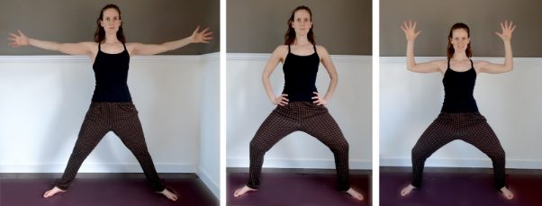
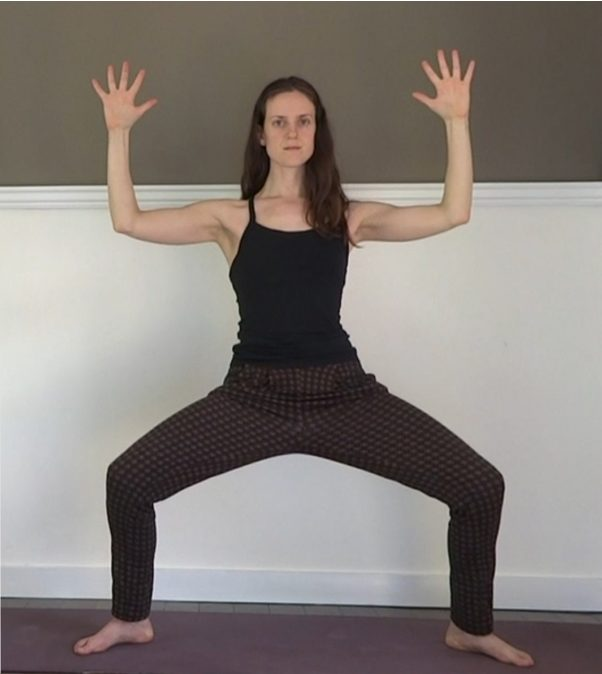
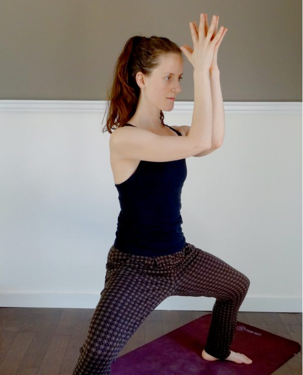
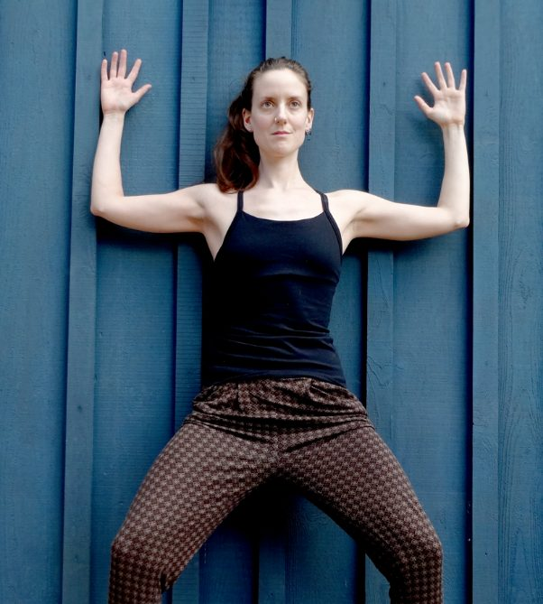

# Deviasana (goddess pose) aka Utkata Konasana (fierce angle pose)

## Finding softness in structure and symmetry

*Goddess Pose* is a lateral standing pose with effects explicitly beneficial for pregnant women, but most definitely applicable to all. This beautiful tall and wide squat improves circulation, makes space in the pelvis, and offers a really balanced strengthening toning of the legs, torso and arms.
It is not difficult to understand why *Goddess* also goes by the name *Fierce Angle*. At first encounter this form might appear to be all about right-angles and quadricep strength - fierce indeed. But I love to practice and teach Utkata Konasana as an opportunity to explore the act of surrender. In any standing form, when the legs are truly grounded, the upper body can be free, tall, a vessel for breath and life force. I find the symmetry of this particular standing pose offers a relative simplicity, a kind of framework which provides a clear visual idea of the skeletal and energetic alignment involved.
I’ll explain 2 options for working with the pose. Both can give you a lovely balanced opening of the hip and pelvic girdles. Start out with the flow, developing fluidity, and when you feel comfortable with the alignment of the pose, settle into a longer hold.
~ Please avoid this pose if you have recent or chronic injury to the hips, knees or ankles. As always, work with a yoga instructor or physiotherapist if you’re not sure.

### Starting Out

I recommend beginning your exploration of Utkata Konasana with a simple flow.

- Begin in a wide stance, with your toes pointed out. The angle of your feet depends on the structure of your pelvis. To ensure that your knees do not twist, bend them slightly and check that they follow the same angle as your feet. If they don’t, then adjust your feet.
- Once you’ve placed your feet with intent, take a moment - a breath or three - to feel the ground.
- Scan your spine with your mind’s eye, noticing its natural curvature.
- With your pelvis in a neutral position, press the soles of your feet into the ground and allow a gentle energetic lift through the crown of your head.
- Relax your shoulders.
- Inhale to stretch through fingers and toes into Star Pose.
- Your arms can reach out as you take-in a radiant breath. Visualise the energy originating at your centre and moving out through all 5 limbs (the 5th is your spine).
- On exhale, visualise the energy drawing back into your centre, as you bend your knees into *Goddess*.
- Work with the legs for a few breaths, inhaling to radiate out to straight legs, and exhaling to release into bent knees.
- When you feel ready, include the movement of the arms (and fingers): radiating out on inhale, drawing into cactus-arms on exhale.

As you practice this flow, you will increase your ability to relax the spine, so the only change in the shape of the body is the bending of the knees and elbows. Work with that intention, allowing the knees to bend as little or as much as your pelvis allows.

### Settling In

When you’re ready for a more challenging version of Utkata Konasana, explore a long hold (this can be anything from 3 breaths to 1 hour).

- Set yourself up intentionally, noticing the alignment of your knees, and the ease-fullness of your spine. Although your limbs won’t be moving as they were in the *Star-Goddess* flow, energetically you will be moving in a very similar way.
- As you inhale, you might notice a radiating of energy from your centre, and as you exhale you might notice a gathering of energy into your centre. The energetic movement is horizontal through the elbows and knees and simultaneously vertical though your feet, hands and spine.
- Press your feet down and visualise the weight of your body spreading into the ground in all directions. Allow your spine to lift through the crown of your head, as your tailbone releases straight down. After some breaths the large leg muscles will start to ease and the smaller stabilisers will wake up. Your legs will become enlivened, and relaxed.
- You can achieve a similar easeful-ness in your arms by visualising your elbows drawing away from each other, and your fingers gently reaching up.

Feel those horizontal and vertical lines of energy across the front and back of the body. This is where you will find a balanced energetic toning and the strong symmetrical structure of the pose will make way for a soft surrender.

### Sequencing

To warm up for Utkata Konasana, choose some circular hip movements, and some gentle neck and shoulder openers.
After practicing Utkata Konasana, use an inversion to reverse the flow of blood and prana in the legs. (Legs up the wall or Viparitakarani Mudra would be ideal.)
Utkata Konasana works beautifully in a standing flow, especially paired with Star-pose. (Chandra Namaskara is a great place to start).
Feel free to get creative with your arm positions!

And remember:

- Neutral pelvis (not tucked, not tilted).
- Tall spine (shoulders above hips, ears above shoulders).
- No knee twisting (knees follow the angle of the feet).
- Inhale out (radiate), exhale in (gather).
- Firm roots (feet to pelvis).
- Steady breath

### Alignment tips

Try using a wall as an alignment guide: Rest your sacrum and back of your head into the wall. Or, sit on a swiss exercise ball. In both cases, the legs can take the wide squat form, without having to hold your body weight. You can then focus some attention on your spinal alignment, and experience what it’s like to feel simultaneously supported and relaxed in the legs and pelvis.

## About your Instructor

### Marianne Butler

Motivated by a love of movement and a craving for peace, Marianne has been practicing Yoga regularly since 2009. Drawing on her experience of a rich variety of styles and teachers, she encourages her students to develop internal awareness as they move and breathe through carefully designed sequences. She lived at the Salt Spring Centre from June 2014 until December 2015, studying and teaching asana and pranayama, as well as exploring the practice of Karma Yoga through serving in Programs Management.
Marianne completed her 200hr Hatha Yoga Teacher Training and an advanced workshop in Sequencing with Joy Morrell, a Nelson-based teacher with a passion for anatomy and a wide open heart. In 2016, she completed 300 hours of yoga training with Cathy Valentine on Salt Spring Island and is currently undertaking an advanced Yoga Therapy training at Ajna Yoga in Victoria.
