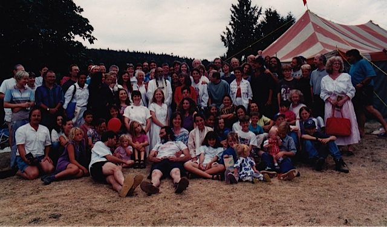

It helps to come back to the ‘why’, the reason we started in the first place. The ‘what’ could be anything - whatever it is you do and think about - your career, your current job, your relationship, your friendships, an organization you’re involved in. It may have unfolded as you envisioned, or it may have turned out differently. Why did you choose it in the first place? What keeps you doing it?
The Centre started with Babaji’s directive to ‘buy land’. Those of us who gathered around Babaji trusted his vision. Each of us had our individual dreams and visions of what the Centre would look like; mine was of community; others saw it as a yoga school while yet others saw it as a big project that needed a lot of work. It became all those things.
Underneath all our ideas of what the Centre should look like was the aim of building a place where people could come and find peace. The intention was to be keepers of the light.
What keeps it going? The light is in the teachings and the practices given to us.
*Spiritual aim is like a compass that points toward God. No matter how much the compass is turned around, its direction never changes.* 
*The aim of life is to attain peace. A guru or spiritual teacher teaches how to attain that peace. The guru teaches how to live in the world with truthfulness, nonviolence, and with selfless service to others. The guru either presents these teachings in words or through the way they live their life.*
*In the beginning an aspirant seeks some support from outside. That support comes from a teacher. When the aspirant starts meditating honestly, then their own Self is revealed in the form of a guru or teacher. The aspirant starts listening to the inner voice and finds the path, which is shown by the voice of the heart.*
The teachings include not only asana, pranayama and meditation, but also developing positive qualities, building right conduct (living by a moral code like yama and niyama), right livelihood (honest work), closeness with family and friends, helping others and contributing to society.
To keep the light burning in our own lives requires the willingness to live by our values and convictions, even when times are difficult. When the light is flickering we are called upon to stay true to what is important.
*God is Love, Light and Peace. Those who love God wholeheartedly receive the gift of love from God.*
There are many methods, but the key thing is to do them. For daily living, the most practical is karma yoga, selfless service. The practice of karma yoga provides purpose and meaning, and it helps others, thereby supporting the world.
*Although karma yoga is usually understood to be merely a path of action, it is truly a path of inner development. There is no difference in actions that are performed with or without Karma Yoga.*
The difference lies in the attitude with which the actions are done. Karma yoga is a practice of doing what needs to be done with a spirit of contribution to others without expecting anything in return. The aim is to become aware of and to reduce our attachment to the fruit of the action, including the subtle rewards of recognition and praise.
We start where we are, keeping in mind the goal of finding peace. Many years ago when I was waffling about making a decision, Babaji told me, “Stick to your convictions.” It took quite a while to figure out what my convictions were, or indeed whether I had a any; daily practice continues to keep me on track.
Everyone wants to be happy and to live in peace. Sometimes our actions are aligned with that intent, and sometimes we forget and lose our way for a while.
*This is life. It includes pleasure, pain, good, bad, happiness, depression, etc. There can’t be day without night. Don’t expect that you or anyone will always be happy and that nothing will go wrong. Stand in the world bravely and face good and bad equally. Life is for that.*
In dark times, it is important to remember that there are sanctuaries that hold the light of spiritual teachings and practices that can rekindle faith and hope. Don’t give up; let’s keep the light burning.
Contributed by Sharada
All text in italics is from writings by Baba Hari Dass

---

 **Sharada Filkow**, a student of classical ashtanga yoga since the early 70s, is one of the founding members of the Salt Spring Centre of Yoga, where she has lived for many years, serving as a karma yogi, teacher and mentor.
