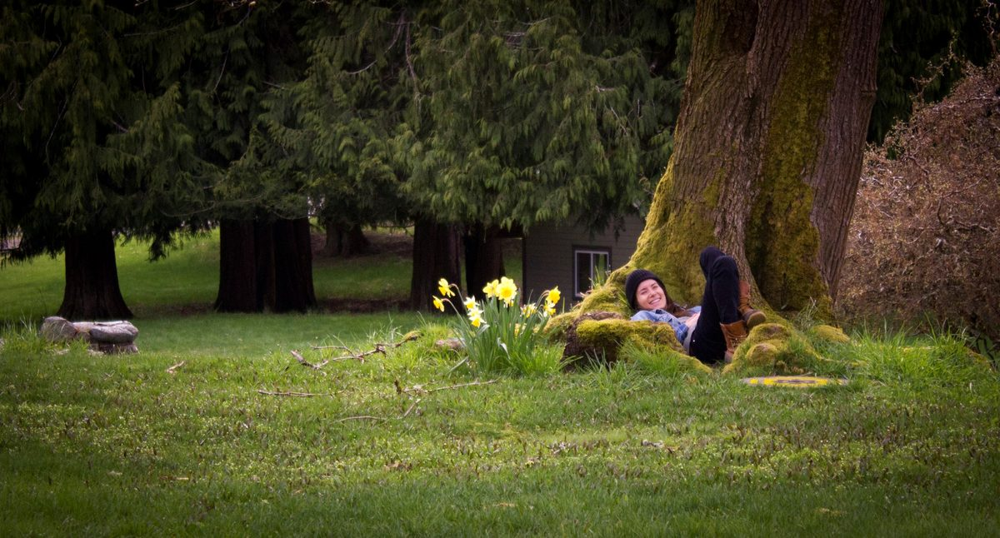
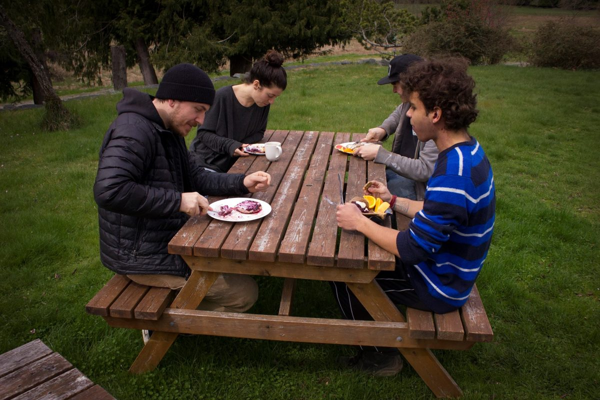
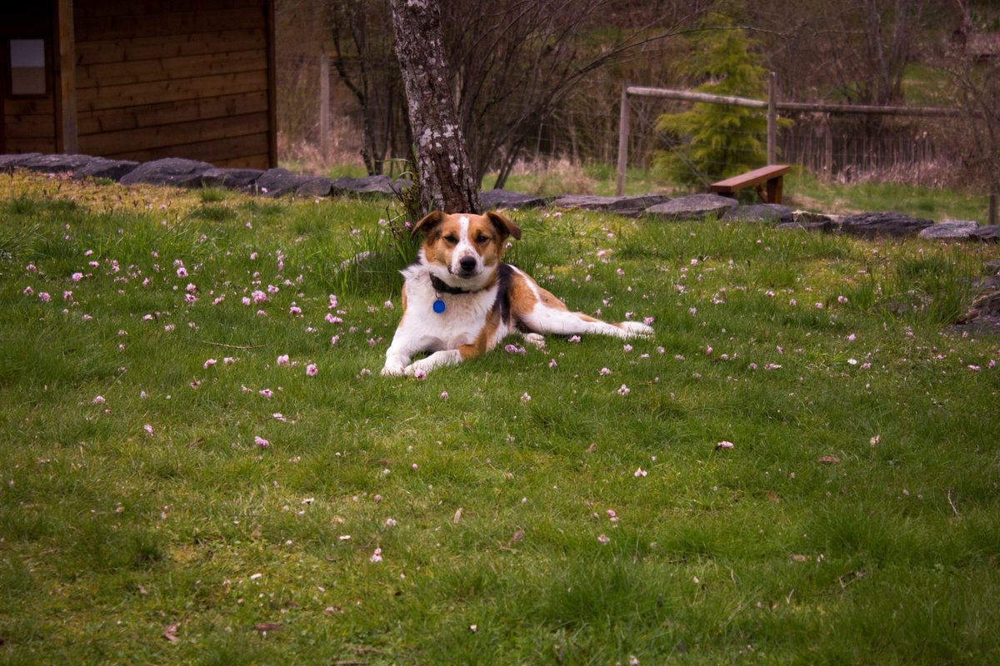
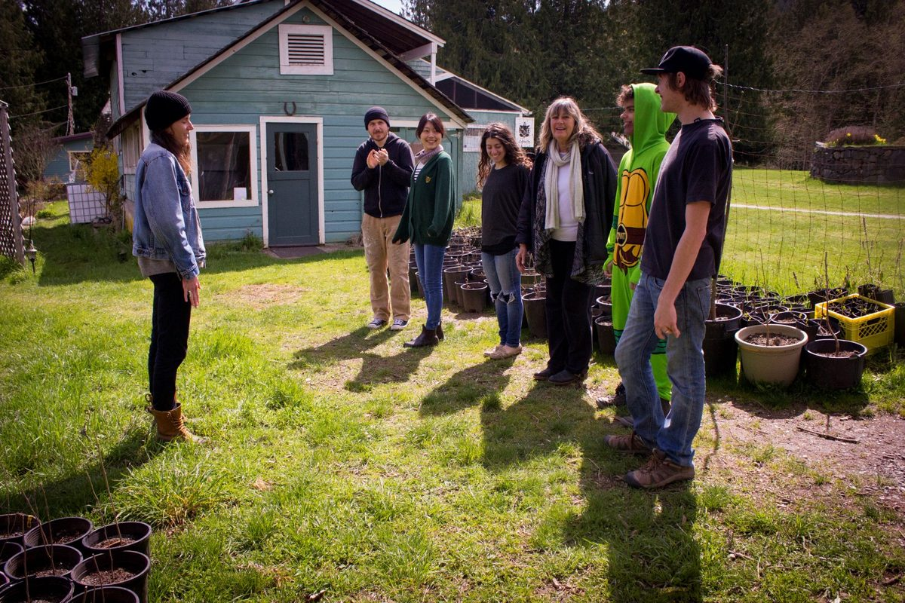
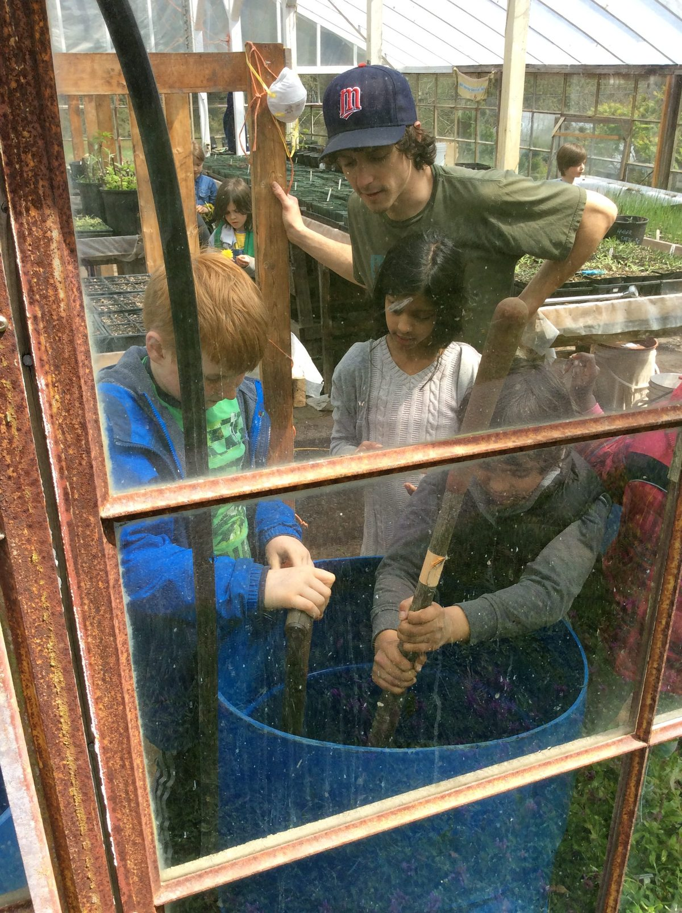
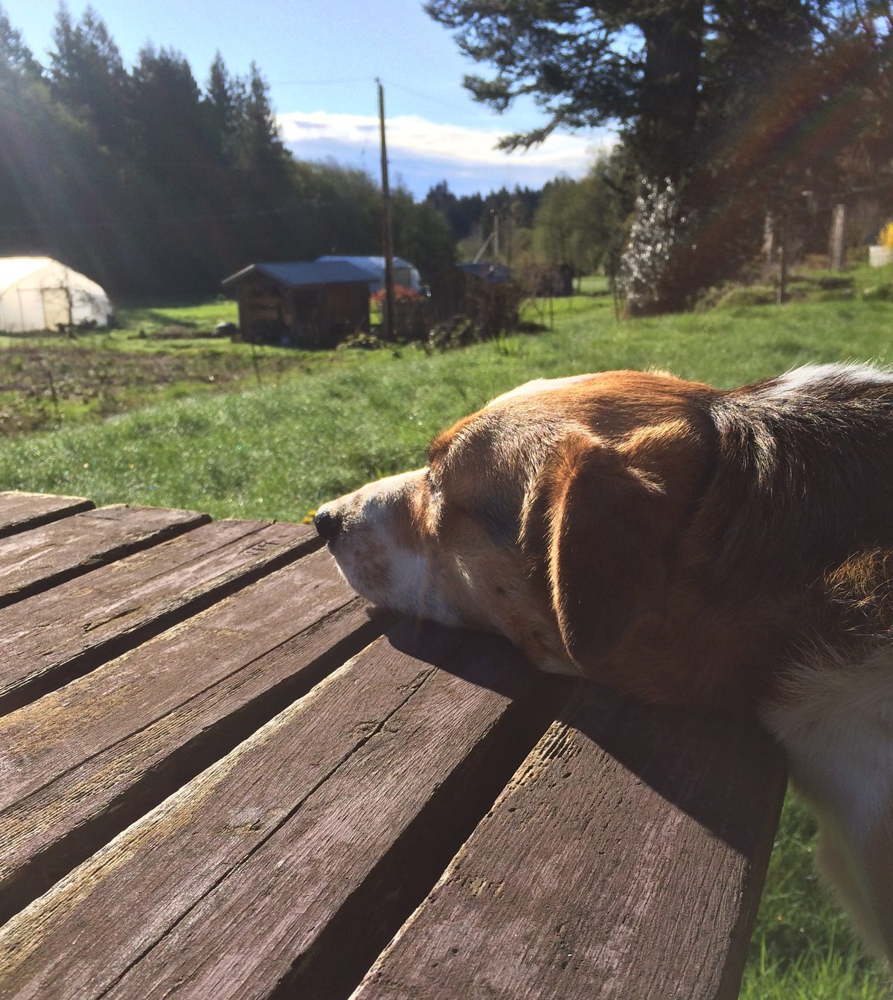
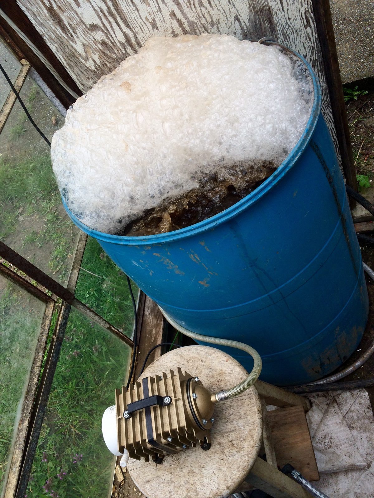

Hello everyone,
Happy May! The air is perfumed with the aroma of blossoms and life is blooming. The campground is open and there are signs that warmer weather - and sunshine - are on the way. Community life is growing. Here are some photos of Easter brunch and the appearance of the Easter Turtle (because we don’t have a bunny costume!).
[caption id="attachment\_14860" align="aligncenter" width="620"] Jules under the maple tree.[/caption]
[caption id="attachment\_14859" align="aligncenter" width="620"] Enjoying Easter brunch (Ben, Bri, Tyler, Carnel)[/caption]
[caption id="attachment\_14865" align="aligncenter" width="620"] Avo doing his job - keeping watch while resting among the flowers[/caption]
[caption id="attachment\_14864" align="aligncenter" width="620"] Jules, Ben, Kaori, Bri, Lakshmi, Carnel (the Easter Turtle), Tyler[/caption]
The farm is definitely a happening place. Here is Milo’s latest update about what’s happening on the land.

## Milo's Farm Update

[caption id="attachment\_14861" align="aligncenter" width="620"] School kids in the greenhouse with Milo - mixing compost tea[/caption]
Ok! Our hoop houses are nearly full and we're days away from first harvests. Greens to start, roots and peas soon to follow. Such a fantastic time of the year, hey? Grateful for the wild greens of spring and our stubborn wintered leeks for holding us through this slow, steady Spring.
[caption id="attachment\_14863" align="aligncenter" width="620"] Avo on watch.[/caption]
A large fence installation is on the horizon including significant repairs to our current garden fence, which didn't fare our winter well. In the meantime Avo dog has been keeping a vigilant watch on our borders, intercepting and deterring all plant-nibbling beasts.
[caption id="attachment\_14862" align="aligncenter" width="620"] Compost tea bubbling away.[/caption]
Our Food Forest destined cuttings are rooting well. It looks like we'll be building up quite the nursery indeed! To keep all these potted plants entertained and satiated I have been brewing up weekly batches of my wicked compost tea. To brew, generous helpings of soil are collected from our worm bins, native forests and of course... compost piles. After a few more magic ingredients the lot of it is aerated into action for 36hrs. Billions of beneficial bacteria and fungi are introduced upon application. Yum.
Come on by for a sunny rainy windy spring day walkabout!

## Karma Yogis Needed!

More karma yogis have joined our residential community in the past few weeks, but we have room for more! We are looking for people to step into a number of different positions in all departments: office, kitchen (kitchen coordinator, lead cooks and others on the kitchen team), housekeeping, farm and maintenance. To find out more, check [Job and Volunteer Opportunities](https://saltspringcentre.com/job-volunteer-opportunities/) on the Centre’ website. If you’re interested, have the necessary skills and a love for the practice of karma yoga, we invite you to consider applying for a position at this beautiful Centre. We also beginning to interview applicants for the the position of Centre Manager, and look forward to introducing you to our new manager soon. Lots of excitement in the air!

## Centre School News

Life is busy at the [Centre School](http://saltspringcentreschool.ca/) as well. May Day is celebrated each year with flower bedecked children dancing around the maypole. The youngest children focus on staying in a circle as they hold onto their ribbons and walk around the pole while the oldest kids skillfully weave the pole with the ribbons. Later this month all the students in the school will take part in this year’s annual school play, Jack Sprat’s Detective Agency.

## Upcoming AGM

On the weekend of May 5-7 Dharma Sara Satsang Society will hold its annual AGM. There is no charge for DS members to attend. If you haven’t yet become a member but would like to, you can [join here](https://saltspringcentre.com/about/dharma-sara-satsang/). The AGM portion is scheduled for Saturday afternoon, and will include reports from all departments and the election of officers to the DS Board. The rest of the weekend will be filled with yoga classes, a work party (and it really is a party when everyone works together), delicious meals and a sauna.

## Join us this Year

Coming up this summer are both YTT and ACYR. [Yoga Teacher Training](https://saltspringcentre.com/yoga-teacher-training/) is an awesome opportunity to study and practice all aspects of yoga in depth with a group of experienced yoga teachers who live what they teach. If this is something you’ve been thinking of doing, now is a great time.
The 43rd consecutive [Annual Community Yoga Retreat](https://saltspringcentre.com/retreats-programs/annual-retreat/) (ACYR) takes place this year from August 3-7. There will be more information about this year’s ACYR on our website soon - keep checking!. Meanwhile, I can tell you that there will be many, many classes, a great children’s program, Hanuman Olympics, Latte Da, and entertainment (to be revealed). It is a wonderful opportunity to gather with others in our extended satsang family.

## This Month's Newsletter

Here are a few articles for you to enjoy.
May’s Asana of the Month is [Deviasana (goddess pose) aka Utkata Konasana (fierce angle pose)](https://saltspringcentre.com/2017/04/asana-of-the-month-goddess-fierce-angle-poses/), brought to us by the beautiful Marianne. This is a powerful pose, particularly beneficial for pregnant women, but it is most definitely applicable to all.
Pratibha, who has shared many Ayurveda teachings with us in the past, tells us a story this month- a true story of her own experience, called “[Remember Your Aim](https://saltspringcentre.com/2017/04/1981-remember-your-aim/)”. While carrying on with her duties, she received the gift of this teaching from Ma Renu, a gentle, wise woman who had helped Babaji come to North America many years ago. Pratibha is an entertaining story teller.
“[Keep the Light Burning](https://saltspringcentre.com/2017/04/keep-the-light-burning/)” is a reminder to us all about the need for sanctuary and peace amidst the turmoil of life in the world, on both a personal scale and global scale. When times are difficult, it helps to know that there are places dedicated to keeping the light burning. It’s our task to keep the light burning in our own lives. This piece is also about keeping our aim, remembering why we started out on our journey and what keeps us going.
On a lighter note, here are some more recipes from the Salt Spring Centre of Yoga kitchen: “[Dressing for Dinner](https://saltspringcentre.com/2017/04/dressing-for-dinner/)”. Bon Appetit!
With love,
Sharada
