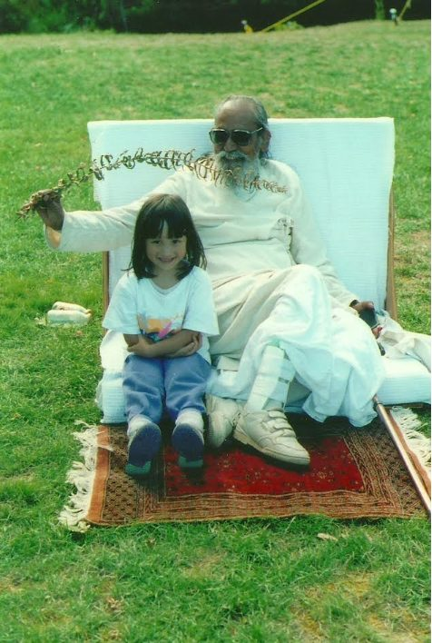
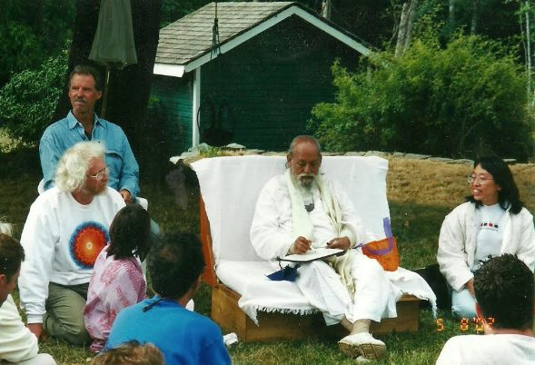
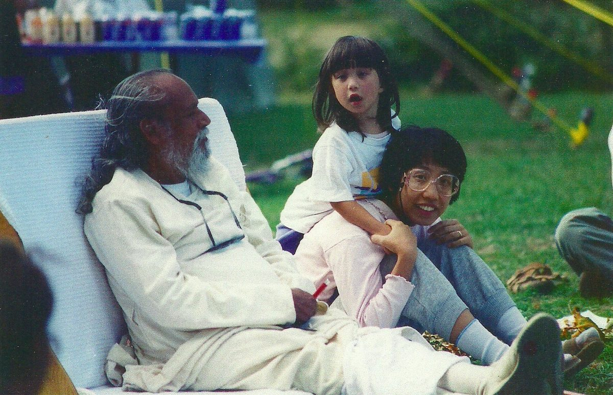

## Growing up with Babaji by Amita Kuttner

 Amita on the mound with Babaji
I was born in North Vancouver in December 1990 to Chandra Prabha and Satish. My parents had both already been students of Babaji for quite some time, and in fact called him from the hospital to get my name. I first visited Salt Spring Centre of Yoga (SSCY) when I was eight months old, and ate my first Babaji candy! I returned for the Annual Community Yoga Retreat every summer, the occasional Easter egg hunt, and for many of the Yoga Teacher Training (YTT) weeks where my mother taught prāṇāyāma, meditation, and philosophy. Coming to SSCY has always been like coming home; a warm welcome and land that makes me feel deeply at peace and free.
 Satish, Amita, and Chandra Prabha with Babaji
When I was little, I would sometimes attend classes on the yoga sūtras of Patañjal when they were held at our house. My mother and I even developed a sūtra board game in the shape of a big spiraling circle. You had to progress from the outside ring of bhoga, and traverse many obstacles and worldly temptations to finally reach the apavarga pinnacle in the centre. (Much regular sadhana involved.)
 Amita and Chandra Prabha with Babaji
When I was 13, I got the chance to move to Mount Madonna Center (MMC) in California for school, living in a boarding house with two girls from Sri Ram Ashram in India. It was wonderful, as I got to see Babaji about four times a week. He came to the Center three days per week, and we would visit him in his home on Sundays for dinner.
Four short months after I moved to California, my childhood home in North Vancouver was destroyed by a mudslide. I had just been home for the holidays three weeks before it happened. The mudslide took both the house and my mother’s life, leaving my father in the hospital for six months and with permanent brain damage and numerous physical injuries.
This was incredibly hard to suffer, and Babaji became a parent to me. He always understood and trusted me in ways that hardly anyone else ever has. I am so grateful for having been steeped in yoga my entire life, as it has given me the strength to continue and the presence of mind to have perspective. Things have not always been easy since then. Meditation and mindfulness are what guide me in handling the trauma that I still carry from the mudslide and related issues.
 Amita as Princess Sita in MMC's Ramayana
Babaji and his teachings have meant a great deal to me so far in my life, and not just in dealing with massive obstacles. I cherish having learned nonviolence and compassion from my first days alive, and having been raised in a household that valued kindness and honesty. Over time, I have let my heart grow, and I think that the foundations I received at SSCY and MMC from Babaji have allowed me to develop a healthy balance of compassion and dispassion. We must feel deeply to care for the world and strive to improve it, but in so doing we must not sacrifice our own peace, lest we lose our abilities to help.
 Amita with her husband Ramesh
 Ramesh and Amita with Chandra Prabha's parents
Amita is currently pursuing a Ph.D. in physics at the University of California, Santa Cruz. She loves to come to Salt Spring whenever she gets a chance.
