# Love lives at Sri Ram Ashram

## by Mya Mitchell

[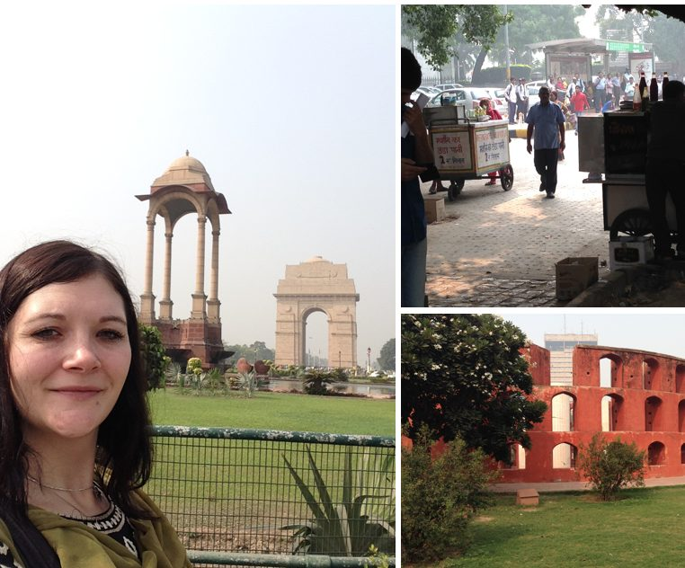](images/a54c2c34_Mya-1.jpg)Have you ever thought about visiting India and Sri Ram Ashram?
I had thought about but I didn't realize that it could actually come to fruition until I came across an invite from the Mount Madonna Center in 2015. The dream not only became a reality, it became a life enriching experience on so many levels that is almost too big for words!
The first time I heard about Sri Ram Ashram was while attending Yoga Teacher Training at the Salt Spring Centre of Yoga. We were watching a video documentary called Jewel in the Jungle about the ashram's beginnings and vision. I remember feeling fascinated and intrigued and as though we had just been let in on a wonderful discovery. Is was through SSYC and the teachings of Babaji that our satsang family had suddenly expanded and we now had this far away place where we could go where would be also be welcomed. A few years later, I found out first hand that this couldn't be more true.
After talking with Niraja, one of the organizers, I felt welcomed with open arms into the MMC group. This was a very big undertaking for me as I had never really travelled before; in fact I obtained my first passport for this trip! Rashmi, the Ashram's head mother, is very versed in organizing groups such as ours and instilled confidence that this trip was "totally do-able" for me. I am forever grateful to all of the people who made this trip happen and who supported and encouraged us along the way.
I arrived in Delhi a few days before our group. I had a few adventures on my own,: wandering around Connaught Place to do some sightseeing and shopping, walking around Jantar Mantar, and taking a rickshaw to India Gate and the parliament buildings. I felt comfortable with my driver so I asked him to drive me around on a sightseeing/picture-taking mission. Rickshaws are now my favourite mode of transportation!
[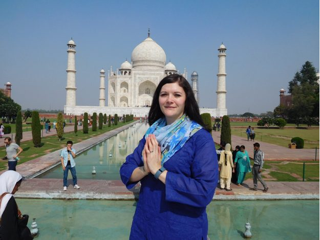](images/a54c2c34_Mya4.jpg)[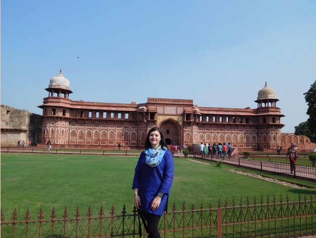](images/a54c2c34_Mya3.jpg)
I also took an incredible trip down to Agra and saw the Taj Mahal and Red Fort. Be assured that it is truly one of the wonders of the world and should be experienced first hand.
[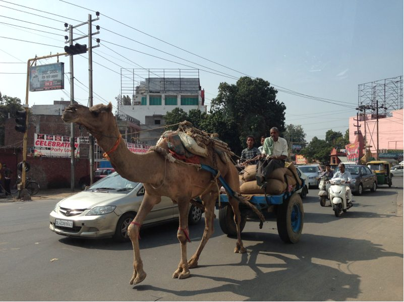](images/a54c2c34_Mya2.jpg)
After a few days on my own, I was excited to meet up with my new travelling companions. Many of you have probably had the experience of meeting up with like minded people; it felt like we were instantly connected and we soon felt like new-found family.
We had some great adventures together in Delhi. We were toured by Rashmi to some of the most amazing temples, and experienced Old Delhi in a way that none of us probably would have attempted on our own. We were well looked after the whole time, so we were able to take in the sights (and other sensory experiences) without worrying about ending up in the wrong place.
[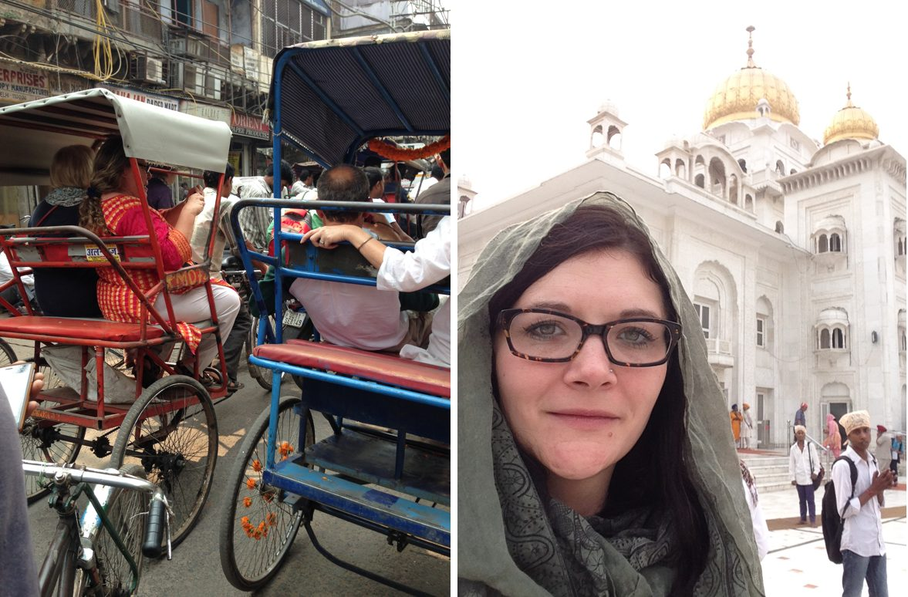](images/a54c2c34_Mya5.jpg)
The next day we were up before the crack of dawn to catch the train to Haridwar. The Delhi train station is something that needs to be experienced to be fully comprehended. It is said to be the biggest station in the country and handles approximately 500,000 people on 400 trains per day! It is intense, fascinating and exciting all at the same time. Again, we had the utmost confidence in Rashmi, who I am sure, has done this too many time to count, and she laughingly assured us that she "hadn't lost anyone yet"!
What a spectacular way to see the countryside! We saw the landscape from an insider’s perspective as we rode through what seemed like the back yards of little villages, as well as lush agricultural areas with crops and vegetation that we didn't even have names for. When we finished our ride in Haridwar, some of "our boys" met us and helped us and our bags off the train and onto the school bus. We were almost there!
As we drove down the driveway, we were greeted by the sweetest welcoming committee! Some of the little kids who were not in school crowded around the buses to welcome us home. Their faces were beaming with happiness and curiosity to see these dusty travellers and welcome them to join them for the holidays.
[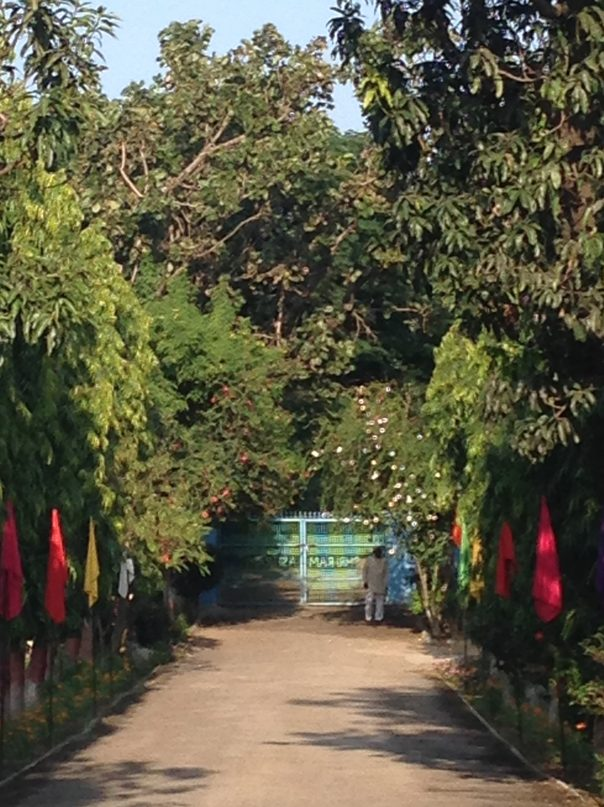](images/a54c2c34_Mya6.jpg)
After settling in, we had a chance to get our bearings and venture out to tour the incredible property, including the school, clinic, newly planted crops, the cow barn and the playground. We had an immediate following and were easily coaxed by some of the little kids to play on the swings and be taken by hand to see the new puppies!
[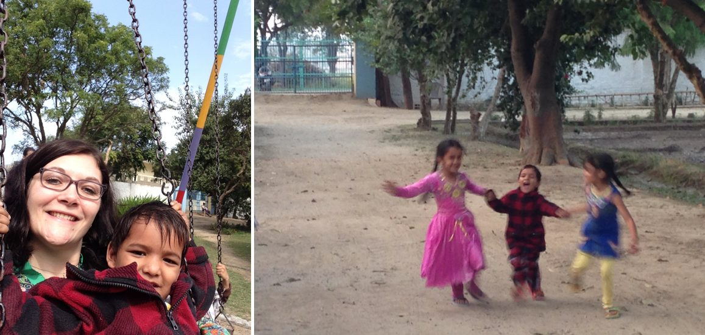](images/a54c2c34_Mya7.jpg)
We spent our days in delighting in getting to know the kids and sharing in their preparations and traditions leading up to Diwali, as well as our daily sadhana and various wonderful excursions to near by villages and cities.
I often felt like I was in a dream state, as there was just so much to take in and all of it was so joyful and happy. Every morning during the quietest moments of our sadhana, I remember feeling utter peace and joy as we heard the sound of early morning birds chirping and the uplifting sounds of kids laughing in the courtyard below. I will always remember the smell of incense wafting out through the building after the morning arati, one of the many memorable smells of this home.
We had many excursions out to the surrounding areas, where we experienced first hand the ways of life of the villagers. We also toured many colourful temples and sacred places. We were in awe at being present in these places, and in wonder at the extraordinarily intricate detail of the architecture. So much to take in on every level and truly amazing!
[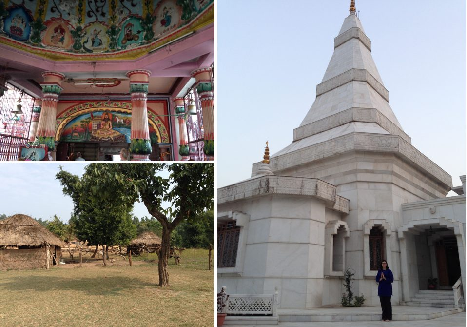](images/a54c2c34_Mya8.jpg)
[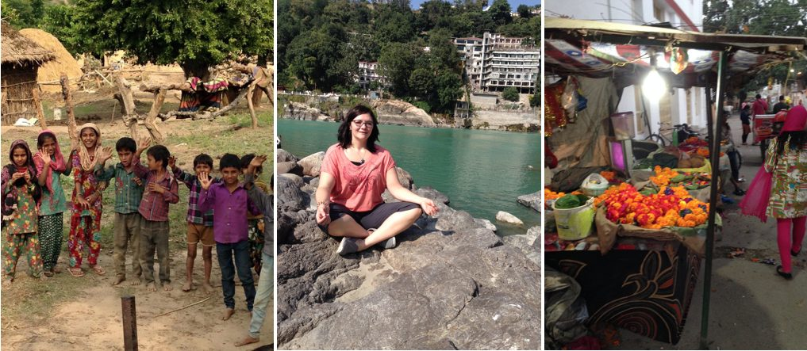](images/a54c2c34_Mya9.jpg)
We felt honoured to have many cherished experiences playing with the little kids and talking and sharing time with the older ones. One of the qualities of the kids that I noticed was that they always asked how you were doing and if you enjoyed the day's excursion or events. They genuinely cared and wanted to know; they were very good conversationalists and were very interested in talking as well as listening.
While talking with the kids and staff, we got a sense of the scope of opportunities that these kids have access to. The kids all attend school up to the 12th grade at the school that is part of the ashram property. The school serves the SRA students as well as others from the neighbouring village and students from Haridwar. Many of the Sri Ram students go on to study business, medical or dental careers, to name just a few.
There are many other wonderful opportunities for the kids, such as sports; the Ashram hockey team is well known throughout the country and has won many highly coveted trophies. Every morning there is a crossfit workout where the kids participate in groups according to age, the older kids lead the workouts; they enjoy keeping active and healthy. There always seems to be something going on, whether it is a field trip or sports trip or a holiday celebration - and sometimes all of these things in one day!
As we stayed at Sri Ram, the family was preparing for Diwali celebrations and we were heartily welcomed to join in. We learned about the traditions; each day celebrating a different holiday building up to Diwali. There were older kids coming home from their jobs or college and we also felt the excitement and joy in seeing them home.
[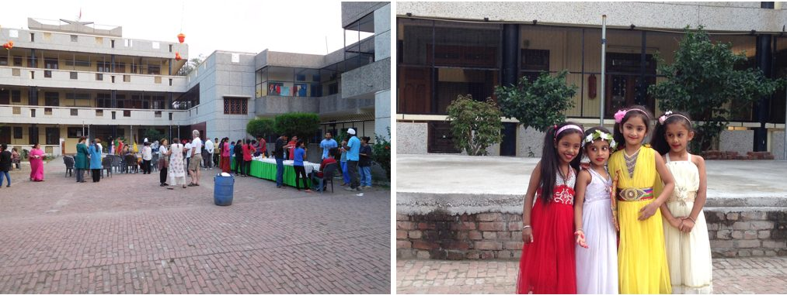](images/a54c2c34_Mya10.jpg)
We had the pleasure of experiencing a tea party that was put on by one of the Sri Ram Trustees. This was a grand affair that took place in the courtyard and included some delicious foods that were all new to me at the time, such as aloo tiki, a stir fry dish, as well as ice cream treats afterward. The kids surprised us with some dances that they had practiced and prepared specially for our entertainment at the party. They were all dressed up in beautiful colours and were so well practiced, it was so touching that they had done this just for us! The music was enticing and they looked like they were having so much fun on stage that some of us got up and joined them for an all around dance party!
Some of the other traditional preparations for Diwali included making ladoo (sweet offerings) for the special family arati, as well as some creative fun building monuments out of bricks and earth. It was really great to work with the kids on these creations.
[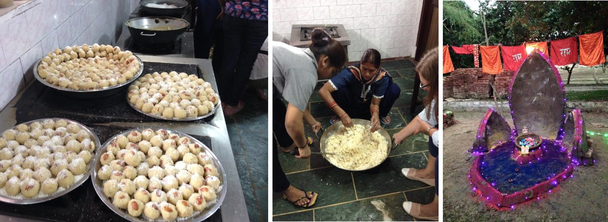](images/a54c2c34_Mya11.jpg)
We also got to join in on the annual shopping trip into Haridwar with all of the kids. This was an extraordinary event that started with a beautiful tea party. All the kids were given some spending money, and they had all carefully planned how they would spend it. We went in groups with the kids and helped as they made their purchases. It was really fascinating to see what they were interested in: anything from sweet treats, new dolls, scarves, clothing, to getting a nose piercing, and when that was all done some of the kids gave their small change away.
[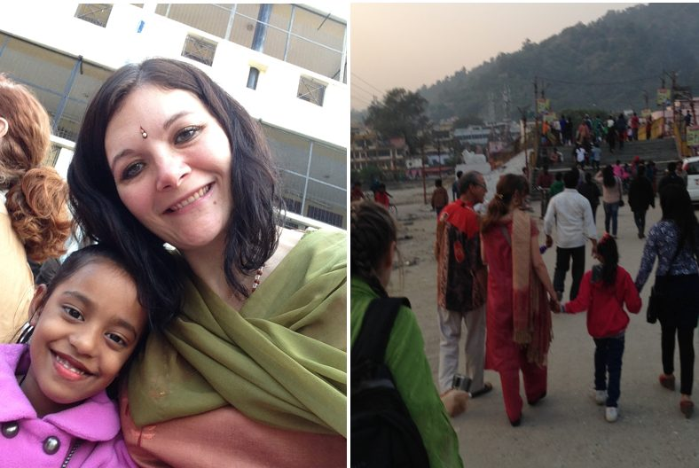](images/a54c2c34_Mya12.jpg)
[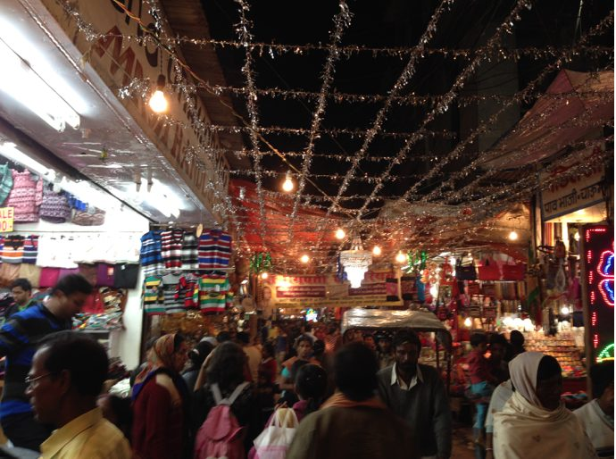](images/a54c2c34_Mya13.jpg)
I don't want to give away too much about the day of Diwali, as I truly think that it is something that one should experience this at least once (if not many) times in life! If I could use just a few words to describe it I would say that it was fantastic, spectacular, joyful and incredibly moving.
I was so impressed that all of the kids knew what to do and exactly where they should or shouldn't be. They looked after each other and really looked after us as well! I will never forget when I was "saved" from a rouge fire spinning wheel that had flipped on its side travelling toward me and one of the girls gently took my arm and said "watch out didi". I was mesmerized by the whole thing, and was very touched that I was being looked after without even realizing that I had needed looking after!
[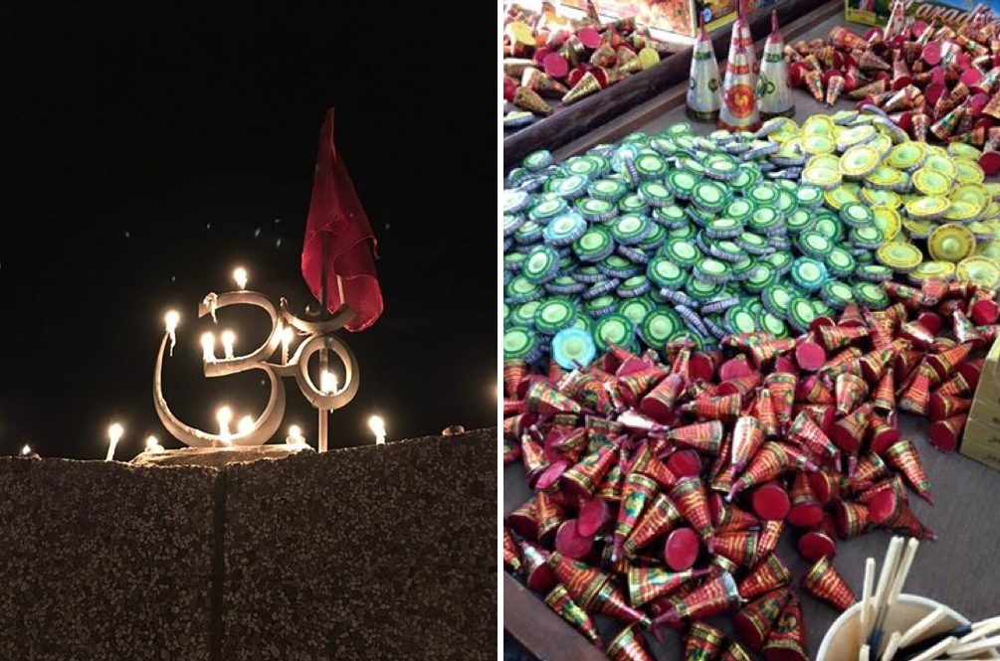](images/a54c2c34_Mya14.jpg)
[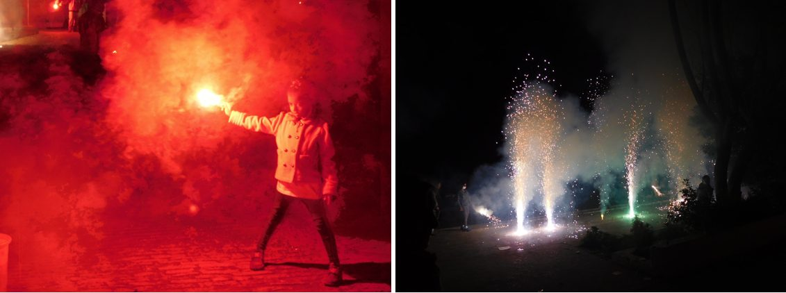](images/a54c2c34_Mya15.jpg)
One of the last days that we were at Sri Ram there was a birthday party for all of the November people. Birthday parties are held once per month, and everyone feels like a celebrity! I just so happened to be a November birthday person, and I was really surprised that I, along with a few of our trip mates, had also been included in the festivities! It was the most memorable birthday party to date, one I will never forget!
[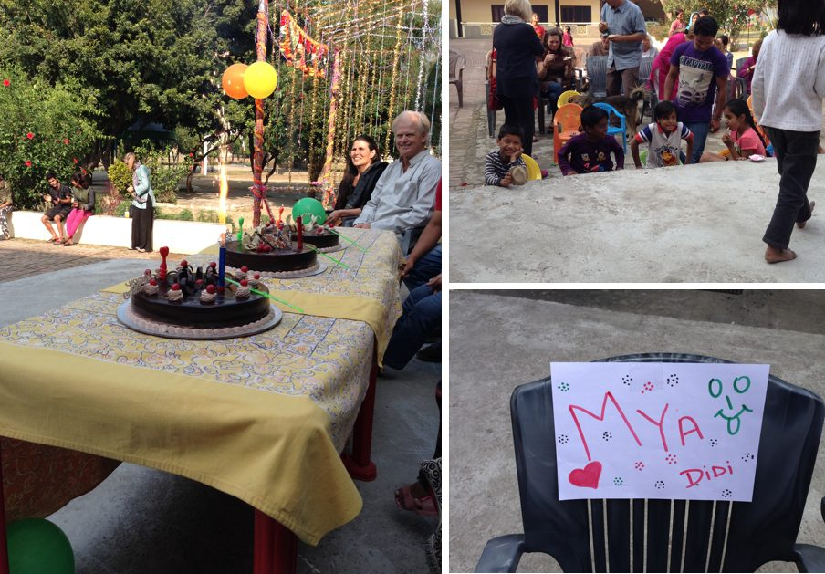](images/a54c2c34_Mya16.jpg)
Later that day, as if we hadn't had enough excitement, we went into Haridwar to experience arati at Hari ki Puuri, one of the most sacred landmarks in Haridwar (if not India); it is believed that Lord Shiva and Lord Vishnu visited here in Vedic times.
[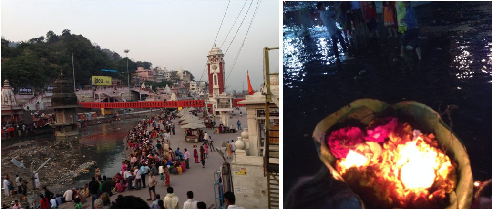](images/a54c2c34_Mya18.jpg)
[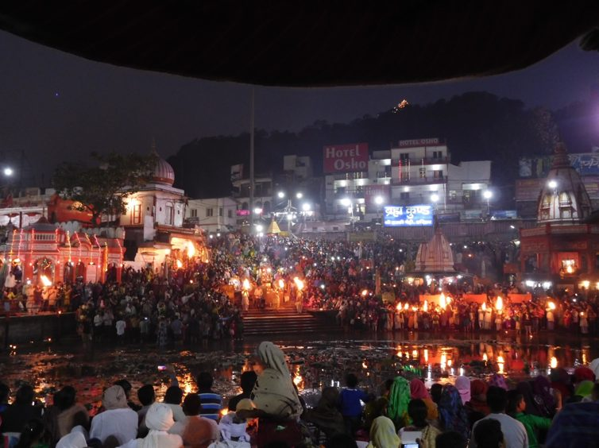](images/a54c2c34_Mya17.jpg)
This was an incredible afternoon; we did a little bit of shopping at Moti bazaar, where they have everything from malas, fabric, food, devotional items and water vessels for Ganges water - really anything you can think of! After this, we got set up in a "prime spot" and waited for sunset when arati begins. Watching the crowds growing and the goings on were absolutely fascinating. When we first arrived there was space all around us, but as the sun went down I couldn't even guess how many people were there; it was like an ocean of people and the energy was incredible! We watched the beautiful ceremony, full of singing and the glow of the lanterns; it was truly breathtaking. After this we each got a little boat made of a big leaf, which had some candles and flower offerings inside, and we made wishes or set intentions as we let them be carried away by the Ganges.
The last night at Sri Ram, we were treated to a Family Dinner with all of the kids and the family eating together. We had a very sentimental and emotional good bye full of hugs and love. Some of the kids asked us when we would be "coming home" next, which was so heartwarming and really was a testament to the fact that we were being accepted and thought of as family. Love truly lives at Sri Ram Ashram.
It is very hard to explain in words the stamp that this trip - Sri Ram Ashram, India and the people I met - have made on my heart. I feel like my life was truly enriched in a way that would be hard to top. I feel like I left a big part of myself in India, and I crave the day when I can go back. I think that this is a place of such richness on so many levels, that only once you experience it yourself, can you understand and feel with your heart what others are trying to explain.
I highly recommend this trip and experience if you have ever been curious about going to India and Sri Ram Ashram. This is a way to see India like no other, and you will be guided and will feel safe with the group. I really can't say enough about it in the confines of an article, but I would happy to elaborate or extend any help or advice for anyone who wanted to go!
With much love and reverence,
Mya
Jai Sri Ram! Jai Babaji!
