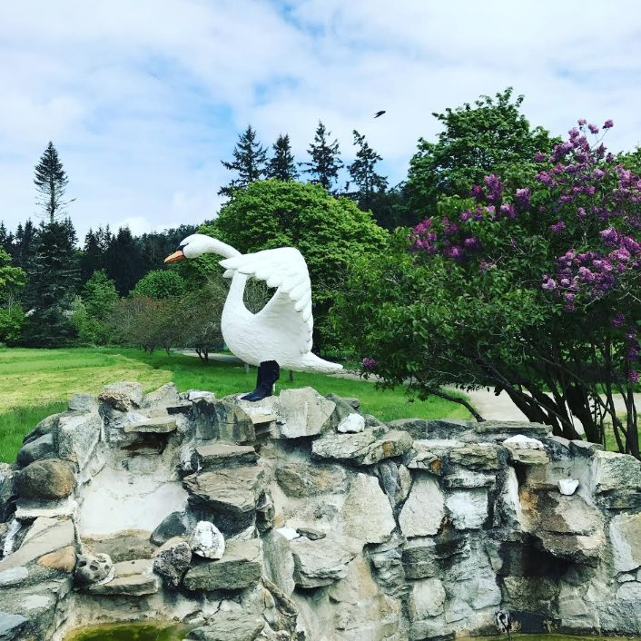
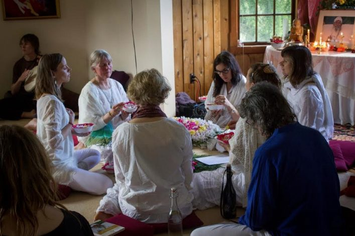
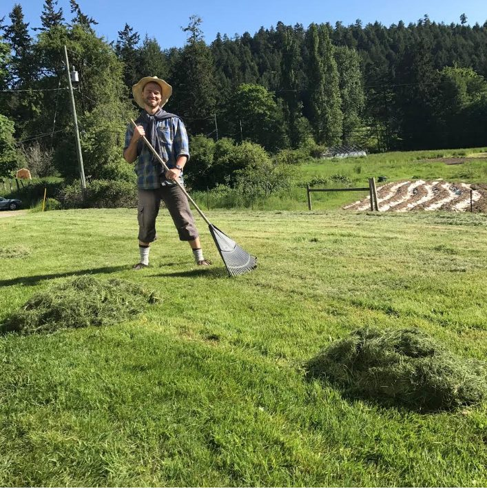
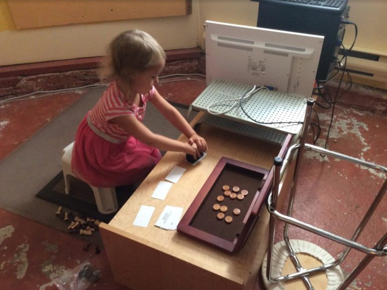
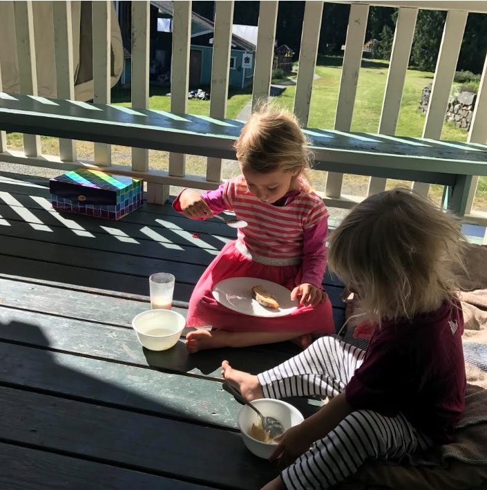
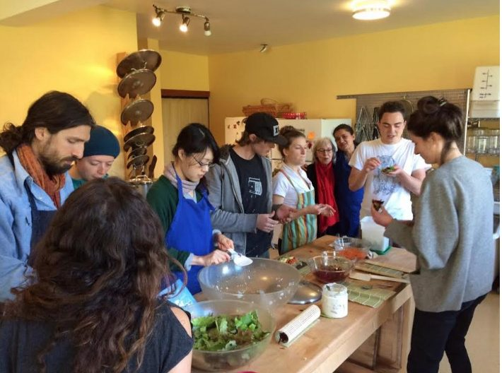
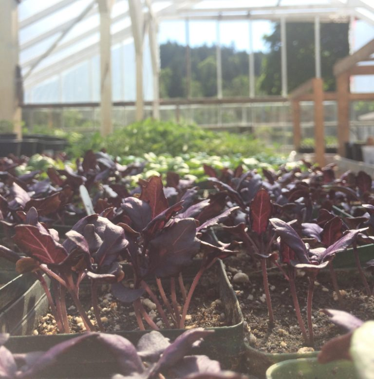
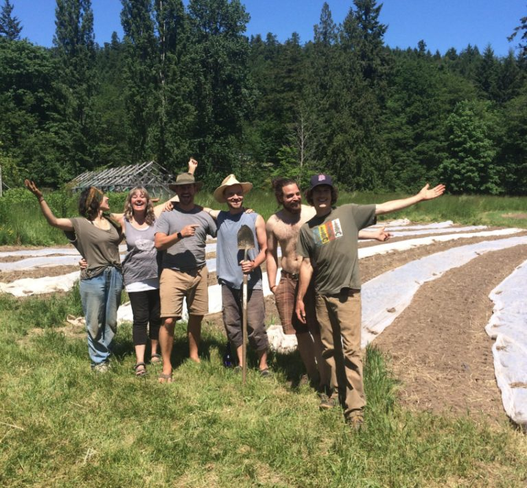

Hello everyone, and happy summer to you. As I write this the sun is shining and the day is bright; the sky is very blue and the grass is very green. Everything is growing.
 The swan by the front fountain (lilacs blooming in the background)
There is lots of exciting news to share in this time of growth.
Mark Classen (aka Omprakash), the president of Dharma Sara Satsang Society, on behalf of the DS Board, is happy to share some exciting news with all of you.
*In mid-April of this year, the Board of Dharma Sara Satsang Society formed a committee to find a new Centre Manager. We posted the position online, contacted satsang friends and eventually received about 25 applications. We found that it was difficult to find the diverse skills necessary to fulfill this demanding role. Eventually we chose two candidates with wonderful complementary skills and envisioned that they would work as a management team to guide the Centre in its operations. These two individuals were offered positions as co-managers and will be joining us during the month of June.*
*We would like to introduce **Daphne Hollins**, who has retired from a life as business manager in the corporate world and also directed two yoga studios. She is the mother of three children and has a background in trauma-informed yoga, bodywork and community organization. We also welcome **Will Yogeshwar Humphrey**, who held various management positions during four years at Mount Madonna and trained as a pujari with Janardan at the Hanuman Temple. Will also did his 500-hour Yoga Teacher Training at Mountt Madonna and has a Masters degree in Religious Studies, including Yoga Sutra and Sanskrit.*
*We are looking forward to their arrival at the Centre and a long and fruitful collaboration.*

In addition, here is some news from the Dharma Sara Satsang Society’s AGM earlier in May. Following reports from all Dharma Sara departments, an election was held for the DS Board. We’re pleased to introduce this year’s Board members: president: Mark Classen; treasurer: Bhavani Chlopan, Amy Cousins, Natasha Samson, Meera Bennett, and Ben Poulton. Kirti White and Sean Crabtree are serving as board interns.
 Divine Mother kirtan
Here are some photos from the past month that didn’t make it into last month’s update, plus a few current ones. Divine Mother kirtan was held on Mother’s Day. In the garden on mother’s day, 500 strawberry plants were planted. There’s also been lots of grass mowing and raking.
 Adam raking in the morning sun
This month is Father’s Day. Happy Father’s Day to all the dads! I hope all the dads are being cared for and loved. One dad spent a couple of weeks here with his not-quite-4 year old daughter - Sean (aka Shyam) and Penny. Penny won everyone’s hearts, and even ended up with a job in the office, involving paper and a stamp pad, working at her very own desk. She was very happy to have a real job!
 Penny at work in her office
Melinda and Laurel (known mostly as Lolo) arrived later. What a treat to have a couple of sweet little girls in the community for a while!
 Penny and Laurel having breakfast on the back deck

# Wonderful Community

There is a wonderful community at the Centre, everyone bringing special gifts. Kaori, one of the lead cooks in the kitchen, led a sushi making party a couple of weeks ago - such fun!
 Community sushi making party
Tyler of the maintenance department has completed the installation of several new windows in the program house, along with beautiful new trim. The new windows let in a lot of light, and Tyler himself brings light to whatever he does. The housekeeping team, led by Crystal (and soon to be joined by John) works quietly away in the background keeping everything orderly and beautiful. Others working in housekeeping include Tammy and Jess.
There’s a new IT team working together (Jesse, Sean, Harreson) to streamline computer systems in the office. Jesse is currently developing a customized registration program for ACYR as phase one.
Racquel is the newest member of the office team, being supported by Jules and Bri as they begin their transition out of the office and onto the farm.
The kitchen team - Angelo, Svenja, Ian and Kaori (and others part time) - continue to keep us well fed and nourished with top quality, delicious meals. More and more is coming from the farm each day.
The farm team, headed up by Milo, includes Adam, Shambhavi, Jules, Bri, and recently joined by Martin.
 Getting ready to be planted!
 The tomato planting team
Here’s Milo’s monthly farm update.
> *Well someone hit the ON switch for Summer!*
>  *The farm is swooning as we pick up our pace and sunscreen our face.*
> *Everything is happening. The soils are dry enough to be worked and seeded. Our starts are eager to tickle wide open fields and we yearn for the rain that’s disappeared so suddenly.*
> *First on the list. We’ve just satiated over a hundred tomatoes seedlings. They’ve been tucked into their new home and covered with cloche in our east field. It’s shaping up to be a lovely year for outdoor tomatoes.*
> *Second. Many many beds of bush beans have been sown with the rumour of rain and our spuds are finally going to taste dirt.*
> *In the coming weeks we’ll be installing a new irrigation system, seeding our little hearts out and hitting the lake!*
> *Happy Summer. Come by for a visit.*

Sunday satsang and Wednesday kirtan continue, with some karma yogis participating in leading kirtans, playing guitar, and drumming. Online Bhagavad Gita study continues every Tuesday evening via Zoom. If any of you are interested in joining this group study, please send me your email address and I’ll send you the link. You can reach me at sharada@saltspringcentre.com. For Centre residents there is also regular pranayama and meditation and weekly history and yoga theory classes.

# Join us this Summer!

Coming up soon: Yoga Teacher Training begins on July 6. Although it is filling up, there is still room, so if you’re interested please read about this wonderful program on the Centre’s [website](https://saltspringcentre.com/yoga-teacher-training/), and [register online](https://saltspringcentre.com/yoga-teacher-training/ytt-application).
The 43rd Annual Community Yoga Retreat (ACYR) follows on the heels of the first session of YTT, from August 3 - 7. Dharma Sara’s [first yoga retreat](https://saltspringcentre.com/2011/07/37-years-of-yoga-retreats/) was held in 1975 and is still going strong. It’s an amazing opportunity to gather with a community of yoga teachers, students and seekers. There are many, many classes and lots of time to sing and play. There is also a wonderful children’s program.

# This Month's Newsletter Offerings

In this edition we offer you some very inspiring reading.
Amita Kuttner, who was born into the satsang family, shares the story of her life and her connection to both the Salt Spring Centre and Mount Madonna Center. She has been guided by Babaji her whole life, having been a yogi (both serious and playful) since she was little. Her story, ‘[Growing up with Babaji](https://saltspringcentre.com/2017/06/growing-up-with-babaji/)’ is a very moving story.
In celebrating the connection among the centres begun by Babaji - Mount Madonna Center, the Salt Spring Centre of Yoga, and Sri Ram Ashram - we are delighted to share an invitation to join Mount Madonna Center for [Yoga Diwali India](https://saltspringcentre.com/2017/06/yoga-diwali-india/), from October 10-22, 2017 - a perfect time to experience India.
During YTT at the Salt Spring Centre of Yoga a few years ago, Mya Mitchell was inspired when she watched ‘Jewel in the Jungle’,the video of Sri Ram Ashram’s beginnings. She explored the possibility of visiting India for Diwali, and here presents us with a journal of her experiences,‘[Love Lives at Sri Ram Ashram’](https://saltspringcentre.com/2017/06/love-lives-at-sri-ram-ashram/), with many photos. I’m sure you’ll enjoy it. If you’ve been thinking of visiting India, you may be inspired by Mya’s story.
From Babaji: *“Don’t think that you are carrying the whole world; make it easy, make it play, make it a prayer.”*
Love,
Sharada
