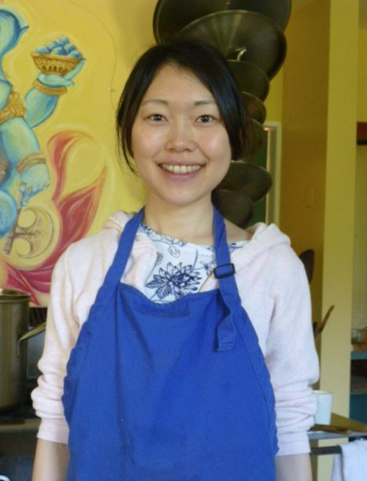
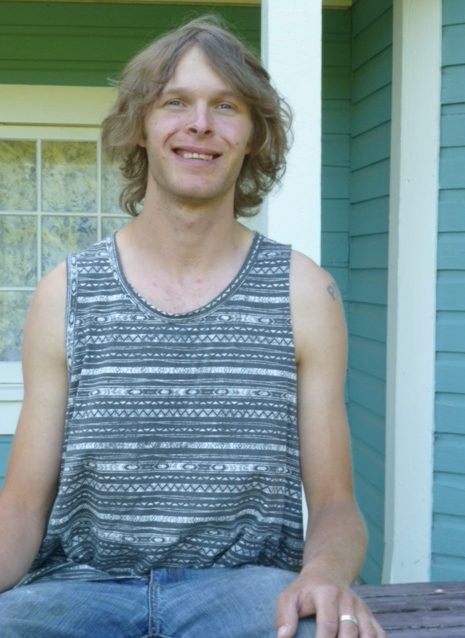

# Ponderings by a few karma yogis at the Centre

Here are the prompts people were given to stimulate some reflections about their lives at the Centre. You may want to consider these questions yourself (perhaps with a little revision to fit your life).

- *What have been the highlights of your time at the Centre so far?*
- *What have you learned - about yourself, yoga practice, living in community?*
- *What teachings and practices have inspired you?*

Three of our current karma yogis have shared some of their reflections about how their experiences of living and working at the Salt Spring Centre of Yoga have contributed to their lives and their outlook on life.
It is my pleasure to introduce you to Mariel Ahlers, Kaori Makifuchi and Tyler Brush.

## Mariel Ahlers

It's hard to narrow down the highlights of my time here so far - there have been so many! Meeting a whole community of like minded people was a major highlight, as well as getting to explore the beautiful centre grounds. Another highlight for me is getting to spend all day, every day outside with my hands in the dirt. And last but not least, the amazing food here at the centre continues to be a highlight every day!

The biggest thing I have learned is that living harmoniously in community is indeed possible and can in fact be an extremely enriching experience. On a more personal note, I am learning to slow down and live in the moment. And I continue to learn and be inspired by the skills, experience and kindness of everyone around me.
I am incredibly inspired when I hear the elders tell stories of the early days of the centre and the teachings that Baba Hari Dass imparted, both through his actions and words. I am also inspired by the weekly yoga theory classes for providing a deeper understanding of Karma Yoga and the foundational principles of the centre. And attending Kirtan and Satsang always leaves me inspired on a spiritual and emotional level.

## Kaori Makifuchi

Every day IS practice !
I really enjoy this peaceful and beautiful land. Although it's such a wonderful place, I have some difficulty. Being in the community is sometimes hard for me because of my language problem between Japanese and English. Sometimes I feel disconnected with everyone and get lost but every time, people help me and I really appreciate it. I believe every time I develop awareness, I can understand myself deeper and be more shanti.
Our kitchen is really sattvic, we can practice yoga asana and pranayama whenever we want, and people here are knowledgeable. So it's the best place to practice yogic life.
I’ve learned non-attachment about food, other people’s emotions and my own emotions. Every awareness helps me know about myself!
I don't have an exact answer about what teachings and practices have inspired me - just that the people and environment here are always the teacher.
namaste
lots of love

## Tyler Brush

To pick just a few highlights from my time at the centre kind of a difficult task, as the entire experience of living and being here has been extraordinary. With that said, I think the biggest things for me have been: The food, so full of love and vitality. The people, beautiful, colourful, and inspiring. The deep connection, to nature, to god, and to myself.
Before coming here I didn't know very much about yoga aside from the physical, "on the mat" practice, which I'd tried briefly in my youth.I certainly wouldn't have considered myself as a yogi. I’ve now learned, that the spiritual shift in my life's direction in the years leading up to my arrival here was very much yoga,and without even knowing it, i had been walking the path of a yogi.
"As soon as a person starts thinking, 'I want to be a better person,' that is the start of yoga"- Babaji
Karma yoga and silence have been the most important practices for me. Service had emerged as an important theme in my life long before I knew it had another name, and being in a place where my base needs are met has enabled me to give so much more freely of myself. Also, to witness the powerful effects of karma yoga on this land, and all the people who have called it home (even for a weekend,) has solidly cemented its value in my heart.
Silence has been more of an internal practice for me than the actual act of not speaking. Being an introvert, and dealing with a certain degree of social anxiety, I knew I would face some challenges with maintaining the level of personal space necessary for my well being, while living in such a (sometimes) busy environment. However, with the help of a consistent morning practice (a big part being a prayerful, meditative walk, which I've dubbed, "my coffee date with god,") Ive been able to find a beautiful silence within, even when surrounded with the buzzing activity of the centre. To say I feel blessed to be here would be an understatement, but I guess those are the best words available. Namaste!

### For information about the Salt Spring Centre of Yoga’s Residential Yoga Study and Service Immersion Program program, visit:

[Residential Yoga Study and Service Immersion Program](https://saltspringcentre.com/programs-retreats/residential-yoga-study-and-service-immersion/)
