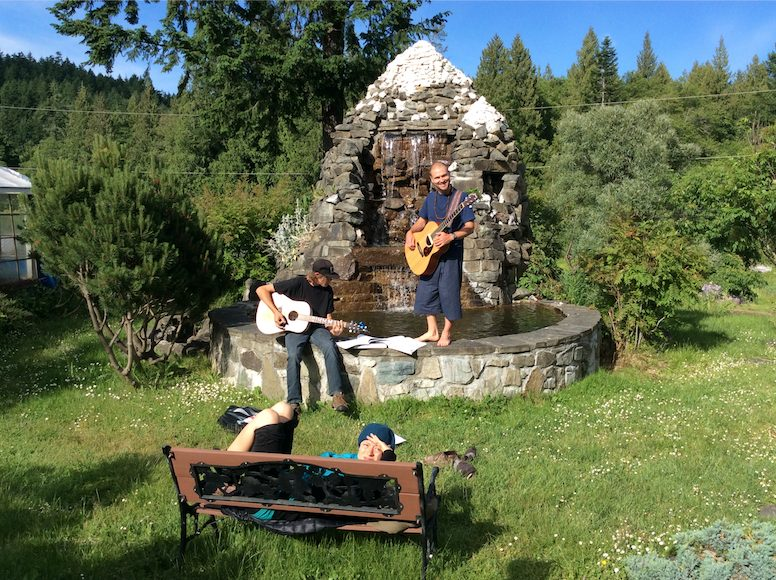
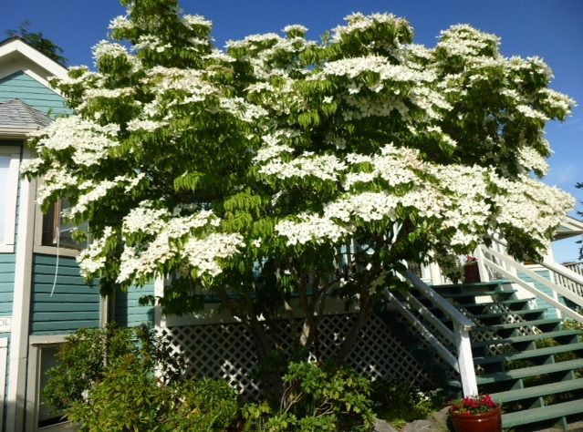
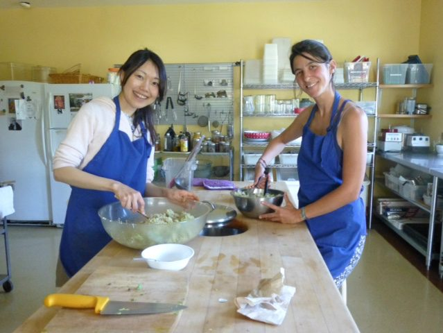
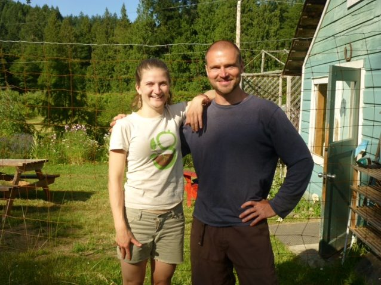
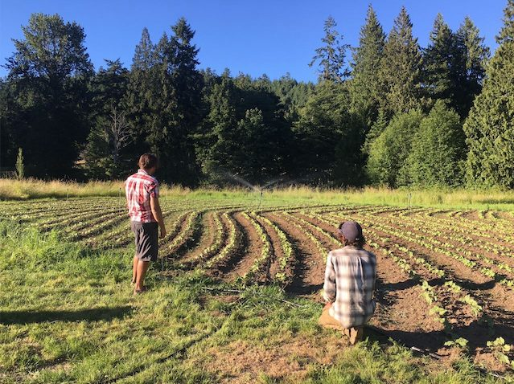
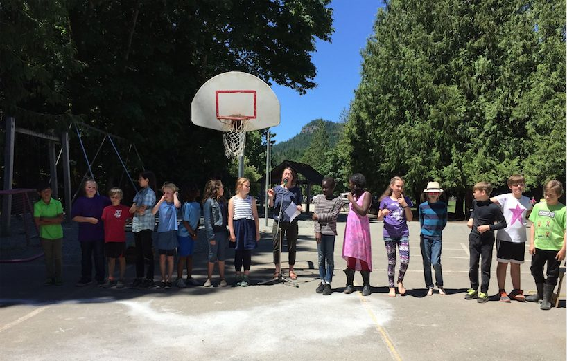

 Music in the meditation garden: Tyler and Adam, Svenja (the audience) on the bench.
Hello everyone, and sunny wishes to you all. Summer has finally taken root, and along with it, all the summer events at the Centre. Happy Canada Day!
Daphne Hollins and Yogeshwar Humphry have dived into their new roles as Centre Manager and Operations Manager. They’ve spent a lot of time in meetings, but are also getting to connect with the resident community. In addition to their office roles, they’ve been doing dishes, cutting veggies, making beds, and generally getting to know the Centre from the inside out.
Guru Purnima, a special celebration to honour Baba Hari Dass and all spiritual teachers occurs this year on July 8 at 9:00 am in the Pond Dome. Please join us if you can.

# Guru Purnima & Full Moon Yajna

This is the auspicious and holy full moon day on which celebration and homage to the Guru are paid. Guru means “one who removes darkness or ignorance.” Traditionally, this day is set aside for worship of the spiritual teacher and attempting to pay our debt of gratitude by study of the scriptures and practice of the teachings.
The ideal we wish to attain is vividly represented by the full moon. It is at this time the moon receives to the fullest extent the dazzling light of the sun and reflects it perfectly. Thus it is this supreme ideal of fully reflecting the divine splendor that is aimed at through the surrender to and worship of the spiritual guide, through the study of and meditation upon the truths of the teachings. The human mind being purified by service to the Guru and assimilation of the teachings becomes serene and calm and then faithfully reflects the Atman (Pure Consciousness).
The guru is ever by your side – in truth the guru dwells in your heart. You have only to think of the guru with real faith and devotion and you will at once feel the guru’s spiritual presence. Guru Purnima is the time to honour this guide – to begin or to renew our spiritual aim by living our lives in awareness of the choices that can take us to our highest ideals. May all that we have read, seen, heard and learned become, through sadhana, transformed into a continuous outpouring of universal love, ceaseless loving service, and continuous prayer and worship of the divine within all beings.
Through our ancient Vedic ceremony of yajna, we will honour Babaji and all spiritual teachers. May we rededicate ourselves to all that the teachings inspire within us to attain real peace. We offer our gifts from the heart in deep gratitude.
> “A person is in bondage by his own consciousness, so he can be free by his own consciousness. It’s only a matter of turning the angle of the mind. If you think you can do it, then you will do it. It takes firm determination. For keeping determination alive, we need regular sadhana, faith, devotion and satsang. Always watch yourself. How desire comes. How a thought builds a long story. How hate, anger and greed come. Watch all these things; this is the real yoga.” ~ Baba Hari Dass

If you are interested in being an offerer at the yajna, and/or helping with preparations or clean up, please contact Rajani 250 537 9537.

# Upcoming Programs

[Yoga Teacher Training](https://saltspringcentre.com/yoga-teacher-training/) begins on July 6, so our community will increase as both students and teachers arrive. The first session of YTT runs from July 6 - July 19, followed by a second session from August 12 - 22.
Between the two YTT sessions (August 3-7) is our biggest event of the year - ACYR ([Annual Community Yoga Retreat](https://saltspringcentre.com/retreats-programs/annual-retreat/)). This summer we host our 43rd annual consecutive retreat which continues to be a highlight for many people. There are many, many classes, pranayama and meditation, yoga asana, yoga theory , and a lot of fun events, including the classics like Hanuman Olympics and Latte Da Stage. There will also be a dance, stories, and a special evening concert with [Srivani Jade](http://www.srivanijade.com), a renowned Hindustani singer, with Ravi Albright on tabla. Of course there will be the usual great meals plus a wonderful program for children. Registration is open on our website, with early bird prices continuing till July 8. If you haven’t registered yet, [do it now](http://www.burtonmediainc.com/sscy/)!
In the midst of all this, community life continues at the Centre. Here are some recent photos.
 The Dogwood tree by the front steps
 Kaori and Muriel making dinner
 Shambhavi and Santosh (two of the farm team folks)

# Farm Update

The farm is looking amazing, and the veggies that are coming out of the farm are delicious!
 Watching our beans grow.
Here’s Milo’s farm update:
> Well summer is here and mid-day siesta season is upon us.
>
> When we're not napping.... we're running around installing our new irrigation system and planting out the last of our heat craving crops! This irrigation is a huge leap for the farm and will increase our production immensely. Come check it out!
>
> We'll also be breaking new ground this week in preparation for our seed gardens managed by the "Salt Spring Seed Sanctuary". Island farmers will grow out seed crops and donate a portion to our local seed bank and farmer friends thus ensuring seed security within our community and beyond.
>
> Leaps and bounds this year folks. Thanks for all your support. Onward.

# 

# End of School Celebration

The Salt Spring Centre School celebrated the end of this school year with a potluck, followed performances, awards, and a slideshow of many of the events that took place over the course of the school year.
 Owl Class (grades 4-5-6)

# This Month's Newsletter Offerings

To give you the flavour of life at the Centre, here are some [Ponderings by a Few Karma Yogis at the Centre](https://saltspringcentre.com/2017/06/karma-yogi-ponderings/): Mariel Ahlers, Kaori Maifuchi and Tyler Brush. Each of these people brings something special to our community. Here they talk about their experience and what they’re learning.
In the busyness of life, sometimes we get stressed and forget our inborn purity and goodness. Here is a reminder: [Remembering our Innate Goodness](https://saltspringcentre.com/2017/06/remembering-our-innate-goodness/). No matter how crazy life in the world gets (and how spun out our minds get), we can come back to the light that’s always shining.
*Don’t dwell in the past and don’t worry about the future. Just make your present positive and peaceful. ~ Babaji*
With love,
Sharada
