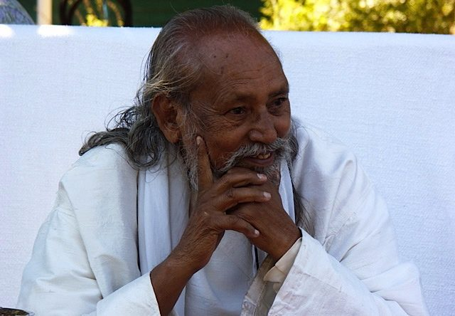

 Baba Hari Dass
We came into this world pure. If you spend time with any newborn baby, you can see they live only in the present moment. A baby may cry when she has physical discomfort - hunger, wet diaper, etc - but she makes no judgements about the world, such as, “Bad mommy. Why isn’t she here yet?” There are no stories.
By the time children are two and a half, their sense of individual ego (the sense of being the centre of the universe) has made its presence known. That’s when words like “no!” and “mine!” start showing up. These sweet children have begun to see themselves as separate from others, with a worldview that has shifted to: I want what I want (now!) and I don’t want that!
It happens to all of us. Over time, the accumulated layers of experience cover our innate purity and goodness. That purity still exists, but we lose sight of it and start thinking that our individual thoughts and stories are who we are.
*A gold piece covered with dried mud looks like a rock, but as soon as the mud covering is broken the gold piece shines and is clearly separate from the mind. This body, the mind, the senses, and their creation of worldly illusions are like a covering on the Self. They hide its glory, but the Self is never really affected by them. It is always separate, like a lotus leaf which, when taken out of a pond, doesn’t retain a single drop of water.* 
*Real human nature is truth and love.*
How can we unearth ourselves from the years of stories, ideas and judgements we have about ourselves and the world, to come back to our innocence and goodness? It is never too late to shift from the sense of separateness to open-heartedness. However separate you feel from others and from your own goodness, you can practice being kind and gentle with yourself. Being able to let go of the past is a way to be kind to yourself. It lightens the pain you carry around with you when you’re angry or distressed. In releasing the past you come into the present, the only place you can be in peace.
*Don’t worry yourself by thinking of the negative things you have done. Do positive things now.*
*Losing once in the battle doesn’t mean that you can’t win again.*
Pema Chodron says, “Spiritual practices awaken our trust that the wisdom and compassion that we need are already within us. They help us to know ourselves: our rough parts and our smooth parts, our passion, aggression, ignorance, and wisdom.”
*Without reducing negative qualities, progress in spiritual life is as impossible as carrying water in a sieve.*
*The mind is purified by meditation, developing good qualities, and selfless service. Once can choose any one or all three. In fact each one includes the other two.*
In those moments when we’re feeling stuck, and hopelessness is ruling the day, there are a number of simple actions we can take to shift the angle of our minds - anything that works to remind us that happiness and peace are just around the corner. But first we have to be willing to do something. It can be so tempting to sit in our own unhappiness, but we can break the cycle by going for a walk, listening to music, reading uplifting teachings or visiting with friends. Helping someone else is also an excellent way of shifting our focus.
*Q: How does an impure mind purify itself? How can a confused mind gain clarity?*
 *A: Impure mind is a mind dwelling on negative thoughts. When negative thoughts are removed, it’s called pure mind.*
*The mind is purified by meditation, developing good qualities, and selfless service. Once can choose any one or all three. In fact each one includes the other two.*
Once our hearts begin to open, we can start seeing the glass as half full again, and we are ready to step back into a formal practice.
*Failure is the foundation of success. We learn how to achieve success by failing in our efforts. The main thing is not to stop the effort.*
*Cultivate a sympathetic heart, humility in dealings and selflessness in actions. If these are practiced with earnestness and sincerity, then you will win the race of life.*
*If you work on Yoga, Yoga will work on you.*
*Wish you happy.*
Contributed by Sharada
All quotes in italics are from writings by Baba Hari Dass.

---

 **Sharada Filkow**, a student of classical ashtanga yoga since the early 70s, is one of the founding members of the Salt Spring Centre of Yoga, where she has lived for many years, serving as a karma yogi, teacher and mentor.
