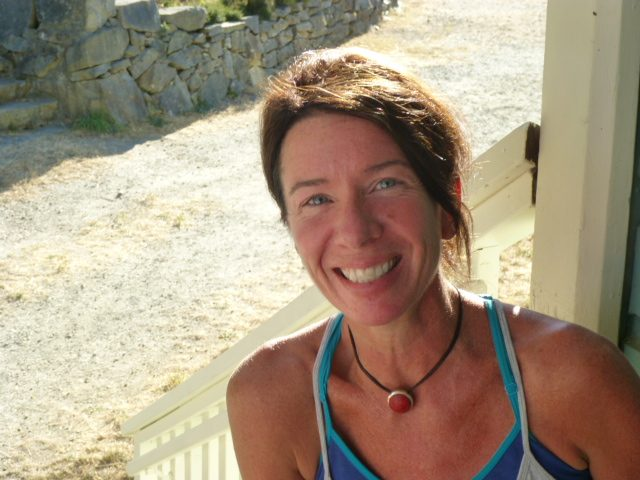

 Centre Manager, Daphne Hollins
Summer has arrived at the Centre and so has a new management team. I am so grateful to be a part of this community and also to be partnered with the inspiring and capable Yogeshwar (Will) Humphrey, our new Operations Manager.
As I settle in to my new role as Centre Manager, I reflect on the depth and breadth of the history within the land and the buildings. The combined years of knowledge and experiences of our elder community reminds me of the importance of what our Centre offers to people, from all ages and stages of their lives. The youth and energy of our residents, shaping the land and envisioning the future, provide me with a deep belief in the sustainability of this space. As I encounter our guests, some arriving for the first time while others continue to come back, year after year, I am heartened by the subtle bliss I witness, blossoming and growing as the energy of the land and its people takes hold of their experience.
In my brief tenure here I have watched the arrival of our Yoga Getaway participants, taking a brief respite from their day to day lives to immerse themselves here, creating memories and learning lessons that reach far beyond their yoga mat. I’ve engaged with Personal Retreat guests, seeing them as they arrive, bringing the bustle and “busy-ness” of their world beyond to come and connect with ours. “Retreat” is the operative word, as they are allowed the opportunity to connect with the sights and sounds of our natural spaces and feel the transformative power of acceptance brought on by a staff that clearly takes tremendous pride in all they do. Lastly, I have been honored to witness the first half of our Yoga Teacher Training, humbled by the depth of knowledge brought by our teachers. Engaging with the students, I have heard profound stories of what brought them to our land and our training. I was so proud of my community and what we offered as the students related to me their experiences both inside and outside of the training rooms.
I feel a deep sense of commitment, from everyone I encounter within our Centre. It is my belief we are here to serve the greater community of the world around us and each person that enters our sacred space moves beyond with a deeper awareness, a sense of belonging and an abiding peace. I am blessed to be a voyager on this journey.
