[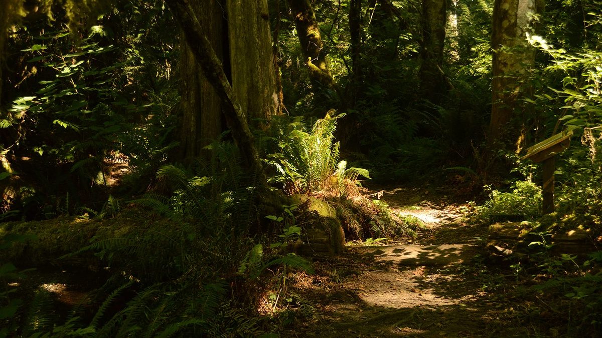](images/5ede19a2_walking-through-the-trail.jpg) Walking through the trail
Hello everyone,
Summer is speeding by as it does every year. This month Daphne Hollins, our Centre Manager shares her experience of the past few months in [Musings from Centre Management](https://saltspringcentre.com/2017/07/musings-from-centre-management/).
Kudos to our amazing staff of karma yogis and volunteers for their support during the July session of YTT: The kitchen team provided excellent (and much appreciated) meals every day; the dish team (aka the dish kingdom team) doesn’t always get acknowledgement but we couldn’t manage without them; the housekeeping team does such a good job that it’s not always noticed because it’s easy to take for granted that everything is always clean and organized. The same is also true of the maintenance and landscaping team that keeps everything in working order and tidy; the farm team kept us well fed with lots of greens - and fava beans!; and the office team seamlessly keeps everything humming along.
[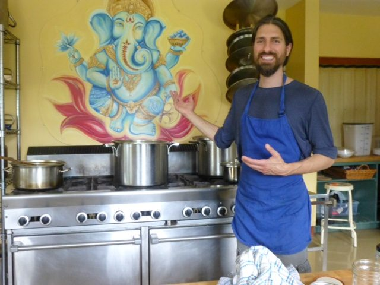](images/5ede19a2_Angelo-with-Ganesh-painted-by-Sarah.jpg) Angelo with Ganesh (painted by Sarah)
[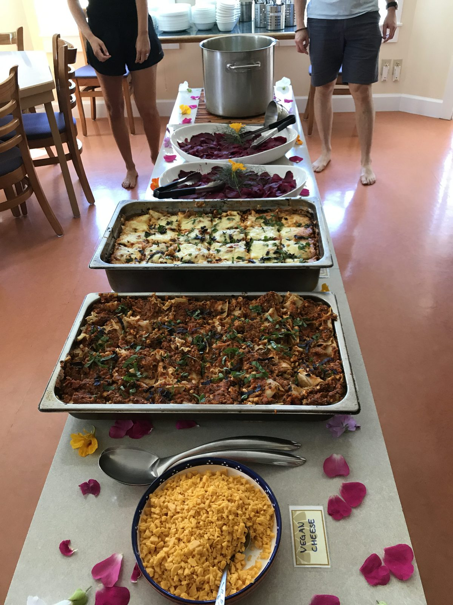](images/5ede19a2_dinner-e1501395154292.jpg) Lasagne for dinner
[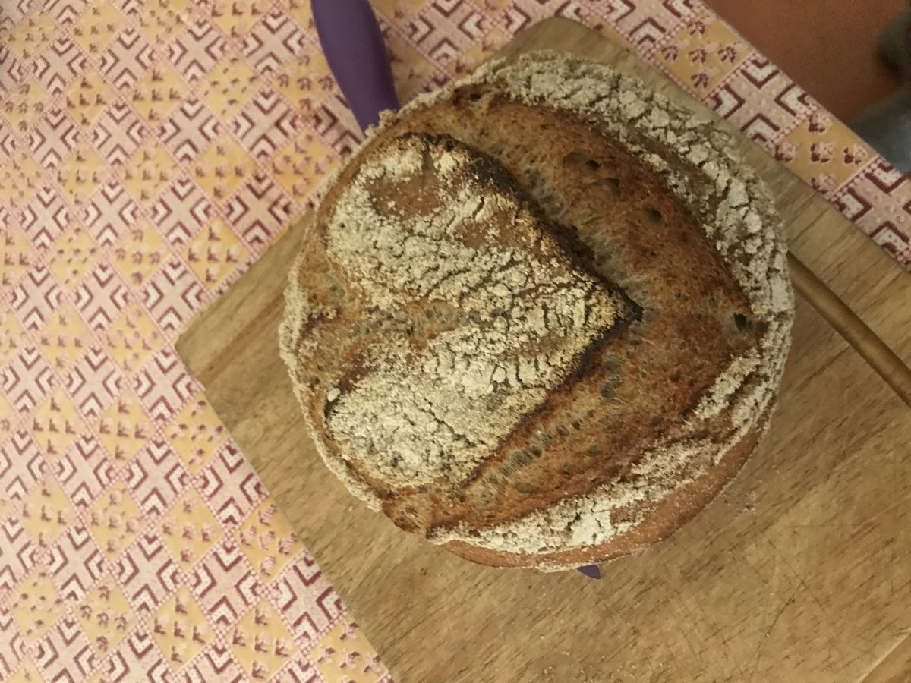](images/5ede19a2_sourdough-bread.jpg) sourdough bread made by Bri

# Farm Update

Milo has been very busy on the farm; here is his monthly farm update:
[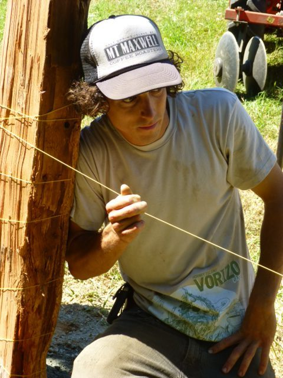](images/5ede19a2_Milo-fencepost.jpg) Milo making sure the line is straight
 
[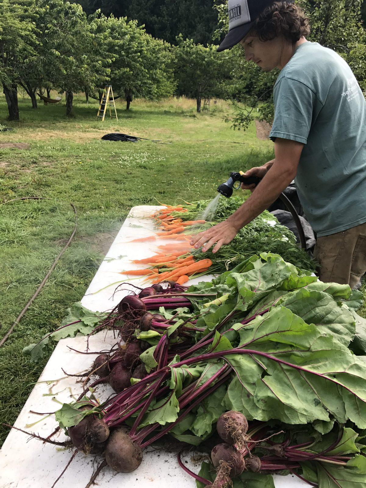](images/5ede19a2_Milo-washing-carrots-and-beets-e1501395072400.jpg) Milo washing carrots and beets
[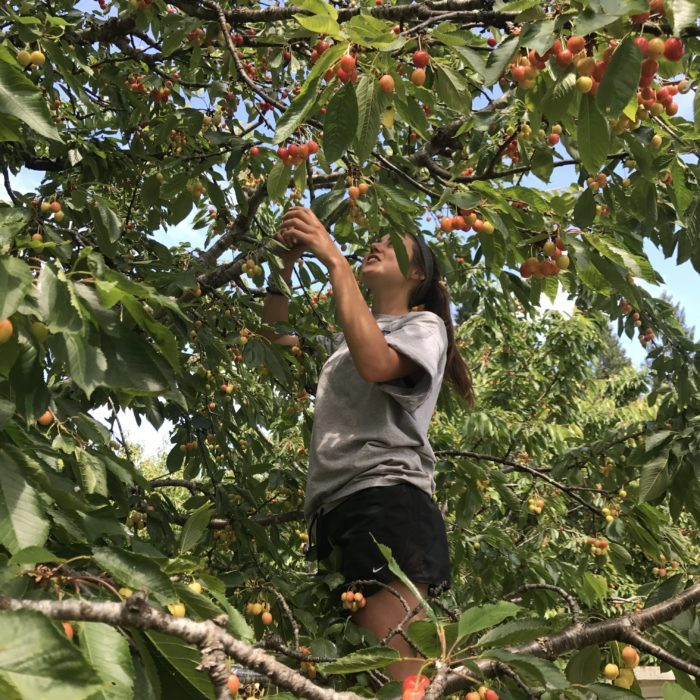](images/5ede19a2_picking-cherries-e1501395018634.jpg) picking cherries
[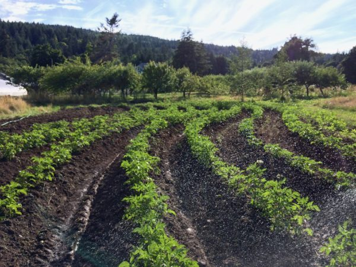](images/5ede19a2_potatoes-2017.jpg) hilled potatoes

*Hello all.*

*Summer is flying by yet in some ways we are just getting started. The fruits of our labour are taking shape. Tomatoes are setting, flowers are beginning bloom and our green beans are days away from bombarding our baskets.*

*It has been a huge year for foundational improvements. The farm is sporting a new irrigation system, compost tea injector and various tractor implements allowing us to create raised beds AND sweep weeds efficiently.*

*A new fence is also underway around our future food forest thanks to an investment from the Salt Spring Seed Sanctuary which will be co-managing seed crops amongst the emerging food forest. The fence will enclose over an acre of well drained, arable land and allow us to get an earlier jump on the season!*

*I hope everyone is having a fantastic summer. Come on by for a visit. Onward.*

# Creativity & Community at the Centre

I’d like to give a shout out to Satya Gauthier who’s been working on amazing sewing projects that are upgrading many corners of the Centre. You’ll see more when you visit.
[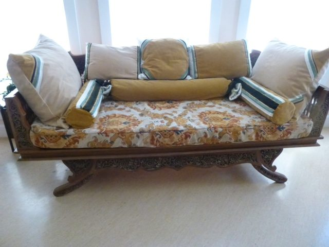](images/5ede19a2_Satya-sewing-project.jpg) Satya's sewing project
Tyler is also working on his wonderful hammock-sewing project.
[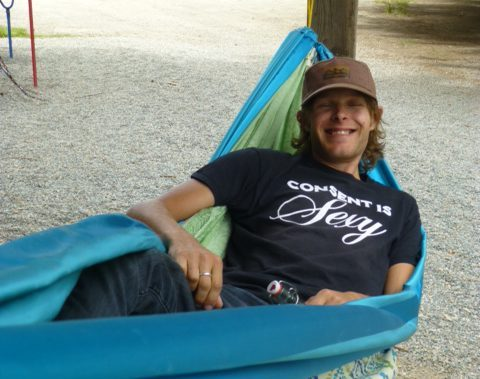](images/5ede19a2_Tyler-hammock-e1501393742816.jpg) Tyler in one of his hammocks
A big congratulations to Mischa Makortoff and Jun on the birth of their son, Dalton.
 Dalton Clay Makortoff
Sean, Melinda, Penny and Laurel (mostly known as Lolo) are camping at the Centre till after ACYR when they will move into their new Salt Spring home.
[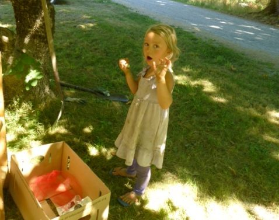](images/5ede19a2_Pennys-lemonade-stand.jpg) Penny's lemonade stand
[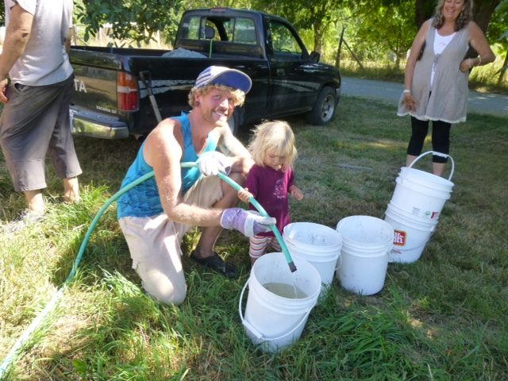](images/5ede19a2_Laurel-filling-buckets.jpg) Christopher and Laurel filling buckets

# Annual Family Retreat!

[ACYR](https://saltspringcentre.com/retreats-programs/annual-retreat/) is approaching quickly. If you haven’t yet registered, here are some highlights to entice you: Many, many classes: shat karma, pranayama and meditation, asanas, a fabulous program for kids while parents are in classes, including nightly games of Capture the Flag. There’s also kirtan, dancing, and lots of play, as well as an evening of **classical Indian singing by [Srivani Jade](http://www.srivanijade.com/)**, accompanied on tabla by our own [**Ravi Albright**](http://www.ravialbright.com/). There is satsang on Sunday afternoon followed by Hanuman Olympics, and the evening is topped off by Latte Da Stage. And I haven’t even mentioned Latte Da, or the Jai store or the Yajna on Monday morning. Come and check it out!

# Summer reading…

Continuing with the theme begun last month, we introduce you to a few more karma yogis, reflecting on the same question asked to the last group: What have been the highlights of your time at the Centre so far? What have you learned - about yourself, yoga practice, living in community? What teachings and practices have inspired you? This month we introduce you to Arron, Jess, and Jesse. I hope you enjoy meeting these lovely folks in [Karma Yogi Ponderings](https://saltspringcentre.com/2017/07/karma-yogi-ponderings-2/) and getting a taste of what it’s like to be a karma yogi here.
In our first-world lives, there are innumerable distractions, yet to succeed on our path, we need to be able learn to limit our choices and make a commitment to the important things in our lives, particularly our spiritual practice. Please read [Commitment to Spiritual Practice](https://saltspringcentre.com/2017/07/commitment-to-spiritual-practice/).
From Babaji: *Wish you all happy and success in sadhana*.
Love,
Sharada
