[caption id="attachment\_15265" align="alignnone" width="462"][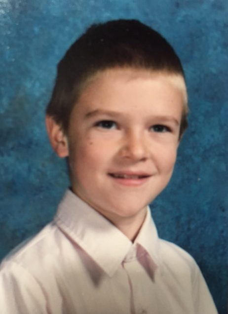](images/debb963f_Aam-Bernath1.jpg) School pic from grade 4[/caption]
My spiritual journey began when I was very young. In about the third grade I started realizing a sensitivity and compassion for the crude and harsh attitudes and tendencies that I witnessed on the playground and in school. “Why is there bullying?” I would ask myself, “and why would anyone want to hurt anybody?” I remember feeling confused a lot in elementary school, trying very hard to figure out my world and to understand my place in it. My mother would say, “You’re going to need to develop a thicker skin Adam” when I expressed my sadness over being prey to meanness or bullying. That made me feel worse I think. As though it was sort of wrong or not in one’s favor to be sensitive in this world.
[caption id="attachment\_15266" align="alignnone" width="474"][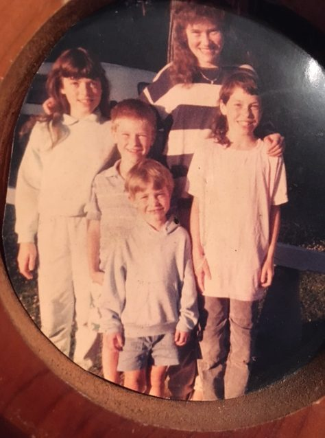](images/debb963f_AdamBernath-2.jpg) Me with all my siblings at our cottage 1988[/caption]
I wasn’t a total misfit but I guess I felt a bit lost or awkward regarding social dynamics. There was a desire and a need I felt to connect with people but I don’t know if I ever really found that back then outside of my family. I was a fairly quiet and very thoughtful, introverted child. Maybe that’s why; I lived in my head mostly. I took up drawing around that time, perhaps as my means of getting out of my head. Art was the only subject that really mattered to me, although I achieved average grades in most subjects.
I fell in love with the great outdoors when my parents bought a cottage in Rondeau Provincial Park on the north shore of Lake Erie. It was and still is a wilderness teeming with life. I was seven years old when I first had the delight of exploring the beauty of that magical place. I spent every summer living there from the age of seven to the time I finished high school. Looking back I feel deeply blessed to be given that time. I believe it really had a profound formative effect on me.
[caption id="attachment\_15272" align="alignnone" width="596"][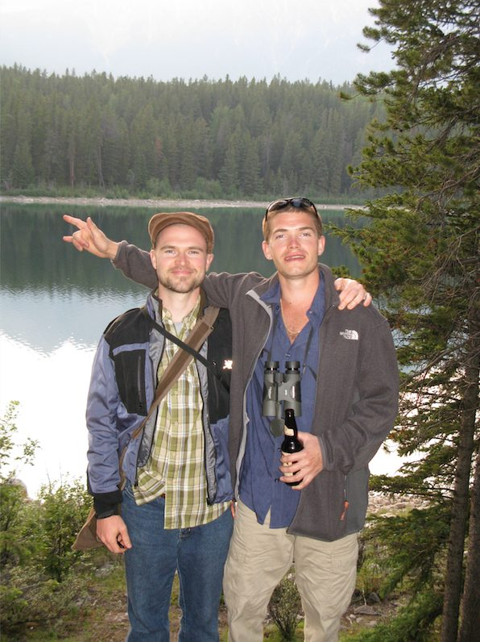](images/debb963f_AdamBernath-8.jpg) Me with my brother at the lake in Jasper, AB[/caption]
In High school I was involved in martial arts and was inspired by watching films like ‘Dragon: The Bruce Lee Story’. When I heard him talk about how “we all have a chi, an inner spirit”, it sparked an immediate curiosity to understand more deeply.
I went straight into Art College after High School and continued to study there for six years. I had exposure to a lot of different kinds of philosophy and literature that greatly expanded my horizons and opened my eyes. I also fell in love with the art of pottery, which has been an ongoing creative adventure since that time.
[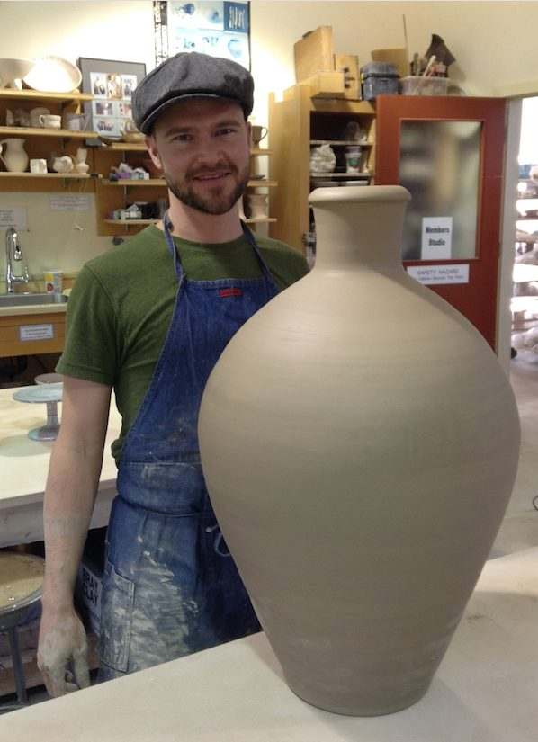](images/debb963f_AdamBernath-11.jpg) [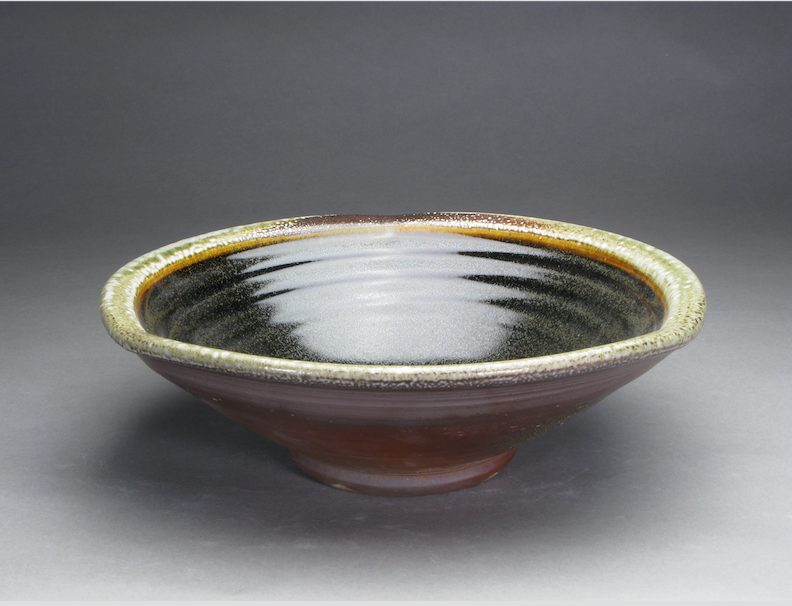](images/debb963f_AdamBernath-10.jpg) [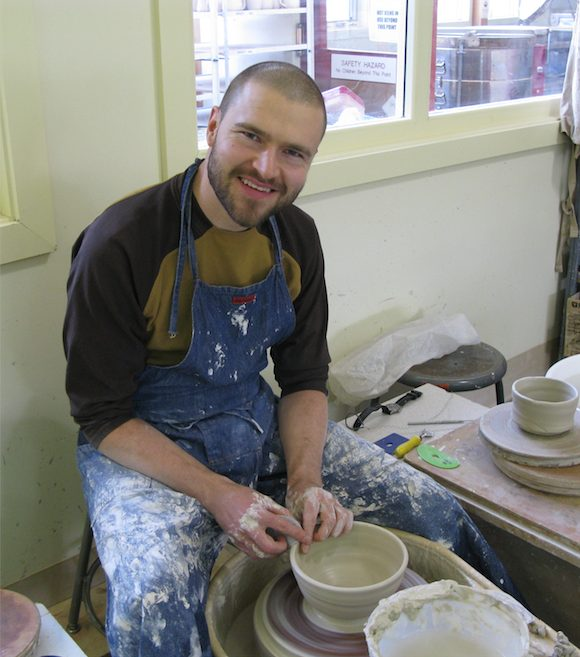](images/debb963f_AdamBernath-9.jpg)
I think it was my second year of college when I first picked up some books on yoga, when I was at the library studying art. I saw the poses on one of the covers and found myself very intrigued. Soon after that I got a video that I could follow at home; it was a bit challenging for my body at first, but I began to find my groove pretty fast. I started practicing most days and kept feeling better and better in my body. For the first four years or so, I never really considered going to a studio class, as my practice was very personal. Slowly I started checking out classes and enjoyed them more and more.
[caption id="attachment\_15267" align="alignnone" width="654"][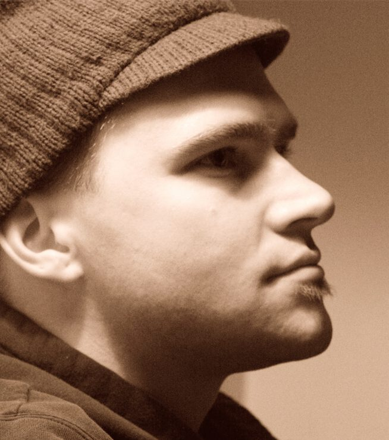](images/debb963f_AdamBernath-3.jpg) Me in 2005[/caption]
[caption id="attachment\_15276" align="alignnone" width="1003"][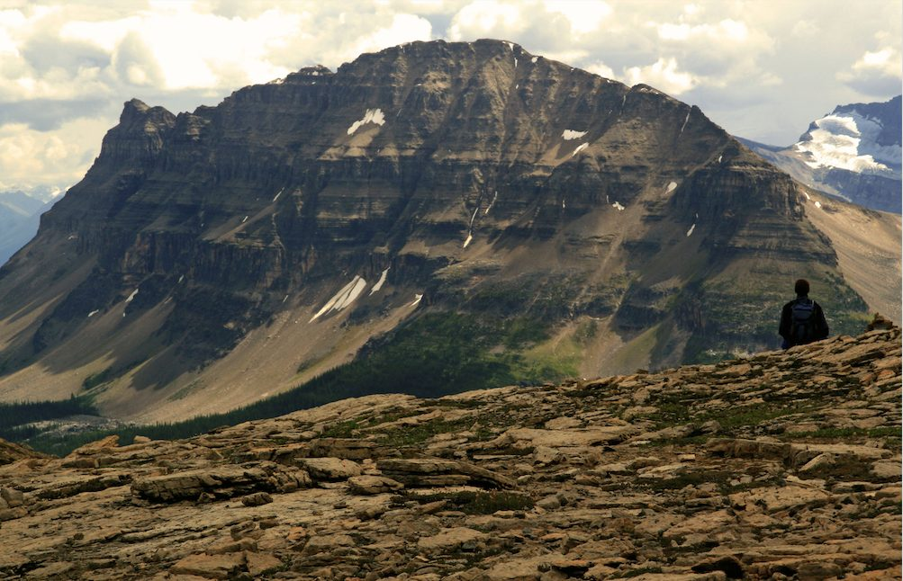](images/debb963f_AdamBernath-12.jpg) A mid-hike break near Jasper, AB summer 2006[/caption]
I didn’t have much of an understanding of the deeper aspects of yoga in those first years, but this really opened up when I attended my first Vipassana meditation course in 2006. This was a very beautiful transformative experience for me. I felt like I had found a lot of answers that I had been looking for my whole life: insights about the laws of nature and how the universe works, inside and out. It gave me a powerful set of tools for consciousness that have really helped me to live with the ease of wellbeing and to cultivate deep peace of mind. Since then I have stayed quite actively involved with the Vipassana practice, attending a course an average of once a year.
[caption id="attachment\_15269" align="alignnone" width="776"][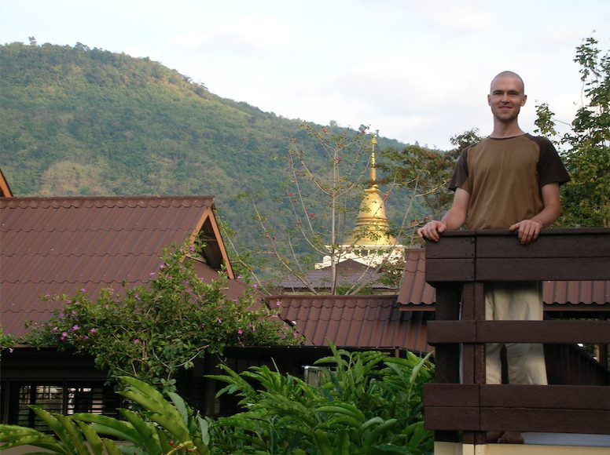](images/debb963f_AdamBernath-5.jpg) Last day of a vipassana course in Thailand[/caption]
[caption id="attachment\_15270" align="alignnone" width="610"][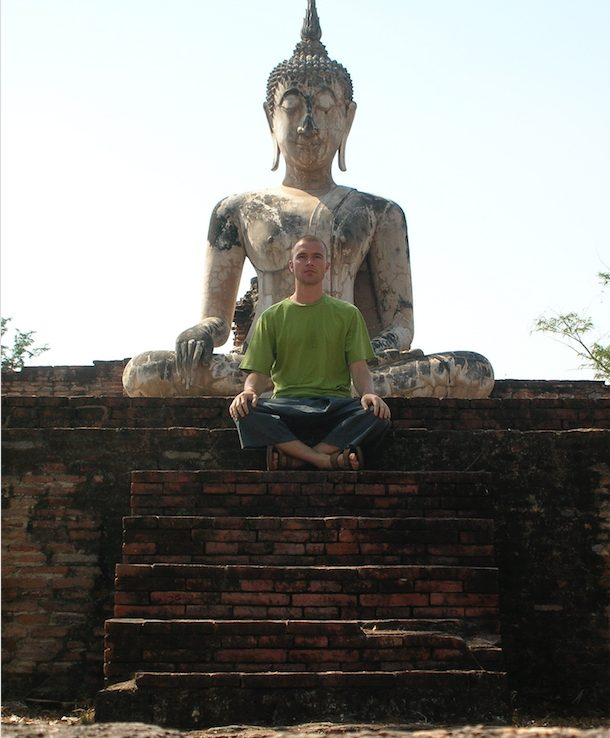](images/debb963f_AdamBernath-6.jpg) A stop during a bike ride through the ancient capital of Sukhothai[/caption]
I first learned of The Saltspring Centre Of Yoga when I purchased the book “The Salt Spring Experience”. I enjoyed working with this book very much. Within about a year after picking it up, I had decided to become a yoga teacher. I knew that I wanted to be active in the sharing of these tools for accessing the deeper truths of our world, as there is so much suffering and pain that we can be free from when we see with a balanced and clear mind and move with an open heart.
It was in July 2008 when I first had the blessing of living at the Centre as a Karma Yogi.
I found the experience of serving there to be very beautiful and deeply fulfilling.
It was a level of fulfillment that I had never known before, a sense of connection, purpose and support that was ever so sweet to behold. Something I had longed for, a source of nourishment that we all truly need as human beings.
[caption id="attachment\_15271" align="alignnone" width="798"][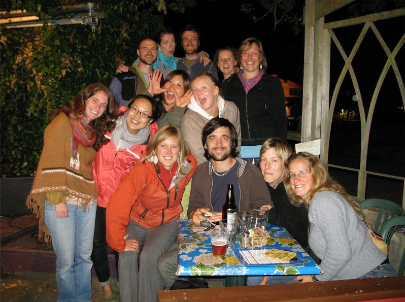](images/debb963f_AdamBernath-7.jpg) My first Karma Yoga group at the Centre in July 2008[/caption]
I graduated from the Yoga Teacher Training program in 2010. The experience was magical and I was amazed by the depth and quality of the course. I have been able to come back many times to serve since then and while many of the faces change as people come and go, the Centre continues to be a place of great learning, insight and potential for growth. It provides a wonderful space for healing and self-study/development. One of the most significant ways that the Centre has helped me to grow has been in finding my voice and opening up to my musicality. I have found Kirtan to be an extraordinarily powerful heart opening and impactful healing practice, one that has steadily deepened during my time here.
[caption id="attachment\_15268" align="alignnone" width="580"][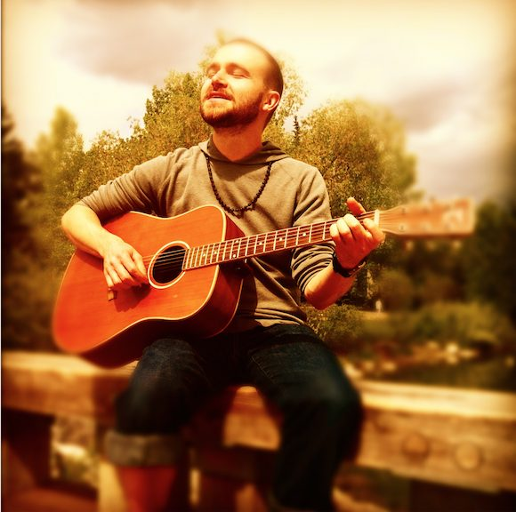](images/debb963f_AdamBernath-4.jpg) Prince’s Island Park in Calgary 2013[/caption]
I believe that the most beautiful gift of Karma Yoga is in the learning of how to give. This is the place where I have really been able to understand the meaning of the scriptural saying “give and you shall receive”. I feel this is the most important and powerful aim we can focus on.
Discovering the Centre has been a true blessing. I feel that I have found my tribe and I am forever more and more grateful to be a part of this great beacon of light on planet earth.
Blessings,
Om Shanti
