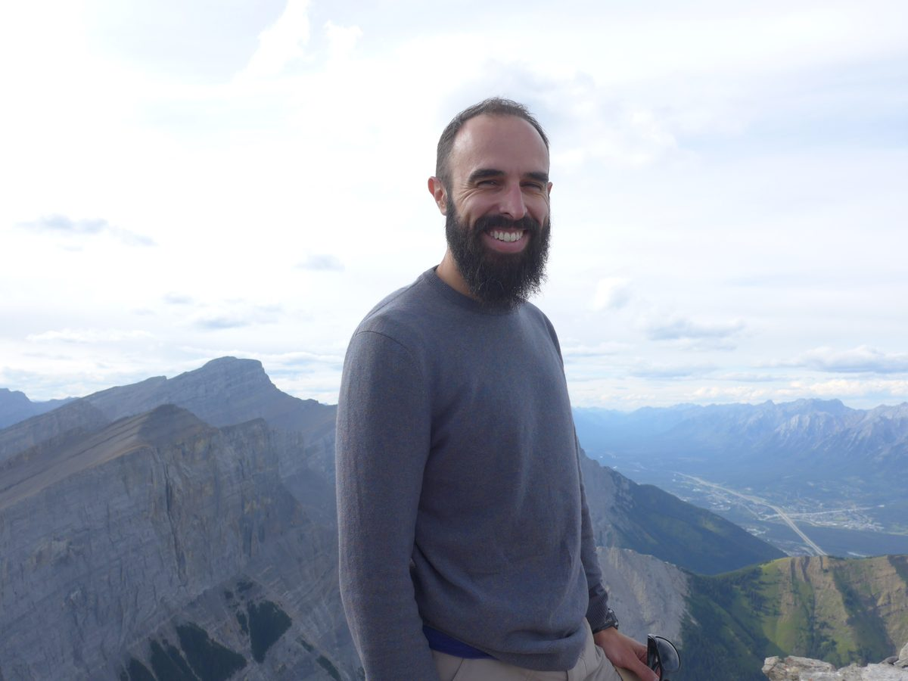

It’s now been just about two and a half months since I arrived at the Salt Spring Centre in my new role as Operations Manager. I drove off of the Long Harbour ferry and over to the Centre, got out of my car, and walked right into a Dharma Sara Satsang Society board meeting. I’ve pretty much been going ever since, and the resident staff and our wonderful Centre Manager Daphne Hollins have been right there with me through it all. As most people familiar with the life of the Centre know, July and August are the fullest, busiest months of the year, and my first few months here have often felt like I’ve jumped into a roaring river with a current and momentum all its own.
The path that led me to this latest adventure began well over a decade ago. I like to say I got into yoga the old-fashioned way, by reading Be Here Now as a young twenty-something with an inquiring mind and a yearning heart. From that book, I learned about Baba Hari Dass, which in turn led to a move out to Mt. Madonna, where I’d go on to spend a total of about four years. During that time, I deepened in the study and practice of yoga, and felt a strong connection to Babaji’s teachings and the community and satsang that has helped to hold them all of these years. It was also there that I met my wife Rebecca, who’s Canadian and a big part of how and why I wound up here north of the border. After leaving Mt. Madonna in 2012, I lived in Calgary, where I taught yoga and completed an MA in Religious Studies at the University of Calgary. Throughout that time, Rebecca and I often felt a call to the west coast and to spiritual community, and when the posting for a new Centre Manager went out, something just clicked.
In joining the community here at the Salt Spring Centre, I’ve been reminded of the subtle yet powerful sadhana that living in an intentional community can be. On the one hand, if I’m willing, community provides a chance to catch my desires, aversions, projections, and stories in action as they rub up against those of others. It can be hard work, especially in those places I’m most attached or guarded. But, it can also be deeply freeing, especially in those moments when meeting others draws me out of the habit of separateness and into a connection with something beyond just me, be it between myself and another being, or perhaps even myself and the Self that abides through all of those desires and dramas.
During these last weeks, I’ve often been reminded of a story that Janardan Farley, one of my mentors at Mt. Madonna, told about Babaji. One very rainy day in the early days at Mt. Madonna, Babaji insisted on going out to work on the land and see how the water flowed over it, even though the weather was nasty and he was a touch sick. After hours trudging through the mud and the rain with an ever diminishing crew of tag-alongs, Babaji wrote simply, “It is a yajña.” Or, it is a sacrifice, an offering.
It’s hard to know just what Babaji meant by that, but I think one way to understand it is to think of that attention and effort, that willingness to go into the rain and out of one’s sense of comfort, as an offering, a sacrifice. In the formal ritual of yajña there is a symbolic surrender, or even a sense of loss, of that which we take as ours. At the same time, there is a chance to rediscover a deeper wholeness and freedom, one that can reveal itself through that very same surrender. For, that same sense of self-interestedness can bind us to separateness. And so it is in karma yoga, in working in a spirit of selfless service.
I see the same possibility present here in the work we’re doing at the Centre. On the one hand, living closely in community reveals aversions and attractions and challenges us to confront, question, and even surrender them. And yet, in sharing life with others, in working as selflessly as we can to create spaces for our guests and our land to grow and heal, there is also the possibility that we can step into something greater and fuller than we may have thought possible.
