Hello everyone,
Welcome, September! August was a month of shifting energies on a number of levels. Fires in northern and eastern parts of BC (and further east) affected many people, casting a pall of smoke over much of the province, affecting everyone, particularly those with breathing difficulties. We continue to send our prayers to those whose lives have been - and still are - affected.

# Spectacular Summer

## Annual Family Yoga Retreat

Despite the smoke ACYR was vibrant as always.
[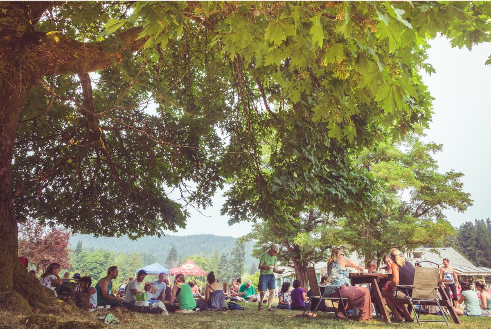](images/debb963f_ACYR-17-1.jpg)  [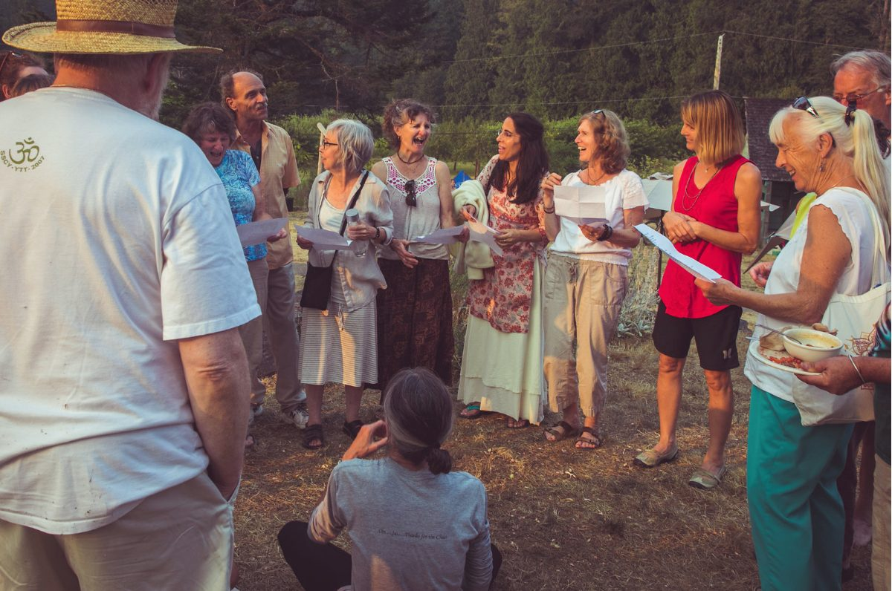](images/debb963f_ACYR-17-3.jpg)
[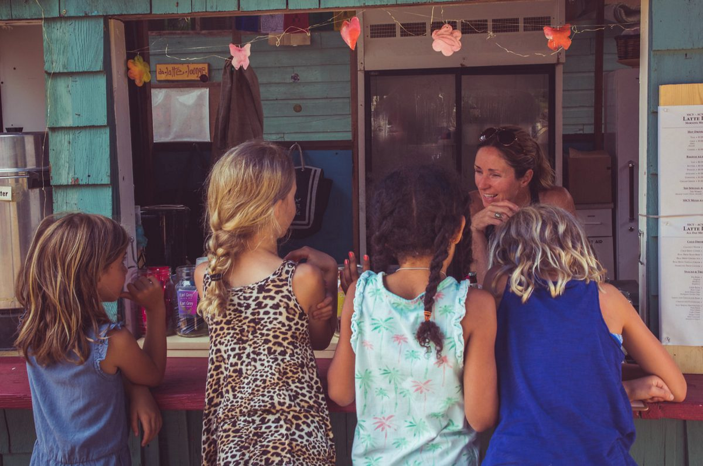](images/debb963f_ACYR-17-4.jpg)
[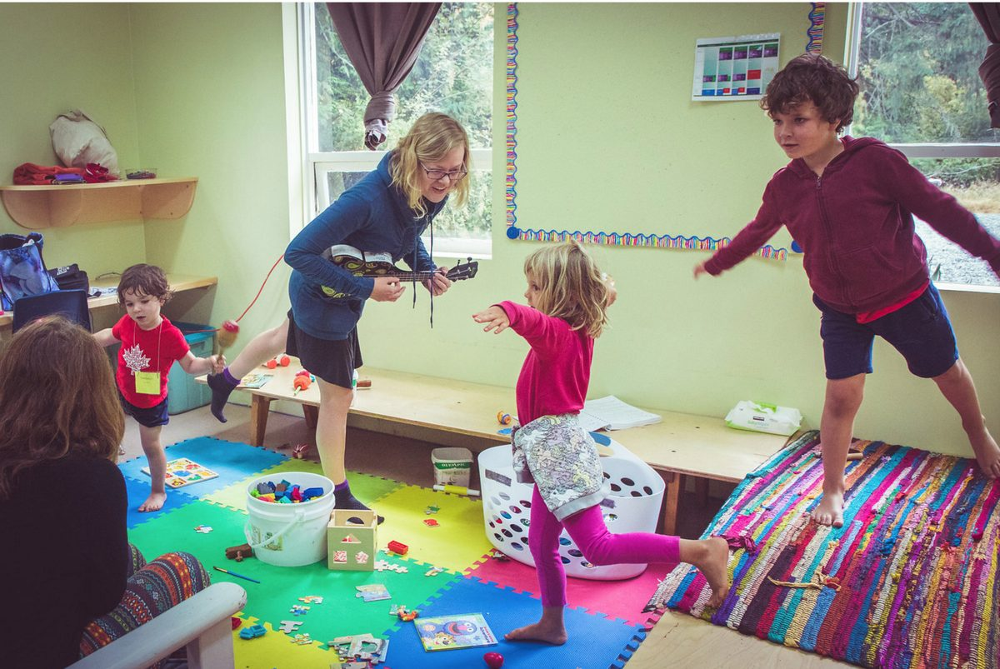](images/debb963f_ACYR-17-5.jpg)
[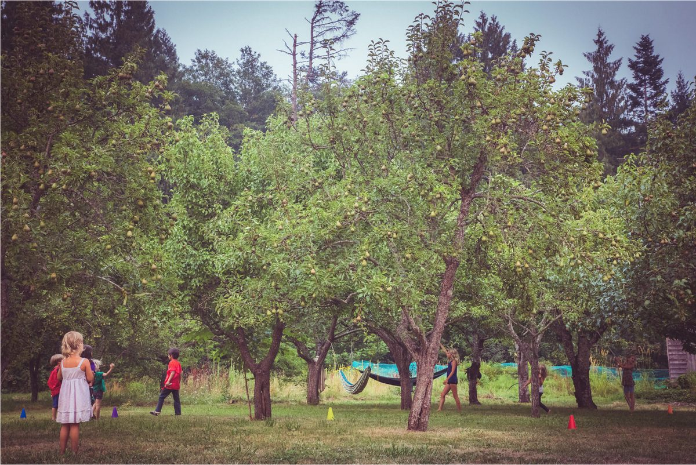](images/debb963f_ACYR-17-7.jpg)[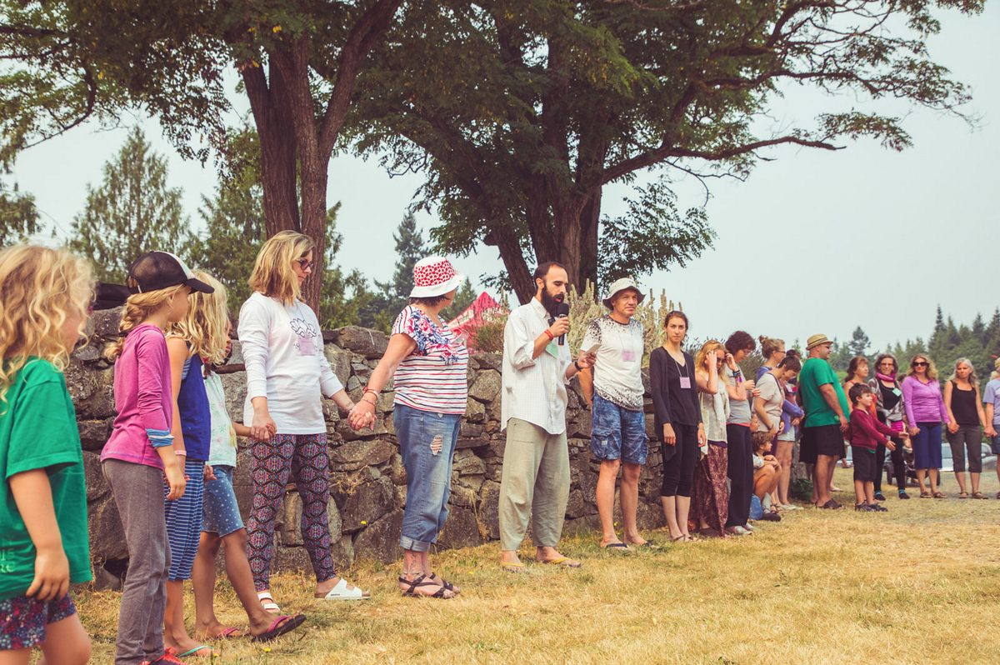](images/debb963f_ACYR-17-9.jpg)
Thanks to [Rebecca Dadson](http://www.rebeccadadson.com/) for these beautiful photos of the family retreat!

## Solar Eclipse on the Mound

Later in August, we were treated to a spectacular celestial event - the solar eclipse. While Salt Spring Island was not on the “path of totality”, it was still pretty exciting. The sky didn’t go black, but the light dimmed and the temperature dipped; it was chilly until the light and warmth of the sun returned. Meanwhile, we saw images of the crescent sun as the moon passed between sun and earth. Here are some photos of that event as we gathered on the mound.
[caption id="attachment\_15301" align="alignnone" width="620"][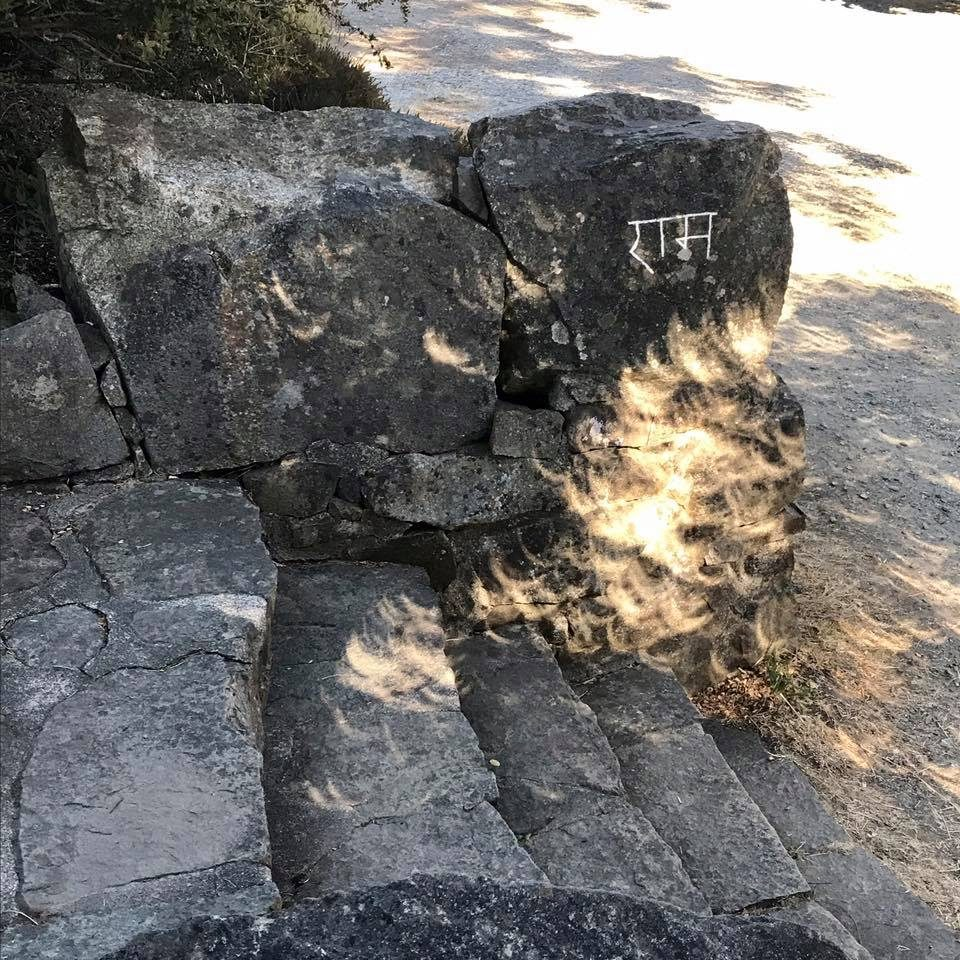](images/debb963f_eclipse-on-the-stone-steps.jpg) eclipse on the stone steps[/caption]
[caption id="attachment\_15302" align="alignnone" width="720"][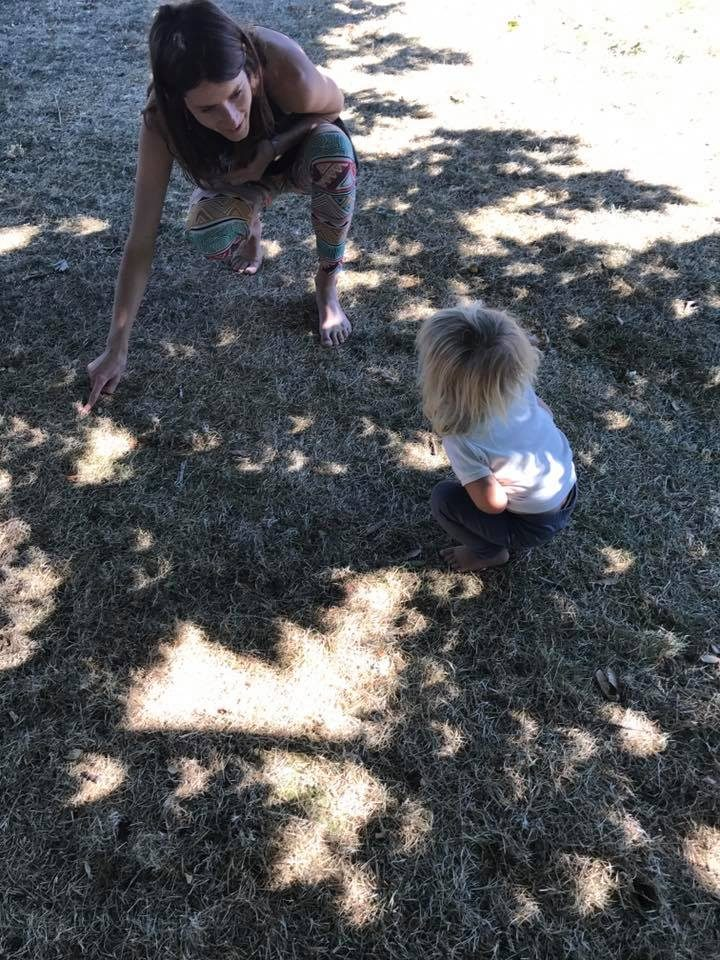](images/debb963f_Jules-showing-Laurel-.jpg) Jules showing eclipse images under the tree to Laurel[/caption]

## Yoga Teacher Training

August was also the month in which a group of new yoga teachers graduated from the Centre’s YTT program.
[caption id="attachment\_15305" align="alignnone" width="1080"][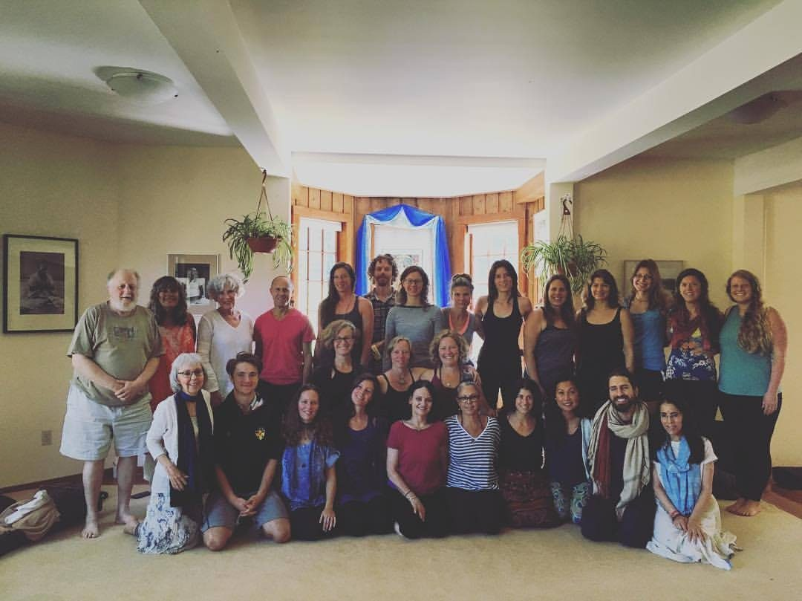](images/debb963f_YTT-grads.jpg) 2017 YTT grads and teachers[/caption]
Congratulations to all the graduates, and thank you to all the students and teachers who, together, create this wonderful opportunity, and to the fabulous group of karma yogis who keep everything running smoothly. On the last night of YTT the whole community of students, teachers and karma yogis came together for an amazing talent show followed by a dance in the pond dome.
[caption id="attachment\_15299" align="alignnone" width="628"][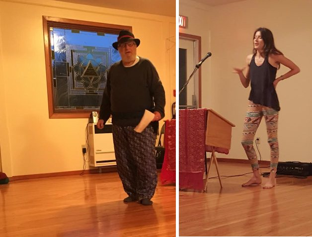](images/debb963f_YTT-Talent-a.jpg) Divakar, the MC as always; Jules[/caption]
[caption id="attachment\_15298" align="alignnone" width="701"][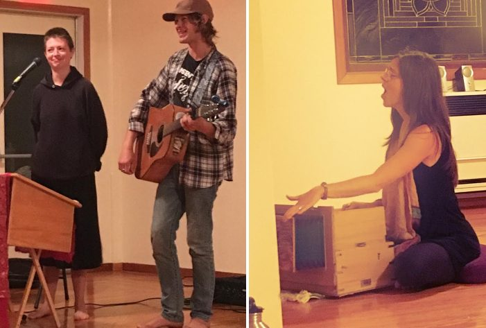](images/debb963f_YTT-Talent-b.jpg) Svenja and Tyler; Amy[/caption]
[caption id="attachment\_15300" align="alignnone" width="620"][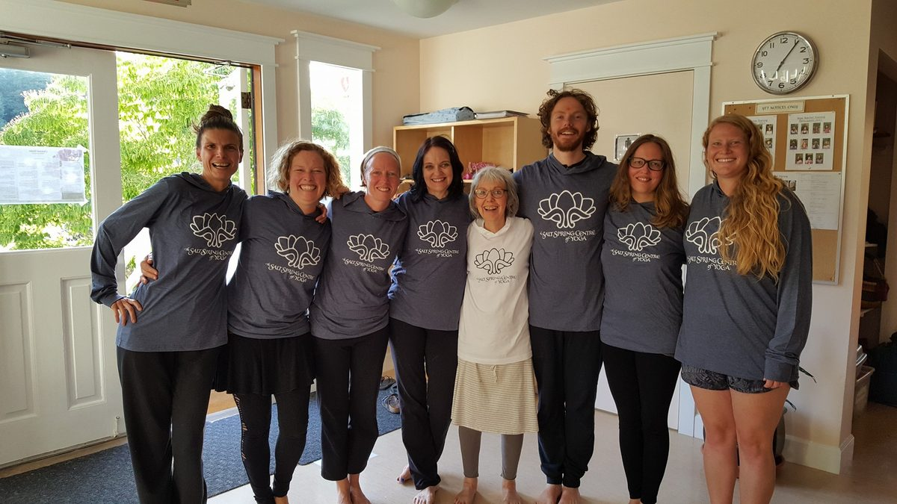](images/debb963f_YTT-hoodies.jpg) YTT students and Sharada in their Salt Spring Centre of Yoga hoodies[/caption]

# Centre Activity

Last month [Daphne Hollins](https://saltspringcentre.com/2017/07/musings-from-centre-management/), our Centre Manager, introduced herself to readers of Offerings. In this edition, [Yogeshwar Humphrey](https://saltspringcentre.com/2017/08/meet-yogeshwar-humphrey-sscy-operations-manager/), the other half of the Centre’s management team, introduces himself. We are very fortunate to have both of them here.
Summer was filled with YTT and ACYR, and then the second session of YTT. At the moment it’s a bit quieter around here, but programs, rentals and regular yoga classes continue throughout the rest of the program season. The next [Yoga Getaway](https://saltspringcentre.com/retreats-programs/yogagetaways/) is on September 22-24, with others on October 13-15 and November 3-5.
As always, Sunday satsang continues from 3:30 to around 5:30 each week. Community dinners following satsang will resume on the first Sunday of each month, beginning in September. Wednesday kirtan will also keep going, with various kirtan leaders. Thank you to Claire and Vikash for keeping these weekly kirtan gatherings going for so many years, and to Raven who was ready to step up any time. Raven is now on his way to India for the next 6 months.

# Farm Update

The farm is abundant, with a big harvest season coming up as the apples and pears ripen in readiness for picking. Please be in touch if you’re interested in helping with the harvest and processing fruit for the winter.
[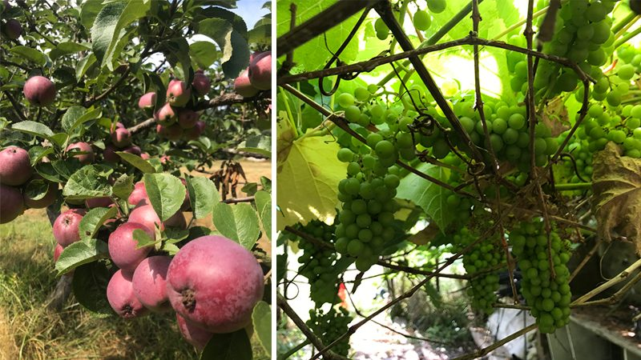](images/debb963f_SSCY-Harvest-17.jpg)
[caption id="attachment\_15304" align="alignnone" width="489"][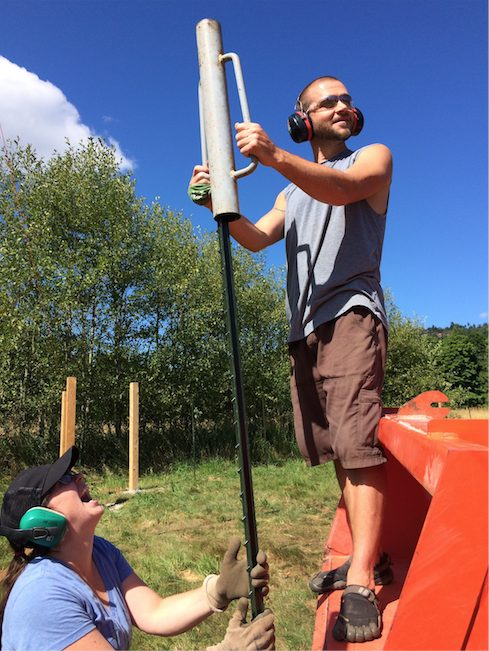](images/debb963f_SSCY-Pole-Pounding.jpg) Santosh and Jess pounding T-posts[/caption]
Here is Milo’s monthly farm update.
> We’re quick on our feet this week as the new fence approaches completion! The bulk of the Food Forest within will be planted out this fall and the rest come spring.
> As I’m sure you’re all aware it’s harvest season! We’re stepping up our preservation game this year and building a large solar dehydrator for the abundant apples and pears poised to rain down on us. Stay tuned.
> I hope everyone is finding time to jump in the lakes and dip in the ocean during these final weeks of summer! Soak it in.

# Centre School News

This month the Centre School children will return to school; I’m always so happy to hear them playing outside again. Again I will have the gift of celebrating Rosh Hashanah, the Jewish New Year with the kids later in the month.

# This Month's Newsletter Offerings

For your reading pleasure this month:
Years ago, Babaji answered a question with what has become almost a motto at the Salt Spring Centre of Yoga: Work honestly, meditate every day, meet people without fear, and play. When we first read it, many of us assumed we were doing well in all areas except for play. Upon further examination, we learned that there’s more to it than we initially thought. [Here it is unpacked a bit more](https://saltspringcentre.com/2017/08/work-honestly/).
I was delighted to receive a newsletter submission from a YTT grad from last year. Ankit Rao shares with us “[A Simple Teaching](https://saltspringcentre.com/2017/08/a-simple-teaching/),” explaining how he’s incorporated the teachings and practices he learned at YTT into his work life.
Also in this edition is an opportunity to meet one more member of our satsang community - Santosh Adam Bernath who came here for the first time in 2008, followed by many visits as a karma yogi over the years. In his story, [Finding my Tribe](https://saltspringcentre.com/2017/08/finding-my-tribe-santosh-adam-bernath/) he invites us to follow his journey from being a sensitive child who didn’t understand why anyone would ever be unkind to another to a discovering that there were others with the same questions, and then finding his tribe.
From Babaji:
*Love is a universal religion.*
*Be persistent in withdrawing your mind from the world, from anger, fear, hate, jealousy, attachment, and pride. Remove malice from your heart. Be friendly to all. Establish love in your heart for everyone. Be selfless in your thoughts and actions.*
*Love and hate are two opposites. If one is capable of removing hate within, then love will emanate without.*
Love,
Sharada
