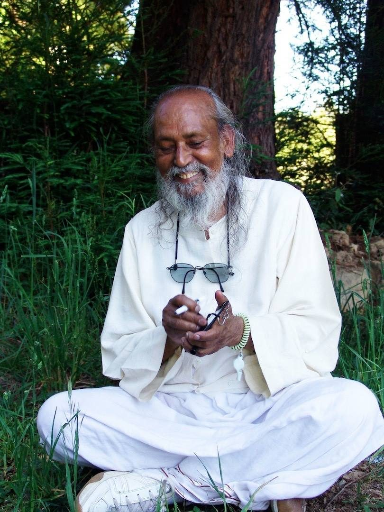

****

## *Work Honestly,* *Meditate every day* *Meet people without fear,* *And play.*

This simple four-line instruction that Babaji wrote on his chalkboard years ago in response to a question, has become a guiding light at the Salt Spring Centre of Yoga. This quote is visible in the lobby and even on the back of the hoodie from this year’s ACYR. It’s easy to remember and seems so simple.
Upon first reading this phrase, many of us thought, “We’re not doing too badly. Work honestly - check. Meditate every day - not an automatic check for everyone, but a recognition that it would be a good thing. Meet people without fear - check. Play - we need more of that.” We figured the rest was straightforward, but we didn’t play enough. While it was true we weren’t playing much, the rest of the teaching also needed a bit more attention.
**Work honestly:** ‘Work honestly’ can refer to both what we do and how we do it. Honest work is work that aligns with your values. There are certain kinds of work you might consider immoral. What would make a job immoral? If you’re required to lie, perhaps, or if the work exploits other people, whether your customers, fellow workers or workers in other countries who are not paid a living wage. What if the work you’re engaged in is harmful to the environment?
Sometimes people take a job because they need to support themselves and their families. If that’s your aim, do you look more lightly at some moral implications of your work? What if your job is not ideal, but you’re the chief breadwinner in your family? Supporting your family is definitely a worthy aim. Babaji’s teachings are very practical.
*A livelihood is earned in various ways. Any work we do, if we do it honestly and without hurting anyone, is right livelihood. But one should know that if a horse makes grass his friend, then he will die hungry. When a farmer plows the ground, several worms and insects get killed. If you think farming is not right livelihood, then you can’t eat food.*
And then there’s the question of our attitude toward our work. *We have to be honest in our mind, actions, and words. It’s enough.* When we are able to do that, work becomes an act of service, an offering. That is the attitude of karma yoga - giving full attention to doing your job well, aiming to achieve a particular outcome, but without creating a story about being the doer or attaching your sense of yourself as good or bad based on whether the intended outcome manifests.
**Meditate every day:** This is pretty clear. Although Babaji has frequently reminded people to do regular sadhana or RS, here he is making it clear that he means every day. It takes commitment; we of course have no problem coming up with excuses, but what does Babaji say? *Kick yourself to get up early in the morning.* He says *Meditate every day.* Do it even when you’re tired, when you stayed up late the night before and want to sleep longer, even when you can’t concentrate well. It becomes a habit that nourishes you throughout your day, throughout your life.
**Meet people without fear:** When first hearing this, I thought, “I’m pretty friendly and I like meeting and welcoming new people, so I’m doing okay.” It turns out this requires more attention than I realized. What about the people who are already in my life? What about challenging situations with others?
How many of us either plow ahead in a confrontational manner or avoid difficult conversations altogether? When we encounter a difficult conversation (or a “difficult person”) what do we do? Do we go into attack more or do we avoid dealing with the situation, perhaps blaming ourselves for our weakness or the other person for being so difficult in the first place? My favourite definition of a difficult person is “someone beyond my current skill level.” That turns the responsibility back to me. Whatever is hard to deal with in the other person turns out to be a reflection of what’s hard to deal with in me. Being able to accept that it’s our own fear that is blocking communication is a step toward meeting people without fear.
*Anger is a defense mechanism against fear. People who have a lot of fear always defend themselves by getting angry. There is only one proven method to remove anger and that is not to defend your ego. It is very hard not to defend your ego.*
*You can practice:*

1. *Developing positive qualities.*
2. *Not getting attached to objects. (Note: This also includes our thoughts.)*
3. *Reducing your worldly desires.*
4. *Meditation.*
5. *Being honest to yourself.*

This is a big practice in itself. While it may be difficult, it is doable, and it can lead to more ease and peace in our lives.
**And play:** Play includes sports and games, yet it’s broader - and deeper - than that. It is a way of living with an attitude of lightness. We often take ourselves much too seriously, believing our own thoughts and opinions. This constricts our view of life to the degree that we become depressed and see only misery. Of course we’re generally not miserable all the time, but we do forget that play brings lightness and joy into our lives. We need to play for our own well being and that of the people around us.
Pema Chodron says, “The key to feeling at home with your body, mind and emotions, to feeling worthy to live on this planet comes from being able to lighten up. This earnestness, this seriousness about everything in our lives - including practice - this goal-oriented “we’re-going-to-do-it-or-else” attitude, is the world’s greatest killjoy. There’s no sense of appreciation because we’re so solemn about everything. In contrast, a joyful mind is very ordinary and relaxed. The best gift you can give yourself is to lighten up.”

*Don’t think that you*
 *are carrying the whole world:*
 *Make it easy,*
 *Make it play,*
 *Make it a prayer.*

Contributed by Sharada
All writings in italics are by Baba Hari Dass

---

 **Sharada Filkow**, a student of classical ashtanga yoga since the early 70s, is one of the founding members of the Salt Spring Centre of Yoga, where she has lived for many years, serving as a karma yogi, teacher and mentor.
