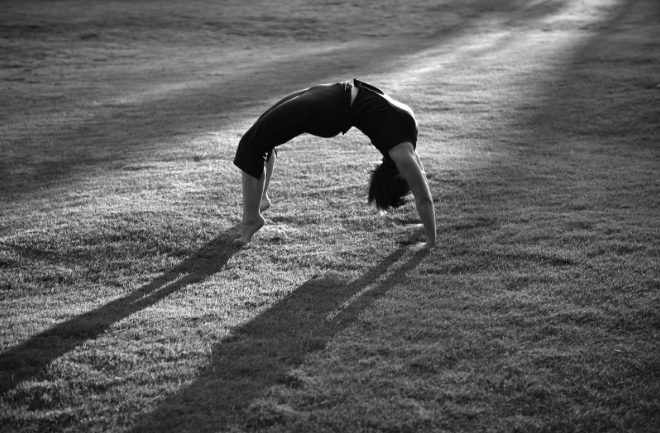
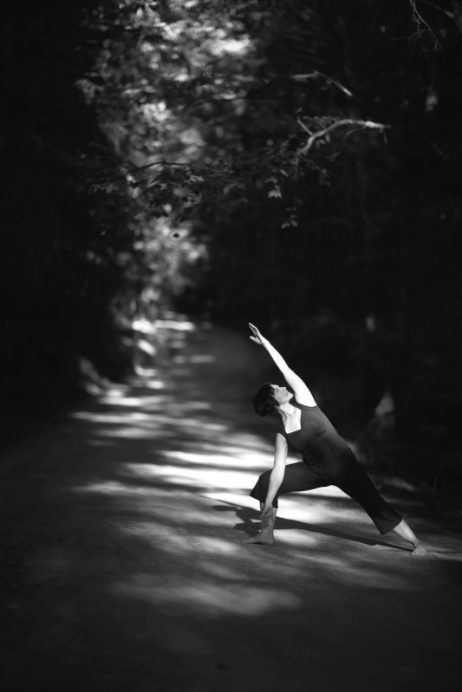
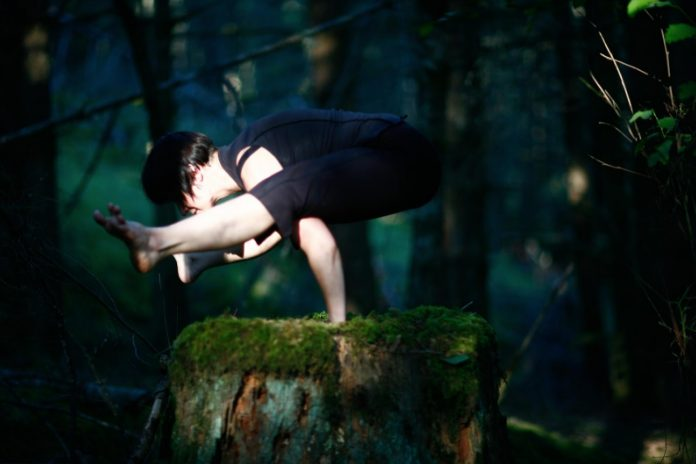
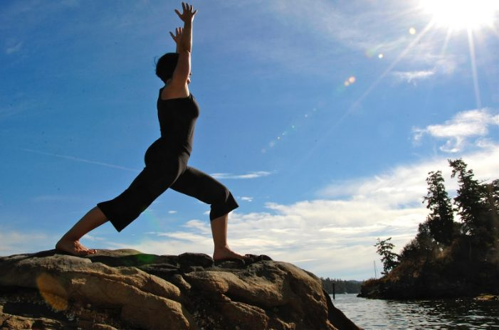
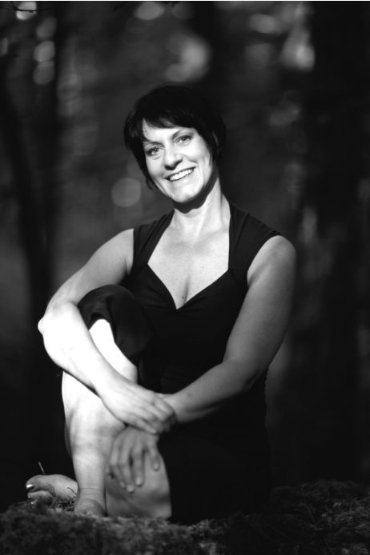

### [Lindsay Savage](images/1bb3e30d_Lindsay1.jpg)by Lyndsay Savage

I have had a repeated, and unwanted message from school teachers as a child… “Lyndsay, you just worry about Lyndsay”. What could possibly move them to say such oddly phrased and annoying words to a young me?! Possibly it was because I had a strong sense of truth-seeking in all aspects of life, actually holding honesty as a beacon and flag before my heart.
It was common that teachers misunderstood the happenings in the classroom and would reprimand the wrong student for minor crimes (ie. talking during work time…) Hearing the inaccuracy, therefore the injustice, I would speak out to “correct” all errors. I can remember feeling that it was my job to speak out against injustices, but now I hold the honesty meter closer to myself, with my own reflection, biding my teacher’s words. I realized that it was more important to do self-inquiry and self-study with my precious honesty ideal. This being said, it turns out to be a full-time job with the potential for less accuracy than I would hope for, but the job never ends.

My quest for self-inquiry is at the heart of my Yoga practice.
In 1972, I remember watching Kareen’s Yoga with Kareen Zebroff, on TV. I’m not sure how many other people in grade 2 were watching Yoga as a pastime, but it stayed with me until my first Yoga classes (1974) A young Yoga Nerd was born!
During a summer program for kids Yoga, I attended my first Yoga classes. I loved these classes, and to this day hold this teacher dear to my heart and into my teaching today. One concept he brought to the classes was that Yoga was a living practice, a practice that expands as we do. OM to him.

I had a relationship with Yoga in my mind and body from that day forward, reading books and practicing, however I didn’t go to classes again until I was an adult and my daughter was just born. I have been so lucky to have had only amazing Yoga teachers all my life; and my first adult class was with a wonderful woman, Leslie Young, from Mount Curry BC. It was during my third class with her that I realized that I would be teaching Yoga one day! During simple movements of standing and folding forward, it seemed that I heard a tone in my head; it was like a type of singing, and tears welled up in my eyes with the wonder and excitement of this prospect. There was not an urgency of time, but a certainty of direction.
The path from then on was sweet and filled with the love of so many aspects of Yoga discovery…. with only exciting ways in which to find Self. Not to say that it was always only bliss, as finding Self is a multi-coloured study!!

It’s funny how having a relationship with Yoga can be a bit challenging for family members. I even remember my Mom suggesting that I’m doing too much Yoga… Hmmm. Daily practicing can seem excessive to some, but to me it is the good life, and I count my blessings often.
I had a successful career as a hair stylist and makeup artist for 12 years when I moved to Salt Spring in 1998, with the intention to continue my practice of Yoga, continue taking classes and continue with my hair business. The Salt Spring Centre of Yoga was not teaching a YTT 200 hour program at the time, and I imagined that I would need to leave for my training when my daughter was old enough for me to leave her for the duration however, I had the great, great honour and luck to attend the Centre shortly after the Yoga Teacher Training program began. Yay!
Then other opportunities magically opened up:
800 Hour Vijnana Yoga International with Orit Sen Gupta and Gioia Irwin
500 Hour Traditional Yoga Apprenticeship with Cathy Valentine
250 Hour Yoga Synergy with Simon Borg Olivier

During my time with YTT at the Salt Spring Centre of Yoga, I had another clear moment when I felt compelled, or drawn to teaching at the Centre for the Yoga Teacher Training in the future. Just as before, it did not feel time urgent, but compelling. After experience teaching, and after more training, I started with helping roles of YTT.
It’s been a privilege to assist in YTT s at the Centre, being a part of a holistic program, taking students to places inside and out that they may not have even known were there. One of my favorite parts of the training is at the end when people say things like, “I didn’t imagine how transforming this program would be, and how supported I would feel!”

Baba Hari Dass was at the Centre during the beginning of the August session of my training. This gift is something words will not do justice to, so I’ll just say that being in the presence of someone who feels so clear and is beautiful mirror, will stay with me as a reminder that keeps unfolding with new meaning. “OM”
Humbling reminders of ”Lyndsay, You just worry about Lyndsay”, may be on par with Babaji’s “Teach to Learn” idiom. Now I practice paying attention to myself, practice regular Sadhana, and hope my teaching practice comes from an honest place.
